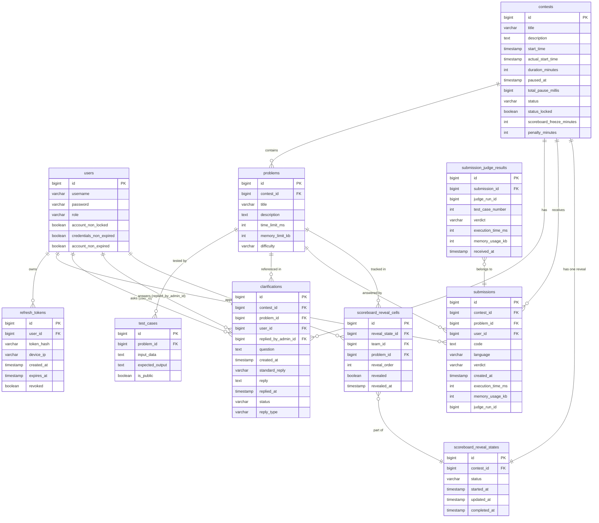

# AuraC2 — Complete System Documentation

> Last updated: 2026-05-16 (re-verified against all source files)
> This file covers every feature, every technology, every database table and relation, and how the entire system works end-to-end.

---

## Table of Contents

1. [What Is AuraC2?](#1-what-is-aurac2)
2. [Technology Stack](#2-technology-stack)
3. [High-Level Architecture](#3-high-level-architecture)
4. [Feature Map](#4-feature-map)
5. [Backend — Spring Boot](#5-backend--spring-boot)
   - [Domain Packages](#51-domain-packages)
   - [Authentication & JWT](#52-authentication--jwt)
   - [Contest Lifecycle](#53-contest-lifecycle)
   - [Submission Pipeline](#54-submission-pipeline)
   - [Clarifications](#55-clarifications)
   - [Scoreboard & Reveal](#56-scoreboard--reveal)
   - [Server-Sent Events (SSE)](#57-server-sent-events-sse)
   - [Security Configuration](#58-security-configuration)
   - [All REST Endpoints](#59-all-rest-endpoints)
6. [Database — Full Schema](#6-database--full-schema)
   - [Tables Overview](#61-tables-overview)
   - [Each Table in Detail](#62-each-table-in-detail)
7. [Entity Relationships — ER Diagram](#7-entity-relationships--er-diagram)
   - [Mermaid ER Diagram](#71-mermaid-er-diagram)
   - [Relationship Explanations](#72-relationship-explanations)
8. [Frontend — React/TypeScript](#8-frontend--reacttypescript)
   - [App Shell & Routing](#81-app-shell--routing)
   - [Admin Application](#82-admin-application)
   - [Team Application](#83-team-application)
   - [Auth & Token Management](#84-auth--token-management)
   - [API Services](#85-api-services)
   - [Real-Time Hooks (SSE)](#86-real-time-hooks-sse)
   - [Shared Components](#87-shared-components)
   - [Frontend Dependencies](#88-frontend-dependencies)
9. [Infrastructure](#9-infrastructure)
   - [Docker Compose](#91-docker-compose)
   - [RabbitMQ Configuration](#92-rabbitmq-configuration)
   - [Judge0 Integration](#93-judge0-integration)
10. [Key Workflows — Step by Step](#10-key-workflows--step-by-step)
    - [User Login Flow](#101-user-login-flow)
    - [Contest Lifecycle Flow](#102-contest-lifecycle-flow)
    - [Submission Flow](#103-submission-flow)
    - [Clarification Flow](#104-clarification-flow)
    - [Scoreboard Reveal Flow](#105-scoreboard-reveal-flow)
11. [Configuration Reference](#11-configuration-reference)
12. [Enums Reference](#12-enums-reference)

---

## 1. What Is AuraC2?

AuraC2 is an **ICPC-style competitive programming contest platform**. It allows:

- An **Admin** to create and manage contests, add problems with test cases, register teams, pause/resume contests, answer clarifications, rejudge submissions, and reveal a frozen scoreboard with step-by-step animation.
- **Teams** to view problems, submit code solutions, receive live verdicts, ask clarifications, and track standings on the live scoreboard.

Code is **executed remotely** by Judge0 (an open-source judge service). Results come back asynchronously via HTTP webhooks. Everything flows in real-time to the browser via **Server-Sent Events (SSE)**.

---

## 2. Technology Stack

### Backend

| Layer | Technology | Version | Purpose |
|---|---|---|---|
| Language | Java | 21 | Core language |
| Framework | Spring Boot | 3.4.2 | Web, DI, security, JPA |
| ORM | Hibernate / Spring Data JPA | — | DB access, entities, queries |
| Database | PostgreSQL | 15 | Persistent storage |
| Message Broker | RabbitMQ | 3 | Async submission queue |
| Auth | JJWT (jsonwebtoken) | 0.12.x | JWT signing & validation |
| Security | Spring Security | 6.x | Filter chain, role guards |
| API Docs | SpringDoc OpenAPI | 2.x | Swagger UI at `/swagger-ui.html` |
| Email | Spring Mail | — | SMTP via Gmail |
| Judge | Judge0 CE | external API | Remote code execution |
| Utilities | Lombok | — | Boilerplate reduction |
| Build | Maven | 3.x | Dependency & build management |
| Env Vars | spring-dotenv | — | `.env` file support |

### Frontend

| Layer | Technology | Version | Purpose |
|---|---|---|---|
| Language | TypeScript | 5.7.2 | Type-safe JS |
| Framework | React | 18.3.1 | UI rendering |
| Build Tool | Vite | 6.0.0 | Dev server & bundler |
| Styling | Tailwind CSS | 4.0.0 | Utility-first CSS |
| UI Components | Radix UI | various | Accessible unstyled primitives |
| Icons | Lucide React | 0.487.0 | SVG icon library |
| Forms | React Hook Form | 7.55.0 | Form state + validation |
| Charts | Recharts | 2.15.2 | Scoreboard visualizations |
| Date Picker | react-day-picker | 8.10.1 | Contest scheduling UI |
| Toasts | Sonner | 2.0.3 | Notification system |
| Themes | next-themes | 0.4.6 | Dark/light mode |
| SSE Client | @microsoft/fetch-event-source | 2.0.1 | Real-time streaming with auth headers |
| Resizable Panels | react-resizable-panels | 2.1.7 | Team workspace layout |
| Drawer | vaul | 1.1.2 | Slide-in drawer component |
| Carousel | Embla Carousel | 8.6.0 | UI carousel |

### Infrastructure

| Component | Technology | Port |
|---|---|---|
| Database | PostgreSQL | 5432 |
| Message Broker | RabbitMQ AMQP | 5672 |
| RabbitMQ Management UI | RabbitMQ | 15672 |
| Backend | Spring Boot | 8080 |
| Frontend Dev | Vite Dev Server | 5173 |

---

## 3. High-Level Architecture

```
┌─────────────────────────────────────────────────────────────────┐
│                         BROWSER                                 │
│                                                                 │
│   ┌─────────────┐   ┌─────────────┐   ┌─────────────────────┐  │
│   │  LoginPage  │   │  AdminApp   │   │     TeamApp         │  │
│   └──────┬──────┘   └──────┬──────┘   └──────────┬──────────┘  │
│          │                 │                      │             │
│          └────────┬────────┘                      │             │
│                   │  REST (JSON) + SSE             │             │
└───────────────────┼───────────────────────────────┼─────────────┘
                    │                               │
                    ▼                               ▼
         ┌──────────────────────────────────────────────────────┐
         │                  SPRING BOOT :8080                   │
         │                                                      │
         │  ┌────────────┐  ┌─────────────┐  ┌──────────────┐  │
         │  │ AuthServer │  │ContestServer│  │SubmissionSrv │  │
         │  │  (JWT,     │  │ (lifecycle, │  │  (submit,    │  │
         │  │  users,    │  │  problems,  │  │   Judge0,    │  │
         │  │  tokens)   │  │  clarifs,   │  │  callbacks,  │  │
         │  │            │  │  scoreboard)│  │  RabbitMQ)   │  │
         │  └────────────┘  └─────────────┘  └──────────────┘  │
         │                         │                  │          │
         └─────────────────────────┼──────────────────┼──────────┘
                                   │                  │
               ┌───────────────────┘                  │
               ▼                                      ▼
      ┌─────────────────┐                   ┌──────────────────┐
      │   PostgreSQL    │                   │    RabbitMQ      │
      │    :5432        │                   │    :5672         │
      │  (all tables)   │                   │ submissionQueue  │
      └─────────────────┘                   └────────┬─────────┘
                                                     │
                                                     ▼
                                            ┌──────────────────┐
                                            │    Judge0 CE     │
                                            │ (external API)   │
                                            │  executes code,  │
                                            │  PUTs callback   │
                                            └──────────────────┘
```

**Request flow summary:**
- The browser talks to Spring Boot via REST (JSON) and SSE (streaming text events).
- Spring Boot persists everything in PostgreSQL.
- Code submissions are offloaded to RabbitMQ, consumed, and forwarded to Judge0.
- Judge0 returns results via a public webhook URL (PUT request).
- Results fan out to all connected browsers in real time via SSE.

---

## 4. Feature Map

| Feature | Who | How |
|---|---|---|
| Register teams | Admin | `POST /auth/register` |
| Login / logout | Everyone | `POST /auth/login` + HttpOnly refresh cookie |
| Create contest | Admin | `POST /api/contest` |
| Add problems | Admin | `POST /api/problems` |
| Add test cases | Admin | `POST /api/testcases/{problemId}` |
| Start / pause / resume / end contest | Admin | `PUT /api/contest/{id}/start` etc. |
| View contest problems | Team | `GET /api/problems/contest/{id}` |
| Submit code | Team | `POST /api/submissions` |
| View submission verdicts | Team | SSE + `GET /api/submissions/{id}` |
| Ask clarifications | Team | `POST /api/clarifications` |
| Answer clarifications | Admin | `PUT /api/clarifications/admin/{id}/reply` |
| Live scoreboard | Everyone | `GET /api/scoreboard/contests/{contestId}` + SSE |
| Scoreboard freeze | Automatic | Computed from `scoreboardFreezeMinutes` |
| Scoreboard reveal | Admin | Step-through animation via SSE |
| Rejudge submissions | Admin | 6 rejudge endpoints (by ID / problem / contest, with optional force) |
| Manage users | Admin | `GET/PUT/DELETE /api/admin/users` |
| Real-time updates | Everyone | SSE on contest, submissions, clarifications, scoreboard |

---

## 5. Backend — Spring Boot

### 5.1 Domain Packages

The backend is split into **three domain packages** under:
`backend/aura-contest-control/jwtAuthServer/src/main/java/com/server/contestControl/`

```
com.server.contestControl/
├── authServer/          ← Users, JWT, login, refresh, registration
├── contestServer/       ← Contests, problems, test cases, clarifications, scoreboard
└── submissionServer/    ← Submissions, Judge0, RabbitMQ callbacks, rejudge
```

Each domain follows the same layered pattern:
```
domain/
├── entity/         ← @Entity JPA classes (maps to DB tables)
├── repository/     ← @Repository Spring Data interfaces
├── service/        ← @Service business logic
├── controller/     ← @RestController HTTP handlers
├── dto/            ← Request/response data transfer objects
├── enums/          ← Java enums (status values)
└── config/         ← Domain-specific configuration beans
```

---

### 5.2 Authentication & JWT

#### How JWT Works Here

The system uses **two tokens**:

| Token | Storage | Expiry | Purpose |
|---|---|---|---|
| Access Token | `localStorage` in browser | 15 minutes | Sent in every API request as `Authorization: Bearer <token>` |
| Refresh Token | `HttpOnly` cookie (never readable by JS) | 7 days | Used only at `/auth/refresh` to obtain a new access token |

**Token contents (Access Token claims):**
- `sub` — username
- `role` — `ADMIN` or `TEAM`
- `iat`, `exp` — issued-at and expiry timestamps

**Token type tracking** — The `TokenType` enum (`ACCESS` / `REFRESH`) is embedded in the JWT or used internally to differentiate signing keys.

#### Refresh Token Rotation

- Every `/auth/refresh` call **issues a new refresh token** and **revokes the old one**.
- Actual token values are never stored — only their SHA-256 hash (`tokenHash`) is in the `refresh_tokens` table.
- `revoked = true` marks invalidated tokens.
- A refresh token stores the device's IP (`deviceIp`) for traceability.

#### JwtAuthFilter

- Intercepts every request before Spring Security filters.
- Reads `Authorization: Bearer <token>` header.
- Validates signature and expiry using the access-token secret.
- Sets `SecurityContextHolder` with the user's principal and role.
- If token missing/invalid → passes the request through (public endpoints work; protected ones return 401).

#### Bootstrap Admin

On first start-up a bootstrap service creates the initial admin account. Credentials are read from `admin-account.txt` (path configurable in `application.yml`). A second ADMIN account cannot be created via `/auth/register` — only one admin is allowed (enforced by `RegistrationService`).

---

### 5.3 Contest Lifecycle

#### States

```
UPCOMING ──────► RUNNING ──────► ENDED
                    │                ▲
                    ▼                │
                  PAUSED ───────────►┘
```

| Transition | What Happens |
|---|---|
| UPCOMING → RUNNING | Sets `actualStartTime = now()` (only first time; never overwritten) |
| RUNNING → PAUSED | Sets `pausedAt = now()` |
| PAUSED → RUNNING | Adds `(now − pausedAt)` to `totalPauseMillis`, clears `pausedAt` |
| * → ENDED | Requires `effectiveEndTime ≤ now` unless `juryOverride = true` |

#### Effective End Time

The system distinguishes **scheduled** vs **effective** time:
- `startTime` = when admin originally scheduled the contest to start (planning only)
- `actualStartTime` = when admin actually clicked START (set once, never changed)
- `effectiveEndTime` = `actualStartTime + durationMinutes (in ms) + totalPauseMillis`

Pauses add time back, so teams never lose contest minutes to pauses.

#### Auto-Sync Scheduler (Three-Class Design)

The auto-sync uses three classes for isolation and concurrency safety:

| Class | Role |
|---|---|
| `ContestStatusSyncScheduler` | Fires on a fixed delay (every 30 s, initial 10 s after start). Calls `syncService`. Activated only when `contest.sync.enabled=true`. |
| `ContestStatusSyncService` | Opens read-only transaction; finds all UPCOMING/RUNNING contests; delegates each to `syncExecutor` in a **new transaction** (`REQUIRES_NEW`). |
| `ContestStatusSyncExecutor` | Acquires `SELECT FOR UPDATE` lock on the contest row; computes effective state; applies allowed auto-transitions. |

**Allowed auto-transitions (no manual override needed):**
- UPCOMING → RUNNING: when `startTime` has passed; sets `actualStartTime = startTime` (the scheduled time, not current time)
- RUNNING → ENDED: when `effectiveEndTime` has passed

The `SELECT FOR UPDATE` lock prevents duplicate transitions if two scheduler threads fire simultaneously.
The `statusLocked = true` flag prevents auto-sync for a specific contest (for manual override scenarios).

#### Scoreboard Freeze

- `scoreboardFreezeMinutes` = minutes before the contest ends when the public scoreboard freezes.
- Condition: `now ≥ effectiveEndTime − scoreboardFreezeMinutes` → `scoreboardFrozen = true`.
- Frozen scoreboard shows standings up to the freeze time; new submissions still enter the DB but do not update public standings.
- `scoreboardFreezeMinutes` must be less than `durationMinutes` (validated on create/update).

---

### 5.4 Submission Pipeline

#### Full Flow

```
Team Browser
     │
     │ POST /api/submissions { code, language, problemId, contestId }
     ▼
SubmissionController
     │
     ▼
SubmissionService
  ├── validates contest is RUNNING
  ├── validates problem belongs to this contest
  ├── creates Submission { verdict=PENDING, judgeRunId=0 } in DB
  └── SubmissionProducer.sendSubmission(submissionId) → RabbitMQ submissionQueue
     │
     ▼
RabbitMQ submissionQueue
     │
     ▼
SubmissionConsumer (polls queue)
  ├── loads full Submission from DB
  ├── loads all TestCases for the problem
  ├── for each test case:
  │     Judge0Service.sendSingleTest(submission, testCase, testCaseNumber, languageId)
  │     → PUT to Judge0 API { source_code, stdin, expected_output, callback_url }
  │     callback_url = /api/callback/judge0/{submissionId}/{judgeRunId}/{testCaseNumber}
  └── Judge0 accepts all N requests asynchronously
     │
     ▼ (Judge0 PUTs back to our webhook)
CallbackHandler (controller)
  PUT /api/callback/judge0/{submissionId}/{judgeRunId}/{testCaseNumber}
     │
     ▼
Judge0CallbackService.handleJudge0Callback()
  ├── acquires SELECT FOR UPDATE lock on Submission row
  ├── validates judgeRunId matches (stale callbacks from old runs are discarded)
  ├── converts Judge0 status ID → Verdict enum
  ├── skips non-terminal verdicts (PENDING, RUNNING — Judge0 still processing)
  ├── saves SubmissionJudgeResult for this test case
  ├── counts received results vs. total test cases expected
  ├── when all received:
  │     first non-ACCEPTED result wins (short-circuit final verdict)
  │     if all ACCEPTED → verdict = ACCEPTED
  │     update Submission.executionTime (max), Submission.memoryUsage (max)
  └── after @Transactional commit: publishes SSE event
     │
     ▼
SSE stream → Team browser shows live verdict
```

#### Legacy Callback Support

The callback handler also accepts:
`PUT /api/callback/judge0/{submissionId}/{testCaseNumber}` (no `judgeRunId` in path — legacy format). The service treats `judgeRunId` as `null` in this case.

#### Verdict Short-Circuiting

All test cases are sent to Judge0 simultaneously. When callbacks arrive, the first non-ACCEPTED result sets the final verdict. The remaining callbacks are still processed and stored in `submission_judge_results` but cannot override a failure.

#### RejudgeService

Admins can rejudge submissions via 6 endpoints (see §5.9):
1. Resets `Submission.verdict = PENDING_REJUDGE`
2. Increments `judgeRunId` (old `SubmissionJudgeResult` rows are now stale — callbacks with old `judgeRunId` are discarded)
3. Re-enqueues submission ID to RabbitMQ → same pipeline as a fresh submission

The unique constraint `(submission_id, judge_run_id, test_case_number)` on `submission_judge_results` ensures old and new runs never collide.

**Standard vs Force rejudge:**
- **Standard**: Only rejudges submissions that are in a terminal state (ACCEPTED, WRONG_ANSWER, etc.). Skips PENDING/RUNNING.
- **Force**: Rejudges regardless of current verdict.

---

### 5.5 Clarifications

Teams can ask questions during a running contest. Admins answer. This mirrors the ICPC clarification system.

#### States
```
PENDING → ANSWERED → (optionally CLOSED)
```

#### Reply Visibility
- **PUBLIC** — visible to all teams on the public clarification board
- **PRIVATE** — visible only to the team that asked

#### Standard Replies (ICPC quick replies)

Admins can select a predefined `StandardReply` instead of typing free text:

| Enum Value | Display Text |
|---|---|
| `YES` | "Yes." |
| `NO` | "No." |
| `NO_COMMENT` | "No comment." |
| `READ_PROBLEM_STATEMENT_CAREFULLY` | "Read the problem statement carefully." |
| `ANSWERED` | "Answered." |
| `CUSTOM` | (admin types custom text in the `reply` field) |

#### Who Sees What
- Teams calling `GET /api/clarifications/my/{contestId}` see:
  - All of **their own** clarifications (any status, any visibility)
  - All **PUBLIC + ANSWERED** clarifications from any team
- Public page `GET /api/clarifications/public/{contestId}` shows only PUBLIC ANSWERED (no auth required)
- Admins calling `GET /api/clarifications/admin/contest/{contestId}` see all clarifications for that contest

---

### 5.6 Scoreboard & Reveal

#### Live Scoreboard Calculation (`ScoreboardService` + `ScoreboardRankingService`)

The scoreboard is computed from the `submissions` table. For each team × problem pair:
- Count wrong attempts before first ACCEPTED (penalty count)
- Find the ACCEPTED submission's elapsed minutes from `actualStartTime`
- **Cell penalty** = accepted time (min) + `penaltyMinutes × wrong_attempt_count`

**Ranking rules (applied by `ScoreboardRankingService`):**
1. Most problems solved (descending)
2. Lowest total penalty (ascending)
3. Team name alphabetical (ascending, case-insensitive)
4. Team ID (ascending, tiebreaker)

Ties receive the same rank.

#### Scoreboard Audiences

The `ScoreboardAudience` enum controls what data is returned:
- `PUBLIC` — applies freeze policy; hides frozen cells for unannounced problems
- `ADMIN` — always unfrozen, live data; shows all submissions regardless of freeze

#### Scoreboard Freeze Logic

When frozen for public audience:
- Submissions submitted after the freeze timestamp are marked as **hidden** in the `ScoreboardProblemCell`
- Hidden cells display the pre-freeze state (attempts/time from before freeze)
- During reveal ceremony, cells transition from `hidden: true` → `revealed: true` one at a time

**`ScoreboardProblemCell` fields:**
- `solved` — whether problem is solved
- `attempts` — wrong attempt count
- `penalty` — penalty minutes
- `firstToSolve` — whether this team solved it first globally
- `hidden` — this cell's data is from the frozen period (not shown publicly)
- `revealed` — this hidden cell has been explicitly revealed during the ceremony

#### Scoreboard Reveal (Animation)

The reveal is an ICPC-style ceremony where frozen rows are revealed one at a time, last place to first.

**API paths (correct form):**
```
GET    /api/admin/scoreboard/contests/{contestId}                 → admin snapshot
GET    /api/admin/scoreboard/contests/{contestId}/reveal          → reveal state
POST   /api/admin/scoreboard/contests/{contestId}/reveal/start    → start ceremony
POST   /api/admin/scoreboard/contests/{contestId}/reveal/next     → reveal next cell
POST   /api/admin/scoreboard/contests/{contestId}/reveal/all      → reveal all at once
POST   /api/admin/scoreboard/contests/{contestId}/reveal/reset    → reset to start
```

**How it works:**
1. `start` → creates `ScoreboardRevealState` (status=IN_PROGRESS) + all `ScoreboardRevealCell` rows (revealed=false), ordered by `revealOrder`
2. `next` → marks one cell `revealed=true`, recalculates standings, broadcasts SSE event
3. `all` → reveals all remaining cells at once
4. `reset` → deletes all cells and reveal state → can start over
5. Reveal status progresses: `NOT_STARTED` → `IN_PROGRESS` → `COMPLETED`

---

### 5.7 Server-Sent Events (SSE)

SSE is a **one-way, server-to-browser streaming protocol** over HTTP. The browser opens a long-lived connection; the server pushes events as they happen. All SSE connections time out at **30 minutes** (clients auto-reconnect).

AuraC2 uses SSE instead of WebSockets — simpler, HTTP-native, works through proxies.

#### All SSE Endpoints

| Endpoint | Auth | Who | Events |
|---|---|---|---|
| `GET /api/contest/stream` | **ADMIN** | Admin only | Contest state changes (start, pause, resume, end, update) |
| `GET /api/team/stream` | **TEAM** | Teams | Combined: contest + initial snapshot |
| `GET /api/submissions/stream` | **TEAM** | Teams | This team's submission verdict updates |
| `GET /api/admin/submissions/stream` | **ADMIN** | Admin | All submission verdict updates (broadcast) |
| `GET /api/clarifications/my/stream/{contestId}` | **TEAM** | Teams | New replies to this team's clarifications + public announcements |
| `GET /api/clarifications/admin/stream/{contestId}` | **ADMIN** | Admin | New clarifications submitted by teams |
| `GET /api/scoreboard/contests/{contestId}/stream` | Public | Everyone | Public scoreboard updates |
| `GET /api/admin/scoreboard/contests/{contestId}/stream` | **ADMIN** | Admin | Admin scoreboard updates (incl. reveal steps) |

> **Important:** `/api/contest/stream` is admin-only. Teams use `/api/team/stream` for their contest updates.

#### SSE Event Types

| Event Name | Payload |
|---|---|
| `ping` | Keepalive — no payload |
| `snapshot` | Full current state (initial data on connect) |
| `contest-update` | `ContestStreamUpdate` with reason and updated contest |
| `submission-update` | `SubmissionStreamEvent` (verdict, timing, IDs) |
| `clarification-created` | New clarification submitted |
| `clarification-replied` | Admin replied to a clarification |
| `clarification-public-answered` | Public answer available |
| `scoreboard-update` | `ScoreboardUpdatePayload` with changed rows |
| `scoreboard-freeze` | Scoreboard has just frozen |
| `scoreboard-reveal-step` | One cell was revealed during ceremony |

#### `ContestUpdateReason` values

`CREATED`, `MANUAL_START`, `AUTO_START`, `MANUAL_PAUSE`, `MANUAL_RESUME`, `MANUAL_END`, `AUTO_END`, `UPDATED`

#### Why `open-in-view: false` Matters

Spring Boot by default keeps the Hibernate session open for the duration of an HTTP request. For SSE connections (which last 30 minutes), this would hold a DB connection open the whole time — exhausting the pool. `spring.jpa.open-in-view: false` closes the session after the initial data fetch.

#### Event Publishing Pattern

Services publish a **Spring Application Event** (e.g., `ContestUpdatedEvent`, `ClarificationRepliedEvent`). The SSE controllers listen for these events and push them to all connected clients. This decouples business logic from streaming. For transactional operations, events are dispatched **after the commit** using `TransactionSynchronizationManager.afterCommit()` to ensure consistent data.

---

### 5.8 Security Configuration

**Profile:** `!no-security` (active in all normal profiles)

#### Filter Chain Order

```
Request
  │
  ▼
JwtAuthFilter (custom — before UsernamePasswordAuthenticationFilter)
  ├── reads Authorization: Bearer <token>
  ├── validates JWT signature and expiry
  ├── sets SecurityContextHolder
  └── calls FilterChain.doFilter()
  │
  ▼
Spring Security standard filters
  │
  ▼
Controller (@PreAuthorize annotations applied here)
```

#### Role Hierarchy

```
ROLE_ADMIN → full access to all admin and team endpoints
ROLE_TEAM  → submit code, view problems, ask clarifications, view scoreboard
```

#### Security Rules (summary)

| Match | Auth Required |
|---|---|
| `/`, `/index.html`, `/assets/**`, `/favicon.ico` | Public |
| `/error`, `/v3/api-docs/**`, `/swagger-ui/**`, `/swagger-resources/**`, `/webjars/**` | Public |
| `/auth/login`, `/auth/refresh`, `/auth/logout`, `/verify/**` | Public |
| `/api/callback/judge0/**` | Public (called by Judge0 servers) |
| `GET /api/contest/active,/upcoming,/paused,/ended` | Public |
| `/api/scoreboard/**` | Public |
| `/api/clarifications/public/**` | Public |
| `POST /auth/register` | ADMIN |
| `/api/contest/**` (mutations) | ADMIN |
| `/api/admin/**` | ADMIN |
| `GET /api/contest/stream` | ADMIN |
| `GET /api/clarifications/admin/**` | ADMIN |
| `PUT /api/clarifications/admin/{id}/reply` | ADMIN |
| `/api/submissions/**` | TEAM or ADMIN |
| `POST /api/clarifications` | TEAM |
| `GET /api/clarifications/my/**` | TEAM |
| `GET /api/team/stream` | TEAM |

**Exception handler:** Returns HTTP 401 directly (no redirect to login page).

---

### 5.9 All REST Endpoints

#### Auth — `/auth`

| Method | Path | Auth | Description |
|---|---|---|---|
| POST | `/auth/register` | ADMIN | Create a new team account |
| POST | `/auth/login` | Public | Login → returns access token + sets refresh cookie |
| POST | `/auth/refresh` | Public (cookie) | Refresh access token (rotates refresh token) |
| POST | `/auth/logout` | Authenticated | Clear refresh cookie + revoke server-side token |

#### Contest — `/api/contest`

| Method | Path | Auth | Description |
|---|---|---|---|
| POST | `/api/contest` | ADMIN | Create contest |
| PUT | `/api/contest/{id}` | ADMIN | Update contest details |
| PUT | `/api/contest/{id}/start` | ADMIN | Transition UPCOMING → RUNNING |
| PUT | `/api/contest/{id}/pause` | ADMIN | Transition RUNNING → PAUSED |
| PUT | `/api/contest/{id}/resume` | ADMIN | Transition PAUSED → RUNNING |
| PUT | `/api/contest/{id}/end` | ADMIN | Transition → ENDED (`?juryOverride=true` to skip time check) |
| GET | `/api/contest/active` | Public | Get currently RUNNING contest |
| GET | `/api/contest/upcoming` | Public | Get next UPCOMING contest |
| GET | `/api/contest/paused` | Public | Get currently PAUSED contest |
| GET | `/api/contest/ended` | Public | List ENDED contests |
| GET | `/api/contest/stream` | **ADMIN** | SSE stream of contest updates |

#### Problems — `/api/problems`

| Method | Path | Auth | Description |
|---|---|---|---|
| POST | `/api/problems` | ADMIN | Create problem |
| GET | `/api/problems/{id}` | TEAM/ADMIN | Get single problem |
| GET | `/api/problems/contest/{contestId}` | TEAM/ADMIN | List all problems for a contest |
| PUT | `/api/problems/{id}` | ADMIN | Update problem |
| DELETE | `/api/problems/{id}` | ADMIN | Delete problem (cascades test cases, submissions, clarifications) |

#### Test Cases — `/api/testcases`

| Method | Path | Auth | Description |
|---|---|---|---|
| POST | `/api/testcases/{problemId}` | ADMIN | Add test case |
| GET | `/api/testcases/problem/{problemId}` | TEAM/ADMIN | List test cases (teams see `isPublic=true` only; admins see all) |
| PUT | `/api/testcases/{id}` | ADMIN | Update test case |
| DELETE | `/api/testcases/{id}` | ADMIN | Delete test case |

#### Submissions — `/api/submissions`

| Method | Path | Auth | Description |
|---|---|---|---|
| POST | `/api/submissions` | TEAM/ADMIN | Submit code |
| GET | `/api/submissions/{id}` | TEAM/ADMIN | Get one submission (teams see own only) |
| GET | `/api/submissions/my` | TEAM/ADMIN | My submissions (`?problemID=X` optional filter) |
| GET | `/api/submissions/my/all` | TEAM | All my submissions |
| GET | `/api/submissions/stream` | **TEAM** | SSE — this team's verdict updates |
| GET | `/api/admin/submissions/stream` | **ADMIN** | SSE — all submissions verdict broadcast |

#### Clarifications — `/api/clarifications`

| Method | Path | Auth | Description |
|---|---|---|---|
| POST | `/api/clarifications` | TEAM | Ask a question |
| GET | `/api/clarifications/my/{contestId}` | TEAM | My questions + all public answered |
| GET | `/api/clarifications/my/stream/{contestId}` | **TEAM** | SSE — new replies / public announcements |
| GET | `/api/clarifications/public/{contestId}` | Public | Public answered clarifications only |
| GET | `/api/clarifications/admin/contest/{contestId}` | ADMIN | All clarifications for a contest |
| GET | `/api/clarifications/admin/all` | ADMIN | All clarifications across all contests |
| GET | `/api/clarifications/admin/stream/{contestId}` | **ADMIN** | SSE — new team submissions to this contest |
| PUT | `/api/clarifications/admin/{id}/reply` | ADMIN | Reply to a clarification |

#### Admin Users — `/api/admin/users`

| Method | Path | Auth | Description |
|---|---|---|---|
| GET | `/api/admin/users` | ADMIN | List all users |
| PUT | `/api/admin/users/{userId}/name` | ADMIN | Rename a user |
| PUT | `/api/admin/users/{userId}/password` | ADMIN | Change user password |
| DELETE | `/api/admin/users/{userId}` | ADMIN | Delete user (cannot delete the admin account) |
| GET | `/api/admin/users/submissions` | ADMIN | All submissions (`?contestId=X` optional) |

#### Rejudge — `/api/admin/rejudge`

| Method | Path | Auth | Description |
|---|---|---|---|
| POST | `/api/admin/rejudge/submissions` | ADMIN | Rejudge specific submission IDs (body: list of IDs) |
| POST | `/api/admin/rejudge/problem/{problemId}` | ADMIN | Rejudge all submissions for a problem |
| POST | `/api/admin/rejudge/contests/{contestId}` | ADMIN | Rejudge all submissions in a contest |
| POST | `/api/admin/rejudge/force/submissions` | ADMIN | Force-rejudge specific IDs (ignores current verdict) |
| POST | `/api/admin/rejudge/force/problem/{problemId}` | ADMIN | Force-rejudge all for problem |
| POST | `/api/admin/rejudge/force/contests/{contestId}` | ADMIN | Force-rejudge all in contest |

All rejudge endpoints return `RejudgeResponse` with: `scope`, `requested`, `found`, `queued`, `skipped` counts and the submission ID arrays.

#### Scoreboard — `/api/scoreboard` and `/api/admin/scoreboard`

| Method | Path | Auth | Description |
|---|---|---|---|
| GET | `/api/scoreboard/contests/{contestId}` | Public | Public scoreboard (frozen during freeze period) |
| GET | `/api/scoreboard/contests/{contestId}/stream` | Public | SSE — public scoreboard updates |
| GET | `/api/admin/scoreboard/contests/{contestId}` | ADMIN | Admin scoreboard (always live, never frozen) |
| GET | `/api/admin/scoreboard/contests/{contestId}/stream` | ADMIN | SSE — admin scoreboard updates incl. reveal steps |
| GET | `/api/admin/scoreboard/contests/{contestId}/reveal` | ADMIN | Get current reveal state |
| POST | `/api/admin/scoreboard/contests/{contestId}/reveal/start` | ADMIN | Start reveal ceremony |
| POST | `/api/admin/scoreboard/contests/{contestId}/reveal/next` | ADMIN | Reveal next cell |
| POST | `/api/admin/scoreboard/contests/{contestId}/reveal/all` | ADMIN | Reveal all remaining cells |
| POST | `/api/admin/scoreboard/contests/{contestId}/reveal/reset` | ADMIN | Reset reveal to NOT_STARTED |

#### Judge0 Callback — `/api/callback/judge0`

| Method | Path | Auth | Description |
|---|---|---|---|
| PUT | `/api/callback/judge0/{submissionId}/{judgeRunId}/{testCaseNumber}` | Public | Judge0 callback (current format — includes run ID) |
| PUT | `/api/callback/judge0/{submissionId}/{testCaseNumber}` | Public | Judge0 callback (legacy format — no run ID) |

> **Note:** Judge0 sends **PUT** requests to callbacks, not POST.

---

## 6. Database — Full Schema

### 6.1 Tables Overview

| Table | Domain | Description |
|---|---|---|
| `users` | authServer | All accounts (admin + teams) |
| `refresh_tokens` | authServer | Refresh token store (hashed, rotated) |
| `contests` | contestServer | Contest metadata + lifecycle state |
| `problems` | contestServer | Problems belonging to a contest |
| `test_cases` | contestServer | Input/output pairs for a problem |
| `clarifications` | contestServer | Q&A between teams and admin |
| `submissions` | submissionServer | Code submissions + final verdict |
| `submission_judge_results` | submissionServer | Per-test-case Judge0 results |
| `scoreboard_reveal_states` | contestServer | Reveal ceremony state per contest |
| `scoreboard_reveal_cells` | contestServer | Individual cells to reveal during ceremony |

### 6.2 Each Table in Detail

---

#### `users`

Stores every account in the system. Both the admin account and all team accounts live here.

| Column | Type | Constraints | Description |
|---|---|---|---|
| `id` | BIGINT | PK, auto-increment | Internal ID |
| `username` | VARCHAR | UNIQUE, NOT NULL | Login name |
| `password` | VARCHAR | NOT NULL | BCrypt-hashed password |
| `role` | VARCHAR (enum) | NOT NULL | `ADMIN` or `TEAM` |
| `account_non_locked` | BOOLEAN | default TRUE | Spring Security lock flag |
| `credentials_non_expired` | BOOLEAN | default TRUE | Spring Security credentials flag |
| `account_non_expired` | BOOLEAN | default TRUE | Spring Security account flag |

**Notes:**
- Only one row may have `role = 'ADMIN'` (enforced in `RegistrationService`, not a DB constraint)
- Implements Spring Security's `UserDetails` interface
- `getAuthorities()` returns `ROLE_ADMIN` or `ROLE_TEAM` (with the `ROLE_` prefix Spring requires)

---

#### `refresh_tokens`

Tracks issued refresh tokens. Each user can have multiple tokens (one per device/session).

| Column | Type | Constraints | Description |
|---|---|---|---|
| `id` | BIGINT | PK, auto-increment | Internal ID |
| `user_id` | BIGINT | FK → `users.id`, NOT NULL | Owner of this token |
| `token_hash` | VARCHAR | indexed | SHA-256 hash of the raw token value |
| `device_ip` | VARCHAR | nullable | IP address that obtained this token |
| `created_at` | TIMESTAMP (Instant) | NOT NULL | When issued |
| `expires_at` | TIMESTAMP (Instant) | NOT NULL | When it expires (7 days from issue) |
| `revoked` | BOOLEAN | default FALSE | `true` after logout or token rotation |

---

#### `contests`

The central table for contest management.

| Column | Type | Constraints | Description |
|---|---|---|---|
| `id` | BIGINT | PK, auto-increment | Internal ID |
| `title` | VARCHAR | NOT NULL | Display name |
| `description` | TEXT | nullable | Contest rules / welcome text |
| `start_time` | TIMESTAMP (Instant) | NOT NULL | Scheduled start time (admin planning; may differ from actual) |
| `actual_start_time` | TIMESTAMP (Instant) | nullable | Set exactly once when admin clicks START |
| `duration_minutes` | INT | NOT NULL | Contest length in minutes |
| `paused_at` | TIMESTAMP (Instant) | nullable | Set when contest enters PAUSED; cleared on resume |
| `total_pause_millis` | BIGINT | default 0 | Accumulated pause duration across all pauses |
| `status` | VARCHAR (enum) | NOT NULL | `UPCOMING`, `RUNNING`, `PAUSED`, `ENDED` |
| `status_locked` | BOOLEAN | default FALSE | Prevents auto-sync scheduler from modifying this row |
| `scoreboard_freeze_minutes` | INT | nullable | Minutes before end to freeze public scoreboard |
| `penalty_minutes` | INT | default 20 | ICPC penalty minutes per wrong attempt |

**Derived values (computed in Java, not stored):**
- `effectiveEndTime = actualStartTime + durationMinutes*60000ms + totalPauseMillis`
- `scoreboardFrozen = now ≥ effectiveEndTime − scoreboardFreezeMinutes*60000ms`
- `remainingMillis = effectiveEndTime − now`

---

#### `problems`

A problem belongs to exactly one contest.

| Column | Type | Constraints | Description |
|---|---|---|---|
| `id` | BIGINT | PK, auto-increment | Internal ID |
| `contest_id` | BIGINT | FK → `contests.id`, NOT NULL | Parent contest |
| `title` | VARCHAR | NOT NULL | Problem title |
| `description` | TEXT | nullable | Problem statement (rich text / HTML) |
| `time_limit` | INTEGER | nullable | Execution time limit in **milliseconds** |
| `memory_limit` | INTEGER | nullable | Memory limit in **kilobytes** |
| `difficulty` | VARCHAR (enum) | nullable | `EASY`, `MEDIUM`, `HARD` |

---

#### `test_cases`

Each test case belongs to exactly one problem.

| Column | Type | Constraints | Description |
|---|---|---|---|
| `id` | BIGINT | PK, auto-increment | Internal ID |
| `problem_id` | BIGINT | FK → `problems.id`, NOT NULL | Parent problem |
| `input_data` | TEXT | nullable | stdin input |
| `expected_output` | TEXT | nullable | Expected stdout |
| `is_public` | BOOLEAN | default FALSE | If true, teams can see this test case's input/output |

---

#### `clarifications`

Stores questions asked by teams and replies from admin.

| Column | Type | Constraints | Description |
|---|---|---|---|
| `id` | BIGINT | PK, auto-increment | Internal ID |
| `contest_id` | BIGINT | FK → `contests.id`, NOT NULL | Which contest |
| `problem_id` | BIGINT | FK → `problems.id`, nullable | Which problem (null = contest-level question) |
| `user_id` | BIGINT | FK → `users.id`, NOT NULL | Team that asked |
| `replied_by_admin_id` | BIGINT | FK → `users.id`, nullable | Admin who replied (null until answered) |
| `question` | TEXT | NOT NULL | The question text |
| `created_at` | TIMESTAMP (LocalDateTime) | NOT NULL | When asked (set by `@PrePersist`) |
| `standard_reply` | VARCHAR (enum) | nullable | ICPC quick reply value (see §12) |
| `reply` | TEXT | nullable | Custom reply text (used when `standardReply = CUSTOM`) |
| `replied_at` | TIMESTAMP (LocalDateTime) | nullable | When admin replied |
| `status` | VARCHAR (enum) | NOT NULL | `PENDING`, `ANSWERED`, `CLOSED` (default: PENDING from `@PrePersist`) |
| `reply_type` | VARCHAR (enum) | nullable | `PUBLIC` or `PRIVATE` (null until answered) |

---

#### `submissions`

Records every code submission.

| Column | Type | Constraints | Description |
|---|---|---|---|
| `id` | BIGINT | PK, auto-increment | Internal ID |
| `contest_id` | BIGINT | FK → `contests.id`, nullable | Which contest |
| `problem_id` | BIGINT | FK → `problems.id`, nullable | Which problem |
| `user_id` | BIGINT | FK → `users.id`, nullable | Submitting team |
| `code` | TEXT | NOT NULL | Source code |
| `language` | VARCHAR | NOT NULL | e.g. `python`, `java`, `cpp` |
| `verdict` | VARCHAR (enum) | NOT NULL | See Verdict enum in §12 |
| `created_at` | TIMESTAMP (LocalDateTime) | NOT NULL | Submission time (set by `@PrePersist`) |
| `execution_time` | INTEGER | nullable | Max execution time in **milliseconds** across all test cases |
| `memory_usage` | INTEGER | nullable | Max memory usage in **kilobytes** across all test cases |
| `judge_run_id` | BIGINT | default 0 | Run counter; incremented on each rejudge |

**`@PrePersist` defaults:** `verdict = PENDING`, `judgeRunId = 0L`

---

#### `submission_judge_results`

Stores the per-test-case result from Judge0. One row per test case per judge run.

| Column | Type | Constraints | Description |
|---|---|---|---|
| `id` | BIGINT | PK, auto-increment | Internal ID |
| `submission_id` | BIGINT | FK → `submissions.id`, NOT NULL | Parent submission |
| `judge_run_id` | BIGINT | NOT NULL | Which run (matches `submissions.judge_run_id`) |
| `test_case_number` | INT | NOT NULL | Which test case (0-indexed or 1-indexed) |
| `verdict` | VARCHAR (enum) | NOT NULL | Result for this specific test case |
| `execution_time` | INTEGER | nullable | Execution time in **milliseconds** |
| `memory_usage` | INTEGER | nullable | Memory usage in **kilobytes** |
| `received_at` | TIMESTAMP (LocalDateTime) | auto-updated | Timestamp of callback receipt (`@PrePersist` + `@PreUpdate`) |

**Unique constraint:** `(submission_id, judge_run_id, test_case_number)` — prevents duplicate callback processing if Judge0 sends the same callback twice

---

#### `scoreboard_reveal_states`

One row per contest when a reveal ceremony is initiated.

| Column | Type | Constraints | Description |
|---|---|---|---|
| `id` | BIGINT | PK, auto-increment | Internal ID |
| `contest_id` | BIGINT | FK → `contests.id`, UNIQUE, NOT NULL | One reveal state per contest |
| `status` | VARCHAR (enum) | NOT NULL | `NOT_STARTED`, `IN_PROGRESS`, `COMPLETED` |
| `started_at` | TIMESTAMP (Instant) | nullable | When admin started the ceremony |
| `updated_at` | TIMESTAMP (Instant) | auto-updated | Last change timestamp (`@PrePersist` + `@PreUpdate`) |
| `completed_at` | TIMESTAMP (Instant) | nullable | When ceremony was completed |

**`@PrePersist` defaults:** `status = NOT_STARTED`, `updatedAt = now()`

---

#### `scoreboard_reveal_cells`

One row per team×problem cell that needs to be revealed during the ceremony.

| Column | Type | Constraints | Description |
|---|---|---|---|
| `id` | BIGINT | PK, auto-increment | Internal ID |
| `reveal_state_id` | BIGINT | FK → `scoreboard_reveal_states.id`, NOT NULL | Parent reveal session |
| `team_id` | BIGINT | FK → `users.id`, NOT NULL | Which team |
| `problem_id` | BIGINT | FK → `problems.id`, NOT NULL | Which problem |
| `reveal_order` | INT | NOT NULL | Animation sequence (last place first → ascending rank) |
| `revealed` | BOOLEAN | NOT NULL, default FALSE | Has this cell been revealed? |
| `revealed_at` | TIMESTAMP (Instant) | nullable | When it was revealed |

**Unique constraint:** `(reveal_state_id, team_id, problem_id)` — one cell per team×problem per ceremony
**`@PrePersist` default:** `revealed = false`

---

## 7. Entity Relationships — ER Diagram

### 7.1 Mermaid ER Diagram



---

### 7.2 Relationship Explanations

#### `users` → `refresh_tokens` (One-to-Many)
- One user can have **many active refresh tokens** (one per browser/device session).
- On logout: token is revoked (`revoked = true`).
- On token rotation: old token revoked, new token created.
- `cascade = ALL`, `orphanRemoval = true` → deleting a user deletes all their tokens.

#### `users` → `submissions` (One-to-Many)
- One team can make **many submissions** across contests.
- `user_id` on submissions identifies who submitted.
- Teams can only see their own submissions via the API; admins see all.

#### `users` → `clarifications` via `user_id` (One-to-Many)
- One team can **ask many questions**.
- `user_id` is NOT NULL — every clarification must have an author.

#### `users` → `clarifications` via `replied_by_admin_id` (One-to-Many, optional)
- One admin can **answer many clarifications**.
- `replied_by_admin_id` is NULL until the clarification is answered.

#### `users` → `scoreboard_reveal_cells` via `team_id` (One-to-Many)
- Each reveal cell references the **team whose frozen result will be revealed**.
- One team can have one cell per problem per reveal session.

#### `contests` → `problems` (One-to-Many)
- One contest has **many problems**.
- `contest_id` NOT NULL — problems cannot exist without a contest.
- `cascade = ALL` → deleting a contest deletes all its problems.

#### `contests` → `submissions` (One-to-Many)
- One contest receives **many submissions** from all teams.
- `contest_id` on submissions filters "all submissions in this contest".

#### `contests` → `clarifications` (One-to-Many)
- One contest has **many clarifications**.
- Every clarification is tied to a specific contest.

#### `contests` → `scoreboard_reveal_states` (One-to-One)
- Each contest has **at most one reveal state**.
- Enforced by `@OneToOne` + `UNIQUE` constraint on `contest_id`.
- Created only when admin starts the reveal ceremony.

#### `problems` → `test_cases` (One-to-Many)
- One problem has **many test cases**.
- `problem_id` NOT NULL — test cases cannot exist without a problem.
- `cascade = ALL`, `orphanRemoval = true` → deleting a problem deletes all its test cases.

#### `problems` → `clarifications` (One-to-Many, optional)
- A clarification can be **problem-specific** (`problem_id` set) or **contest-level** (`problem_id` null).
- `problem_id` is nullable on clarifications.

#### `problems` → `submissions` (One-to-Many)
- One problem receives **many submissions** from different teams.
- `problem_id` on submissions identifies which problem is being answered.

#### `problems` → `scoreboard_reveal_cells` (One-to-Many)
- Each reveal cell references a **specific problem** being revealed for a team.

#### `submissions` → `submission_judge_results` (One-to-Many)
- One submission has **many judge results** — one per test case, per judge run.
- `judge_run_id` partitions results between the original run and any rejudge runs.
- The unique constraint prevents duplicate callback processing.

#### `scoreboard_reveal_states` → `scoreboard_reveal_cells` (One-to-Many)
- One reveal session has **many cells** to reveal (one per frozen team×problem).
- Cells are ordered by `reveal_order` for the animation sequence.
- Deleting reveal state cascades to all its cells.

---

## 8. Frontend — React/TypeScript

### 8.1 App Shell & Routing

**File:** [`UI/src/App.tsx`](UI/src/App.tsx)

AuraC2 uses **no React Router**. All navigation is conditional rendering based on the decoded JWT role.

```
App (root)
  │
  ├── On mount: getStoredToken() → decode role
  ├── If no token: POST /auth/refresh (HttpOnly cookie sent automatically)
  │     ├── success → storeToken(newToken) → decode role
  │     └── fail → render LoginPage
  │
  ├── role === "ADMIN"   → <AdminApp onLogout />
  ├── role === "TEAM"    → <TeamApp onLogout />
  └── role === "UNKNOWN" → <LoginPage onLoginSuccess />
```

**Logout:** `clearToken()` + `POST /auth/logout` + re-render LoginPage.

---

### 8.2 Admin Application

**File:** [`UI/src/admin/App.tsx`](UI/src/admin/App.tsx)

#### Layout

```
┌──────────────────────────────────────────────────────┐
│  TopNav: "AuraC2 Admin" | current user | Logout btn  │
├────────────┬─────────────────────────────────────────┤
│  Sidebar   │           Main Content Area             │
│            │                                         │
│  Overview  │  (Switches based on activeView)         │
│  Contests  │                                         │
│  Problems  │                                         │
│  Teams     │                                         │
│ Submission │                                         │
│  Clarifs   │                                         │
│ Scoreboard │                                         │
│  Rejudge   │                                         │
│   Reveal   │                                         │
└────────────┴─────────────────────────────────────────┘
```

#### URL-Based Navigation

Admin navigation syncs view selection to the browser URL via `window.history.pushState()`. This enables bookmarking specific views and browser back-button support. The `adminViewFromLocation()` function parses the URL on load to restore the active view.

#### Admin Views

| View | Component | What It Does |
|---|---|---|
| Overview | `AdminOverview` | Dashboard: active contest summary, team count, submission stats |
| Contests | `ContestOverview` | Create/edit contests, change status (start/pause/end/resume) |
| Problems | `ProblemsView` | Add/edit/delete problems + test cases for selected contest |
| Teams | `TeamsView` | Register teams, rename, change passwords, delete accounts |
| Submissions | `SubmissionsView` | Browse all submissions; filter by contest/team/problem/verdict |
| Clarifications | `ClarificationsView` | Inbox for team questions; reply with standard or custom answer |
| Scoreboard | `ScoreboardView` | Live admin scoreboard (always unfrozen); freeze indicator |
| Rejudge | `RejudgeView` | Batch rejudge by submission IDs, problem, or entire contest |
| Reveal Display | `ScoreboardRevealDisplay` | Fullscreen reveal animation for the ceremony |

#### Admin Modals

| Modal | Purpose |
|---|---|
| `CreateContestModal` | Contest creation form (title, description, start time, duration, freeze minutes, penalty) |
| `EditContestModal` | Modify contest details |
| `CreateProblemModal` | Problem creation (contestId, title, description, time/memory limits, difficulty) |
| `EditProblemModal` | Modify problem details |
| `AddTestCaseModal` | Add test case (input, output, isPublic toggle) |
| `EditTestCaseModal` | Edit test case |
| `RegisterModal` | Register new team account |

#### SSE in Admin

The Admin App subscribes to `useContestStream()` (endpoint: `/api/contest/stream`). The `contestFetcher` function resolves the most relevant contest (active → paused → upcoming → ended[0]). Contest state updates propagate automatically to all admin views without page reloads.

---

### 8.3 Team Application

**File:** [`UI/src/team/App.tsx`](UI/src/team/App.tsx)

#### Contest-State Driven Rendering

The Team App renders different UI depending on the resolved contest state:

| Contest State | UI Rendered | Description |
|---|---|---|
| `RUNNING` | `TeamWorkspace` | Full workspace: problems, code editor, submission history |
| `UPCOMING` | `TeamLandingPage` | Countdown timer to contest start |
| `PAUSED` | `TeamLandingPage` | "Contest is paused" message |
| `ENDED` | `TeamLandingPage` | "Contest has ended" + final scoreboard |
| `NONE` | `TeamLandingPage` | "No active contest" |

**Contest resolution priority:** active (RUNNING) → paused → upcoming → ended

**Cold-load race guard:** The Team App loads contest state from REST on mount, then subscribes to SSE. If the SSE snapshot arrives while the REST call is still in flight, the SSE snapshot takes precedence (it's more up-to-date).

#### Team Workspace Features

The workspace uses **`react-resizable-panels`** for a three-panel layout with three focus modes:
- **Balanced** — problem statement + code editor side by side
- **Problem focus** — expand problem statement panel
- **Code focus** — expand code editor panel

| Feature | Details |
|---|---|
| Problem list | Sidebar with all contest problems |
| Problem statement | Rich text rendering of problem description |
| Code editor | Language selection (cpp, java, python, etc.) with starter templates |
| Code draft | Auto-saved to localStorage per `userId:contestId:problemId:language` |
| Submit | Single-click, shows PENDING then live verdict via SSE |
| Submission history | Per-problem history with verdict badges, timing |
| Clarifications | Submit question, view own + public answered |
| Scoreboard | Live team standings |

#### SSE Connection Indicator (`ConnectionIndicator`)

A small status chip in the Team App header shows:
- `open` → green (real-time updates flowing)
- `connecting` → yellow (reconnecting with backoff)
- `closed` → red (offline)

---

### 8.4 Auth & Token Management

#### Files

| File | Purpose |
|---|---|
| [`UI/src/auth/LoginPage.tsx`](UI/src/auth/LoginPage.tsx) | Login form (two-column: brand panel + form) |
| [`UI/src/auth/jwt.ts`](UI/src/auth/jwt.ts) | Pure-JS JWT decoder (no dependencies, uses `atob` + `TextDecoder`) |
| [`UI/src/auth/tokenStore.ts`](UI/src/auth/tokenStore.ts) | localStorage wrapper with try/catch |
| [`UI/src/auth/AuthContext.tsx`](UI/src/auth/AuthContext.tsx) | React context definition for auth state (not actively used in main flow) |

#### JWT Decoding (`jwt.ts`)

```typescript
base64UrlDecode(input)      // Handles base64url → base64 → bytes → string
decodeJwtPayload(token)     // Returns parsed JWT payload object
decodeJwtRole(token)        // Maps claims (role/roles[]/authorities[]/scope) → "ADMIN" | "TEAM" | "UNKNOWN"
decodeJwtSubject(token)     // Returns sub or username claim (team name)
```

#### Token Flow

```
1. User submits login form
2. POST /auth/login { username, password }
3. Backend validates → returns { accessToken } + Set-Cookie: refresh_token (HttpOnly)
4. Frontend: storeToken(accessToken) → localStorage["access_token"]
5. Frontend: decodeJwtRole(token) → "ADMIN" | "TEAM"
6. App re-renders correct shell

On every authenticated API call:
7. apiFetch() reads getStoredToken() → adds Authorization: Bearer <token>
8. On 401 response: ensureFreshAccessToken()
   → coalesces concurrent refresh attempts into one (via promise lock)
   → POST /auth/refresh (HttpOnly cookie sent automatically by browser)
   → storeToken(newAccessToken)
   → retry original request once

On logout:
9. clearToken() → removes from localStorage
10. POST /auth/logout → server revokes cookie-based refresh token
```

---

### 8.5 API Services

#### `services/http.ts` — Base HTTP Client

Used by all frontend services:
- Attaches `Authorization: Bearer <token>` header automatically
- On 401: `ensureFreshAccessToken()` (promise-coalesced, no duplicate refreshes) → retry
- `apiFetch<T>(url, init)` — raw fetch with auth
- `apiJson<T>(url, init)` — fetch + JSON parse wrapper

#### `services/authApi.ts`
```typescript
loginApi(username, password)   → POST /auth/login
refreshApi()                   → POST /auth/refresh
logoutApi()                    → POST /auth/logout
```

#### `services/contestApi.ts`
```typescript
createContest(body)            → POST /api/contest
startContest(id)               → PUT  /api/contest/{id}/start
pauseContest(id)               → PUT  /api/contest/{id}/pause
endContest(id)                 → PUT  /api/contest/{id}/end
getActiveContest()             → GET  /api/contest/active
getUpcomingContests()          → GET  /api/contest/upcoming
getPausedContest()             → GET  /api/contest/paused
getEndedContests()             → GET  /api/contest/ended
```

#### `services/submissionApi.ts`
```typescript
submitCode(body)               → POST /api/submissions
getSubmission(id)              → GET  /api/submissions/{id}
```

#### `services/problemApi.ts`
```typescript
createProblem(body)            → POST /api/problems
getProblem(id)                 → GET  /api/problems/{id}
getProblemsByContestId(cId)    → GET  /api/problems/contest/{cId}
```

#### `services/testcaseApi.ts`
```typescript
addTestCase(problemId, body)   → POST /api/testcases/{problemId}
getTestCases(problemId)        → GET  /api/testcases/problem/{problemId}
```

#### `admin/services/api.ts` — Admin API (comprehensive)

Complete admin API covering every admin endpoint. Uses same `apiFetch` pattern with refresh coalescing.

| Category | Functions |
|---|---|
| Auth | `registerUser(data)`, `logout()` |
| Contests | `getActiveContest()`, `getUpcomingContest()`, `createContest(data)`, `updateContestDetails(id, data)`, `startContest(id)`, `resumeContest(id)`, `pauseContest(id)`, `endContest(id, juryOverride?)` |
| Problems | `createProblem(data)`, `getProblem(id)`, `getProblemsByContest(cId)`, `updateProblem(id, data)`, `deleteProblem(id)` |
| Test Cases | `addTestCase(pId, data)`, `getTestCasesForProblem(pId)`, `updateTestCase(id, data)`, `deleteTestCase(id)` |
| Users | `getAllUsers()`, `updateUserName(uid, name)`, `updateUserPassword(uid, pw)`, `deleteUser(uid)` |
| Submissions | `getAllSubmissions(contestId?)` → `GET /api/admin/users/submissions` |
| Rejudge | `rejudgeSubmissions(ids)`, `rejudgeProblem(pId)`, `rejudgeContest(cId)`, `forceRejudgeSubmissions(ids)`, `forceRejudgeProblem(pId)`, `forceRejudgeContest(cId)` |
| Scoreboard | `getPublicScoreboard(cId)`, `getAdminScoreboard(cId)`, `getScoreboardRevealState(cId)`, `startScoreboardReveal(cId)`, `revealNextScoreboardCell(cId)`, `revealAllScoreboardCells(cId)`, `resetScoreboardReveal(cId)` |
| Clarifications | `getAllClarifications()`, `getContestClarifications(cId)`, `replyClarification(id, data)` |

#### `team/services/teamApi.ts` — Team API

```typescript
getActiveContest()             → GET /api/contest/active
getProblemsByContest(cId)      → GET /api/problems/contest/{cId}
getMySubmissions(problemId)    → GET /api/submissions/my?problemID={problemId}
getMyAllSubmissions()          → GET /api/submissions/my/all
submitCode(body)               → POST /api/submissions
submitClarification(body)      → POST /api/clarifications
getMyClarifications(cId)       → GET /api/clarifications/my/{cId}
getPublicScoreboard(cId)       → GET /api/scoreboard/contests/{cId}
```

---

### 8.6 Real-Time Hooks (SSE)

All four SSE hooks share the same reliability pattern:
- **Watchdog timer** (30 s): if no event received in 30 s, force-reconnect
- **Exponential backoff**: base 1 s, max 30 s between reconnection attempts
- **Auth integration**: on 401, calls `ensureRefreshedOnce()` then reconnects with new token
- **Connection states**: `"connecting"` | `"open"` | `"closed"`

#### `useContestStream()`

```typescript
// Admin: connects to /api/contest/stream
// Team:  connects to /api/team/stream
Events handled: "ping", "snapshot", "contest-update"
ContestUpdateReason values:
  CREATED | MANUAL_START | AUTO_START | MANUAL_PAUSE | MANUAL_RESUME | MANUAL_END | AUTO_END | UPDATED
Callbacks: onSnapshot?, onContestUpdate?
Returns: { connectionState }
```

#### `useSubmissionStream()`

```typescript
// Team:  connects to /api/submissions/stream
// Admin: connects to /api/admin/submissions/stream
Events handled: "ping", "submission-update"
SubmissionStreamEvent fields:
  eventType (CREATED | RUNNING | FINALIZED | REJUDGE_QUEUED),
  submissionId, contestId, problemId, userId, username,
  verdict, judgeRunId, executionTime, memoryUsage, createdAt, occurredAt
Callbacks: onEvent?, onError?
Returns: { connectionState }
```

#### `useScoreboardStream()`

```typescript
// Public: connects to /api/scoreboard/contests/{contestId}/stream
// Admin:  connects to /api/admin/scoreboard/contests/{contestId}/stream
Events handled: "ping", "snapshot", "scoreboard-update", "scoreboard-freeze", "scoreboard-reveal-step"
Version tracking: detects out-of-order updates via snapshotVersion counter
onVersionGap callback: triggers when a version gap is detected (full refresh needed)
Callbacks: onSnapshot?, onUpdate?, onFreeze?, onRevealStep?, onVersionGap?, onError?
Returns: { connectionState }
```

#### `useClarificationStream()`

```typescript
// Team:  connects to /api/clarifications/my/stream/{contestId}
// Admin: connects to /api/clarifications/admin/stream/{contestId}
Events handled: "ping", "clarification-created", "clarification-replied", "clarification-public-answered"
Event types validated: CLARIFICATION_CREATED | CLARIFICATION_REPLIED | CLARIFICATION_PUBLIC_ANSWERED
Callbacks: onEvent?, onError?
Can be disabled via prop (enabled flag)
Returns: { connectionState }
```

#### `useCodeDraft()`

Not SSE — uses `localStorage` for code editor persistence.

```typescript
Key pattern: "auraC2:draft:{userId}:{contestId}:{problemId}:{language}"
Legacy key:  "draft_{userId}_{contestId}_{problemId}_{language}" (still supported for fallback read)

Save triggers (5 total):
  1. Debounced auto-save while typing (1500 ms delay)
  2. Immediate save on problem/language switch
  3. Save on window "beforeunload" (tab close / refresh)
  4. Save on "visibilitychange" (Alt+Tab, minimize)
  5. Save on component unmount

Custom event: "aurac:flush-code-draft" — triggers immediate save from outside the component

Returns: { code, setCode, clearDraft, setOnSavedCallback }
```

---

### 8.7 Shared Components

#### `components/StatusBadge.tsx`

Versatile status indicator with color mapping. Supports:
- `kind="verdict"` → ACCEPTED (green), WRONG_ANSWER (red), TLE (orange), COMPILATION_ERROR (yellow), RUNTIME_ERROR (red), PENDING (gray), PENDING_REJUDGE (blue), RUNNING (blue)
- `kind="contest"` → UPCOMING, RUNNING, PAUSED, ENDED
- `kind="difficulty"` → EASY (green), MEDIUM (yellow), HARD (red)
- `kind="clarification"` → PENDING, ANSWERED, CLOSED
- `kind="visibility"` → PUBLIC, PRIVATE

#### `components/RichTextContent.tsx`
Renders problem descriptions from rich text (HTML/markdown-like format).

#### `components/DraftIndicator.tsx`
Visual badge showing unsaved code draft state (saved / saving / unsaved).

#### `components/ThemeProvider.tsx` + `ThemeToggle.tsx`
Dark/light mode context via `next-themes`. Toggle button shown on login page and in the workspace header.

#### `admin/components/RichTextEditor.tsx`
Rich text editor for writing problem descriptions in the admin panel.

---

### 8.8 Frontend Dependencies

#### Core
- **react 18.3.1** + **react-dom** — UI rendering
- **typescript 5.7.2** — Type safety
- **vite 6.0.0** — Dev server + bundler (proxies `/api` and `/auth` to `:8080`)

#### UI Primitives (Radix UI — 20+ components)
`accordion`, `alert-dialog`, `aspect-ratio`, `avatar`, `checkbox`, `collapsible`, `context-menu`, `dialog`, `dropdown-menu`, `hover-card`, `label`, `menubar`, `navigation-menu`, `popover`, `progress`, `radio-group`, `scroll-area`, `select`, `separator`, `slider`, `slot`, `switch`, `tabs`, `toast`, `toggle`, `toggle-group`, `tooltip`

#### Styling
- **tailwindcss 4.0.0** — Utility-first CSS
- **class-variance-authority** — Component variant definitions
- **clsx** + **tailwind-merge** — Conditional class merging without conflicts

#### Features
- **react-hook-form 7.55.0** — Form state + validation
- **react-day-picker 8.10.1** — Calendar date picker (contest scheduling)
- **recharts 2.15.2** — Charts for scoreboard visualizations
- **react-resizable-panels 2.1.7** — Resizable panel layout in TeamWorkspace
- **embla-carousel-react 8.6.0** — Carousel component
- **cmdk 1.1.1** — Command menu / keyboard-driven palette component
- **input-otp 1.4.2** — OTP / PIN input component
- **sonner 2.0.3** — Toast notification system
- **next-themes 0.4.6** — Dark/light mode
- **lucide-react 0.487.0** — SVG icons (500+)
- **vaul 1.1.2** — Slide-in drawer component

#### Real-Time
- **@microsoft/fetch-event-source 2.0.1** — Enhanced SSE client:
  - Supports `Authorization` header (native `EventSource` cannot)
  - Automatic reconnection with configurable retry
  - Handles 401 → token refresh → reconnect flow

---

## 9. Infrastructure

### 9.1 Docker Compose

Running `docker-compose up -d` starts two infrastructure services:

#### PostgreSQL
```yaml
image: postgres:15
container_name: aura-postgres
port: 5432
environment: POSTGRES_DB, POSTGRES_USER, POSTGRES_PASSWORD (from .env)
healthcheck: pg_isready -U ${POSTGRES_USER}
volume: postgres_data:/var/lib/postgresql/data (persistent)
```

#### RabbitMQ
```yaml
image: rabbitmq:3-management
container_name: aura-rabbitmq
ports: 5672 (AMQP broker), 15672 (Management Web UI at http://localhost:15672)
environment: RABBITMQ_DEFAULT_USER, RABBITMQ_DEFAULT_PASS (from .env)
healthcheck: rabbitmq-diagnostics ping
volume: rabbitmq_data:/var/lib/rabbitmq (persistent)
```

**Note:** Backend and frontend are **not** containerized. They run manually in development.

**Useful commands:**
```bash
docker-compose up -d          # Start in background
docker-compose down           # Stop (keeps data volumes)
docker-compose down -v        # Stop and DELETE all data (full reset)
docker logs aura-postgres     # View DB logs
docker logs aura-rabbitmq     # View MQ logs
# RabbitMQ management UI: http://localhost:15672 (guest / guest)
```

---

### 9.2 RabbitMQ Configuration

#### Exchanges

| Exchange | Type | Purpose |
|---|---|---|
| `submissionExchange` | Direct | Routes submission IDs to consumer |
| `resultExchange` | Direct | Reserved for future result routing |

#### Queues & Bindings

| Queue | Exchange | Routing Key | Durable | Consumer |
|---|---|---|---|---|
| `submissionQueue` | `submissionExchange` | `submissionRoutingKey` | Yes | `SubmissionConsumer` — fetches submission from DB, sends each test case to Judge0 |
| `resultQueue` | `resultExchange` | `resultRoutingKey` | Yes | Empty (not yet implemented) |

#### Message Format

Messages in `submissionQueue` contain only the `Long` submission ID. The consumer re-fetches the full `Submission` + `TestCase` list from PostgreSQL to build Judge0 requests.

**Message converter:** `Jackson2JsonMessageConverter` — all messages serialized as JSON.

**Why RabbitMQ instead of direct Judge0 call?**
- Decouples HTTP response from Judge0 latency (returns immediately)
- Allows retry logic if Judge0 is down
- Natural backpressure if Judge0 is slow
- Enables future: priority queues, rejudge batching, rate limiting

---

### 9.3 Judge0 Integration

Judge0 is an external open-source online judge. AuraC2 uses the **Judge0 CE (Community Edition)** public API at `https://ce.judge0.com`.

#### Submission to Judge0

`Judge0Service.sendSingleTest()` sends one HTTP POST per test case:

```json
POST https://ce.judge0.com/submissions?wait=false
{
  "source_code": "<base64-encoded code>",
  "language_id": 71,
  "stdin": "<base64-encoded input>",
  "expected_output": "<base64-encoded expected output>",
  "callback_url": "https://<public-url>/api/callback/judge0/{submissionId}/{judgeRunId}/{testCaseNumber}"
}
```

`wait=false` means Judge0 accepts the job and returns a token immediately without waiting for execution.

#### Callback from Judge0

Judge0 sends a **PUT** request to the `callback_url` when execution finishes:

```json
{
  "status": { "id": 3, "description": "Accepted" },
  "time": "0.045",
  "memory": 3276,
  "stdout": "output here",
  "stderr": null,
  "compile_output": null
}
```

#### Judge0 Status → AuraC2 Verdict Mapping

| Judge0 Status ID | Description | AuraC2 Verdict |
|---|---|---|
| 3 | Accepted | `ACCEPTED` |
| 4 | Wrong Answer | `WRONG_ANSWER` |
| 5 | Time Limit Exceeded | `TLE` |
| 6 | Compilation Error | `COMPILATION_ERROR` |
| 7–12 | Runtime Error (various) | `RUNTIME_ERROR` |
| 13–14 | Internal Error | `INTERNAL_ERROR` |
| other | — | `PENDING` (treated as still processing) |

#### Local Development Note

Judge0 needs a **publicly reachable URL** to PUT callbacks. In local dev:
1. `ngrok http 8080` → copy the HTTPS URL (e.g. `https://abc123.ngrok.io`)
2. Update `judge0.callback` in `application.yml`: `https://abc123.ngrok.io/api/callback/judge0`
3. Restart the backend

---

## 10. Key Workflows — Step by Step

### 10.1 User Login Flow

```
1. User enters username + password in LoginPage
2. Frontend: POST /auth/login { username, password }
3. Backend LoginService:
   a. Loads User by username from DB
   b. PasswordEncoder.matches(rawPassword, hashedPassword)
   c. If invalid → 401 Unauthorized
   d. If valid:
      - Generates JWT access token (sub=username, role=ADMIN/TEAM, exp=15min)
      - Creates RefreshToken entity (stores SHA-256 hash, expiresAt=+7 days)
      - Sets HttpOnly cookie: refresh_token=<raw-token>; Secure; SameSite=Strict
      - Returns { accessToken, message: "Login successful" }
4. Frontend:
   a. storeToken(accessToken) → localStorage["access_token"]
   b. decodeJwtRole(accessToken) → "ADMIN" | "TEAM"
   c. App re-renders with AdminApp or TeamApp
```

---

### 10.2 Contest Lifecycle Flow

```
1. Admin creates contest:
   POST /api/contest { title, description, startTime, durationMinutes, penaltyMinutes, scoreboardFreezeMinutes }
   → Contest saved, status=UPCOMING

2. Admin adds problems:
   POST /api/problems { contestId, title, description, timeLimit, memoryLimit, difficulty }
   → Problem saved, linked to contest

3. Admin adds test cases for each problem:
   POST /api/testcases/{problemId} { inputData, expectedOutput, isPublic }
   → TestCase saved, linked to problem

4. Admin starts contest:
   PUT /api/contest/{id}/start
   → status = RUNNING, actualStartTime = now()
   → SSE event (reason: MANUAL_START) broadcast to all clients

5. Teams see TeamWorkspace with all problems, code editor active

6. [Optional] Admin pauses:
   PUT /api/contest/{id}/pause
   → status = PAUSED, pausedAt = now()
   → SSE event (reason: MANUAL_PAUSE)

7. [Optional] Admin resumes:
   PUT /api/contest/{id}/resume
   → totalPauseMillis += (now - pausedAt), pausedAt = null, status = RUNNING
   → SSE event (reason: MANUAL_RESUME)

8. Contest auto-ends when effectiveEndTime passes (ContestStatusSyncExecutor every 30s)
   OR admin manually ends: PUT /api/contest/{id}/end
   → status = ENDED
   → SSE event (reason: AUTO_END or MANUAL_END)

9. [Optional] Scoreboard reveal ceremony (see 10.5)
```

---

### 10.3 Submission Flow

```
1. Team writes code in editor, clicks Submit
2. Frontend: POST /api/submissions { contestId, problemId, code, language }

3. SubmissionService:
   a. Validates contest is RUNNING
   b. Validates problem belongs to this contest
   c. Creates Submission { verdict=PENDING, judgeRunId=0, createdAt=now() } → save
   d. SubmissionProducer.sendSubmission(submissionId) → RabbitMQ submissionQueue
   e. Publishes SSE event after commit (eventType=CREATED)
   f. Returns SubmissionResponse { id, verdict: "PENDING", ... }

4. Frontend shows "Pending..." and SSE stream is already listening

5. SubmissionConsumer (from RabbitMQ):
   a. Loads Submission + all TestCases from DB
   b. For each test case N:
      Judge0Service.sendSingleTest(submission, testCase, N, languageId)
      → PUT to Judge0: { source_code, stdin, expected_output,
           callback_url: /api/callback/judge0/{submissionId}/{judgeRunId}/{N} }

6. Judge0 executes each test case in parallel/sequence
   When done: PUT /api/callback/judge0/{submissionId}/{judgeRunId}/{N} { status, time, memory }

7. Judge0CallbackService:
   a. Acquires SELECT FOR UPDATE lock on Submission
   b. Validates judgeRunId matches (discards stale callbacks from old runs)
   c. Maps Judge0 status ID → Verdict
   d. Skips if verdict is non-terminal (PENDING=still processing)
   e. Saves SubmissionJudgeResult { submissionId, judgeRunId, testCaseNumber, verdict, time, memory }
   f. Counts received results vs. expected total test case count
   g. When all N results received:
      - first non-ACCEPTED wins as final verdict
      - all ACCEPTED → final verdict = ACCEPTED
      - Submission.executionTime = max(all executionTimes)
      - Submission.memoryUsage = max(all memoryUsages)
      - Saves Submission to DB
   h. After transaction commit:
      Publishes SSE event (eventType=FINALIZED, verdict=ACCEPTED/WRONG_ANSWER/etc.)

8. Frontend SSE hook (useSubmissionStream) receives event
   Shows: ACCEPTED ✓ or WRONG_ANSWER ✗ with timing info
```

---

### 10.4 Clarification Flow

```
1. Team clicks "Ask Question" in workspace
2. Frontend: POST /api/clarifications
   { contestId, problemId (optional), question: "Is the output 0-indexed?" }

3. ClarificationService:
   a. Validates contest is RUNNING
   b. If problemId given, validates problem belongs to this contest
   c. Creates Clarification { status=PENDING, createdAt=now() } → save
   d. Publishes ClarificationCreatedEvent → SSE to admin

4. Admin sees new clarification badge in ClarificationsView (via SSE)

5. Admin opens clarification, chooses reply:
   PUT /api/clarifications/admin/{id}/reply
   {
     reply: "Yes, 0-indexed.",           ← custom text
     standardReply: null,                ← OR use "YES", "NO", "NO_COMMENT", etc.
     replyType: "PUBLIC"                 ← or "PRIVATE"
   }

6. ClarificationService:
   a. Validates status != CLOSED
   b. Sets status=ANSWERED, repliedAt=now(), repliedByAdmin=admin
   c. Sets replyType and reply/standardReply fields
   d. Saves → Publishes ClarificationRepliedEvent → SSE to team

7a. If replyType=PRIVATE:
    Only asking team sees it via GET /api/clarifications/my/{contestId}

7b. If replyType=PUBLIC:
    All teams see it via GET /api/clarifications/my/{contestId}
    Also visible publicly at GET /api/clarifications/public/{contestId}
    SSE event type: "clarification-public-answered" → all team streams receive it
```

---

### 10.5 Scoreboard Reveal Flow

```
[Contest has ended. Scoreboard was frozen. Reveal ceremony begins.]

1. Admin opens ScoreboardRevealDisplay (fullscreen view)

2. Admin clicks "Start Reveal":
   POST /api/admin/scoreboard/contests/{contestId}/reveal/start
   Backend:
   a. Creates ScoreboardRevealState { status=IN_PROGRESS, startedAt=now() }
   b. Computes all frozen cells: team×problem pairs where result changed during freeze
   c. Orders cells by revealOrder (last-ranked team first → highest-ranked last)
   d. Creates ScoreboardRevealCell rows (revealed=false) for each frozen cell
   e. SSE broadcasts: scoreboard-reveal-step event to reveal display

3. Reveal display shows "frozen" scoreboard (pre-freeze standings)

4. Admin clicks "Next" for each row:
   POST /api/admin/scoreboard/contests/{contestId}/reveal/next
   Backend:
   a. Finds first unrevealed cell (ordered by reveal_order ASC, id ASC)
   b. Sets cell.revealed=true, cell.revealedAt=now()
   c. Recalculates scoreboard including this now-visible result
   d. SSE broadcasts: updated ScoreboardSnapshot with changed rows

5. Audience sees live rank changes as each cell flips

6. [Optional] Reveal all at once:
   POST /api/admin/scoreboard/contests/{contestId}/reveal/all
   → Marks all cells revealed, broadcasts final standings

7. ScoreboardRevealState.status automatically set to COMPLETED when all cells revealed

8. [Optional] Admin can reset and redo:
   POST /api/admin/scoreboard/contests/{contestId}/reveal/reset
   → Deletes all ScoreboardRevealCell rows
   → Sets ScoreboardRevealState.status=NOT_STARTED
   → Can start the ceremony again
```

---

## 11. Configuration Reference

### `application.yml` Key Settings

Every value is backed by an environment variable with a dev-safe default (pattern: `${ENV_VAR:default}`). Override any setting at runtime via env vars or a `.env` file without touching the YAML.

```yaml
# Database (PostgreSQL)
spring.datasource.url: ${SPRING_DATASOURCE_URL:jdbc:postgresql://localhost:5432/authserver}
spring.datasource.username: ${SPRING_DATASOURCE_USERNAME:postgres}
spring.datasource.password: ${SPRING_DATASOURCE_PASSWORD:1234}
spring.datasource.driver-class-name: org.postgresql.Driver

# JPA / Hibernate
spring.jpa.open-in-view: false          # CRITICAL — keep false; prevents DB connections staying
                                         # open during 30-minute SSE streams
spring.jpa.hibernate.ddl-auto: ${SPRING_JPA_DDL_AUTO:create-drop}  # Dev: schema dropped/recreated on restart
spring.jpa.database-platform: org.hibernate.dialect.PostgreSQLDialect

# RabbitMQ
spring.rabbitmq.host: ${SPRING_RABBITMQ_HOST:localhost}
spring.rabbitmq.port: ${SPRING_RABBITMQ_PORT:5672}
spring.rabbitmq.username: ${SPRING_RABBITMQ_USERNAME:guest}
spring.rabbitmq.password: ${SPRING_RABBITMQ_PASSWORD:guest}

# Email (Gmail SMTP — used for notifications)
spring.mail.host: ${SPRING_MAIL_HOST:smtp.gmail.com}
spring.mail.port: ${SPRING_MAIL_PORT:587}
spring.mail.properties.mail.smtp.auth: true
spring.mail.properties.mail.smtp.starttls.enable: true

# Judge0
judge0.url: ${JUDGE0_URL:https://ce.judge0.com/submissions?wait=false}
judge0.callback: ${JUDGE0_CALLBACK_URL:http://localhost:8080/api/callback/judge0}
# ↑ MUST be a publicly reachable URL in dev — use ngrok

# Contest auto-sync scheduler
contest.sync.enabled: ${CONTEST_SYNC_ENABLED:true}
contest.sync.delay-ms: ${CONTEST_SYNC_DELAY_MS:30000}        # Run every 30 seconds
contest.sync.initial-delay-ms: ${CONTEST_SYNC_INITIAL_DELAY_MS:10000}  # Wait 10 s after startup

# JWT
jwt.access-secret: ${JWT_ACCESS_SECRET:HrsxedVrtFb4...}   # base64 256-bit key
jwt.refresh-secret: ${JWT_REFRESH_SECRET:TAvuy/amti...}    # base64 256-bit key
jwt.expiration: 900000                  # 15 minutes in ms
jwt.refresh-expiration: 604800000       # 7 days in ms

# Bootstrap admin account (created on first startup if not exists)
bootstrap.admin.username: ${BOOTSTRAP_ADMIN_USERNAME:admin}
bootstrap.admin.credentials-file: ${BOOTSTRAP_ADMIN_CREDENTIALS_FILE:admin-account.txt}
bootstrap.admin.reset-existing-password: ${BOOTSTRAP_ADMIN_RESET_EXISTING_PASSWORD:false}

# API docs
springdoc.swagger-ui.enabled: true     # http://localhost:8080/swagger-ui.html
```

### Vite Dev Proxy (`vite.config.ts`)

```typescript
proxy: {
  '/auth': 'http://localhost:8080',
  '/api':  'http://localhost:8080',
}
```

The frontend at `:5173` transparently proxies `/auth` and `/api` to the backend at `:8080`. No CORS issues in development.

### Environment Variables (`.env` file)

```bash
POSTGRES_DB=authserver
POSTGRES_USER=postgres
POSTGRES_PASSWORD=1234
RABBITMQ_DEFAULT_USER=guest
RABBITMQ_DEFAULT_PASS=guest
SPRING_PROFILES_ACTIVE=dev
```

---

## 12. Enums Reference

### `Role` (authServer)
| Value | Spring Authority | Description |
|---|---|---|
| `ADMIN` | `ROLE_ADMIN` | Full system access; manages contest |
| `TEAM` | `ROLE_TEAM` | Competitor; can submit and view problems |

### `TokenType` (authServer)
| Value | Description |
|---|---|
| `ACCESS` | Short-lived JWT (15 min) sent in Authorization header |
| `REFRESH` | Long-lived token (7 days) stored as HttpOnly cookie |

### `ContestStatus` (contestServer)
| Value | Description |
|---|---|
| `UPCOMING` | Scheduled but not started |
| `RUNNING` | Active; teams can submit |
| `PAUSED` | Temporarily halted; pause time accumulates |
| `ENDED` | Terminal state; no more submissions accepted |

### `Difficulty` (contestServer)
| Value | `fromString()` |
|---|---|
| `EASY` | case-insensitive lookup supported |
| `MEDIUM` | |
| `HARD` | |

### `Verdict` (submissionServer)
| Value | Description |
|---|---|
| `PENDING` | Waiting in RabbitMQ or being sent to Judge0 |
| `PENDING_REJUDGE` | Set when a rejudge is queued (before new run starts) |
| `RUNNING` | Currently executing in Judge0 |
| `ACCEPTED` | All test cases passed |
| `WRONG_ANSWER` | Output did not match expected |
| `TLE` | Time limit exceeded (Judge0 status 5) |
| `COMPILATION_ERROR` | Code failed to compile (Judge0 status 6) |
| `RUNTIME_ERROR` | Program crashed at runtime (Judge0 statuses 7–12) |
| `INTERNAL_ERROR` | Judge0 or system-level error (Judge0 statuses 13–14) |

> **Note:** There is **no** `MEMORY_LIMIT_EXCEEDED` or `TIME_LIMIT_EXCEEDED` (long form) — the actual enum value for TLE is `TLE`.

### `ClarificationStatus` (contestServer)
| Value | Description |
|---|---|
| `PENDING` | Submitted, not yet answered |
| `ANSWERED` | Admin has replied |
| `CLOSED` | Marked closed; no more replies |

### `ClarificationType` (contestServer)
| Value | Description |
|---|---|
| `PUBLIC` | Answer visible to all teams |
| `PRIVATE` | Answer visible only to the asking team |

### `StandardReply` (contestServer — ICPC quick replies)
| Enum Value | Display Text |
|---|---|
| `YES` | "Yes." |
| `NO` | "No." |
| `NO_COMMENT` | "No comment." |
| `READ_PROBLEM_STATEMENT_CAREFULLY` | "Read the problem statement carefully." |
| `ANSWERED` | "Answered." |
| `CUSTOM` | *(admin types free text in the `reply` field)* |

### `RevealStatus` / `ScoreboardRevealStatus` (contestServer)
| Value | Description |
|---|---|
| `NOT_STARTED` | Ceremony not yet initiated |
| `IN_PROGRESS` | Cells are being revealed one by one |
| `COMPLETED` | All cells revealed; ceremony done |

### `ScoreboardAudience` (contestServer)
| Value | Description |
|---|---|
| `PUBLIC` | Applies freeze policy; hides frozen cells |
| `ADMIN` | Always live and unfrozen |
