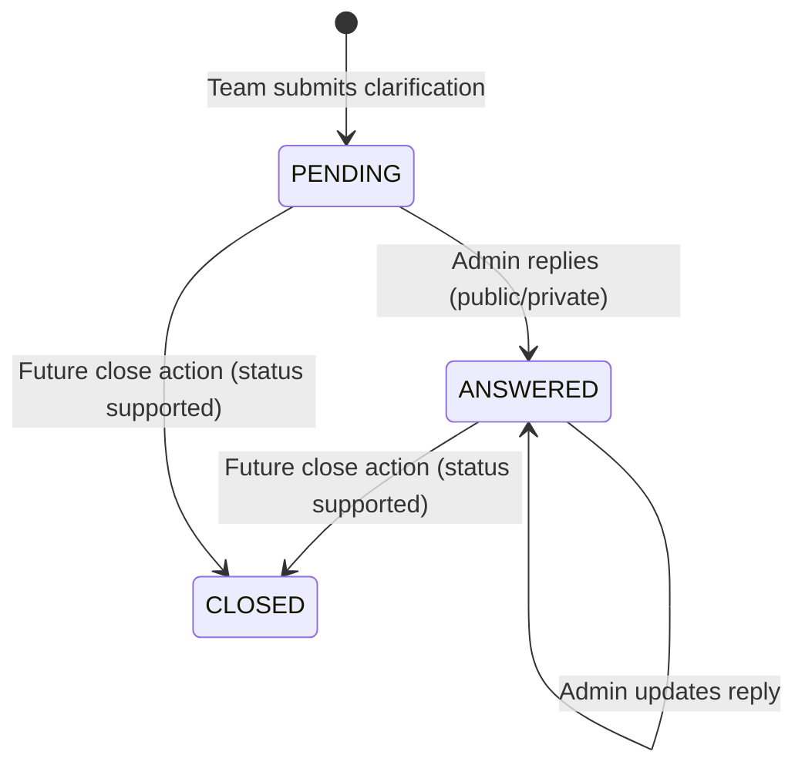

# AuraC² Task Documentation
## Endpoints Update + Clarification System

## 1. Purpose
This document is a full handover of the completed tasks related to:
- Problem/Test Case/Contest update endpoints
- Clarification system (team/admin/public flows)

It is prepared for team presentation and implementation review.

---

## 2. Scope Delivered

### 2.1 Task Group A: Endpoints (Problems, Test Cases, Contest)
Completed:
- `PUT /api/problems/{id}` (update problem)
- `PUT /api/testcases/{id}` (update test case)
- `PUT /api/contest/{id}` (update contest details)
- Validation enforcement with `@Valid` and DTO constraints
- Typed exceptions for clearer API failures
- Immediate updated DTO response after save

### 2.2 Task Group B: Clarification System
Completed:
- Clarification entity and persistence
- Team submit clarification endpoint
- Admin fetch clarifications endpoints
- Admin reply endpoint (private/public + standard/custom reply)
- Team fetch endpoint (own + eligible public clarifications)
- Public fetch endpoint (public answered clarifications only)
- Status model (`PENDING`, `ANSWERED`, `CLOSED`)

---

## 3. High-Level Architecture Placement

- Controllers:
  - `backend/src/main/java/com/server/contestControl/contestServer/controller`
- Services:
  - `backend/src/main/java/com/server/contestControl/contestServer/service`
- DTOs:
  - `backend/src/main/java/com/server/contestControl/contestServer/dto`
- Entity + Repository:
  - `backend/src/main/java/com/server/contestControl/contestServer/entity/Clarification.java`
  - `backend/src/main/java/com/server/contestControl/contestServer/repository/ClarificationRepository.java`
- Global API error shape:
  - `backend/src/main/java/com/server/contestControl/authServer/exception/ErrorResponse.java`

---

## 4. Endpoint Catalog

## 4.1 Updated Contest/Problem/TestCase Endpoints

### 4.1.1 Update Problem
- Method: `PUT`
- Path: `/api/problems/{id}`
- Access: `ADMIN`
- Request DTO: `ProblemUpdateRequest`
- Response DTO: `ProblemResponse`

Request body:
```json
{
  "title": "Two Sum",
  "description": "Find two numbers...",
  "timeLimit": 1000,
  "memoryLimit": 256,
  "difficulty": "EASY"
}
```

Behavior:
- Loads problem by ID
- Updates title/description/time/memory/difficulty
- Difficulty parsing uses enum-safe mapping (`EASY|MEDIUM|HARD`)
- Returns updated object immediately

Main failure cases:
- Problem not found -> `404 ProblemNotFoundException`
- Invalid difficulty -> `400 InvalidDifficultyException`
- Validation failure (blank/negative/etc.) -> `400 ValidationError`

---

### 4.1.2 Update Test Case
- Method: `PUT`
- Path: `/api/testcases/{id}`
- Access: `ADMIN`
- Request DTO: `TestCaseUpdateRequest`
- Response DTO: `TestCaseResponse`

Request body:
```json
{
  "inputData": "5\n1 2 3 4 5\n",
  "expectedOutput": "15\n",
  "isPublic": false
}
```

Behavior:
- Loads test case by ID
- Updates input/output/public visibility
- Returns updated test case immediately

Main failure cases:
- Test case not found -> `404 TestCaseNotFoundException`
- Validation failure -> `400 ValidationError`

---

### 4.1.3 Update Contest Details
- Method: `PUT`
- Path: `/api/contest/{id}`
- Access: `ADMIN`
- Request DTO: `ContestUpdateRequest`
- Response DTO: `ContestResponse`

Request body:
```json
{
  "title": "ACM Warmup 2026",
  "startTime": "2026-04-24T14:00:00Z",
  "durationMinutes": 300
}
```

Behavior:
- Loads contest by ID
- Allows update only if contest status is `UPCOMING`
- Updates title/startTime/duration
- Returns updated contest immediately

Main failure cases:
- Contest not found -> `404 ContestNotFoundException`
- Contest not `UPCOMING` -> `400 InvalidContestStateException`
- Validation failure -> `400 ValidationError`

---

## 4.2 Clarification System Endpoints

### 4.2.1 Team Submits Clarification
- Method: `POST`
- Path: `/api/clarifications`
- Access: `TEAM`
- Request DTO: `ClarificationRequest`
- Response DTO: `ClarificationResponse`

Request body:
```json
{
  "contestId": 7,
  "problemId": 21,
  "question": "In sample #2, are equal values allowed?"
}
```

Notes:
- `problemId` can be `null` for general contest questions.

Core business rules:
- Contest must exist
- Contest must be `RUNNING`
- If `problemId` exists, it must belong to the same contest

---

### 4.2.2 Team Fetches Clarifications
- Method: `GET`
- Path: `/api/clarifications/my/{contestId}`
- Access: `TEAM`
- Response: `List<ClarificationResponse>`

Returned set:
- Team's own clarifications in that contest
- Plus public+answered clarifications from same contest
- Deduplicated and sorted by newest first

Important rule:
- Contest must be `RUNNING`

---

### 4.2.3 Admin Fetches Clarifications (Single Contest)
- Method: `GET`
- Path: `/api/clarifications/admin/contest/{contestId}`
- Access: `ADMIN`
- Response: `List<ClarificationResponse>`

---

### 4.2.4 Admin Fetches Clarifications (All Contests)
- Method: `GET`
- Path: `/api/clarifications/admin/all`
- Access: `ADMIN`
- Response: `List<ClarificationResponse>`

---

### 4.2.5 Admin Replies to Clarification
- Method: `PUT`
- Path: `/api/clarifications/admin/{id}/reply`
- Access: `ADMIN`
- Request DTO: `ReplyRequest`
- Response DTO: `ClarificationResponse`

Example request (standard reply):
```json
{
  "standardReply": "READ_PROBLEM_STATEMENT_CAREFULLY",
  "reply": null,
  "replyType": "PUBLIC"
}
```

Example request (custom reply):
```json
{
  "standardReply": "CUSTOM",
  "reply": "Yes, equal values are valid.",
  "replyType": "PRIVATE"
}
```

Core business rules:
- Cannot reply to `CLOSED` clarification
- If `standardReply = CUSTOM`, custom `reply` is required
- If no standard reply is supplied, custom `reply` is required
- On successful reply:
  - status becomes `ANSWERED`
  - `repliedAt` set on first reply
  - `repliedByAdmin` is stored
  - visibility (`replyType`) is stored

---

### 4.2.6 Public Clarifications Endpoint
- Method: `GET`
- Path: `/api/clarifications/public/{contestId}`
- Access: Public (no auth required)
- Response: `List<ClarificationResponse>`

Returns only:
- `replyType = PUBLIC`
- `status = ANSWERED`

---

## 5. Clarification Domain Model

Entity: `Clarification`

Key fields:
- `id`
- `contest` (required)
- `problem` (optional)
- `user` (required)
- `question` (required)
- `createdAt`
- `standardReply` (enum)
- `reply` (custom text)
- `replyType` (`PRIVATE|PUBLIC`)
- `status` (`PENDING|ANSWERED|CLOSED`)
- `repliedAt`
- `repliedByAdmin`

Default behavior on create:
- `status = PENDING`
- `createdAt = now`

---

## 6. Clarification Lifecycle



Current note:
- `CLOSED` status exists and is enforced by reply logic, but no dedicated close endpoint is implemented yet.

---

## 7. Validation and Error Contract

Validation layer:
- `@Valid` on create/update endpoints for contest/problem/testcase
- Bean constraints in DTOs (`@NotBlank`, `@NotNull`, `@Positive`, `@Size`)

Exception style:
- Domain exceptions extend `ApiException`
- Global handler maps them to structured `ErrorResponse`

Error response shape:
```json
{
  "error": "InvalidContestStateException",
  "message": "Contest name, start time, and duration can only be updated while contest is UPCOMING.",
  "status": 400,
  "timestamp": "2026-04-24T12:10:01Z",
  "path": "/api/contest/7"
}
```

---

## 8. Security and Access Control

Endpoint access summary:
- Contest/problem/testcase update endpoints -> `ADMIN`
- Team clarification submit/fetch -> `TEAM`
- Admin clarification fetch/reply -> `ADMIN`
- Public clarifications fetch -> open endpoint (public)

Security annotations are applied directly at controller methods with `@PreAuthorize`.

---

## 9. Files Added (Task Scope)

- `backend/src/main/java/com/server/contestControl/contestServer/dto/contest/ContestUpdateRequest.java`
- `backend/src/main/java/com/server/contestControl/contestServer/dto/problem/ProblemUpdateRequest.java`
- `backend/src/main/java/com/server/contestControl/contestServer/dto/testcase/TestCaseUpdateRequest.java`
- `backend/src/main/java/com/server/contestControl/contestServer/exceptions/InvalidDifficultyException.java`
- `backend/src/main/java/com/server/contestControl/contestServer/exceptions/TestCaseNotFoundException.java`

Clarification system files in active use:
- `backend/src/main/java/com/server/contestControl/contestServer/entity/Clarification.java`
- `backend/src/main/java/com/server/contestControl/contestServer/controller/ClarificationController.java`
- `backend/src/main/java/com/server/contestControl/contestServer/service/ClarificationService.java`
- `backend/src/main/java/com/server/contestControl/contestServer/repository/ClarificationRepository.java`
- `backend/src/main/java/com/server/contestControl/contestServer/dto/clarification/ClarificationRequest.java`
- `backend/src/main/java/com/server/contestControl/contestServer/dto/clarification/ReplyRequest.java`
- `backend/src/main/java/com/server/contestControl/contestServer/dto/clarification/ClarificationResponse.java`

---

## 10. Files Modified (Task Scope)

- `backend/src/main/java/com/server/contestControl/contestServer/controller/ContestController.java`
- `backend/src/main/java/com/server/contestControl/contestServer/controller/ProblemController.java`
- `backend/src/main/java/com/server/contestControl/contestServer/controller/TestCaseController.java`
- `backend/src/main/java/com/server/contestControl/contestServer/dto/contest/ContestRequest.java`
- `backend/src/main/java/com/server/contestControl/contestServer/dto/problem/ProblemRequest.java`
- `backend/src/main/java/com/server/contestControl/contestServer/dto/testcase/TestCaseRequest.java`
- `backend/src/main/java/com/server/contestControl/contestServer/service/ContestService.java`
- `backend/src/main/java/com/server/contestControl/contestServer/service/ProblemService.java`
- `backend/src/main/java/com/server/contestControl/contestServer/service/TestCaseService.java`

---

## 11. Demo Script for Team Presentation (Suggested)

### 11.1 Part 1: Endpoint Updates
1. Update a contest in `UPCOMING` state using `PUT /api/contest/{id}`.
2. Show success response with updated fields.
3. Try same update on `RUNNING` contest to show business-rule rejection.
4. Update a problem with valid difficulty and then invalid difficulty.
5. Update a test case and verify immediate reflected output.

### 11.2 Part 2: Clarification System
1. As team user, submit clarification (`problemId` set and `null` case).
2. As admin, fetch all clarifications and reply with:
   - a standard reply
   - a custom private reply
3. As team user, fetch `/my/{contestId}` and show merged result.
4. Call public endpoint and show only public+answered items are returned.

---

## 12. Known Gaps / Next Step Suggestions

- Add dedicated endpoint to mark clarification as `CLOSED`.
- Add bean validation for clarification request/reply DTOs.
- Add pagination/filtering for admin clarification list on high-volume contests.
- Add audit fields (reply edit history) if governance requires it.

---

## 13. Quick Summary (One Slide)

- Three update endpoints delivered for contest/problem/testcase with strict validation and clear error handling.
- Clarification system delivered end-to-end (team submit, admin manage/reply, public visibility control).
- Access control is role-based and aligned with contest operations.
- Responses are immediate and frontend-ready for admin/team dashboards.
