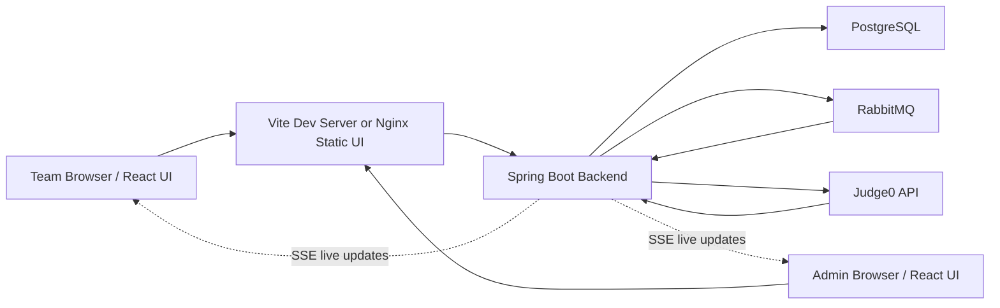
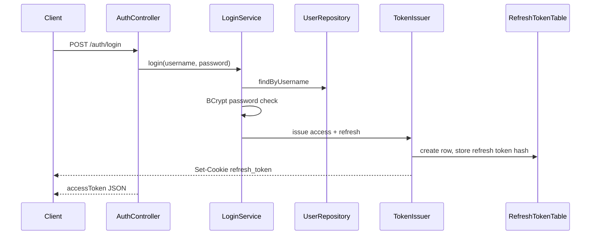
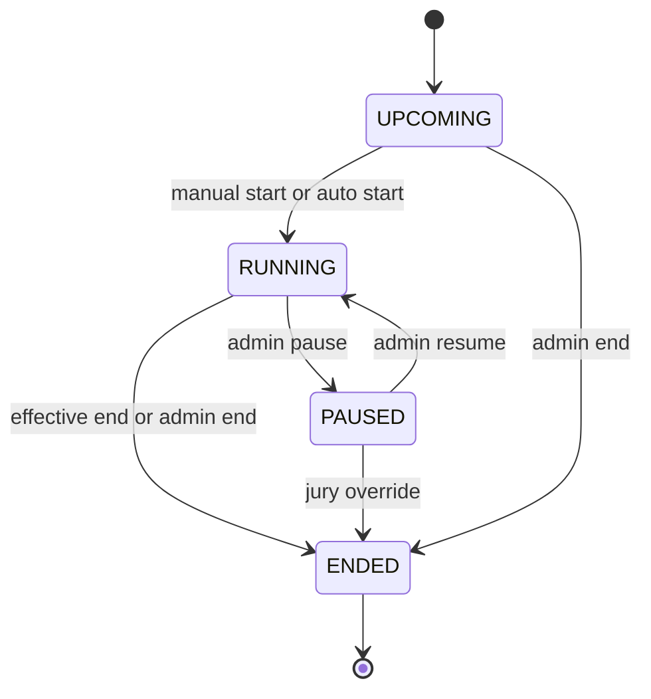
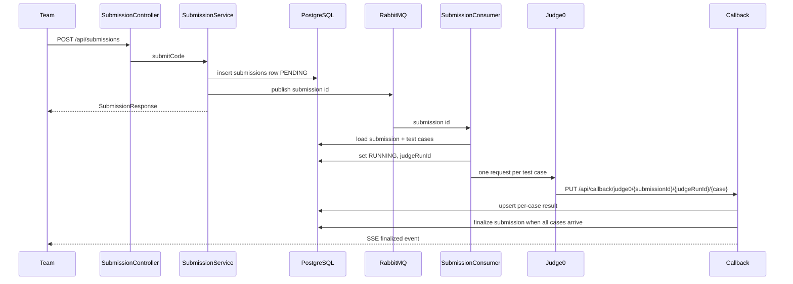
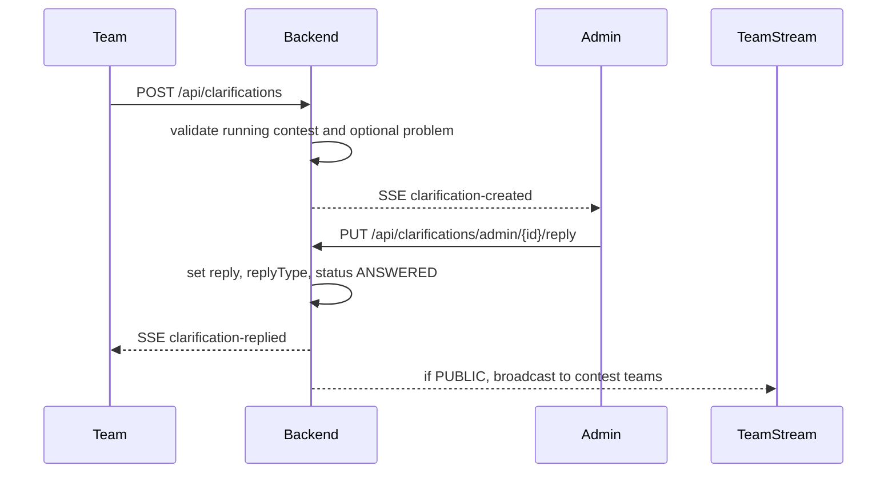
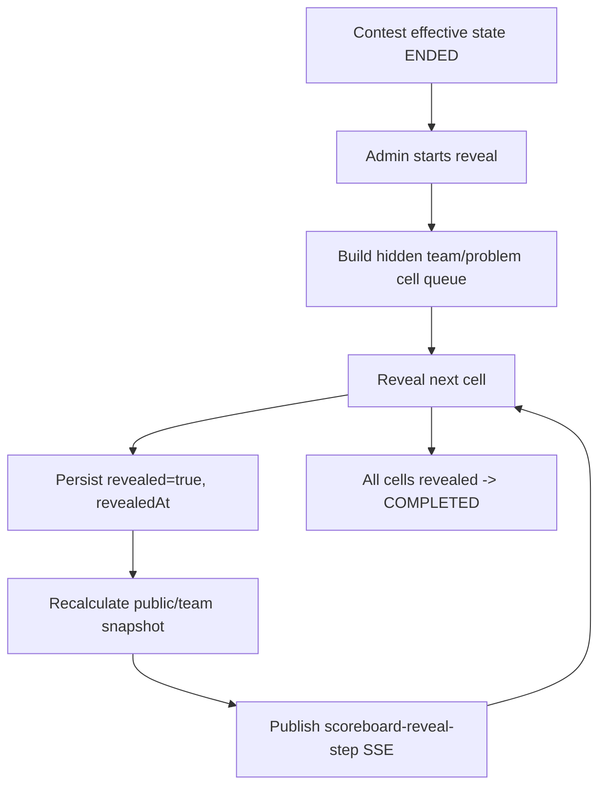
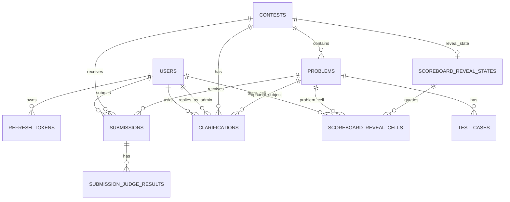

# AuraC2 Full System And Database Documentation

Last reviewed from the current repository state: 2026-05-16.

This document explains AuraC2 as a complete system: what it does, which technologies it uses, how each feature works, how the frontend and backend communicate, how Judge0 and RabbitMQ fit in, and how the database tables relate to each other.

## 1. System Purpose

AuraC2 is an online programming contest control system. It supports two main user roles:

| Role | Purpose |
|---|---|
| `ADMIN` | Creates contests, registers teams, manages problems/test cases, watches submissions, answers clarifications, rejudges submissions, controls scoreboard reveal. |
| `TEAM` | Logs in, sees the current contest state, reads problems, writes code, submits solutions, tracks submissions, asks clarifications, watches the public scoreboard. |

The system is built around a contest lifecycle:

```text
UPCOMING -> RUNNING -> PAUSED -> RUNNING -> ENDED
```

The backend stores contest data, receives submissions, queues judging work, sends code to Judge0, processes callbacks, calculates scoreboard rows, and pushes live updates through Server-Sent Events.

## 2. High-Level Architecture



Runtime responsibilities:

| Layer | Technologies | Responsibility |
|---|---|---|
| Frontend | React 18, TypeScript, Vite, Tailwind CSS 4, Radix UI, lucide-react, fetch-event-source | Admin shell, team workspace, login, live streams, scoreboard UI. |
| Backend | Java 21, Spring Boot 3.4.2, Spring MVC, Spring Security, Spring Data JPA, Lombok | REST APIs, auth, contest logic, submissions, callbacks, SSE, schedulers. |
| Database | PostgreSQL, Hibernate JPA schema generation | Persistent system state. No Flyway/Liquibase migrations are present. |
| Queue | RabbitMQ, Spring AMQP | Async submission dispatch to Judge0. |
| Judge | Judge0 CE API | Compiles/runs submitted code against test cases. |
| Docs/API | springdoc-openapi | Swagger/OpenAPI UI. |
| Deployment | Docker, Docker Compose, Nginx | Local dependencies, backend image, frontend image/proxy. |

## 3. Repository Map

```text
AuraC2/
+-- backend/
|   +-- pom.xml
|   +-- Dockerfile
|   +-- src/main/java/com/server/contestControl/
|       +-- authServer/
|       +-- contestServer/
|       +-- submissionServer/
|       +-- shared/
+-- UI/
|   +-- package.json
|   +-- vite.config.ts
|   +-- nginx.conf
|   +-- src/
|       +-- admin/
|       +-- auth/
|       +-- team/
|       +-- hooks/
|       +-- services/
|       +-- components/
+-- docs/
+-- docker-compose.yml
+-- .env.example
```

Important backend package ownership:

| Package | Owns |
|---|---|
| `authServer` | Users, JWTs, refresh tokens, login/logout/register, Spring Security. |
| `contestServer` | Contests, problems, test cases, clarifications, schedulers, contest/team streams. |
| `contestServer.scoreboard` | ICPC scoring, public/admin standings, freeze/reveal, scoreboard SSE. |
| `submissionServer` | Submissions, RabbitMQ, Judge0 dispatch, Judge0 callbacks, rejudge. |
| `shared.sse` | Generic SSE emitter registry, publisher, heartbeat. |

## 4. Backend Technology Details

Backend project: `backend/pom.xml`

| Technology | Current Use |
|---|---|
| Java 21 | Backend language and runtime. |
| Spring Boot Web | REST controllers and MVC routes. |
| Spring Security | Stateless auth, JWT filter, role-based access control. |
| Spring Data JPA | Entity mapping and repositories. |
| PostgreSQL driver | Database connectivity. |
| Spring AMQP | RabbitMQ producer/consumer. |
| JJWT | Access and refresh token creation/validation. |
| Spring Mail | SMTP config exists, but mail is not a core current feature. |
| Springdoc OpenAPI | Swagger UI. |
| Lombok | Reduces DTO/entity/service boilerplate. |
| Spring Dotenv | Supports environment loading. |
| JUnit/Spring Test/Security Test | Backend test coverage. |

Main backend config: `backend/src/main/resources/application.yml`

Important configuration groups:

| Config | Meaning |
|---|---|
| `spring.datasource.*` | PostgreSQL connection. |
| `spring.jpa.hibernate.ddl-auto` | Defaults to `create-drop`; use safer values outside local dev. |
| `spring.jpa.open-in-view` | Disabled so long SSE streams do not hold DB connections. |
| `spring.rabbitmq.*` | RabbitMQ host, port, username, password. |
| `judge0.url` | Judge0 submission endpoint. |
| `judge0.callback` | Backend callback base URL passed to Judge0. |
| `contest.sync.*` | Periodic contest status sync scheduler. |
| `jwt.*` | Access/refresh secrets and expiry. |
| `bootstrap.admin.*` | First admin account bootstrap behavior. |

## 5. Frontend Technology Details

Frontend project: `UI/package.json`

| Technology | Current Use |
|---|---|
| React 18 | Component UI. |
| TypeScript 5.7 | Static typing. |
| Vite 6 | Dev server and production build. |
| Tailwind CSS 4 | Styling. |
| Radix UI | Accessible primitives: dialog, tabs, select, alert dialog, etc. |
| lucide-react | Icons. |
| `@microsoft/fetch-event-source` | SSE with `Authorization` headers and reconnect logic. |
| react-resizable-panels | Team workspace split editor/problem layout. |
| sonner | Toast notifications. |
| Recharts | Available for charting; not central to current core flows. |

Dev proxy: `UI/vite.config.ts`

| Frontend path | Proxied to |
|---|---|
| `/auth` | `http://localhost:8080` |
| `/api` | `http://localhost:8080` |

Production frontend container:

- Builds with Node 20.
- Serves static files with Nginx.
- Proxies `/api`, `/auth`, Swagger, and `/v3` docs to backend.

## 6. Feature Map

| Feature | Backend Files | Frontend Files | Main Technologies | Works With |
|---|---|---|---|---|
| Login/session | `AuthController`, `LoginService`, `RefreshTokenService`, `JwtAuthFilter` | `LoginPage`, `authApi`, `tokenStore`, `App.tsx` | Spring Security, JWT, HttpOnly cookies, localStorage | `users`, `refresh_tokens` |
| Admin bootstrap | `AdminBootstrapRunner`, `AdminBootstrapProperties` | none | Spring startup runner, BCrypt | `users`, `admin-account.txt` |
| Team registration/user admin | `AuthController`, `AdminController`, `UserService` | `TeamsView`, `RegisterModal` | REST, BCrypt, role checks | `users` |
| Contest lifecycle | `ContestController`, `ContestService`, `ContestLifecycleService`, schedulers | `ContestOverview`, `TeamLandingPage`, `useContestStream` | REST, SSE, schedulers, DB timestamps | `contests` |
| Problems | `ProblemController`, `ProblemService` | `ProblemsView`, `CreateProblemModal`, `EditProblemModal` | REST, JPA | `problems`, `contests` |
| Test cases | `TestCaseController`, `TestCaseService` | `TestCasesPanel`, `AddTestCaseModal`, `EditTestCaseModal` | REST, JPA | `test_cases`, `problems` |
| Team workspace | `ProblemController`, `SubmissionController`, `ClarificationController`, scoreboard APIs | `TeamWorkspace`, `CodeEditor`, `ProblemSidebar`, `SubmissionHistory` | React, localStorage drafts, REST, SSE | Problems, submissions, clarifications |
| Submission judging | `SubmissionService`, `SubmissionProducer`, `SubmissionConsumer`, `Judge0Service` | `CodeEditor`, `SubmissionHistory`, `useSubmissionStream` | RabbitMQ, Judge0, SSE | `submissions`, `test_cases` |
| Judge0 callback aggregation | `CallbackHandler`, `Judge0CallbackService` | live updates through stream hooks | HTTP callback, pessimistic locking, per-test-case rows | `submission_judge_results`, `submissions` |
| Rejudge/force rejudge | `RejudgeController`, `RejudgeService` | `SubmissionsView`, `RejudgeView` | REST, RabbitMQ, `judgeRunId`, SSE | `submissions`, `submission_judge_results` |
| Clarifications | `ClarificationController`, `ClarificationService`, clarification SSE | `Clarifications`, `ClarificationsView`, `useClarificationStream` | REST, SSE, role filtering | `clarifications`, `users`, `contests`, `problems` |
| Scoreboard | `ScoreboardService`, `ScoreboardCalculator`, scoreboard controllers | `ScoreboardView`, `Scoreboard`, `ScoreboardTable`, `useScoreboardStream` | ICPC scoring, REST, SSE | `submissions`, `users`, `problems`, reveal tables |
| Scoreboard reveal | `ScoreboardRevealService`, reveal entities/repos | `ScoreboardView`, `ScoreboardRevealDisplay` | Persisted reveal queue, SSE | `scoreboard_reveal_states`, `scoreboard_reveal_cells` |

## 7. Authentication And Security

Authentication uses short-lived access JWTs and refresh JWTs stored in an HttpOnly cookie.



Auth behavior:

| Part | How It Works |
|---|---|
| Access token | Returned in JSON, stored in frontend `localStorage` under `access_token`, sent as `Authorization: Bearer`. |
| Refresh token | Stored as `refresh_token` HttpOnly cookie with path `/auth`; database stores only SHA-256 hash. |
| Refresh flow | `POST /auth/refresh` validates refresh JWT and DB row, revokes old row, issues new access and refresh tokens. |
| Logout | `POST /auth/logout` revokes refresh token and clears cookie. |
| Passwords | Stored with BCrypt. |
| Roles | `User.role` maps to Spring authorities `ROLE_ADMIN` or `ROLE_TEAM`. |

Security rules:

| Route Pattern | Access |
|---|---|
| `/auth/login`, `/auth/refresh`, `/auth/logout` | Public |
| `POST /auth/register` | `ADMIN` |
| `/api/callback/judge0/**` | Public, because Judge0 must call it |
| `/api/contest/active`, `/upcoming`, `/paused`, `/ended` | Public |
| `/api/scoreboard/**` | Public/team-readable |
| `/api/contest/**` | `ADMIN` |
| `/api/admin/**` | `ADMIN` |
| `/api/submissions/**` | `TEAM` or `ADMIN` |
| `/api/clarifications/my/**` | `TEAM` |
| `/api/clarifications/admin/**` | `ADMIN` |
| `POST /api/clarifications` | `TEAM` |

Important detail: the app is stateless. CSRF, form login, HTTP basic, and server sessions are disabled.

## 8. Contest Lifecycle

The contest feature has two concepts of state:

| State Type | Meaning |
|---|---|
| Persisted state | `contests.status`, the value written in the DB. |
| Effective state | Computed from persisted state, clock time, `actualStartTime`, pause history, duration, and `statusLocked`. |

This matters because the clock can pass a scheduled start/end time before a scheduler writes the DB row. The UI uses effective state so it sees the truth right now.

Contest timing fields:

| Field | Meaning |
|---|---|
| `startTime` | Scheduled/planned start. |
| `actualStartTime` | Real start time, set when contest transitions into running. |
| `durationMinutes` | Contest duration. |
| `pausedAt` | Timestamp when contest was paused. |
| `totalPauseMillis` | Total accumulated paused time. |
| `scoreboardFreezeMinutes` | Minutes before effective end when public scoreboard freezes. |
| `penaltyMinutes` | ICPC penalty per wrong attempt. |

Lifecycle flow:



Schedulers:

| Scheduler | Purpose |
|---|---|
| `ContestTransitionScheduler` | Exact-time in-memory scheduler; parks tasks for start/end times and reacts to contest events. |
| `ContestStatusSyncScheduler` | Fallback periodic sync; catches transitions missed because of restart, clock drift, or failed in-memory task. |
| `ContestStatusSyncExecutor` | Performs locked DB transition in a new transaction. |

Contest updates publish `ContestUpdatedEvent`, then SSE adapters send `contest-update` events to admin/team browsers.

## 9. Problem And Test Case Management

Problems belong to contests. Test cases belong to problems.

Problem fields:

| Field | Meaning |
|---|---|
| `contest_id` | Parent contest. |
| `title` | Problem title. |
| `description` | Full statement, stored as text. |
| `timeLimit` | Execution time limit. |
| `memoryLimit` | Memory limit. |
| `difficulty` | `EASY`, `MEDIUM`, or `HARD`. |

Test case fields:

| Field | Meaning |
|---|---|
| `problem_id` | Parent problem. |
| `inputData` | Input sent to Judge0. |
| `expectedOutput` | Expected output sent to Judge0. |
| `isPublic` | Whether teams can see it. |

Admin can create, update, and delete problems/test cases. Teams can read contest problems and only public test cases. In the current `TestCaseResponse`, public test case responses include both input and expected output, but private cases are filtered out for teams.

Problem deletion explicitly deletes:

1. `submission_judge_results` for that problem's submissions.
2. `submissions` for that problem.
3. `clarifications` linked to that problem.
4. The `problems` row.

## 10. Submission Judging Flow

Submissions are judged asynchronously. The API request saves the submission quickly, then RabbitMQ does the slow work.



Submission validation:

| Rule | Why |
|---|---|
| Active contest is loaded from `ContestService.getContestEntity()` | Teams submit only to the current running contest. |
| Request `contestId`, if present, must match the active contest | Prevents submitting into a stale or wrong contest. |
| Problem must belong to active contest | Prevents cross-contest submissions. |
| Language must map to Judge0 language ID | Unsupported languages fail before Judge0 dispatch. |

Supported language mapping:

| UI/API Language | Judge0 ID |
|---|---:|
| `c` | 50 |
| `cpp`, `c++`, `g++` | 54 |
| `java` | 62 |
| `python`, `py`, `python3` | 71 |
| `javascript`, `js`, `node` | 63 |
| `go` | 60 |

Verdict mapping:

| Judge0 Status ID | AuraC2 Verdict |
|---:|---|
| 3 | `ACCEPTED` |
| 4 | `WRONG_ANSWER` |
| 5 | `TLE` |
| 6 | `COMPILATION_ERROR` |
| 7-12 | `RUNTIME_ERROR` |
| 13-14 | `INTERNAL_ERROR` |
| other / in queue / processing | `PENDING` |

## 11. Judge0 Callback Aggregation

Each submission has a `judgeRunId`. This protects the system when a submission is rejudged while old Judge0 callbacks are still in flight.

Callback URL shape:

```text
/api/callback/judge0/{submissionId}/{judgeRunId}/{testCaseNumber}
```

Legacy callback route still exists:

```text
/api/callback/judge0/{submissionId}/{testCaseNumber}
```

Callback correctness rules:

| Rule | Implementation |
|---|---|
| Stale callback protection | Callback `judgeRunId` must equal current `Submission.judgeRunId`. |
| Per-case persistence | One `submission_judge_results` row per submission/run/test-case number. |
| Out-of-order safety | Final verdict is calculated only after all expected test cases have terminal results. |
| Duplicate callback handling | Existing row for the same `(submission_id, judge_run_id, test_case_number)` is updated. |
| Concurrency | Submission row is loaded with pessimistic write lock during callback handling. |
| Final verdict | First failing test case by number wins; all accepted means `ACCEPTED`. |
| Aggregate metrics | Execution time and memory usage are max values across the run's test cases. |

## 12. Rejudge And Force Rejudge

Rejudge reuses the same RabbitMQ and Judge0 pipeline.

Normal rejudge:

- Admin selects submissions, a problem, or a contest.
- Active submissions are skipped: `PENDING`, `PENDING_REJUDGE`, `RUNNING`.
- Final submissions are marked `PENDING_REJUDGE`.
- `judgeRunId` is advanced.
- Execution metrics are cleared.
- Submission IDs are republished to RabbitMQ after DB commit.

Force rejudge:

- Includes active submissions too.
- Advances `judgeRunId` immediately.
- Old Judge0 callbacks become stale and are ignored.
- It does not physically cancel external Judge0 jobs.

Rejudge response shape:

| Field | Meaning |
|---|---|
| `scope` | `SUBMISSIONS`, `PROBLEM`, `CONTEST`, `FORCE_*`. |
| `scopeId` | Problem/contest ID where relevant. |
| `requestedCount` | Number of normalized requested IDs or scope submissions. |
| `foundCount` | Number found in DB. |
| `queuedCount` | Number moved to `PENDING_REJUDGE`. |
| `skippedCount` | Number skipped by normal rejudge active-state rule. |
| `queuedSubmissionIds` | Queued IDs. |
| `skippedSubmissionIds` | Skipped IDs. |
| `missingSubmissionIds` | Requested selected IDs not found. |

## 13. Clarifications

Clarifications let teams ask questions during a running contest. Admins can reply privately or publicly.

Clarification flow:



Clarification rules:

| Rule | Meaning |
|---|---|
| Contest must be `RUNNING` to submit or view team clarifications. |
| Optional `problemId` must belong to the same contest. |
| Admin can reply with a standard reply or custom reply. |
| `PRIVATE` reply goes to asking team. |
| `PUBLIC` reply is visible to all teams in that contest. |
| Team view includes own clarifications plus answered public clarifications. |
| Public unauthenticated route returns only answered public clarifications. |

Standard replies:

```text
NO_COMMENT
READ_PROBLEM_STATEMENT_CAREFULLY
YES
NO
ANSWERED
CUSTOM
```

## 14. Scoreboard And Reveal

The scoreboard is ICPC-style:

| Rule | Meaning |
|---|---|
| Ranked users | Only `TEAM` users count. Admin submissions are ignored. |
| Solved cell | First `ACCEPTED` submission for a team/problem. |
| Solved time | Minutes from contest `actualStartTime` to first accepted submission. |
| Penalty | solved time + wrong attempts before accepted * `contest.penaltyMinutes`. |
| Wrong attempts counted | `WRONG_ANSWER`, `TLE`, `COMPILATION_ERROR`, `RUNTIME_ERROR`. |
| Tie ranking | Higher solved first, lower penalty next; equal solved/penalty share rank. |
| First to solve | Earliest visible accepted submission per problem. |

Public/team scoreboard:

- Live before freeze.
- Hides terminal post-freeze submissions during freeze.
- Remains frozen after contest end until reveal completes.
- Reveals cells one by one or all at once.

Admin scoreboard:

- Always live.
- Shows freeze metadata.
- Can control reveal mode after contest ends.

Reveal flow:



Reveal tables:

| Table | Purpose |
|---|---|
| `scoreboard_reveal_states` | One reveal state row per contest. |
| `scoreboard_reveal_cells` | Queue of hidden team/problem cells and whether each is revealed. |

## 15. SSE Live Updates

AuraC2 uses Server-Sent Events, not WebSockets.

Shared backend components:

| Component | Purpose |
|---|---|
| `SseEmitterRegistry` | Holds broadcast emitters and targeted emitters. |
| `SsePublisher` | Sends named JSON SSE events. |
| `SseHeartbeatScheduler` | Sends `ping` every 15 seconds to all registries. |

Current stream families:

| Stream | Endpoint | Audience | Events |
|---|---|---|---|
| Contest admin stream | `GET /api/contest/stream` | Admin | `snapshot`, `contest-update`, `ping` |
| Contest team stream | `GET /api/team/stream` | Team | `snapshot`, `contest-update`, `ping` |
| Submission team stream | `GET /api/submissions/stream` | Team | `submission-event`, `ping` |
| Submission admin stream | `GET /api/admin/submissions/stream` | Admin | `submission-event`, `ping` |
| Clarification team stream | `GET /api/clarifications/my/stream/{contestId}` | Team | clarification events, `ping` |
| Clarification admin stream | `GET /api/clarifications/admin/stream/{contestId}` | Admin | clarification events, `ping` |
| Scoreboard public stream | `GET /api/scoreboard/contests/{contestId}/stream` | Public/team | `snapshot`, scoreboard events, `ping` |
| Scoreboard admin stream | `GET /api/admin/scoreboard/contests/{contestId}/stream` | Admin | `snapshot`, scoreboard events, `ping` |

Frontend stream hooks:

| Hook | Purpose |
|---|---|
| `useContestStream` | Contest lifecycle updates; supports auth refresh and watchdog reconnect. |
| `useSubmissionStream` | Submission created/running/finalized/rejudge events. |
| `useClarificationStream` | Clarification created/replied/public answered events. |
| `useScoreboardStream` | Scoreboard row patches, freeze events, reveal steps, version-gap refetch. |

## 16. Database Overview

AuraC2 currently uses Hibernate JPA schema generation. No migration framework or SQL migration files were found.

Important warning:

```yaml
spring.jpa.hibernate.ddl-auto: create-drop
```

is the default unless overridden by environment variable. For real deployments, use `update`, `validate`, or explicit migrations, depending on your deployment strategy.

## 17. Main ER Diagram



## 18. Table-By-Table Database Details

### `users`

Entity: `authServer.entity.User`

| Column/Field | Type Concept | Notes |
|---|---|---|
| `id` | Long PK | Identity generated. |
| `username` | String | Required, unique. |
| `password` | String | BCrypt encoded. |
| `accountNonLocked` | boolean | Defaults true. |
| `credentialsNonExpired` | boolean | Defaults true. |
| `accountNonExpired` | boolean | Defaults true. |
| `role` | enum string | `ADMIN` or `TEAM`. |

Relations:

| Relation | Cardinality |
|---|---|
| User -> RefreshToken | One user has many refresh tokens. |
| User -> Submission | One team can have many submissions. |
| User -> Clarification | One team can ask many clarifications. |
| User -> Clarification as admin | One admin can reply to many clarifications. |
| User -> ScoreboardRevealCell | Team user participates in reveal cells. |

### `refresh_tokens`

Entity: `authServer.entity.RefreshToken`

| Column/Field | Notes |
|---|---|
| `id` | PK and JWT ID reference. |
| `tokenHash` | SHA-256 hash of refresh JWT. |
| `deviceIp` | IP recorded during issue. |
| `createdAt` | Created timestamp. |
| `expiresAt` | Expiry timestamp. |
| `revoked` | Set true when token rotates/logout. |
| `user_id` | FK to `users`. |

Refresh tokens are not trusted just because the browser has a cookie. The backend checks the JWT and the DB row.

### `contests`

Entity: `contestServer.entity.Contest`

| Column/Field | Notes |
|---|---|
| `id` | PK. |
| `title` | Contest name. |
| `startTime` | Planned start. |
| `durationMinutes` | Contest length. |
| `actualStartTime` | Real start timestamp. |
| `pausedAt` | Current pause start, if paused. |
| `totalPauseMillis` | Accumulated pause duration. |
| `description` | Text description. |
| `status` | `UPCOMING`, `RUNNING`, `PAUSED`, `ENDED`. |
| `statusLocked` | Stops automatic state changes. |
| `scoreboardFreezeMinutes` | Public freeze window. |
| `penaltyMinutes` | Wrong-attempt penalty. |

Relations:

| Relation | Cardinality |
|---|---|
| Contest -> Problem | One contest has many problems. |
| Contest -> Submission | One contest has many submissions. |
| Contest -> Clarification | One contest has many clarifications. |
| Contest -> ScoreboardRevealState | One contest has one reveal state. |

### `problems`

Entity: `contestServer.entity.Problem`

| Column/Field | Notes |
|---|---|
| `id` | PK. |
| `contest_id` | Required FK to contest. |
| `title` | Problem title. |
| `description` | Text statement. |
| `timeLimit` | Time limit. |
| `memoryLimit` | Memory limit. |
| `difficulty` | `EASY`, `MEDIUM`, `HARD`. |

Relations:

| Relation | Cardinality |
|---|---|
| Problem -> TestCase | One problem has many test cases, orphan removal enabled. |
| Problem -> Submission | One problem has many submissions. |
| Problem -> Clarification | One problem can be referenced by many clarifications. |
| Problem -> ScoreboardRevealCell | One problem can appear in many reveal cells. |

### `test_cases`

Entity: `contestServer.entity.TestCase`

| Column/Field | Notes |
|---|---|
| `id` | PK. |
| `problem_id` | Required FK to problem. |
| `inputData` | Text stdin. |
| `expectedOutput` | Text expected stdout. |
| `isPublic` | Visible to teams if true. |

Test cases are loaded by `SubmissionConsumer` and sent one by one to Judge0.

### `submissions`

Entity: `submissionServer.entity.Submission`

| Column/Field | Notes |
|---|---|
| `id` | PK. |
| `contest_id` | FK to contest. |
| `problem_id` | FK to problem. |
| `user_id` | FK to submitting user. |
| `code` | Submitted source code text. |
| `language` | Language string mapped to Judge0 ID. |
| `verdict` | Current verdict enum. |
| `createdAt` | Submission timestamp. |
| `executionTime` | Aggregate max execution time. |
| `memoryUsage` | Aggregate max memory usage. |
| `judgeRunId` | Current judging attempt ID. |

Lifecycle:

```text
PENDING -> RUNNING -> ACCEPTED / WRONG_ANSWER / TLE / COMPILATION_ERROR / RUNTIME_ERROR / INTERNAL_ERROR
```

Rejudge lifecycle:

```text
FINAL_VERDICT -> PENDING_REJUDGE -> RUNNING -> FINAL_VERDICT
```

### `submission_judge_results`

Entity: `submissionServer.entity.SubmissionJudgeResult`

| Column/Field | Notes |
|---|---|
| `id` | PK. |
| `submission_id` | Required FK to submission. |
| `judge_run_id` | Run attempt ID. |
| `test_case_number` | 1-based case number. |
| `verdict` | Terminal per-case verdict. |
| `executionTime` | Per-case time. |
| `memoryUsage` | Per-case memory. |
| `receivedAt` | Updated on insert/update. |

Constraint:

```text
unique(submission_id, judge_run_id, test_case_number)
```

This table is the reason out-of-order Judge0 callbacks are safe.

### `clarifications`

Entity: `contestServer.entity.Clarification`

| Column/Field | Notes |
|---|---|
| `id` | PK. |
| `contest_id` | Required FK. |
| `problem_id` | Optional FK. Null means general contest question. |
| `user_id` | Required FK to asking team. |
| `question` | Team question text. |
| `createdAt` | Defaults on persist. |
| `standardReply` | Optional standard reply enum. |
| `reply` | Optional custom reply text. |
| `repliedAt` | Admin reply timestamp. |
| `replied_by_admin_id` | FK to admin user. |
| `status` | `PENDING`, `ANSWERED`, `CLOSED`. |
| `replyType` | `PRIVATE`, `PUBLIC`, or null before answer. |

### `scoreboard_reveal_states`

Entity: `contestServer.scoreboard.entity.ScoreboardRevealState`

| Column/Field | Notes |
|---|---|
| `id` | PK. |
| `contest_id` | Required unique FK to contest. |
| `status` | `NOT_STARTED`, `IN_PROGRESS`, `COMPLETED`. |
| `startedAt` | Reveal start timestamp. |
| `updatedAt` | Updated on persist/update. |
| `completedAt` | Reveal completion timestamp. |

One contest can have at most one persisted reveal state row. Before reveal starts, the service can return a default `NOT_STARTED` response without saving a row.

### `scoreboard_reveal_cells`

Entity: `contestServer.scoreboard.entity.ScoreboardRevealCell`

| Column/Field | Notes |
|---|---|
| `id` | PK. |
| `reveal_state_id` | Required FK to reveal state. |
| `team_id` | Required FK to `users`. |
| `problem_id` | Required FK to problem. |
| `revealOrder` | Order in reveal queue. |
| `revealed` | Whether this cell is visible yet. |
| `revealedAt` | Timestamp when revealed. |

Constraint:

```text
unique(reveal_state_id, team_id, problem_id)
```

## 19. Database Relationship Notes

Cascade/orphan behavior:

| Relation | Behavior |
|---|---|
| `User.refreshTokens` | Cascade all and orphan removal. Deleting user deletes refresh token rows. |
| `Contest.problems` | Cascade all. Problems are children of contest. |
| `Problem.testCases` | Cascade all and orphan removal. Deleting a problem deletes test cases. |
| Problem deletion service | Manually deletes related judge results, submissions, and clarifications before deleting problem. |

Important DB integrity/business constraints:

| Constraint | Why It Matters |
|---|---|
| `users.username` unique | Login identity must be unique. |
| `scoreboard_reveal_states.contest_id` unique | One reveal state per contest. |
| `submission_judge_results(submission_id, judge_run_id, test_case_number)` unique | One result per case per judge run. |
| `scoreboard_reveal_cells(reveal_state_id, team_id, problem_id)` unique | One reveal queue item per hidden team/problem cell. |
| Pessimistic lock on submission callback | Prevents two callbacks finalizing same submission at the same time. |
| Pessimistic lock on contest sync | Prevents duplicate auto-start/end changes. |

## 20. API Endpoint Index

### Auth

| Method | Endpoint | Access | Purpose |
|---|---|---|---|
| `POST` | `/auth/login` | Public | Login, returns access token and refresh cookie. |
| `POST` | `/auth/refresh` | Public with refresh cookie | Rotate refresh token, return new access token. |
| `POST` | `/auth/logout` | Public with refresh cookie | Revoke refresh token and clear cookie. |
| `POST` | `/auth/register` | Admin | Register a team account. |

### Contest

| Method | Endpoint | Access | Purpose |
|---|---|---|---|
| `POST` | `/api/contest` | Admin | Create contest. |
| `PUT` | `/api/contest/{id}` | Admin | Update contest details. |
| `PUT` | `/api/contest/{id}/start` | Admin | Start contest. |
| `PUT` | `/api/contest/{id}/resume` | Admin | Resume paused contest. |
| `PUT` | `/api/contest/{id}/pause` | Admin | Pause running contest. |
| `PUT` | `/api/contest/{id}/end?juryOverride=false` | Admin | End contest. |
| `GET` | `/api/contest/active` | Public | Get effective running contest. |
| `GET` | `/api/contest/upcoming` | Public | Get effective upcoming contest. |
| `GET` | `/api/contest/paused` | Public | Get paused contest. |
| `GET` | `/api/contest/ended` | Public | Get ended contests. |
| `GET` | `/api/contest/stream` | Admin | Contest SSE stream. |
| `GET` | `/api/team/stream` | Team | Team contest SSE stream. |

### Problems And Test Cases

| Method | Endpoint | Access | Purpose |
|---|---|---|---|
| `POST` | `/api/problems` | Admin | Create problem. |
| `PUT` | `/api/problems/{id}` | Admin | Update problem. |
| `DELETE` | `/api/problems/{id}` | Admin | Delete problem and dependent submission data. |
| `GET` | `/api/problems/{id}` | Admin/team | Get one problem. |
| `GET` | `/api/problems/contest/{id}` | Admin/team | Get contest problems. |
| `POST` | `/api/testcases/{problemId}` | Admin | Add test case. |
| `PUT` | `/api/testcases/{id}` | Admin | Update test case. |
| `DELETE` | `/api/testcases/{id}` | Admin | Delete test case. |
| `GET` | `/api/testcases/problem/{problemId}` | Admin/team | Admin gets all; team gets public only. |

### Submissions And Rejudge

| Method | Endpoint | Access | Purpose |
|---|---|---|---|
| `POST` | `/api/submissions` | Team/admin | Submit code. |
| `GET` | `/api/submissions/{id}` | Team/admin | Get submission; team can only access own. |
| `GET` | `/api/submissions/my?problemID={id}` | Team/admin | Current user's submissions for problem. |
| `GET` | `/api/submissions/my/all` | Team | Current team's submissions. |
| `GET` | `/api/submissions/stream` | Team | Team submission SSE. |
| `GET` | `/api/admin/submissions/stream` | Admin | Admin submission SSE. |
| `GET` | `/api/admin/users/submissions?contestId={id}` | Admin | All submissions, optionally by contest. |
| `POST` | `/api/admin/rejudge/submissions` | Admin | Rejudge selected final submissions. |
| `POST` | `/api/admin/rejudge/problem/{problemId}` | Admin | Rejudge final submissions for problem. |
| `POST` | `/api/admin/rejudge/contests/{contestId}` | Admin | Rejudge final submissions for contest. |
| `POST` | `/api/admin/rejudge/force/submissions` | Admin | Force rejudge selected submissions. |
| `POST` | `/api/admin/rejudge/force/problem/{problemId}` | Admin | Force rejudge problem. |
| `POST` | `/api/admin/rejudge/force/contests/{contestId}` | Admin | Force rejudge contest. |

### Clarifications

| Method | Endpoint | Access | Purpose |
|---|---|---|---|
| `POST` | `/api/clarifications` | Team | Submit question. |
| `GET` | `/api/clarifications/my/{contestId}` | Team | Team's own plus public answered clarifications. |
| `GET` | `/api/clarifications/admin/contest/{contestId}` | Admin | Contest clarifications. |
| `GET` | `/api/clarifications/admin/all` | Admin | All clarifications. |
| `PUT` | `/api/clarifications/admin/{id}/reply` | Admin | Reply privately/publicly. |
| `GET` | `/api/clarifications/public/{contestId}` | Public | Public answered clarifications. |
| `GET` | `/api/clarifications/my/stream/{contestId}` | Team | Team clarification SSE. |
| `GET` | `/api/clarifications/admin/stream/{contestId}` | Admin | Admin clarification SSE. |

### Scoreboard

| Method | Endpoint | Access | Purpose |
|---|---|---|---|
| `GET` | `/api/scoreboard/contests/{contestId}` | Public/team | Freeze-aware public snapshot. |
| `GET` | `/api/scoreboard/contests/{contestId}/stream` | Public/team | Public scoreboard SSE. |
| `GET` | `/api/admin/scoreboard/contests/{contestId}` | Admin | Live admin snapshot. |
| `GET` | `/api/admin/scoreboard/contests/{contestId}/stream` | Admin | Admin scoreboard SSE. |
| `GET` | `/api/admin/scoreboard/contests/{contestId}/reveal` | Admin | Reveal state. |
| `POST` | `/api/admin/scoreboard/contests/{contestId}/reveal/start` | Admin | Start/rebuild reveal queue. |
| `POST` | `/api/admin/scoreboard/contests/{contestId}/reveal/next` | Admin | Reveal next cell. |
| `POST` | `/api/admin/scoreboard/contests/{contestId}/reveal/all` | Admin | Reveal all cells. |
| `POST` | `/api/admin/scoreboard/contests/{contestId}/reveal/reset` | Admin | Reset reveal to frozen state. |

## 21. Frontend Behavior By Role

Admin app:

| View | Purpose |
|---|---|
| Overview | Current contest summary and navigation. |
| Contests | Create/edit/start/pause/resume/end contests, view lifecycle buckets. |
| Teams | Register teams, update names/passwords, delete non-admin users. |
| Problems | Manage problems for the selected contest. |
| Submissions | View submissions, filter, inspect code, selected rejudge/force rejudge. |
| Clarifications | View and answer team questions. |
| Scoreboard | View live admin scoreboard, public snapshot, freeze/reveal controls. |
| Rejudge | Rejudge by problem or contest. |
| Reveal display | Presentation view for reveal mode. |

Team app:

| State | Screen |
|---|---|
| No contest | Landing page. |
| Upcoming | Landing page with upcoming contest. |
| Paused | Landing page showing paused state. |
| Running | Full workspace with problems, statement panel, code editor, submissions, clarifications, scoreboard. |
| Ended by live event | Landing page / ended lifecycle. |

Team workspace details:

- Problem selection is stored per contest in `localStorage`.
- Code drafts are stored per user/contest/problem/language.
- Language selection is stored per user/contest/problem.
- Submission stream causes safe refetch of submission history.
- Scoreboard page opens public/team scoreboard and stream.

## 22. Deployment And Local Runtime

Docker Compose currently starts:

| Service | Image | Ports |
|---|---|---|
| PostgreSQL | `postgres:15` | `5432:5432` |
| RabbitMQ | `rabbitmq:3-management` | `5672:5672`, `15672:15672` |

Backend/frontend Docker services exist in `docker-compose.yml` but are commented out.

Backend Dockerfile:

- Builds with Maven 3.9 + Eclipse Temurin 21.
- Runs with Eclipse Temurin 21 JRE Alpine.
- Exposes port 8080.

Frontend Dockerfile:

- Builds with Node 20 Alpine.
- Serves with Nginx on port 80.
- Proxies `/api` and `/auth` to backend.

Judge0 callback note:

- If using public Judge0 CE from local development, `judge0.callback` must be publicly reachable, usually through a tunnel such as ngrok.
- If Judge0 runs inside the same Docker network, callback can use internal backend address.

## 23. Current Limitations And Risks

| Area | Current Situation |
|---|---|
| DB migrations | No Flyway/Liquibase migrations found; schema relies on Hibernate. |
| Local JPA default | `create-drop` will recreate schema unless overridden. |
| Secrets | Example/default config includes development secrets; production must use environment/secret storage and rotate real credentials. |
| Judge0 cancellation | Force rejudge does not cancel external Judge0 jobs; it ignores old callbacks logically. |
| Rejudge outbox | If RabbitMQ publish fails after DB commit, submission can remain `PENDING_REJUDGE`; no durable outbox table yet. |
| Result cleanup | Old `submission_judge_results` rows are retained. |
| Horizontal scaling | Scoreboard version cache and last snapshot diff are process-local. |
| Validation coverage | Some DTOs rely on service validation rather than Bean Validation annotations. |
| Public test response | Public test cases expose expected output, which is fine for sample cases but should be intentional. |

## 24. Testing Coverage Seen In Repo

Backend tests cover:

- Auth controller/security, JWT filter, cookie utility, global exception handler.
- Contest service, lifecycle sync scheduler/executor, transition scheduler.
- Submission service validation.
- Submission consumer.
- Judge0 callback aggregation.
- Rejudge and force rejudge.
- SSE emitter registry.
- Scoreboard calculator, service, reveal, reveal visibility, SSE publisher.

Frontend tests cover:

- Scoreboard stream hook.
- Scoreboard table rendering.
- Admin scoreboard view.
- Team scoreboard component.

Common verification commands:

```bash
cd backend
./mvnw test
```

```bash
cd UI
npm run build
```

```bash
cd UI
npx vitest
```

## 25. One-Screen Mental Model

AuraC2 works like this:

1. Admin logs in and creates a contest.
2. Admin registers teams.
3. Admin adds problems and test cases.
4. Contest becomes running manually or automatically.
5. Team logs in and opens the workspace.
6. Team submits code.
7. Backend saves the submission, publishes the ID to RabbitMQ, and returns immediately.
8. RabbitMQ consumer sends each test case to Judge0.
9. Judge0 calls back once per test case.
10. Backend stores every callback in `submission_judge_results`.
11. When all test cases arrive, backend finalizes `submissions.verdict`.
12. Submission SSE updates team/admin UIs.
13. Scoreboard receives submission events and recalculates rows.
14. Contest lifecycle events freeze the public scoreboard when needed.
15. After contest end, admin can reveal hidden cells one by one.

The database is the source of truth. RabbitMQ is the work queue. Judge0 is the execution engine. SSE is the live UI update layer. React is the operator/team interface.
