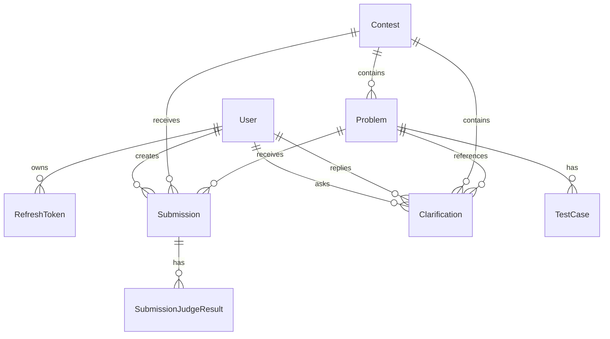
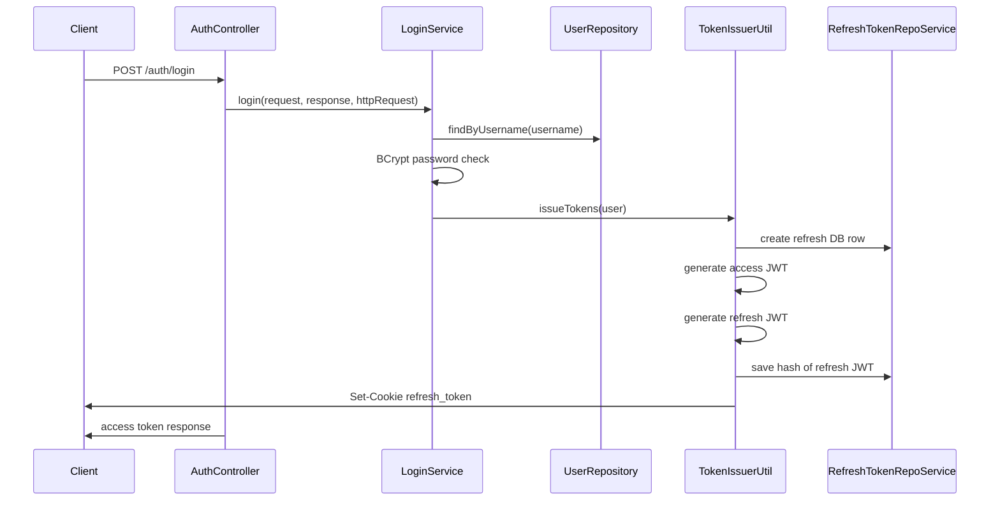
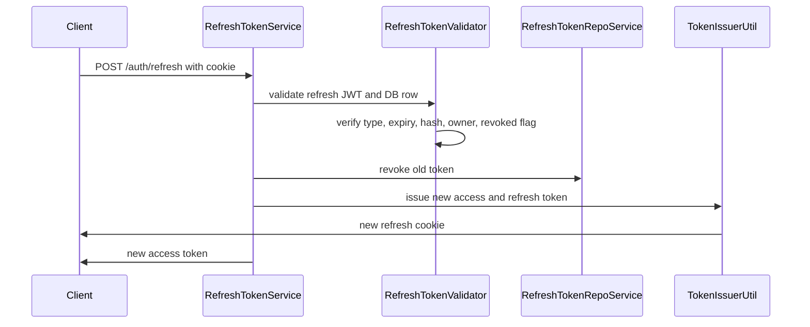
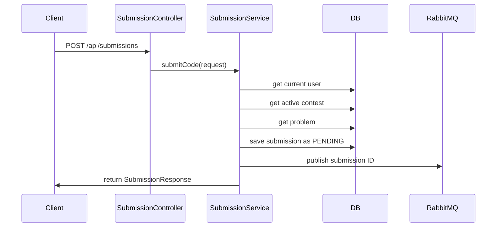
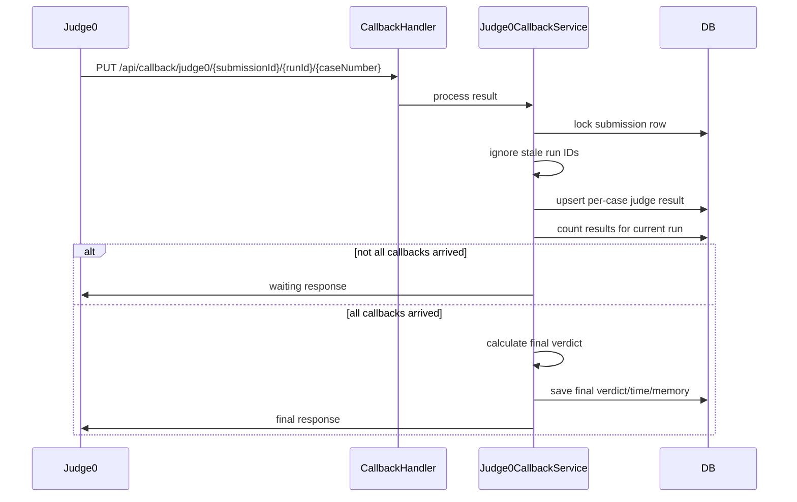
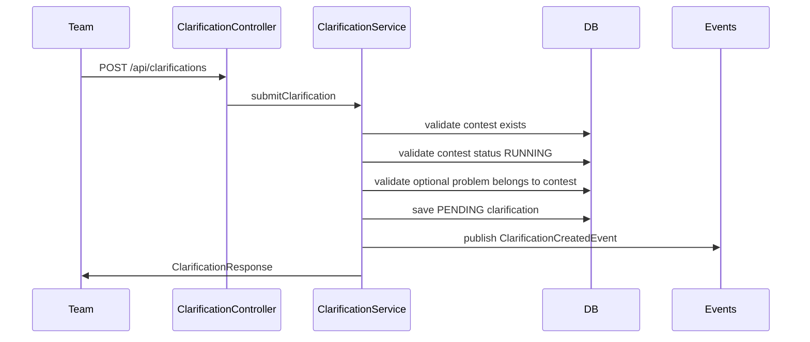

# AuraC2 Backend Full System Documentation

Last reviewed from the current repository state on 2026-05-11.

Scoreboard addendum reviewed from the current repository state on 2026-05-15.

This document explains the backend project in phases. It covers the current implementation, what each feature does, how data moves through the system, which endpoints exist, how SSE is used, how rejudge works, how Judge0 and RabbitMQ are connected, and the current limitations visible in the code.

## 1. Project Purpose

AuraC2 is a competitive programming contest backend. The backend handles:

- User authentication for admins and teams.
- Contest creation and lifecycle control.
- Problem and test case management.
- Code submission.
- Asynchronous judging through RabbitMQ and Judge0.
- Manual and force rejudge flows.
- Clarification questions and admin replies.
- Server-Sent Events for live contest and clarification updates.
- Automatic contest state synchronization through schedulers.

The backend is a Spring Boot application using Java 21, Spring Security, Spring Data JPA, PostgreSQL, RabbitMQ, JWT authentication, and Judge0 callbacks.

## 2. Backend Package Map

Main backend source root:

```text
backend/src/main/java/com/server/contestControl
```

Major backend packages:

```text
authServer
  config
  controller
  dto
  entity
  enums
  exception
  filter
  repository
  service
  startup
  util

contestServer
  controller
  dto
  entity
  enums
  event
  exception
  exceptions
  repository
  scoreboard
  scheduler
  service
  sse

submissionServer
  config
  controller
  dto
  entity
  enums
  exceptions
  queue
  repository
  service
  util

shared
  sse
```

High-level responsibility by package:

| Package | Responsibility |
|---|---|
| `authServer` | Login, register, refresh tokens, JWTs, user accounts, security config, startup admin bootstrap |
| `contestServer` | Contests, contest state, problems, test cases, clarifications, contest schedulers, contest/team/clarification SSE |
| `contestServer.scoreboard` | ICPC-style scoring, freeze/reveal state, scoreboard REST endpoints, scoreboard SSE |
| `submissionServer` | Submissions, RabbitMQ queues, Judge0 integration, Judge0 callbacks, rejudge |
| `shared.sse` | Generic SSE registry, publishing, heartbeat scheduling |

Main Spring Boot application class:

```text
backend/src/main/java/com/server/contestControl/AuraServerApplication.java
```

`AuraServerApplication` uses:

- `@SpringBootApplication`
- `@EnableConfigurationProperties(AdminBootstrapProperties.class)`

This is what enables the `bootstrap.admin` configuration group used by startup admin creation.

## 3. Runtime And Dependencies

The backend is a Maven Spring Boot project.

Important dependencies from `pom.xml`:

| Dependency | Purpose |
|---|---|
| Spring Boot Web | REST controllers and HTTP layer |
| Spring Boot Security | Authentication and authorization |
| Spring Boot Data JPA | Database ORM |
| PostgreSQL Driver | PostgreSQL database connection |
| Spring Boot Mail | Mail support, currently configured |
| Spring AMQP | RabbitMQ messaging |
| Spring WebFlux | Included, though the current main APIs are MVC-style controllers |
| JJWT | JWT creation and validation |
| Lombok | Reduces boilerplate for entities and DTO helpers |
| Spring Dotenv | Loads environment variables from dotenv-style config |
| Springdoc OpenAPI | Swagger/OpenAPI UI |
| Spring Boot Test / Security Test | Unit and integration testing |

Important runtime systems:

| System | Usage |
|---|---|
| PostgreSQL | Persistent storage for users, contests, problems, submissions, results, clarifications |
| RabbitMQ | Submission queue used to judge submissions asynchronously |
| Judge0 | External judge engine used to compile/run submissions against test cases |
| SSE | Live updates to browser clients |
| JWT | Access and refresh token authentication |

## 4. Configuration Overview

Configuration is stored in `backend/src/main/resources/application.yml`.

Main config areas:

| Config Area | Meaning |
|---|---|
| `spring.datasource` | PostgreSQL URL, username, password |
| `spring.jpa` | Hibernate behavior and SQL logging |
| `spring.rabbitmq` | RabbitMQ host, port, credentials |
| `spring.mail` | SMTP config |
| `judge0` | Judge0 base URL and callback base URL |
| `contest.sync` | Contest status sync scheduler settings |
| `app.jwt` | Access and refresh token secrets and expiration |
| `bootstrap.admin` | Startup admin account bootstrap behavior |
| `springdoc` | OpenAPI and Swagger UI |

Important notes:

- The default JPA `ddl-auto` value is `create-drop` unless overridden by environment variable. This is useful for local development but dangerous for production.
- JWT and mail values are environment-backed. Real production secrets should come from environment variables or secret management.
- Judge0 callback base URL must be reachable by Judge0. If Judge0 is running outside the backend network, the callback value must point to the backend route Judge0 can call.
- RabbitMQ must be running for normal submission judging to work.
- `SecurityConfiguration` is active only when the `no-security` Spring profile is not active because it is annotated with `@Profile("!no-security")`.
- `spring.jpa.open-in-view` is disabled so long-lived SSE streams do not hold database connections for the full stream lifetime.

## 5. Main Domain Model

The current backend revolves around these core entities:



Core entities:

| Entity | Main Purpose |
|---|---|
| `User` | Admin or team account |
| `RefreshToken` | Server-side record for refresh JWT rotation |
| `Contest` | Contest definition and runtime lifecycle state |
| `Problem` | Problem statement and limits |
| `TestCase` | Input/output test data for a problem |
| `Submission` | A team code submission |
| `SubmissionJudgeResult` | Per-test-case Judge0 result for a submission run |
| `Clarification` | Team question and admin answer |

## 6. Phase 1: Authentication And Security

### 6.1 Auth Feature Summary

The auth system supports:

- Admin login.
- Team login.
- Admin-only team registration.
- Access JWT issuing.
- Refresh JWT issuing through an HttpOnly cookie.
- Refresh token rotation.
- Logout with refresh token revocation.
- Startup admin account creation.

Main classes:

| Class | Role |
|---|---|
| `AuthController` | Exposes `/auth` endpoints |
| `AuthFacade` | Thin facade that delegates auth operations |
| `LoginService` | Validates credentials and issues tokens |
| `RegistrationService` | Creates team users and startup admin users |
| `RefreshTokenService` | Rotates refresh tokens |
| `LogoutService` | Revokes refresh tokens and clears cookie |
| `JwtAuthFilter` | Reads Bearer tokens and authenticates requests |
| `JwtService` | Parses and validates JWT claims |
| `TokenFactory` | Creates access and refresh JWTs |
| `TokenIssuerUtil` | Orchestrates issuing access and refresh tokens |
| `RefreshTokenValidator` | Validates refresh JWT plus database token row |
| `RefreshTokenRepoService` | Persists and revokes refresh token rows |
| `CookieUtil` | Creates and clears refresh token cookie |
| `AdminBootstrapRunner` | Creates or resets admin at startup |

### 6.2 Auth Endpoints

Base path:

```text
/auth
```

| Method | Endpoint | Access | Purpose |
|---|---|---|---|
| `POST` | `/auth/register` | ADMIN | Register a new team account |
| `POST` | `/auth/login` | Public | Login and receive access token plus refresh cookie |
| `POST` | `/auth/refresh` | Public with refresh cookie | Rotate refresh token and receive new access token |
| `POST` | `/auth/logout` | Public with refresh cookie | Revoke refresh token and clear cookie |

### 6.3 User Entity

`User` implements Spring Security `UserDetails`.

Important fields:

| Field | Meaning |
|---|---|
| `id` | Database ID |
| `username` | Login username |
| `email` | Optional email field |
| `password` | BCrypt-hashed password |
| `role` | `ADMIN` or `TEAM` |
| `enabled` | Account enabled flag |
| `createdAt` | Account creation time |

Role mapping:

| Role Enum | Spring Authority |
|---|---|
| `ADMIN` | `ROLE_ADMIN` |
| `TEAM` | `ROLE_TEAM` |

### 6.4 Login Flow

Flow:



Important behavior:

- Passwords are checked using BCrypt.
- Access token is returned in the JSON response.
- Refresh token is placed in an HttpOnly cookie.
- Refresh token value is not stored directly in the DB. A SHA-256 hash is stored instead.
- Refresh token DB record contains user, expiry, revocation state, and device IP.

### 6.5 Access Token

Access token behavior:

- JWT subject is the username.
- Token contains a `type` claim with value `access`.
- Token contains an `authorities` claim.
- Used as `Authorization: Bearer <token>`.
- Validated by `JwtAuthFilter`.
- If valid, the filter stores authentication in `SecurityContextHolder`.

### 6.6 Refresh Token

Refresh token behavior:

- JWT subject is the username.
- JWT ID points to the refresh token DB row ID.
- Token contains a `type` claim with value `refresh`.
- Token is stored client-side in a cookie named `refresh_token`.
- Server stores only the hash, not the raw refresh token.
- Refresh endpoint revokes the old refresh token and creates a new one.

Cookie behavior:

| Property | Behavior |
|---|---|
| Name | `refresh_token` |
| Path | `/auth` |
| HttpOnly | Yes |
| Secure | Enabled in production profile |
| SameSite | `Strict` in production, `Lax` in development |
| Max age | 7 days |

Because the cookie path is `/auth`, the browser sends it only to `/auth` routes.

### 6.7 Refresh Flow

Flow:



Important behavior:

- The old refresh token is revoked during refresh.
- A new refresh token row and cookie are created.
- If the DB token is missing, revoked, expired, mismatched, or owned by another user, refresh fails.

### 6.8 Logout Flow

Logout behavior:

- Extract refresh token from cookie.
- Validate refresh token.
- Revoke matching DB refresh token.
- Clear Spring Security context.
- Return a clearing cookie for `refresh_token`.

### 6.9 Startup Admin Bootstrap

`AdminBootstrapRunner` runs on startup.

Behavior:

- Checks how many admins exist.
- If more than one admin exists, startup fails.
- If no admin exists, creates one admin account.
- If configured to reset the existing admin password, updates it.
- Writes generated credentials to a configured file path.

This makes first-run setup possible without manually inserting an admin row.

### 6.10 Security Rules

Security is configured in `SecurityConfiguration`.

Main behavior:

- Stateless session management.
- CSRF disabled.
- Form login disabled.
- HTTP Basic disabled.
- JWT filter runs before username/password authentication filter.
- Static frontend assets and Swagger docs are public.
- Judge0 callback endpoint is public.
- Auth login, refresh, and logout are public.
- Register is admin-only.
- Contest admin APIs are admin-only.
- Submission APIs are team/admin.
- Clarification APIs are role-specific.

Important nuance:

- Some stream endpoints are listed as permitted in the HTTP matcher config, but controller methods also use `@PreAuthorize`. With method security enabled, the method-level role rules still apply.

## 7. Phase 2: Admin And User Management

### 7.1 Admin Feature Summary

Admins can:

- Register team accounts.
- List users.
- Update usernames.
- Update passwords.
- Delete non-admin users.
- View all submissions.

Main classes:

| Class | Role |
|---|---|
| `AdminController` | Admin user management and all submissions endpoint |
| `UserService` | User lookup, update, delete, admin checks |
| `UserRepository` | User DB access |

### 7.2 Admin Endpoints

Actual base path:

```text
/api/admin/users
```

| Method | Endpoint | Access | Purpose |
|---|---|---|---|
| `GET` | `/api/admin/users` | ADMIN | List all users |
| `PUT` | `/api/admin/users/{userId}/name` | ADMIN | Update username |
| `PUT` | `/api/admin/users/{userId}/password` | ADMIN | Update password |
| `DELETE` | `/api/admin/users/{userId}` | ADMIN | Delete a non-admin user |
| `GET` | `/api/admin/users/submissions` | ADMIN | View all submissions |

### 7.3 User Management Details

Important rules:

- Usernames must be unique.
- Admin deletion is blocked.
- Password updates are BCrypt encoded.
- User lookup failures use auth-specific exceptions in most public service paths.

## 8. Phase 3: Contest Lifecycle

### 8.1 Contest Feature Summary

The contest system supports:

- Creating contests.
- Updating contests while upcoming.
- Manual start.
- Manual pause.
- Manual resume.
- Manual end.
- Automatic start when scheduled time is reached.
- Automatic end when contest duration is reached.
- Pause-aware duration handling.
- Scoreboard freeze metadata.
- Live contest stream snapshots.

Main classes:

| Class | Role |
|---|---|
| `ContestController` | Contest REST API |
| `ContestService` | Contest creation, updates, status transitions, responses |
| `ContestLifecycleService` | Computes effective contest state and timing |
| `ContestStatusSyncService` | Periodic state sync entry point |
| `ContestStatusSyncExecutor` | Locked transactional auto-transition executor |
| `ContestStatusSyncScheduler` | Periodic scheduler |
| `ContestTransitionScheduler` | One-shot exact-time scheduler |
| `ContestRepository` | Contest DB queries and pessimistic lock |

### 8.2 Contest Entity

Important fields:

| Field | Meaning |
|---|---|
| `id` | Contest ID |
| `title` | Contest name |
| `startTime` | Scheduled start time |
| `durationMinutes` | Contest duration |
| `actualStartTime` | Time the contest actually started |
| `pausedAt` | Time contest was paused |
| `totalPauseMillis` | Accumulated paused time |
| `description` | Contest description |
| `problems` | Problems in contest |
| `status` | Persisted status |
| `statusLocked` | Blocks automatic effective transition when set |
| `scoreboardFreezeMinutes` | Freeze window before end |
| `penaltyMinutes` | Wrong-submission penalty value for scoreboard logic |

Persisted status values:

| Status | Meaning |
|---|---|
| `UPCOMING` | Contest scheduled but not started |
| `RUNNING` | Contest active |
| `PAUSED` | Contest paused |
| `ENDED` | Contest ended |

### 8.3 Effective State

The backend distinguishes persisted state from effective state.

Persisted state is the value stored in the database.

Effective state is calculated by `ContestLifecycleService` using current time, start time, actual start time, duration, pause state, and lock flag.

Effective-state behavior:

| Persisted State | Effective Behavior |
|---|---|
| `ENDED` | Always effectively ended |
| `PAUSED` | Always effectively paused |
| `RUNNING` | Becomes effectively ended if effective end time has passed and not locked |
| `UPCOMING` | Becomes effectively running if start time has passed and not locked |

This lets the system show correct state even if the database row has not yet been updated by the scheduler.

### 8.4 Contest Timing Rules

Important timing fields:

| Value | Meaning |
|---|---|
| Scheduled start | `startTime` |
| Scheduled end | `startTime + durationMinutes` |
| Actual start | `actualStartTime` |
| Effective end | `actualStartTime + durationMinutes + totalPauseMillis` |
| Remaining millis | Calculated based on effective state |
| Freeze time | `effectiveEndTime - scoreboardFreezeMinutes` |

Pause behavior:

- When contest is paused, `pausedAt` is set to current time.
- When resumed, the time between `pausedAt` and resume time is added to `totalPauseMillis`.
- Effective end time is extended by total paused time.
- Remaining time is frozen while paused.

### 8.5 Contest End Rules

Manual ending:

- Allowed from `UPCOMING`, `RUNNING`, or `PAUSED`.
- Without jury override, ending before effective end time is rejected.
- With `juryOverride=true`, an admin can end early.

Automatic ending:

- Only applies to contests persisted as `RUNNING`.
- Uses locked DB row in `ContestStatusSyncExecutor`.
- Sets persisted state to `ENDED`.
- Publishes an auto-end contest event.

### 8.6 Contest Endpoints

Base path:

```text
/api/contest
```

| Method | Endpoint | Access | Purpose |
|---|---|---|---|
| `POST` | `/api/contest` | ADMIN | Create contest |
| `PUT` | `/api/contest/{id}` | ADMIN | Update contest details while upcoming |
| `PUT` | `/api/contest/{id}/start` | ADMIN | Start contest |
| `PUT` | `/api/contest/{id}/pause` | ADMIN | Pause contest |
| `PUT` | `/api/contest/{id}/resume` | ADMIN | Resume contest |
| `PUT` | `/api/contest/{id}/end?juryOverride=false` | ADMIN | End contest |
| `GET` | `/api/contest/active` | Public | Get active/running contest |
| `GET` | `/api/contest/upcoming` | Public | Get upcoming contest |
| `GET` | `/api/contest/paused` | Public | Get paused contest |
| `GET` | `/api/contest/ended` | Public | Get ended contests |

### 8.7 Contest Response

`ContestResponse` includes both raw and calculated fields:

| Field | Meaning |
|---|---|
| `id` | Contest ID |
| `title` | Contest title |
| `startTime` | Scheduled start time |
| `durationMinutes` | Duration |
| `description` | Description |
| `status` | Persisted status |
| `effectiveState` | Computed state |
| `statusLocked` | Lock flag |
| `actualStartTime` | Actual start |
| `pausedAt` | Pause time |
| `totalPauseMillis` | Pause duration total |
| `remainingMillis` | Computed remaining time |
| `endTime` | Scheduled end |
| `effectiveEndTime` | Pause-aware end |
| `scoreboardFreezeMinutes` | Freeze window |
| `effectiveScoreboardFreezeTime` | Calculated freeze timestamp |
| `penaltyMinutes` | Penalty minutes |
| `scoreboardFrozen` | Whether scoreboard is currently frozen |

### 8.8 Contest Events

Contest changes publish `ContestUpdatedEvent`.

Event reasons:

| Reason | Trigger |
|---|---|
| `CREATED` | Contest created |
| `MANUAL_START` | Admin starts contest |
| `MANUAL_PAUSE` | Admin pauses contest |
| `MANUAL_RESUME` | Admin resumes contest |
| `MANUAL_END` | Admin ends contest |
| `AUTO_START` | Scheduler starts contest |
| `AUTO_END` | Scheduler ends contest |

These events are used by SSE and scheduling.

### 8.9 Current Contest Notes And Gaps

Observed current behavior:

- Only one contest in effective `UPCOMING`, `RUNNING`, or `PAUSED` state is allowed.
- Updating contest details is allowed only while persisted status is `UPCOMING`.
- `updateContestDetails` currently does not publish a contest update event. That means connected SSE clients and exact-time scheduling may not immediately know about changed start time or duration until another sync/event occurs.
- Scoreboard freeze fields exist in contest responses, but a full scoreboard ranking service is not present in the reviewed backend.

## 9. Phase 4: Problems And Test Cases

### 9.1 Problem Feature Summary

Admins can:

- Create problems.
- Update problems.
- Delete problems.
- Attach problems to contests.

Teams and admins can:

- Fetch problems.
- Fetch problems by contest.

Main classes:

| Class | Role |
|---|---|
| `ProblemController` | Problem REST endpoints |
| `ProblemService` | Problem create/update/delete/read logic |
| `ProblemRepository` | Problem database queries |
| `Problem` | Problem entity |
| `Difficulty` | Problem difficulty enum |

### 9.2 Problem Entity

Important fields:

| Field | Meaning |
|---|---|
| `id` | Problem ID |
| `contest` | Owning contest |
| `title` | Problem title |
| `description` | Problem statement text |
| `timeLimit` | Time limit |
| `memoryLimit` | Memory limit |
| `difficulty` | `EASY`, `MEDIUM`, or `HARD` |
| `testCases` | Test cases linked to problem |

### 9.3 Problem Endpoints

Base path:

```text
/api/problems
```

| Method | Endpoint | Access | Purpose |
|---|---|---|---|
| `POST` | `/api/problems` | ADMIN | Create problem |
| `PUT` | `/api/problems/{id}` | ADMIN | Update problem |
| `DELETE` | `/api/problems/{id}` | ADMIN | Delete problem |
| `GET` | `/api/problems/{id}` | ADMIN/TEAM | Get one problem |
| `GET` | `/api/problems/contest/{contestId}` | ADMIN/TEAM | Get problems for contest |

### 9.4 Problem Deletion Behavior

Deleting a problem also deletes related data:

- Judge results for submissions under the problem.
- Submissions for the problem.
- Clarifications linked to the problem.
- The problem itself.

This prevents orphaned records when an admin deletes a problem.

### 9.5 Difficulty Parsing

Difficulty input is parsed case-insensitively.

Supported values:

```text
EASY
MEDIUM
HARD
```

### 9.6 Test Case Feature Summary

Admins can:

- Add test cases.
- Update test cases.
- Delete test cases.

Teams and admins can:

- Fetch test cases for a problem.

Main classes:

| Class | Role |
|---|---|
| `TestCaseController` | Test case REST endpoints |
| `TestCaseService` | Test case logic |
| `TestCaseRepository` | Test case database queries |
| `TestCase` | Test case entity |

### 9.7 Test Case Entity

Important fields:

| Field | Meaning |
|---|---|
| `id` | Test case ID |
| `problem` | Owning problem |
| `inputData` | Standard input for judge |
| `expectedOutput` | Expected output |
| `isPublic` | Whether team can see this case |

### 9.8 Test Case Endpoints

Base path:

```text
/api/testcases
```

| Method | Endpoint | Access | Purpose |
|---|---|---|---|
| `POST` | `/api/testcases/{problemId}` | ADMIN | Add test case to problem |
| `PUT` | `/api/testcases/{id}` | ADMIN | Update test case |
| `DELETE` | `/api/testcases/{id}` | ADMIN | Delete test case |
| `GET` | `/api/testcases/problem/{problemId}` | ADMIN/TEAM | Get test cases for problem |

### 9.9 Public Test Case Behavior

The service branches based on role:

- Admin receives all test cases.
- Team receives only public test cases.

Current implementation note:

- `TestCaseResponse.fromPublicEntity` currently still returns both input and expected output for public test cases. If the intended UX is "sample tests include expected output", this is correct. If expected output should be hidden from teams, this method should be changed.

## 10. Phase 5: Submission And Judging

### 10.1 Submission Feature Summary

Teams can:

- Submit code.
- View their own submissions.
- View a single submission if they own it.

Admins can:

- Submit code.
- View any submission.
- View all submissions from admin endpoint.

The judging pipeline is asynchronous:

1. A submission is created in the database.
2. Its ID is published to RabbitMQ.
3. A RabbitMQ consumer receives the ID.
4. The consumer sends one Judge0 request per test case.
5. Judge0 calls the backend callback endpoint once per test case.
6. The backend stores per-case results.
7. When all test case callbacks arrive, the final submission verdict is calculated.

Main classes:

| Class | Role |
|---|---|
| `SubmissionController` | Submission REST endpoints |
| `SubmissionService` | Submission creation and reading |
| `SubmissionRepository` | Submission DB queries |
| `SubmissionProducer` | Publishes submission IDs to RabbitMQ |
| `SubmissionConsumer` | Consumes submission IDs and sends Judge0 jobs |
| `Judge0Service` | Calls Judge0 API |
| `CallbackHandler` | Receives Judge0 callbacks |
| `Judge0CallbackService` | Stores Judge0 results and finalizes submissions |
| `SubmissionJudgeResultRepository` | Per-test-case result DB access |
| `LanguageMapper` | Maps language string to Judge0 language ID |

### 10.2 Submission Entity

Important fields:

| Field | Meaning |
|---|---|
| `id` | Submission ID |
| `contest` | Contest linked to submission |
| `problem` | Problem linked to submission |
| `user` | User/team that submitted |
| `code` | Submitted source code |
| `language` | Submitted language string |
| `verdict` | Current/final verdict |
| `createdAt` | Submission time |
| `executionTime` | Max execution time from final run |
| `memoryUsage` | Max memory usage from final run |
| `judgeRunId` | Current judge run number |

Defaults from `@PrePersist`:

- `createdAt` is set to now.
- `verdict` starts as `PENDING`.
- `judgeRunId` starts as `0`.

### 10.3 Verdicts

Supported verdict enum:

| Verdict | Meaning |
|---|---|
| `PENDING` | Submission saved but not yet being judged |
| `PENDING_REJUDGE` | Submission queued for rejudge |
| `RUNNING` | Judge0 jobs have been sent and callbacks are pending |
| `ACCEPTED` | All test cases accepted |
| `WRONG_ANSWER` | At least one test case had wrong answer |
| `TLE` | Time limit exceeded |
| `COMPILATION_ERROR` | Compilation failed |
| `RUNTIME_ERROR` | Runtime error |
| `INTERNAL_ERROR` | Judge/internal error |

Judge0 status mapping:

| Judge0 Status ID | Backend Verdict |
|---|---|
| `3` | `ACCEPTED` |
| `4` | `WRONG_ANSWER` |
| `5` | `TLE` |
| `6` | `COMPILATION_ERROR` |
| `7` | `RUNTIME_ERROR` |
| `13` | `INTERNAL_ERROR` |
| Other | `PENDING` |

### 10.4 Submission Endpoints

Base path:

```text
/api/submissions
```

| Method | Endpoint | Access | Purpose |
|---|---|---|---|
| `POST` | `/api/submissions` | TEAM/ADMIN | Create a submission |
| `GET` | `/api/submissions/{id}` | TEAM/ADMIN | Get one submission |
| `GET` | `/api/submissions/my?problemID={id}` | TEAM/ADMIN | Get my submissions for one problem |
| `GET` | `/api/submissions/my/all` | TEAM | Get all my submissions |

### 10.5 Submit Code Flow

Flow:



Important current behavior:

- The service uses the active contest from `ContestService.getContestEntity()`.
- The request `contestId` is not used in the current submit implementation.
- The current code does not verify that the submitted problem belongs to the active contest.
- Unsupported language is detected later by the consumer through `LanguageMapper`.

### 10.6 RabbitMQ Configuration

Configured queue/exchange values:

| Bean | Purpose |
|---|---|
| `submissionQueue` | Queue containing submission IDs to judge |
| `submissionExchange` | Direct exchange for submissions |
| `submissionRoutingKey` | Routing key for submission IDs |
| `resultQueue` | Result queue scaffold |
| `resultExchange` | Result exchange scaffold |
| `resultRoutingKey` | Routing key scaffold |

Current active queue flow:

```text
SubmissionProducer -> submissionExchange -> submissionQueue -> SubmissionConsumer
```

`ResultProducer` and `ResultConsumer` exist but are currently empty scaffolds.

### 10.7 Submission Consumer Flow

`SubmissionConsumer` receives a submission ID from RabbitMQ.

Behavior:

1. Load the submission.
2. If submission verdict is not `PENDING` or `PENDING_REJUDGE`, skip it.
3. Load problem test cases.
4. Convert language string to Judge0 language ID.
5. If verdict is `PENDING`, increment `judgeRunId`.
6. If verdict is `PENDING_REJUDGE`, keep the reserved `judgeRunId`.
7. Set verdict to `RUNNING`.
8. Save submission.
9. Send one Judge0 job per test case.

This design prevents stale duplicate queue messages from rejudging already finalized submissions.

### 10.8 Judge0 Request

Judge0 request DTO fields:

| Field | Meaning |
|---|---|
| `source_code` | Submitted source code |
| `language_id` | Judge0 language ID |
| `stdin` | Test case input |
| `expected_output` | Test case expected output |
| `callback_url` | Backend callback URL for this submission/test case |

Callback URL pattern:

```text
{judge0.callback}/{submissionId}/{judgeRunId}/{testCaseNumber}
```

Legacy callback URL is still supported:

```text
/api/callback/judge0/{submissionId}/{testCaseNumber}
```

### 10.9 Language Mapping

Supported language aliases:

| Input | Judge0 ID |
|---|---|
| `c` | `50` |
| `cpp`, `c++`, `g++` | `54` |
| `java` | `62` |
| `python`, `py`, `python3` | `71` |
| `javascript`, `js`, `node` | `63` |
| `go` | `60` |

Unsupported language throws an `IllegalArgumentException` in `LanguageMapper`.

### 10.10 Judge0 Callback Flow

Flow:



Important details:

- Submission row is locked with pessimistic write while processing a callback.
- Stale callback run IDs are ignored.
- Per-case result is stored in `SubmissionJudgeResult`.
- Results are unique per `(submission_id, judge_run_id, test_case_number)`.
- Duplicate callback for same case/run updates existing result.
- Final verdict is calculated only after all test case results for the current run arrive.

### 10.11 Final Verdict Calculation

Finalization logic:

1. Load all results for the current submission and judge run.
2. Sort by test case number.
3. Find first result whose verdict is not `ACCEPTED`.
4. If one exists, final verdict is that first failing verdict.
5. If none exists, final verdict is `ACCEPTED`.
6. Execution time is the max execution time across cases.
7. Memory usage is the max memory usage across cases.
8. Save final values on the submission.

This means the earliest failing test case determines final non-accepted verdict.

## 11. Phase 6: Rejudge And Force Rejudge

### 11.1 Rejudge Feature Summary

Admins can rejudge:

- Specific submissions.
- All submissions for a problem.
- All submissions for a contest.

There are two modes:

| Mode | Behavior |
|---|---|
| Normal rejudge | Queues only non-active submissions |
| Force rejudge | Queues active and non-active submissions |

Active verdicts:

```text
PENDING
PENDING_REJUDGE
RUNNING
```

Main classes:

| Class | Role |
|---|---|
| `RejudgeController` | Admin rejudge endpoints |
| `RejudgeService` | Rejudge selection, state reset, queue publishing |
| `RejudgeResponse` | Summary response |
| `RejudgeSubmissionsRequest` | Request body for selected IDs |

### 11.2 Rejudge Endpoints

Base path:

```text
/api/admin/rejudge
```

Normal rejudge:

| Method | Endpoint | Access | Purpose |
|---|---|---|---|
| `POST` | `/api/admin/rejudge/submissions` | ADMIN | Rejudge selected submissions |
| `POST` | `/api/admin/rejudge/problem/{problemId}` | ADMIN | Rejudge all submissions for problem |
| `POST` | `/api/admin/rejudge/contests/{contestId}` | ADMIN | Rejudge all submissions for contest |

Force rejudge:

| Method | Endpoint | Access | Purpose |
|---|---|---|---|
| `POST` | `/api/admin/rejudge/force/submissions` | ADMIN | Force rejudge selected submissions |
| `POST` | `/api/admin/rejudge/force/problem/{problemId}` | ADMIN | Force rejudge all submissions for problem |
| `POST` | `/api/admin/rejudge/force/contests/{contestId}` | ADMIN | Force rejudge all submissions for contest |

### 11.3 Normal Rejudge Behavior

Normal rejudge:

1. Select target submissions.
2. Skip submissions with active verdicts:
   - `PENDING`
   - `PENDING_REJUDGE`
   - `RUNNING`
3. For each queued submission:
   - Increment/reserve next `judgeRunId`.
   - Set verdict to `PENDING_REJUDGE`.
   - Clear execution time.
   - Clear memory usage.
4. Save all changed submissions.
5. Publish submission IDs to RabbitMQ after transaction commit.

Normal mode protects currently running submissions from being overwritten.

### 11.4 Force Rejudge Behavior

Force rejudge:

1. Select target submissions.
2. Include both active and final submissions.
3. Reserve a new `judgeRunId`.
4. Set verdict to `PENDING_REJUDGE`.
5. Clear execution and memory.
6. Publish submission IDs after commit.

Force mode is designed for cases where the admin wants to invalidate and replace the currently running judge run.

### 11.5 Why Judge Run ID Matters

`judgeRunId` is the key safety mechanism for rejudge correctness.

Example:

1. Submission run 1 is currently running.
2. Admin force rejudges submission.
3. Backend increments `judgeRunId` to 2.
4. New Judge0 jobs are sent for run 2.
5. Late callbacks from run 1 arrive.
6. `Judge0CallbackService` sees old run ID and ignores them.
7. Only run 2 callbacks can finalize the submission.

This prevents stale Judge0 callbacks from overwriting newer results.

### 11.6 Rejudge Response

`RejudgeResponse` contains:

| Field | Meaning |
|---|---|
| `scope` | `SUBMISSIONS`, `PROBLEM`, `CONTEST`, `FORCE_SUBMISSIONS`, `FORCE_PROBLEM`, or `FORCE_CONTEST` |
| `scopeId` | Problem/contest ID when applicable |
| `requestedCount` | Number requested |
| `foundCount` | Number of requested/scope submissions found in the database |
| `queuedCount` | Number actually queued |
| `skippedCount` | Number skipped |
| `queuedSubmissionIds` | IDs queued |
| `skippedSubmissionIds` | IDs skipped |
| `missingSubmissionIds` | IDs requested but not found |

### 11.7 Request Validation

Selected submission request validation:

- Rejects null ID list.
- Filters out non-positive IDs.
- De-duplicates IDs while preserving input order.
- Rejects empty normalized list.
- Reports missing positive IDs.

Problem and contest rejudge validate that the target problem or contest exists.

## 12. Phase 7: Clarifications

### 12.1 Clarification Feature Summary

The clarification system allows teams to ask questions during a running contest and admins to reply.

Features:

- Team submits clarification.
- Clarification may be tied to a problem.
- Admin can view contest clarifications.
- Admin can reply privately or publicly.
- Teams see their own clarifications.
- Teams also see public answered clarifications.
- Public answered clarifications are available from a public endpoint.
- SSE pushes clarification events to admins and affected teams.

Main classes:

| Class | Role |
|---|---|
| `ClarificationController` | Clarification REST endpoints |
| `ClarificationService` | Clarification business rules |
| `ClarificationRepository` | Clarification DB queries |
| `Clarification` | Clarification entity |
| `ClarificationSseAdapter` | Publishes SSE events for clarification changes |

### 12.2 Clarification Entity

Important fields:

| Field | Meaning |
|---|---|
| `id` | Clarification ID |
| `contest` | Contest |
| `problem` | Optional problem |
| `user` | Team that asked |
| `question` | Question text |
| `createdAt` | Ask time |
| `standardReply` | Standard reply enum |
| `reply` | Custom or final reply text |
| `repliedAt` | Reply time |
| `repliedByAdmin` | Admin who replied |
| `status` | `PENDING`, `ANSWERED`, or `CLOSED` |
| `replyType` | `PRIVATE` or `PUBLIC` |

### 12.3 Clarification Types And Statuses

Clarification status:

| Status | Meaning |
|---|---|
| `PENDING` | Waiting for admin reply |
| `ANSWERED` | Admin answered |
| `CLOSED` | Closed and cannot be replied to |

Reply type:

| Type | Meaning |
|---|---|
| `PRIVATE` | Only asking team and admins see it |
| `PUBLIC` | All teams can see answered clarification |

Standard replies:

| Standard Reply |
|---|
| `NO_COMMENT` |
| `READ_PROBLEM_STATEMENT_CAREFULLY` |
| `YES` |
| `NO` |
| `ANSWERED` |
| `CUSTOM` |

### 12.4 Clarification Endpoints

Base path:

```text
/api/clarifications
```

| Method | Endpoint | Access | Purpose |
|---|---|---|---|
| `POST` | `/api/clarifications` | TEAM | Submit clarification |
| `GET` | `/api/clarifications/my/{contestId}` | TEAM | Get my contest clarifications plus public answered ones |
| `GET` | `/api/clarifications/admin/contest/{contestId}` | ADMIN | Admin get contest clarifications |
| `GET` | `/api/clarifications/admin/all` | ADMIN | Admin get all clarifications |
| `PUT` | `/api/clarifications/admin/{id}/reply` | ADMIN | Reply to a clarification |
| `GET` | `/api/clarifications/public/{contestId}` | Public | Get public answered clarifications |

### 12.5 Submit Clarification Flow

Flow:



Current rule:

- Clarification submission requires persisted contest status `RUNNING`.
- It does not rely on effective state in the reviewed code path.

### 12.6 Reply Flow

Admin reply behavior:

1. Load clarification.
2. Reject if status is `CLOSED`.
3. Resolve reply text:
   - Standard reply.
   - Custom standard reply.
   - Plain reply text.
4. Set reply type.
5. Set admin user.
6. Set `repliedAt` if first reply.
7. Set status to `ANSWERED`.
8. Save.
9. Publish `ClarificationRepliedEvent`.

### 12.7 Team Visibility Rules

When a team fetches clarifications for a contest, it receives:

- Clarifications asked by that team in that contest.
- Public answered clarifications in that contest.

The service de-duplicates the combined result and sorts by creation time descending.

### 12.8 Public Visibility Rules

Public endpoint returns only:

- Contest clarifications.
- Reply type `PUBLIC`.
- Status `ANSWERED`.

Private clarifications are not exposed by this endpoint.

## 13. Phase 8: SSE Live Updates

### 13.1 Is This Project Using SSE?

Yes. The backend uses Server-Sent Events.

SSE is implemented through Spring's `SseEmitter`.

SSE is used for:

- Contest stream updates.
- Team contest stream updates.
- Admin clarification stream updates.
- Team clarification stream updates.
- Heartbeat ping events.

It is not currently used for:

- Submission verdict updates.
- Judge0 result updates.
- Scoreboard push updates from a scoreboard service.

### 13.2 SSE Shared Infrastructure

Main shared classes:

| Class | Role |
|---|---|
| `SseEmitterRegistry` | Stores active emitters and sends events safely |
| `SsePublisher` | Small facade for publishing named SSE events |
| `SseHeartbeatScheduler` | Sends periodic ping events |

`SseEmitterRegistry` supports two emitter styles:

| Style | Meaning |
|---|---|
| Broadcast | Every connected emitter receives the event |
| Targeted | Emitters are grouped under an ID, then events are sent to one ID or all targeted IDs |

Important registry behavior:

- Uses thread-safe collections.
- Removes emitters on completion.
- Removes emitters on timeout.
- Removes emitters on error.
- Removes emitters when send fails.
- Can count active emitters.

### 13.3 SSE Heartbeats

`SseHeartbeatScheduler` sends a named `ping` event every 15 seconds.

Reason:

- Some frontend SSE clients, such as fetch-event-source style clients, do not expose comment-based heartbeat messages to the normal message handler.
- A named event is easier for the frontend to observe and keep alive.

### 13.4 Contest Stream

Endpoint:

```text
GET /api/contest/stream
```

Access:

```text
ADMIN
```

Behavior:

1. Create SSE emitter with 30 minute timeout.
2. Send initial `snapshot` event.
3. Register emitter in contest broadcast registry.
4. Future contest events are pushed as `contest-update`.

Snapshot includes:

- Active contest.
- Upcoming contest.
- Paused contest.
- Ended contests.

### 13.5 Team Contest Stream

Endpoint:

```text
GET /api/team/stream
```

Access:

```text
TEAM
```

Behavior:

1. Create SSE emitter with 30 minute timeout.
2. Send initial contest snapshot.
3. Register emitter under the authenticated team user ID.
4. Contest events are fan-out pushed to all registered team emitters.

### 13.6 Clarification Streams

Team clarification stream:

```text
GET /api/clarifications/my/stream/{contestId}
```

Access:

```text
TEAM
```

Admin clarification stream:

```text
GET /api/clarifications/admin/stream/{contestId}
```

Access:

```text
ADMIN
```

Behavior:

- Admin clarification stream is targeted by contest ID.
- Team clarification stream is targeted by a generated audience ID containing contest ID and team user ID.
- Created/replied clarification events are transformed into SSE payloads.

### 13.7 Clarification SSE Events

Event flow:

| Domain Event | SSE Behavior |
|---|---|
| `ClarificationCreatedEvent` | Sends `clarification-created` to admins of contest and asking team |
| `ClarificationRepliedEvent` | Sends `clarification-replied` to admins and asking team |
| Public answered reply | Sends `clarification-public-answered` to all team audiences in contest |

This means:

- Admins see new questions live.
- The asking team sees its own question/reply live.
- All teams see public answered clarification replies live.

### 13.8 Contest SSE Events

Contest events publish:

```text
event: contest-update
data:
  reason: <event reason>
  snapshot: <ContestStreamSnapshot>
```

The snapshot is rebuilt from current service state when the event is processed.

## 14. Phase 9: Schedulers And Automatic Contest Sync

### 14.1 Scheduler Feature Summary

The backend has two contest scheduling mechanisms:

1. Periodic sync scheduler.
2. Exact-time transition scheduler.

Main classes:

| Class | Role |
|---|---|
| `SchedulerConfig` | Enables scheduling and configures task scheduler |
| `ContestStatusSyncScheduler` | Periodically calls sync service |
| `ContestStatusSyncService` | Finds eligible contests and publishes events |
| `ContestStatusSyncExecutor` | Performs locked auto transition |
| `ContestTransitionScheduler` | Schedules one-shot tasks at exact contest transition times |

### 14.2 Periodic Sync

`ContestStatusSyncScheduler`:

- Controlled by `contest.sync.enabled`.
- Runs with configured fixed delay.
- Has configured initial delay.
- Calls `ContestStatusSyncService.syncAllEligibleContests()`.
- Catches/logs exceptions so the scheduler does not die permanently.

### 14.3 Sync Candidate Selection

`ContestRepository` finds candidates that are:

- Not status locked.
- Persisted as `UPCOMING` or `RUNNING`.

Only eligible contests can auto-start or auto-end.

### 14.4 Locked Auto Transition

`ContestStatusSyncExecutor`:

- Runs in a new transaction.
- Locks the contest row pessimistically.
- Computes effective state.
- Allows:
  - `UPCOMING -> RUNNING`
  - `RUNNING -> ENDED`
- Saves state if changed.

Auto-start behavior:

- Sets status to `RUNNING`.
- Sets `actualStartTime` to scheduled start time.

Auto-end behavior:

- Sets status to `ENDED`.

### 14.5 Exact-Time Transition Scheduler

`ContestTransitionScheduler`:

- Listens for contest events.
- Schedules a one-shot task at the next transition time.
- Cancels scheduled tasks when contest is paused or ended.
- Restores pending scheduled tasks on application ready.

Scheduling behavior:

| Current State | Scheduled Target |
|---|---|
| `UPCOMING` | `startTime` |
| `RUNNING` | `effectiveEndTime` |
| `PAUSED` | No exact end task while paused |
| `ENDED` | No task |

When a one-shot task fires, it calls the sync service.

### 14.6 Why There Are Two Scheduler Systems

The exact-time scheduler gives quick transition near the expected time.

The periodic scheduler acts as a safety net:

- If the app restarts.
- If a scheduled task is missed.
- If system time changes.
- If some event did not schedule correctly.

Together, they reduce the chance of stale contest status.

## 15. API Endpoint Map

### 15.1 Auth

| Method | Endpoint | Access |
|---|---|---|
| `POST` | `/auth/register` | ADMIN |
| `POST` | `/auth/login` | Public |
| `POST` | `/auth/refresh` | Public with refresh cookie |
| `POST` | `/auth/logout` | Public with refresh cookie |

### 15.2 Admin

| Method | Endpoint | Access |
|---|---|---|
| `GET` | `/api/admin/users` | ADMIN |
| `PUT` | `/api/admin/users/{userId}/name` | ADMIN |
| `PUT` | `/api/admin/users/{userId}/password` | ADMIN |
| `DELETE` | `/api/admin/users/{userId}` | ADMIN |
| `GET` | `/api/admin/users/submissions` | ADMIN |

### 15.3 Contest

| Method | Endpoint | Access |
|---|---|---|
| `POST` | `/api/contest` | ADMIN |
| `PUT` | `/api/contest/{id}` | ADMIN |
| `PUT` | `/api/contest/{id}/start` | ADMIN |
| `PUT` | `/api/contest/{id}/pause` | ADMIN |
| `PUT` | `/api/contest/{id}/resume` | ADMIN |
| `PUT` | `/api/contest/{id}/end` | ADMIN |
| `GET` | `/api/contest/active` | Public |
| `GET` | `/api/contest/upcoming` | Public |
| `GET` | `/api/contest/paused` | Public |
| `GET` | `/api/contest/ended` | Public |
| `GET` | `/api/contest/stream` | ADMIN |
| `GET` | `/api/team/stream` | TEAM |

### 15.4 Problems

| Method | Endpoint | Access |
|---|---|---|
| `POST` | `/api/problems` | ADMIN |
| `PUT` | `/api/problems/{id}` | ADMIN |
| `DELETE` | `/api/problems/{id}` | ADMIN |
| `GET` | `/api/problems/{id}` | ADMIN/TEAM |
| `GET` | `/api/problems/contest/{contestId}` | ADMIN/TEAM |

### 15.5 Test Cases

| Method | Endpoint | Access |
|---|---|---|
| `POST` | `/api/testcases/{problemId}` | ADMIN |
| `PUT` | `/api/testcases/{id}` | ADMIN |
| `DELETE` | `/api/testcases/{id}` | ADMIN |
| `GET` | `/api/testcases/problem/{problemId}` | ADMIN/TEAM |

### 15.6 Submissions

| Method | Endpoint | Access |
|---|---|---|
| `POST` | `/api/submissions` | TEAM/ADMIN |
| `GET` | `/api/submissions/{id}` | TEAM/ADMIN |
| `GET` | `/api/submissions/my?problemID={id}` | TEAM/ADMIN |
| `GET` | `/api/submissions/my/all` | TEAM |
| `PUT` | `/api/callback/judge0/{submissionId}/{judgeRunId}/{testCaseNumber}` | Public Judge0 callback |
| `PUT` | `/api/callback/judge0/{submissionId}/{testCaseNumber}` | Public legacy Judge0 callback |

### 15.7 Rejudge

| Method | Endpoint | Access |
|---|---|---|
| `POST` | `/api/admin/rejudge/submissions` | ADMIN |
| `POST` | `/api/admin/rejudge/problem/{problemId}` | ADMIN |
| `POST` | `/api/admin/rejudge/contests/{contestId}` | ADMIN |
| `POST` | `/api/admin/rejudge/force/submissions` | ADMIN |
| `POST` | `/api/admin/rejudge/force/problem/{problemId}` | ADMIN |
| `POST` | `/api/admin/rejudge/force/contests/{contestId}` | ADMIN |

### 15.8 Clarifications

| Method | Endpoint | Access |
|---|---|---|
| `POST` | `/api/clarifications` | TEAM |
| `GET` | `/api/clarifications/my/{contestId}` | TEAM |
| `GET` | `/api/clarifications/admin/contest/{contestId}` | ADMIN |
| `GET` | `/api/clarifications/admin/all` | ADMIN |
| `PUT` | `/api/clarifications/admin/{id}/reply` | ADMIN |
| `GET` | `/api/clarifications/public/{contestId}` | Public |
| `GET` | `/api/clarifications/my/stream/{contestId}` | TEAM |
| `GET` | `/api/clarifications/admin/stream/{contestId}` | ADMIN |

## 16. DTO Map

### 16.1 Auth DTOs

| DTO | Purpose |
|---|---|
| `LoginRequest` | Username/password login request |
| `LoginResponse` | Access token response |
| `RegisterRequest` | User registration request |
| `RegisterResponse` | Registered user response |
| `RefreshResponse` | New access token from refresh |
| `LogoutResponse` | Logout response |
| `TokenValidationResult` | Internal refresh validation result |
| `ErrorResponse` | Error response body |

### 16.2 Contest DTOs

| DTO | Purpose |
|---|---|
| `ContestRequest` | Create contest request |
| `ContestUpdateRequest` | Update contest details |
| `ContestResponse` | Full contest response with computed timing |
| `ContestStreamSnapshot` | SSE snapshot with active/upcoming/paused/ended buckets |

### 16.3 Problem/Test Case DTOs

| DTO | Purpose |
|---|---|
| `ProblemRequest` | Create problem |
| `ProblemUpdateRequest` | Update problem |
| `ProblemResponse` | Problem response |
| `TestCaseRequest` | Create/update test case |
| `TestCaseResponse` | Test case response |

### 16.4 Submission DTOs

| DTO | Purpose |
|---|---|
| `SubmissionRequest` | Code submission request |
| `SubmissionResponse` | Submission response |
| `Judge0SubmissionDTO` | Request sent to Judge0 |
| `Judge0Response` | Callback body from Judge0 |

### 16.5 Rejudge DTOs

| DTO | Purpose |
|---|---|
| `RejudgeSubmissionsRequest` | Selected submission IDs |
| `RejudgeResponse` | Rejudge summary |

### 16.6 Clarification DTOs

| DTO | Purpose |
|---|---|
| `ClarificationRequest` | Team question |
| `ClarificationResponse` | Clarification response |
| `ReplyRequest` | Admin reply request |
| `ClarificationStreamEvent` | SSE clarification event payload |

## 17. Error Handling

### 17.1 Global Exception Handling

`GlobalExceptionHandler` centralizes error responses.

Handled categories:

- Custom `ApiException`.
- Validation exceptions.
- Async request problems.
- Client abort / broken pipe / SSE disconnect style errors.
- IO errors.
- General exceptions.

SSE-specific behavior:

- If the request looks like an SSE request, client disconnects are treated differently to avoid noisy standard error responses.
- URI ending in `/stream` or `Accept: text/event-stream` is treated as SSE.

### 17.2 Custom Exception Style

Auth exceptions generally extend `ApiException` and include HTTP status codes.

Examples:

- Invalid credentials.
- Missing token.
- Invalid token.
- Token expired.
- Refresh token revoked.
- Token ownership mismatch.
- Duplicate username.
- User not found.
- Admin deletion not allowed.

Contest/problem/clarification/submission modules also define custom exceptions, although there are currently two contest exception package names:

```text
contestServer.exception
contestServer.exceptions
```

This is functional but can be confusing for maintenance.

## 18. Tests Currently Present

The backend includes tests around important behavior.

### 18.1 Auth/Security Tests

Covered areas:

- Auth controller method security.
- Admin-only register behavior.
- Unauthenticated/team/admin role cases.
- JWT filter behavior around register path.
- Security context cleanup.
- Cookie flags and path behavior.

### 18.2 Contest Scheduler Tests

Covered areas:

- No sync candidates.
- Auto-start.
- Auto-end.
- No transition when not needed.
- Event publishing.
- Scheduler exception handling.

### 18.3 Submission/Judge0 Tests

Covered areas:

- Callback waits until all test cases arrive.
- Final verdict based on first failing case.
- Stale callback run IDs ignored.
- Force rejudge stale callback protection.
- Legacy callback support.
- Consumer increments run ID for normal pending submissions.
- Consumer does not double-increment `PENDING_REJUDGE`.
- Consumer skips stale/duplicate queue messages.

### 18.4 Rejudge Tests

Covered areas:

- Empty selected submission request rejected.
- Normal rejudge queues final submissions.
- Normal rejudge skips active submissions.
- Problem scope rejudge.
- Contest scope rejudge.
- Force rejudge includes active submissions.
- Force rejudge advances `judgeRunId`.

### 18.5 SSE Tests

Covered areas:

- Emitter registry cleanup on send failure.
- Timeout/error completion handling.

## 19. End-To-End Feature Flows

### 19.1 New Contest Setup Flow

Typical admin setup:

1. Admin logs in.
2. Admin creates contest.
3. Admin creates problems under contest.
4. Admin creates test cases under problems.
5. Contest starts manually or automatically at scheduled time.
6. Teams submit solutions.
7. Admin handles clarifications.
8. Contest ends manually or automatically.
9. Admin may rejudge if needed.

### 19.2 Team Contest Flow

Typical team flow:

1. Team logs in.
2. Team opens active contest.
3. Team fetches problems.
4. Team optionally opens public test cases.
5. Team submits code.
6. Backend queues and judges submission.
7. Team fetches submission status.
8. Team asks clarification if needed.
9. Team receives clarification events through SSE.

### 19.3 Submission Judging Flow

```text
Team/Admin submits code
  -> Submission row saved as PENDING
  -> Submission ID published to RabbitMQ
  -> Consumer receives ID
  -> Consumer marks submission RUNNING
  -> Consumer sends Judge0 jobs
  -> Judge0 calls callback per test case
  -> Backend stores per-case results
  -> Backend finalizes after all results arrive
```

### 19.4 Force Rejudge Flow

```text
Admin force rejudges submission
  -> Backend increments judgeRunId
  -> Backend marks PENDING_REJUDGE
  -> Queue message published after commit
  -> Consumer sends new Judge0 run
  -> Old callbacks are ignored
  -> New callbacks finalize result
```

### 19.5 Clarification Flow

```text
Team asks question
  -> Backend validates running contest
  -> Clarification saved as PENDING
  -> Admin receives SSE event
  -> Admin replies private/public
  -> Asking team receives SSE event
  -> If public, all teams in contest receive SSE event
```

## 20. Current Feature Status

| Feature | Current Status |
|---|---|
| JWT login | Implemented |
| Refresh token rotation | Implemented |
| Logout and revoke refresh | Implemented |
| Admin bootstrap | Implemented |
| Admin team registration | Implemented |
| User management | Implemented |
| Contest CRUD/control | Implemented |
| Contest auto-start/auto-end | Implemented |
| Pause/resume with duration extension | Implemented |
| Scoreboard freeze metadata | Implemented |
| Full scoreboard ranking | Not present in reviewed backend |
| Problem management | Implemented |
| Test case management | Implemented |
| Public/private test case filtering | Implemented, with expected output exposed for public cases |
| Code submission | Implemented |
| RabbitMQ judging queue | Implemented |
| Judge0 integration | Implemented |
| Per-test-case result storage | Implemented |
| Stale callback protection | Implemented |
| Rejudge | Implemented |
| Force rejudge | Implemented |
| Clarifications | Implemented |
| Clarification SSE | Implemented |
| Contest SSE | Implemented |
| Submission result SSE | Not present in reviewed backend |
| Result queue processing | Scaffold exists, not implemented |

## 21. Current Limitations And Risks

These are not necessarily bugs in every context, but they are important current-code observations.

### 21.1 Submission Request Contest ID Is Ignored

`SubmissionService.submitCode` gets the active contest from contest service and does not use the `contestId` from the request.

Impact:

- The client may send a contest ID, but the backend uses whichever contest is active.
- If future UX supports multiple contests or historical submissions, this needs adjustment.

### 21.2 Problem Is Not Verified Against Active Contest On Submission

The submission flow loads the requested problem but does not verify that the problem belongs to the active contest.

Impact:

- A user could submit to a problem ID from another contest while the active contest is different, unless prevented elsewhere.

### 21.3 No Submission SSE Updates

SSE currently covers contests and clarifications, not submission verdicts.

Impact:

- The frontend must poll submission endpoints or refresh state another way to learn final verdicts.

### 21.4 Empty Result Queue Scaffold

`ResultProducer` and `ResultConsumer` exist but do not implement result queue behavior.

Impact:

- Current result processing is callback-based directly from Judge0.
- The result queue is future infrastructure, not an active feature.

### 21.5 Contest Update Does Not Publish Event

Updating upcoming contest details does not currently publish a `ContestUpdatedEvent`.

Impact:

- SSE listeners may not immediately receive updated contest details.
- Exact transition scheduler may not reschedule immediately after a start/duration change.
- Periodic sync or later lifecycle events can still correct state over time.

### 21.6 Public Test Case Expected Output Is Returned

For team users, only public test cases are returned, but the public response currently includes expected output.

Impact:

- This is fine for sample tests.
- If the product expects hidden outputs even for public tests, response mapping must change.

### 21.7 Unsupported Language Validation Happens Late

Unsupported language is not rejected in the submission controller/service before saving and queueing.

Impact:

- A submission with unsupported language can be saved and queued, then fail when the consumer maps the language.

### 21.8 Mixed Contest Exception Packages

The backend has both:

```text
contestServer.exception
contestServer.exceptions
```

Impact:

- This increases maintenance confusion.
- Future cleanup could consolidate exception packages.

### 21.9 Some Submission Errors Use Generic RuntimeException

Some submission read paths throw generic runtime exceptions for not found or unauthorized cases.

Impact:

- Error responses may be less consistent than custom `ApiException` responses.

### 21.10 JPA Default `create-drop`

The default config uses `create-drop` unless overridden.

Impact:

- Local development is easy.
- Production must override this to avoid destructive schema behavior.

## 22. Suggested Future Improvements

Recommended backend improvements based on current code:

1. Validate submission `contestId` and ensure the problem belongs to the active/requested contest.
2. Add early language validation before saving or queueing submission.
3. Add SSE or websocket-style live submission verdict updates if the UI needs real-time verdicts.
4. Publish contest update event after `updateContestDetails`.
5. Decide whether public test case expected output should be visible to teams.
6. Consolidate duplicate contest exception packages.
7. Replace generic submission `RuntimeException` paths with typed API exceptions.
8. Implement or remove result queue scaffolding.
9. Add a real scoreboard service if scoreboard ranking is part of the product scope.
10. Change production JPA ddl mode to `validate` or migration-based management.

## 23. Manual Verification Checklist

This checklist can be used to verify the backend manually.

### 23.1 Auth

- Start backend with database available.
- Confirm admin bootstrap creates one admin if none exists.
- Login as admin.
- Register team as admin.
- Confirm team cannot register another team.
- Refresh access token using refresh cookie.
- Logout and confirm refresh token cannot be reused.

### 23.2 Contest

- Create upcoming contest.
- Open admin contest stream.
- Start contest manually and confirm SSE update.
- Pause contest and confirm remaining time freezes.
- Resume contest and confirm effective end extends.
- End contest with and without jury override.
- Create short upcoming contest and verify auto-start.
- Verify auto-end after duration.

### 23.3 Problems/Test Cases

- Create problem in contest.
- Add public and private test cases.
- Fetch as admin and confirm all cases are visible.
- Fetch as team and confirm only public cases are visible.
- Delete problem and confirm submissions/results/clarifications are cleaned.

### 23.4 Submissions/Judge0

- Start RabbitMQ.
- Configure Judge0 URL and callback URL.
- Submit accepted code.
- Confirm submission becomes `RUNNING`.
- Send/receive Judge0 callbacks.
- Confirm final verdict becomes `ACCEPTED`.
- Submit wrong code and confirm final verdict uses first failing case.

### 23.5 Rejudge

- Rejudge a finalized submission.
- Confirm `judgeRunId` increments and verdict becomes `PENDING_REJUDGE`.
- Confirm queue message is published.
- Force rejudge a running submission.
- Confirm old run callbacks are ignored.
- Confirm new run callbacks finalize submission.

### 23.6 Clarifications/SSE

- Team opens clarification stream.
- Admin opens admin clarification stream.
- Team submits clarification.
- Confirm admin receives `clarification-created`.
- Admin replies privately.
- Confirm asking team receives reply.
- Admin replies publicly.
- Confirm all teams in contest receive public answered event.

## 24. Quick Architecture Summary

The backend is organized around domain modules:

- Auth secures every protected feature using JWT and role-based method authorization.
- Contest lifecycle determines whether teams can interact with contest features.
- Problems and test cases define what submissions are judged against.
- Submission service saves code and pushes judging work into RabbitMQ.
- Judge0 callbacks write per-test-case results and finalize submissions safely.
- Rejudge uses judge run IDs to prevent stale callback corruption.
- Clarifications let teams communicate with admins during contests.
- SSE keeps contest and clarification screens live.
- Schedulers keep contest state synchronized with real time.

The most important backend correctness mechanisms are:

- BCrypt for passwords.
- Refresh token rotation with hashed token storage.
- Role-based authorization with `@PreAuthorize`.
- Pessimistic locking for contest auto transitions and Judge0 callbacks.
- `judgeRunId` stale callback protection.
- Transaction-after-commit publishing for rejudge queueing.
- SSE cleanup on timeout/error/send failure.

## 25. Second-Pass Recheck Additions

This section was added after re-scanning the backend file tree, controller annotations, configuration files, `thetask1`, existing rejudge docs, and SSE docs. It records details that are easy to miss when reading only the main service flows.

### 25.1 Exact Root Package And Application Bootstrap

The actual Java root package is:

```text
com.server.contestControl
```

Main class:

```text
backend/src/main/java/com/server/contestControl/AuraServerApplication.java
```

Responsibilities:

- Starts Spring Boot.
- Enables `AdminBootstrapProperties`.
- Makes the `bootstrap.admin.*` configuration group available to `AdminBootstrapRunner`.

The older package name `com.example.auracodeserver` is not used in the current source tree.

### 25.2 Static Frontend Forwarding

`FrontendController` is a normal Spring MVC controller, not a REST controller.

File:

```text
backend/src/main/java/com/server/contestControl/authServer/controller/FrontendController.java
```

Routes forwarded to the React single page app:

```text
/
/login
/admin/**
/team/**
```

All of these return:

```text
forward:/index.html
```

Purpose:

- Browser refresh on `/admin/...` or `/team/...` should still load the React app.
- Backend serves SPA entry routes without requiring a separate frontend router fallback server.

### 25.3 Exact Security And Filter Details

`SecurityConfiguration` is annotated with:

```java
@Profile("!no-security")
```

Meaning:

- Normal profiles use JWT security.
- If the `no-security` profile is active, this security filter chain is not registered.

HTTP security disables:

- CSRF.
- Form login.
- HTTP Basic.
- Server sessions, using stateless session creation policy.

Public route matchers in `SecurityConfiguration` include:

```text
/
/index.html
/assets/**
/favicon.ico
/error
/v3/api-docs/**
/swagger-ui/**
/swagger-ui.html
/swagger-resources/**
/webjars/**
/auth/login
/auth/refresh
/auth/logout
/verify/**
/api/callback/judge0/**
/api/contest/active
/api/contest/upcoming
/api/contest/paused
/api/contest/ended
/api/contest/stream
/api/team/stream
/api/clarifications/public/**
```

Important nuance:

- `/api/contest/stream` and `/api/team/stream` appear in the HTTP permit list.
- Their controller methods still have `@PreAuthorize`.
- Therefore method security still decides whether the current caller can enter those methods when method security is enabled.

`JwtAuthFilter` has its own skip list for endpoints that must work without an access token. That skip list includes auth endpoints, docs assets, Judge0 callbacks, and public contest status endpoints. It does not skip every route listed in `SecurityConfiguration`, so routes can still pass through the filter and then be accepted or rejected by Spring Security.

### 25.4 Exact Request DTO And Validation Details

Several request DTOs use Bean Validation, but not all of them do. This matters because some invalid data is rejected by annotations and some is rejected later by service code.

| Request DTO | Fields | Bean Validation |
|---|---|---|
| `LoginRequest` | `username`, `password` | No validation annotations |
| `RegisterRequest` | `username`, `password`, `role` | No validation annotations |
| `ContestRequest` | `title`, `description`, `startTime`, `durationMinutes`, `scoreboardFreezeMinutes`, `penaltyMinutes` | `title` required/max 255, `startTime` required, `durationMinutes` min 1, freeze/penalty min 0 |
| `ContestUpdateRequest` | `title`, `startTime`, `durationMinutes` | `title` required/max 255, `startTime` required, duration positive |
| `ProblemRequest` | `contestId`, `title`, `description`, `timeLimit`, `memoryLimit`, `difficulty` | contest required, title required/max 255, description required, limits positive, difficulty required |
| `ProblemUpdateRequest` | `title`, `description`, `timeLimit`, `memoryLimit`, `difficulty` | title required/max 255, description required, limits positive, difficulty required |
| `TestCaseRequest` | `inputData`, `expectedOutput`, `isPublic` | input and expected output required |
| `TestCaseUpdateRequest` | `inputData`, `expectedOutput`, `isPublic` | input and expected output required |
| `SubmissionRequest` | `contestId`, `problemId`, `language`, `code` | No validation annotations |
| `ClarificationRequest` | `contestId`, `problemId`, `question` | No validation annotations |
| `ReplyRequest` | `standardReply`, `reply`, `replyType` | No validation annotations |
| `RejudgeSubmissionsRequest` | `submissionIds` | No Bean Validation, but service normalizes and validates |
| `UpdateUserNameRequest` | `username` | `@NotBlank` |
| `UpdatePasswordRequest` | `newPassword` | `@NotBlank` |

Admin registration detail:

- `RegisterRequest` contains a `role` field.
- `AuthController.register` ignores that role and calls `authFacade.registerTeam(...)`.
- Therefore the admin registration endpoint creates team accounts through this controller path.
- Admin account creation is handled by startup bootstrap or internal service calls, not by passing `ADMIN` to `/auth/register`.

### 25.5 Exact Admin And Test Case Endpoint Corrections

Second-pass endpoint recheck found these exact controller mappings:

Admin controller base path:

```text
/api/admin/users
```

Therefore all-submissions admin endpoint is:

```text
GET /api/admin/users/submissions
```

not:

```text
GET /api/admin/submissions
```

Username update endpoint is:

```text
PUT /api/admin/users/{userId}/name
```

not:

```text
PUT /api/admin/users/{id}/username
```

Test case creation endpoint is:

```text
POST /api/testcases/{problemId}
```

not:

```text
POST /api/testcases
```

The `problemId` is passed in the path, while `inputData`, `expectedOutput`, and `isPublic` are passed in the request body.

### 25.6 Exact Rejudge Response Shape

The current `RejudgeResponse` record is:

```java
public record RejudgeResponse(
        String scope,
        Long scopeId,
        int requestedCount,
        int foundCount,
        int queuedCount,
        int skippedCount,
        List<Long> queuedSubmissionIds,
        List<Long> skippedSubmissionIds,
        List<Long> missingSubmissionIds
) {}
```

There is no separate `missingCount` field. Missing count is calculated by:

```text
missingSubmissionIds.size()
```

Example normal selected response:

```json
{
  "scope": "SUBMISSIONS",
  "scopeId": null,
  "requestedCount": 3,
  "foundCount": 2,
  "queuedCount": 1,
  "skippedCount": 1,
  "queuedSubmissionIds": [1],
  "skippedSubmissionIds": [2],
  "missingSubmissionIds": [3]
}
```

Example force selected response:

```json
{
  "scope": "FORCE_SUBMISSIONS",
  "scopeId": null,
  "requestedCount": 4,
  "foundCount": 4,
  "queuedCount": 4,
  "skippedCount": 0,
  "queuedSubmissionIds": [10, 11, 12, 13],
  "skippedSubmissionIds": [],
  "missingSubmissionIds": []
}
```

Exact scope strings:

| Endpoint Type | Scope String |
|---|---|
| Normal selected submissions | `SUBMISSIONS` |
| Normal problem | `PROBLEM` |
| Normal contest | `CONTEST` |
| Force selected submissions | `FORCE_SUBMISSIONS` |
| Force problem | `FORCE_PROBLEM` |
| Force contest | `FORCE_CONTEST` |

### 25.7 Entity Table Names And Persistence Details

Current table names from entity annotations:

| Entity | Table |
|---|---|
| `User` | `users` |
| `RefreshToken` | `refresh_tokens` |
| `Contest` | `contests` |
| `Problem` | `problems` |
| `TestCase` | `test_cases` |
| `Clarification` | `clarifications` |
| `Submission` | `submissions` |
| `SubmissionJudgeResult` | entity has a table annotation with unique constraint over submission/run/test case |

Important persistence hooks:

| Entity | Hook | Behavior |
|---|---|---|
| `Contest` | `@PrePersist` | Initializes contest defaults such as status/default values |
| `Submission` | `@PrePersist` | Sets `createdAt`, default `PENDING` verdict, and `judgeRunId` default |
| `SubmissionJudgeResult` | `@PrePersist` and `@PreUpdate` | Updates `receivedAt` |
| `Clarification` | `@PrePersist` | Initializes creation time/status defaults |

### 25.8 Existing Documentation Cross-Check

The repository contains several older documentation files, including:

```text
README.md
docs/rejudge-feature-documentation.md
docs/thetask1-force-rejudge-full-documentation.md
docs/sse-architecture.md
docs/contest_lifecycle_guide.md
docs/AuraC2_Endpoints_Update_Architecture_Technical_Documentation.md
docs/AuraC2_Clarifications_System_Architecture_Technical_Documentation.md
```

Important current-doc note:

- `README.md` appears older than the current code in some places. For example, it marks clarifications and real-time contest updates as not implemented, but the current backend contains clarification APIs and SSE classes.
- `docs/sse-architecture.md` is useful for SSE design history, but some access-control details differ from the currently scanned controllers.
- `docs/thetask1-force-rejudge-full-documentation.md` is the most detailed existing write-up for force rejudge and matches the implemented concepts of `judgeRunId`, stale callback rejection, force endpoints, and no dedicated rejudge SSE.

This file should be treated as the current backend documentation snapshot, not the older README feature-status table.

### 25.9 Additional Current Limitations Found In Recheck

These are extra observations from the second pass:

- `UserService.findByEmail(String email)` delegates to `userRepository.findByUsername(email)`. The method name is misleading in the current code.
- `UserService.getUserOrThrow(Long userId)` throws a generic `RuntimeException("User not found")` instead of a typed API exception.
- `SubmissionRequest`, `ClarificationRequest`, `ReplyRequest`, `LoginRequest`, and `RegisterRequest` do not use Bean Validation annotations in the current code.
- Force rejudge does not physically cancel external Judge0 jobs. It invalidates older callbacks logically by advancing `judgeRunId`.
- Force rejudge does not delete older `SubmissionJudgeResult` rows. Old rows remain separated by older `judgeRunId`.
- Rejudge publishes queue messages after DB commit, but if RabbitMQ publish fails after commit, the DB state remains `PENDING_REJUDGE` and the failure is logged. There is no durable rejudge job/outbox table yet.
- `ResultProducer` and `ResultConsumer` are empty scaffolds, so Judge0 callbacks are processed directly by HTTP callback handling rather than a result queue.
- Some existing documentation files are stale compared with current backend code.

### 25.10 Files Rechecked In The Second Pass

The second pass specifically rechecked:

```text
thetask1
README.md
docs/rejudge-feature-documentation.md
docs/thetask1-force-rejudge-full-documentation.md
docs/sse-architecture.md
backend/src/main/resources/application.yml
backend/src/main/java/com/server/contestControl/AuraServerApplication.java
backend/src/main/java/com/server/contestControl/authServer/config/SecurityConfiguration.java
backend/src/main/java/com/server/contestControl/authServer/filter/JwtAuthFilter.java
backend/src/main/java/com/server/contestControl/authServer/controller/AuthController.java
backend/src/main/java/com/server/contestControl/authServer/controller/FrontendController.java
backend/src/main/java/com/server/contestControl/authServer/startup/AdminBootstrapProperties.java
backend/src/main/java/com/server/contestControl/authServer/service/register/RegistrationService.java
backend/src/main/java/com/server/contestControl/authServer/service/user/UserService.java
backend/src/main/java/com/server/contestControl/contestServer/controller/AdminController.java
backend/src/main/java/com/server/contestControl/contestServer/controller/TestCaseController.java
backend/src/main/java/com/server/contestControl/submissionServer/service/rejudge/RejudgeService.java
backend/src/main/java/com/server/contestControl/submissionServer/dto/RejudgeResponse.java
```

It also re-scanned all Java files under:

```text
backend/src/main/java
backend/src/test/java
```

## 26. Addendum: Real-Time ICPC Scoreboard

This addendum records the scoreboard implementation added after the earlier backend review.

### 26.1 Responsibility

The scoreboard module owns:

- Deterministic ICPC-style calculation.
- Admin live standings.
- Public/team freeze-respected standings.
- Persisted post-contest reveal state.
- Row-level SSE update payloads.
- Rejudge and Judge0 callback invalidation.

The implementation lives in:

```text
backend/src/main/java/com/server/contestControl/contestServer/scoreboard
```

### 26.2 Scoring

Only `TEAM` users are ranked. Admin submissions are ignored by the calculator.

Scoring rules:

- A problem is solved by the first `ACCEPTED` submission for that team/problem cell.
- Solved time is minutes from `contest.actualStartTime` to that first accepted submission.
- Penalty is `solvedTime + wrongAttemptsBeforeAccepted * contest.penaltyMinutes`.
- Penalized wrong attempts are `WRONG_ANSWER`, `TLE`, `COMPILATION_ERROR`, and `RUNTIME_ERROR`.
- `INTERNAL_ERROR` is terminal for finalization/SSE but does not add wrong penalty.
- Rank order is solved descending, penalty ascending.
- Equal solved count and equal penalty share rank.
- Display order remains stable by username and id.
- First-to-solve is tracked per visible problem from visible accepted submissions.

### 26.3 Freeze And Reveal

Freeze timing is delegated to `ContestLifecycleService` through `ScoreboardFreezePolicy`, so pause-aware behavior remains centralized.

Public/team snapshots:

- Hide terminal submissions at or after freeze time while the scoreboard is frozen.
- Stay frozen after the contest ends until reveal completes.
- Include only revealed post-freeze cells during reveal.

Admin snapshots:

- Always show live scoring.
- Include metadata showing whether the official public/team scoreboard is frozen.

Reveal persistence:

```text
scoreboard_reveal_states
scoreboard_reveal_cells
```

Reveal status values:

- `NOT_STARTED`
- `IN_PROGRESS`
- `COMPLETED`

Reveal endpoints require the contest effective state to be `ENDED`. `start` rebuilds the hidden-cell queue, `next` reveals one team/problem cell, `all` reveals every queued cell, and `reset` returns public/team standings to the frozen snapshot.

### 26.4 REST Endpoints

Public/team:

| Method | Path | Behavior |
|---|---|---|
| `GET` | `/api/scoreboard/contests/{contestId}` | Freeze-respected public/team snapshot |
| `GET` | `/api/scoreboard/contests/{contestId}/stream` | Public/team SSE stream |

Admin:

| Method | Path | Behavior |
|---|---|---|
| `GET` | `/api/admin/scoreboard/contests/{contestId}` | Live admin snapshot |
| `GET` | `/api/admin/scoreboard/contests/{contestId}/stream` | Admin SSE stream |
| `GET` | `/api/admin/scoreboard/contests/{contestId}/reveal` | Reveal status and next queued cell |
| `POST` | `/api/admin/scoreboard/contests/{contestId}/reveal/start` | Build reveal queue |
| `POST` | `/api/admin/scoreboard/contests/{contestId}/reveal/next` | Reveal one queued cell |
| `POST` | `/api/admin/scoreboard/contests/{contestId}/reveal/all` | Reveal all queued cells |
| `POST` | `/api/admin/scoreboard/contests/{contestId}/reveal/reset` | Reset reveal to frozen state |

### 26.5 SSE Flow

Scoreboard streams use `shared.sse`:

- `ScoreboardSseRegistry` for public/team streams.
- `AdminScoreboardSseRegistry` for admin streams.
- `ScoreboardSsePublisher` for event dispatch.
- `ScoreboardSseAdapter` for domain-event-to-SSE conversion.

Events:

- Initial `snapshot`
- `scoreboard-update`
- `scoreboard-freeze`
- `scoreboard-reveal-step`
- shared `ping`

Flow for accepted submissions:

```text
Judge0CallbackService finalizes ACCEPTED
  -> SubmissionFinalizedEvent
  -> ScoreboardSseAdapter recalculates admin and public/team snapshots
  -> ScoreboardSsePublisher emits row-level payload
  -> UI patches changed rows or refetches on version gap
```

Rejudge flow:

```text
RejudgeService queues submissions
  -> SubmissionRejudgeQueuedEvent
  -> scoreboard invalidates/recalculates
  -> later Judge0 callback finalizes new verdict
  -> SubmissionFinalizedEvent
  -> scoreboard recalculates again
```

Zero-test-case flow:

```text
SubmissionConsumer detects no test cases
  -> marks submission INTERNAL_ERROR
  -> publishes final submission SSE
  -> publishes SubmissionFinalizedEvent
  -> scoreboard streams remain in sync
```

### 26.6 Tests

New backend coverage includes:

- `ScoreboardCalculatorTest`
- `ScoreboardServiceTest`
- `ScoreboardRevealServiceTest`
- `ScoreboardSsePublisherTest`

Existing submission, Judge0 callback, rejudge, and submission consumer tests were extended for scoreboard event publication and zero-test-case finalization.

Frontend TypeScript integration is verified through `npm run build`. Hook and component coverage is verified through `npm run test` using Vitest and React Testing Library.

### 26.7 Dedicated Feature Doc

Full API contract, SSE payload shape, frontend package map, manual E2E checklist, and migration notes are maintained in:

```text
docs/scoreboard-feature-documentation.md
```
