# AuraC2 Report Rebuild - Diagram Prompts

Use these prompts after Phase 1 review to generate small, focused diagrams. All figures are kept and renumbered according to their order of appearance in `report-draft-google-docs.md`. Do not merge diagrams. If a generated image becomes dense, keep the same figure but simplify labels rather than combining it with another figure.

## Figure 1 - System Context Diagram

- Report section: 2.2 Current System Architecture
- Diagram type: C4-style system context diagram
- Purpose: Show the major runtime actors and external systems around AuraC2.
- Description: Shows the browser frontend, Spring Boot backend, PostgreSQL, RabbitMQ, Judge0, REST calls, SSE streams, queue dispatch, and signed Judge0 callback path.
- Code alignment: `UI/src/App.tsx`, `backend/src/main/java/com/server/contestControl`, `RabbitMQConfig`, `Judge0Service`, `ContestStreamController`, `SubmissionStreamController`, and `docker-compose.yml`.
- Current status: Implemented.
- Actors/components/swimlanes/entities: Admin/Team browser, React frontend, Spring Boot backend, PostgreSQL, RabbitMQ, Judge0 API, SSE clients, Judge0 callback endpoint.
- What the diagram should show: Browser-to-frontend usage, frontend REST calls to backend, backend SSE streams to browser for contest/submission/clarification/scoreboard updates, backend JPA persistence, RabbitMQ submission queue, backend Judge0 requests, and Judge0 callback into backend.
- What the diagram must NOT include: Individual controllers, DTOs, all database tables, or future-only systems such as security monitoring and report export.
- AI image-generation prompt: Create a clean academic system context diagram for AuraC2, a university programming contest control system. Use simple boxes and labeled arrows. Show Browser/React Frontend, Spring Boot Backend, PostgreSQL Database, RabbitMQ, Judge0 API, SSE clients, REST API, submission queue, and Judge0 callback endpoint. Use a formal blue-gray palette, readable labels, and no decorative elements.
- PlantUML:

## Figure 2 - Backend Modular Architecture Diagram

- Report section: 2.3 Main Modules
- Diagram type: Component/module diagram
- Purpose: Show the current Spring Boot modular monolith package structure.
- Description: Shows the `authServer`, `contestServer`, and `submissionServer` package responsibilities inside one Spring Boot process.
- Code alignment: Backend package tree under `backend/src/main/java/com/server/contestControl`.
- Current status: Implemented.
- Actors/components/swimlanes/entities: `authServer`, `contestServer`, `submissionServer`, Spring Security, PostgreSQL, RabbitMQ, Judge0.
- What the diagram should show: Authentication controllers/services/entities/repositories/filter/config; contest controllers/services/entities/repositories/events/schedulers/SSE/problems/test cases/clarifications; submission controllers/services/entities/repositories/queues/Judge0 callbacks/per-test-case results/submission SSE/rejudge.
- What the diagram must NOT include: Frontend component hierarchy or every DTO class.
- AI image-generation prompt: Create a modular backend architecture diagram for AuraC2 as a Spring Boot modular monolith. Show three main packages: authServer, contestServer, and submissionServer. Inside each package show only major responsibilities: controllers, services, entities, repositories, filters/config for auth; contest lifecycle, events, schedulers, SSE, problems, test cases, clarifications for contest; submissions, RabbitMQ, Judge0 callbacks, per-test-case results, and rejudge for submission. Add PostgreSQL, RabbitMQ, and Judge0 as external dependencies. Keep it compact and academic.
- PlantUML:

```plantuml
@startuml
skinparam componentStyle rectangle
package "authServer" {
  [AuthController]
  [JwtAuthFilter]
  [Login / Register / Refresh / Logout Services]
  [User + RefreshToken]
}
package "contestServer" {
  [ContestController]
  [ContestService + LifecycleService]
  [Transition + Sync Schedulers]
  [SSE Adapters + Registries]
  [Problem / TestCase / Clarification Services]
}
package "submissionServer" {
  [SubmissionController]
  [SubmissionProducer / SubmissionConsumer]
  [Judge0Service + CallbackService]
  [RejudgeService]
  [Submission + JudgeResult]
}
database "PostgreSQL" as DB
queue "RabbitMQ" as MQ
cloud "Judge0" as J0
[User + RefreshToken] --> DB
[ContestService + LifecycleService] --> DB
[Problem / TestCase / Clarification Services] --> DB
[Submission + JudgeResult] --> DB
[SubmissionProducer / SubmissionConsumer] --> MQ
[Judge0Service + CallbackService] --> J0
@enduml
```

## Figure 3 - Current Scope vs Future Scope Diagram

- Report section: 2.5 Current Scope vs Future Scope
- Diagram type: Four-column scope/status diagram
- Purpose: Visually distinguish implemented, partially implemented, planned/future, and deprecated/removed features.
- Description: Groups the current feature map into implemented, partially implemented, planned/future, and deprecated/removed scope.
- Code alignment: Feature classification in `docs/report-rebuild/analysis-plan.md`, backend controllers/services/entities/tests, and UI components under `UI/src`.
- Current status: Implemented as documentation classification; individual feature statuses vary by group.
- Actors/components/swimlanes/entities: Implemented scope, partial scope, future scope, deprecated/removed scope.
- What the diagram should show: Implemented: login, admin-protected team registration, refresh rotation/logout revocation, admin bootstrap, user admin, contest lifecycle, SSE contest/submission/clarification/scoreboard updates, problem/test-case create/update/delete, deterministic compare policies, custom output validators, admin reference-solution oracle/generated counterexample UI, submission queue, Judge0 callback, per-case results, rejudge backend/UI, clarifications backend/UI, scoreboard ranking/freeze/reveal. Partial: team workspace polish, result queue scaffold, local/offline deployment. Future: announcements, security monitor, statistics endpoints, participation/join workflow, report/export workflow, interactive judging/ML verdicts, full LAN-first Judge0. Removed: email verification.
- What the diagram must NOT include: Detailed code paths, class names, or unverified features.
- AI image-generation prompt: Create a clean status diagram for AuraC2 with four labeled groups: Implemented, Partially Implemented, Planned/Future Work, Deprecated/Removed. Include concise feature chips. Make clear that registration is admin-protected, logout revocation is implemented, clarifications are wired, rejudge UI exists, and scoreboard ranking/freeze/reveal are implemented. Use formal academic styling and avoid clutter.
- PlantUML:

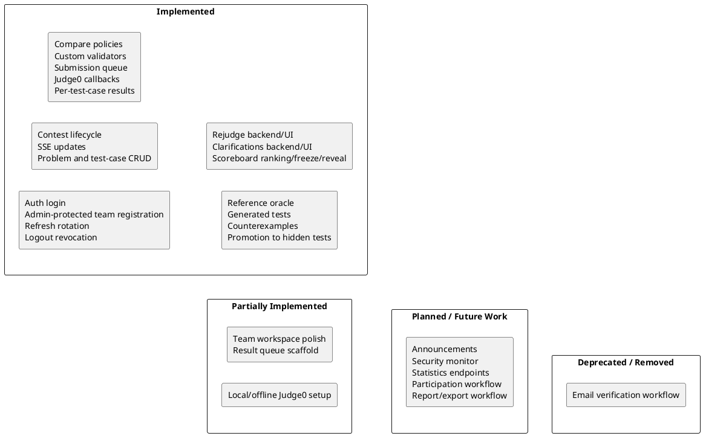

## Figure 4 - Contest Administration Use Case Diagram

- Report section: 5.1 Use Case Diagrams
- Diagram type: UML use case diagram
- Purpose: Show administrator operations currently implemented or partially implemented.
- Description: Shows administrator actions for accounts, contests, problems, test cases, submissions, rejudge, clarifications, and scoreboard reveal controls.
- Code alignment: `AdminController`, `ContestController`, `ProblemController`, `TestCaseController`, `RejudgeController`, `ClarificationController`, `AdminScoreboardController`, and admin UI components.
- Current status: Implemented, except statistics/security-monitor placeholders excluded from implemented use cases.
- Actors/components/swimlanes/entities: Administrator, AuraC2 backend.
- What the diagram should show: Manage team accounts, register team account, create contest, view contest buckets, start/pause/resume/end contest, force end with jury override, create/update/delete problems, create/update/delete test cases, review submissions, use rejudge controls, view/administer clarifications, manage admin scoreboard reveal controls.
- What the diagram must NOT include: Scoreboard ranking, security monitoring implementation, announcements, or team-only actions.
- AI image-generation prompt: Create a small UML use case diagram for AuraC2 contest administration. Actor: Administrator. Use cases: Manage Team Accounts, Register Team Account, Create Contest, View Contest Buckets, Start Contest, Pause Contest, Resume Contest, End Contest, Force End With Jury Override, Manage Problems, Manage Test Cases, Review Submissions, Rejudge, Answer Clarifications, and Manage Scoreboard Reveal. Mark only Statistics and Security Monitor as partial or future. Keep it readable and academic.
- PlantUML:

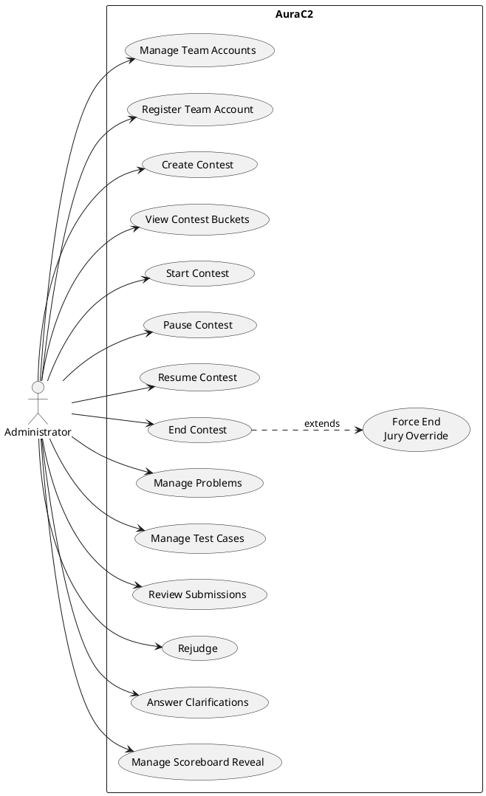

## Figure 5 - Team Contest Workspace Use Case Diagram

- Report section: 5.1 Use Case Diagrams
- Diagram type: UML use case diagram
- Purpose: Show current team capabilities.
- Description: Shows team workspace actions for login, contest/problem access, code drafts, submissions, live submission updates, scoreboard viewing, and clarifications.
- Code alignment: `TeamWorkspace`, `CodeEditor`, `ProblemSidebar`, `SubmissionHistory`, `useSubmissionStream`, `Scoreboard`, `Clarifications`, and team API services.
- Current status: Implemented with remaining problem-statement polish limitations.
- Actors/components/swimlanes/entities: Team User, AuraC2 backend/frontend.
- What the diagram should show: Log in, view active contest, view problem list, select problem, write code, save local draft, submit code, receive live submission updates, view own submission history, view submitted code, view public/team scoreboard, submit clarifications, and view own/public clarification answers.
- What the diagram must NOT include: Admin user management or rejudge as a team action.
- AI image-generation prompt: Create a UML use case diagram for AuraC2 team workspace. Actor: Team User. Include implemented use cases for login, view active contest, view problems, select problem, write code, local draft persistence, submit code, receive live submission updates, view own submission history, view submitted code, view scoreboard, submit clarifications, and view clarification answers.
- PlantUML:

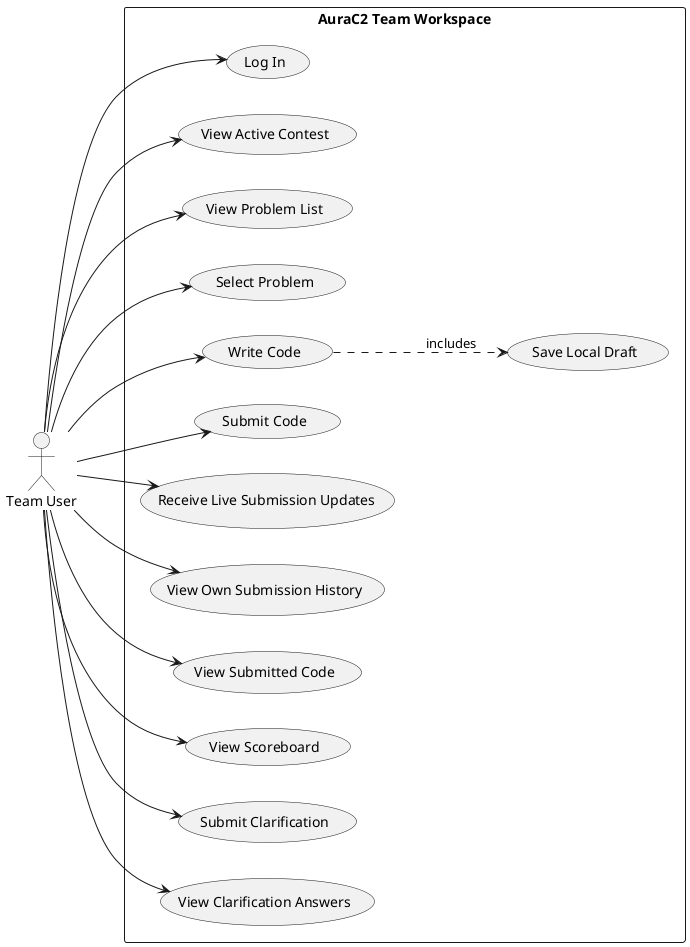

## Figure 6 - Authentication and Session Lifecycle Activity Diagram

- Report section: 5.3 Activity Diagrams for Complicated Behaviors
- Diagram type: Activity diagram with swimlanes
- Purpose: Explain login, admin-protected registration, access-token usage, refresh-token rotation, and logout revocation.
- Description: Shows administrator-protected team registration, login, access-token use, refresh rotation, logout revocation, and guarded no-security behavior.
- Code alignment: `AuthController`, `AuthFacade`, `LoginService`, `RegistrationService`, `RefreshTokenService`, `LogoutService`, `JwtAuthFilter`, `SecurityConfiguration`, `CookieUtil`, and frontend auth/http utilities.
- Current status: Implemented.
- Actors/components/swimlanes/entities: Visitor/Admin/Team, React frontend, SecurityConfiguration, JwtAuthFilter, AuthController/AuthFacade, Login/Register/Refresh/Logout services, RefreshToken table.
- What the diagram should show: Admin-authenticated team registration, route-level ADMIN registration guard, JWT filter processing `/auth/register`, method security, login request, password validation, access token issue, refresh cookie creation at `/auth`, protected request with Bearer token, 401/refresh flow, old refresh-token revocation, new cookie issue, logout receiving `/auth` cookie, server-side revocation, cookie clearing, and no-security profile allowed only in local/test.
- What the diagram must NOT include: Contest lifecycle, RabbitMQ, Judge0, or unrelated admin functions.
- AI image-generation prompt: Create a formal activity diagram with swimlanes for AuraC2 authentication. Show Administrator registering team accounts through route-level ADMIN authorization and method-level protection, then show normal login, JWT access token, HTTP-only refresh_token cookie scoped to /auth, persisted refresh-token hash, refresh rotation, revoked-token check, and logout that receives the same /auth cookie and revokes it. Include notes that JwtAuthFilter does not skip /auth/register and that the no-security profile is guarded for local/test only. Keep labels readable.
- PlantUML:

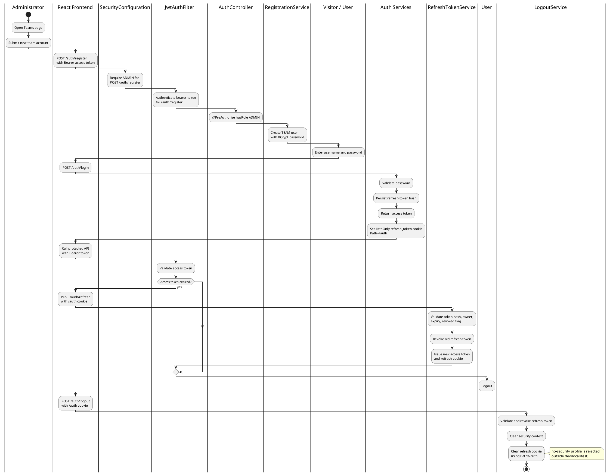

## Figure 7 - Persisted State vs Effective State Diagram

- Report section: 5.3 Activity Diagrams for Complicated Behaviors
- Diagram type: Conceptual state/data diagram
- Purpose: Preserve the distinction between database status and computed current status.
- Description: Shows persisted contest timing/status fields, lifecycle resolver inputs, and computed effective state/end/freeze outputs.
- Code alignment: `Contest`, `ContestLifecycleService`, `ContestService.toResponse`, `ContestResponse`, and lifecycle tests.
- Current status: Implemented.
- Actors/components/swimlanes/entities: Contest row fields, current time, `ContestLifecycleService`, response DTO.
- What the diagram should show: Persisted fields `status`, `startTime`, `durationMinutes`, `actualStartTime`, `pausedAt`, `totalPauseMillis`, `statusLocked`, `scoreboardFreezeMinutes`, and `penaltyMinutes`; inputs to effective state resolver; outputs `effectiveState`, `remainingMillis`, `effectiveEndTime`, `scoreboardFrozen`.
- What the diagram must NOT include: UI buttons, RabbitMQ, or Judge0.
- AI image-generation prompt: Create a conceptual diagram explaining AuraC2 persisted contest state versus effective contest state. On the left show database fields: status, startTime, durationMinutes, actualStartTime, pausedAt, totalPauseMillis, statusLocked, scoreboardFreezeMinutes, penaltyMinutes. In the center show ContestLifecycleService plus current time. On the right show computed outputs: effectiveState, remainingMillis, effectiveEndTime, scoreboardFrozen, frozen window. Add note: schedulers reduce the gap between effective state and persisted state.
- PlantUML:

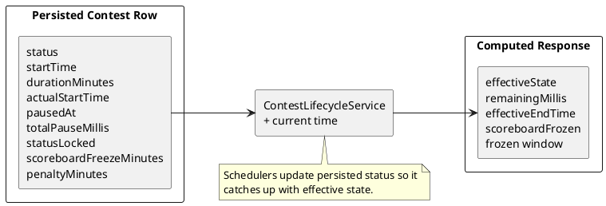

## Figure 8 - Exact-Time Scheduler and Fallback Sync Diagram

- Report section: 5.3 Activity Diagrams for Complicated Behaviors
- Diagram type: Activity diagram
- Purpose: Explain why both scheduler mechanisms exist.
- Description: Shows exact transition scheduling, fallback periodic synchronization, row locking, persisted-state updates, and transition events.
- Code alignment: `ContestTransitionScheduler`, `ContestStatusSyncScheduler`, `ContestStatusSyncService`, `ContestStatusSyncExecutor`, and `ContestRepository.findByIdWithLock`.
- Current status: Implemented.
- Actors/components/swimlanes/entities: `ContestUpdatedEvent`, `ContestTransitionScheduler`, `TaskScheduler`, `ContestStatusSyncScheduler`, `ContestStatusSyncService`, `ContestStatusSyncExecutor`, `ContestRepository`.
- What the diagram should show: Event schedules exact next transition, task fires at start/end time, fallback scheduler periodically calls same sync service, sync executor locks row, checks effective state, updates persisted status, and publishes auto event.
- What the diagram must NOT include: Problem/test-case data or submission judging internals.
- AI image-generation prompt: Create a split activity diagram for AuraC2 schedulers. Left side: exact-time scheduler reacts to ContestUpdatedEvent, computes next transition instant, schedules one-shot task, fires at time. Right side: fallback scheduler runs every configured delay. Both call ContestStatusSyncService, which delegates to ContestStatusSyncExecutor, locks the contest row, resolves effective state, updates persisted status, and publishes AUTO_START or AUTO_END.
- PlantUML:

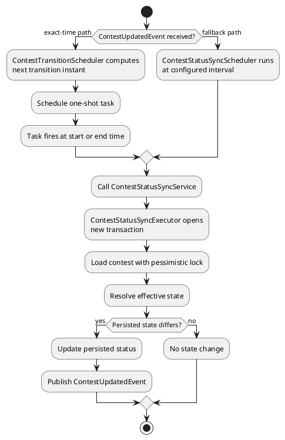

## Figure 9 - SSE Connection and Contest Update Flow

- Report section: 5.3 Activity Diagrams for Complicated Behaviors
- Diagram type: Sequence diagram
- Purpose: Show snapshot, incremental update, heartbeat, cleanup, REST fallback, and polling fallback.
- Description: Shows frontend SSE connection, backend emitter registration, snapshot/update events, heartbeat, cleanup, REST fallback, and polling fallback.
- Code alignment: `ContestStreamController`, `ContestSseRegistry`, `ContestSseAdapter`, `SseHeartbeatScheduler`, `useContestStream`, and `ContestOverview`.
- Current status: Implemented.
- Actors/components/swimlanes/entities: `ContestOverview`, `useContestStream`, `EventSource`, `ContestStreamController`, `ContestSseRegistry`, `ContestSseAdapter`, `SseHeartbeatScheduler`, `ContestService`, REST contest endpoints.
- What the diagram should show: EventSource connects, backend sends snapshot, frontend hydrates buckets, emitter is registered, `ContestUpdatedEvent` triggers the SSE adapter, frontend places contest in the correct bucket, named `ping` heartbeat keeps the connection alive, failure cleanup, REST hydration after no snapshot, and polling when closed.
- What the diagram must NOT include: Judge0, RabbitMQ, or database schema.
- AI image-generation prompt: Create an SSE sequence diagram for AuraC2 contest updates. Show React ContestOverview/useContestStream opening EventSource to /api/contest/stream, backend creating SseEmitter, ContestService building snapshot, frontend applying snapshot, ContestUpdatedEvent causing ContestSseAdapter and SsePublisher to send contest-update through ContestSseRegistry, frontend moving contest between active/upcoming/paused/ended buckets, named ping heartbeat every 15 seconds, emitter cleanup on failure, REST hydration after no snapshot, and 10-second polling when stream is closed.
- PlantUML:

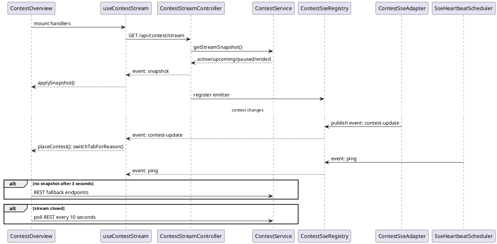

## Figure 10 - Judge0 Callback and Per-Test-Case Result Flow

- Report section: 5.3 Activity Diagrams for Complicated Behaviors
- Diagram type: Activity diagram
- Purpose: Highlight signed callback verification, stale-callback protection, deterministic compare policy handling, idempotent per-case storage, and final verdict aggregation.
- Description: Shows how a signed Judge0 callback becomes a terminal per-test-case result, including built-in compare policies and custom validator execution.
- Code alignment: `CallbackHandler`, `Judge0CallbackSignatureService`, `Judge0CallbackService`, `OutputComparator`, `CustomValidatorService`, `SubmissionJudgeResultRepository`.
- Current status: Implemented.
- Actors/components/swimlanes/entities: Judge0 API, CallbackHandler, Judge0CallbackSignatureService, Judge0CallbackService, OutputComparator, CustomValidatorService, SubmissionRepository row lock, SubmissionJudgeResultRepository, TestCaseRepository.
- What the diagram should show: Callback received with `submissionId`, `judgeRunId`, `testCaseNumber`, and `signature`; signature verified before state changes; submission row locked; stale `judgeRunId` rejected; invalid test case rejected; non-terminal statuses ignored; execution errors bypass comparison/validation; exact built-in policy uses Judge0 verdict; non-exact policies compare Judge0 `stdout` to hidden `expectedOutput`; custom validators run through Judge0 after successful execution and return accept/reject/internal error; duplicate per-case result ignored; new result saved; count results for current run; wait if incomplete; aggregate earliest non-accepted result or accepted; store max execution time and memory.
- What the diagram must NOT include: UI screen design, rejudge selection forms, local host script execution, reference oracles, generated tests, interactive judging, or ML verdicts.
- AI image-generation prompt: Create an activity diagram for AuraC2 Judge0 callback processing. Show callback with submissionId, judgeRunId, testCaseNumber, and signature; signature verification before any state mutation; row lock on Submission; stale callback check; expected test count check; invalid test-case check; terminal verdict check; exact policy using Judge0 status; non-exact deterministic policy comparing stdout with hidden expected output using OutputComparator; custom validator policy sending hidden input, hidden expected output, and team stdout to a Judge0-sandboxed checker; duplicate result ignored; new SubmissionJudgeResult saved; count received results; if incomplete wait; if complete aggregate final verdict, max execution time, max memory, and save Submission.
- PlantUML:

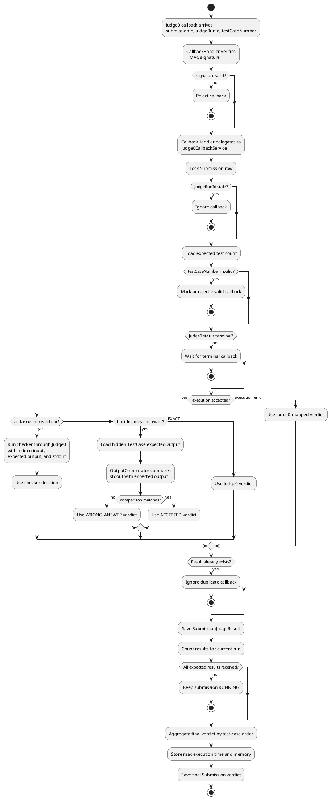

## Figure 11 - Rejudge Workflow Diagram

- Report section: 5.3 Activity Diagrams for Complicated Behaviors
- Diagram type: Activity diagram
- Purpose: Show rejudge backend and admin UI behavior.
- Description: Shows admin-triggered rejudge scope selection, eligibility filtering, after-commit republish, new judgeRunId dispatch, and stale callback rejection.
- Code alignment: `RejudgeView`, `RejudgeController`, `RejudgeService`, `SubmissionRepository`, `SubmissionProducer`, `SubmissionConsumer`, and callback services.
- Current status: Implemented.
- Actors/components/swimlanes/entities: Administrator, RejudgeView, RejudgeController, RejudgeService, SubmissionRepository, SubmissionProducer, RabbitMQ, SubmissionConsumer, Judge0 callback flow.
- What the diagram should show: Admin chooses problem/contest rejudge or force rejudge in the UI, service validates scope, selects submissions, skips active verdicts unless force is used, sets eligible submissions to `PENDING_REJUDGE`, clears aggregate execution/memory, saves, publishes after commit, consumer increments `judgeRunId` and reuses Judge0 flow, stale old callbacks rejected.
- What the diagram must NOT include: Team rejudge access.
- AI image-generation prompt: Create an AuraC2 rejudge workflow diagram. Show Administrator using RejudgeView to call RejudgeController for problem or contest scope. RejudgeService validates request, loads submissions, skips PENDING/PENDING_REJUDGE/RUNNING unless force is requested, sets eligible submissions to PENDING_REJUDGE, clears aggregate metrics, saves, publishes submission IDs after transaction commit, RabbitMQ consumer reuses the Judge0 judging flow, increments judgeRunId, and old callbacks are rejected.
- PlantUML:

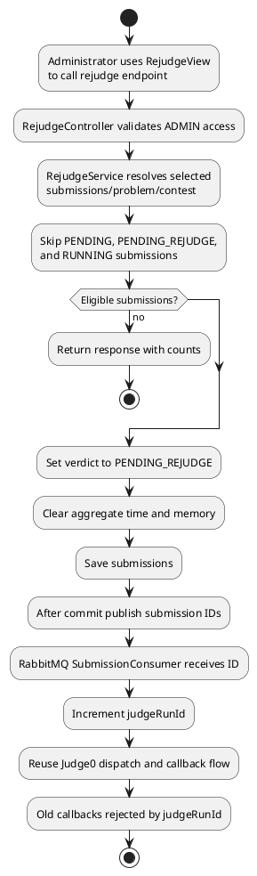

## Figure 12 - Clarification Workflow Diagram

- Report section: 5.3 Activity Diagrams for Complicated Behaviors
- Diagram type: Component interaction diagram
- Purpose: Show the implemented clarification workflow.
- Description: Shows team clarification submission, own/public answer retrieval, admin review/reply, persistence, and SSE refresh.
- Code alignment: `ClarificationController`, `ClarificationService`, `ClarificationRepository`, `ClarificationsView`, team `Clarifications`, and `useClarificationStream`.
- Current status: Implemented.
- Actors/components/swimlanes/entities: Team User, Administrator, Team Clarifications UI, Admin ClarificationsView, ClarificationController, ClarificationService, ClarificationRepository, Clarification SSE stream.
- What the diagram should show: Team UI submits and fetches own/public clarifications; admin UI fetches pending/all clarifications, replies publicly or privately, and both sides receive clarification SSE refresh events.
- What the diagram must NOT include: Scoreboard, submission judging, or future announcements.
- AI image-generation prompt: Create a clear workflow diagram for AuraC2 clarifications. Show Team Clarifications UI submitting questions and fetching own/public answers, Admin ClarificationsView fetching pending/all questions and sending public/private replies, ClarificationController and ClarificationService persisting to ClarificationRepository, and SSE updates refreshing both UIs.
- PlantUML:

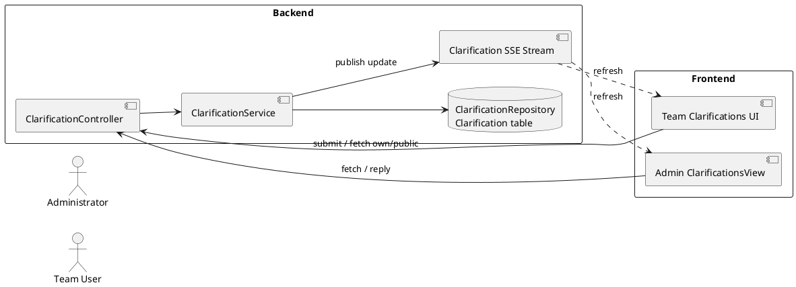

## Figure 13 - Contest Lifecycle Architecture Diagram

- Report section: 6.1 Application Architecture Design / Context Diagram
- Diagram type: Component interaction diagram
- Purpose: Show how contest lifecycle writes, events, schedulers, row locking, and SSE cooperate.
- Description: Shows contest writes, domain events, after-commit listeners, exact/fallback scheduling, row-locked persisted status synchronization, and SSE publication.
- Code alignment: `ContestController`, `ContestService`, `ContestLifecycleService`, `ContestTransitionScheduler`, `ContestStatusSyncScheduler`, `ContestStatusSyncExecutor`, `ContestSseAdapter`, and `ContestSseRegistry`.
- Current status: Implemented.
- Actors/components/swimlanes/entities: Admin UI, ContestController, ContestService, ContestLifecycleService, ContestRepository/PostgreSQL, ContestUpdatedEvent, ContestTransitionScheduler, ContestStatusSyncScheduler, ContestStatusSyncService, ContestStatusSyncExecutor, ContestSseAdapter, SsePublisher, ContestSseRegistry, Browser SSE clients.
- What the diagram should show: Admin creates/changes contest, service saves and publishes event, transactional listeners run after commit, exact-time scheduler reschedules/cancels tasks, fallback sync runs periodically, executor locks row and syncs persisted state, the SSE adapter publishes updates through the shared publisher and registry.
- What the diagram must NOT include: Submission queue or Judge0 callback internals.
- AI image-generation prompt: Create a clean architecture diagram for AuraC2 contest lifecycle. Show Admin React UI, ContestController, ContestService, ContestLifecycleService, ContestRepository/PostgreSQL, ContestUpdatedEvent, ContestTransitionScheduler, ContestStatusSyncScheduler, ContestStatusSyncService, ContestStatusSyncExecutor, ContestSseAdapter, SsePublisher, and ContestSseRegistry. Label manual transitions, auto transitions, row lock, event after commit, and SSE contest-update to browsers.
- PlantUML:

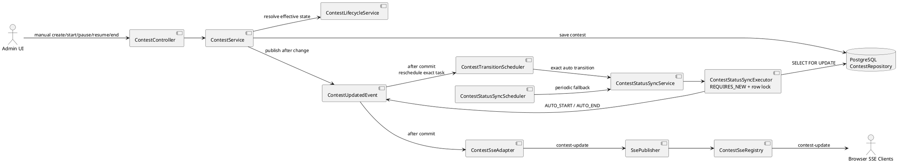

## Figure 14 - Submission and Asynchronous Judging Architecture Diagram

- Report section: 6.1 Application Architecture Design / Context Diagram
- Diagram type: Architecture flow diagram
- Purpose: Show submission persistence, after-commit RabbitMQ publishing, Judge0 dispatch with signed callback URL, compare-policy handling, callback verification, and final result persistence.
- Description: Shows the implemented judging pipeline, including built-in compare policy and custom validator branches.
- Code alignment: `SubmissionService`, `SubmissionProducer`, `SubmissionConsumer`, `Judge0Service`, `Judge0CallbackService`, `OutputComparator`, `CustomValidatorService`.
- Current status: Implemented.
- Actors/components/swimlanes/entities: Team UI, SubmissionController, SubmissionService, SubmissionRepository/PostgreSQL, SubmissionProducer, RabbitMQ, SubmissionConsumer, TestCaseRepository, LanguageMapper, Judge0Service, Judge0CallbackSignatureService, Judge0 API, CallbackHandler, Judge0CallbackService, OutputComparator, CustomValidatorService, SubmissionJudgeResult.
- What the diagram should show: Submission request, save PENDING row, publish submissionId only after commit, consume message, lock/claim submission, map language, increment judgeRunId, mark RUNNING, fetch test cases, send each test to Judge0 with signed callback URL, use `expected_output` only for EXACT built-in policy, omit `expected_output` for non-exact policies and active custom validators, callback verifies signature, backend comparator handles non-exact successful executions, custom validator service submits checker code to Judge0 with hidden input/expected output/team stdout, persists per-case result idempotently, aggregate final verdict.
- What the diagram must NOT include: Contest lifecycle scheduler details, frontend admin screens, local host script execution, generated tests, reference oracles, interactive protocols, or ML verdicts.
- AI image-generation prompt: Create a technical architecture diagram for AuraC2 asynchronous judging. Show Team React UI submitting code to SubmissionController and SubmissionService, PostgreSQL storing a PENDING Submission, SubmissionProducer publishing submissionId to RabbitMQ submissionQueue after commit, SubmissionConsumer consuming it with a row lock, fetching test cases and problem compare/validation policy, LanguageMapper, Judge0Service and Judge0CallbackSignatureService sending one request per test case to Judge0 with signed callback URL. Show exact built-in policy sending expected_output, non-exact policies and custom-validator problems omitting expected_output. Show Judge0 calling CallbackHandler, CallbackHandler verifying signature, Judge0CallbackService storing SubmissionJudgeResult rows idempotently, OutputComparator comparing stdout for non-exact built-ins, and CustomValidatorService sending checker code to Judge0 for custom validators. Label judgeRunId, testCaseNumber, signature, and no ML verdict.
- PlantUML:

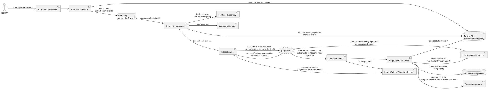

## Figure 15 - Current ER Diagram

- Report section: 6.2 Data Architecture Design
- Diagram type: ER diagram
- Purpose: Represent the current persistent model accurately.
- Actors/components/swimlanes/entities: User, RefreshToken, Contest, Problem, TestCase, Clarification, Submission, SubmissionJudgeResult, ScoreboardRevealState, ScoreboardRevealCell, ReferenceSolution, InputGenerator, InputValidator, GeneratedTestBatch, GeneratedTestCase, Counterexample.
- Description: Shows the current persistent entities and relationships, including compare-policy/custom-validator columns on `Problem` and the Phase 8 deterministic oracle/generated-test entities.
- Code alignment: JPA entities under `contestServer.entity`, `contestServer.oracle.entity`, `authServer.entity`, `submissionServer.entity`, scoreboard entities, and Flyway migrations `V1`-`V5`.
- Current status: Implemented.
- What the diagram should show: One User to many RefreshToken; Contest to many Problem; Problem includes comparePolicy, optional float epsilon fields, validationMode, validatorLanguageId, validatorSourceHash, and validatorEnabled; Problem to many TestCase; User/Contest/Problem to Submission; Submission to many SubmissionJudgeResult; Contest/User/optional Problem/admin User to Clarification; Contest to one ScoreboardRevealState; reveal state to many reveal cells; reveal cells link to team User and Problem; Problem to reference solutions, input generators, input validators, generated batches/cases, and counterexamples; counterexamples link to Submission, GeneratedTestCase, and optionally promoted hidden TestCase.
- What the diagram must NOT include: SecurityAlert, Team entity, contest-membership table, Announcement entity, or a generic future Scoreboard table unless added in future code.
- AI image-generation prompt: Create a readable ER diagram for the current AuraC2 database. Entities: User, RefreshToken, Contest, Problem, TestCase, Clarification, Submission, SubmissionJudgeResult, ScoreboardRevealState, and ScoreboardRevealCell. Show primary keys, important fields including Problem comparePolicy, float epsilon fields, validationMode, validatorLanguageId, validatorSourceHash, and validatorEnabled, cardinalities, and the note that Team is represented by User.role = TEAM. Show TestCase visibility as admin/internal for private cases and public/sample for TEAM users. Do not include future-only tables such as SecurityAlert, Announcement, or ContestMembership.
- PlantUML:

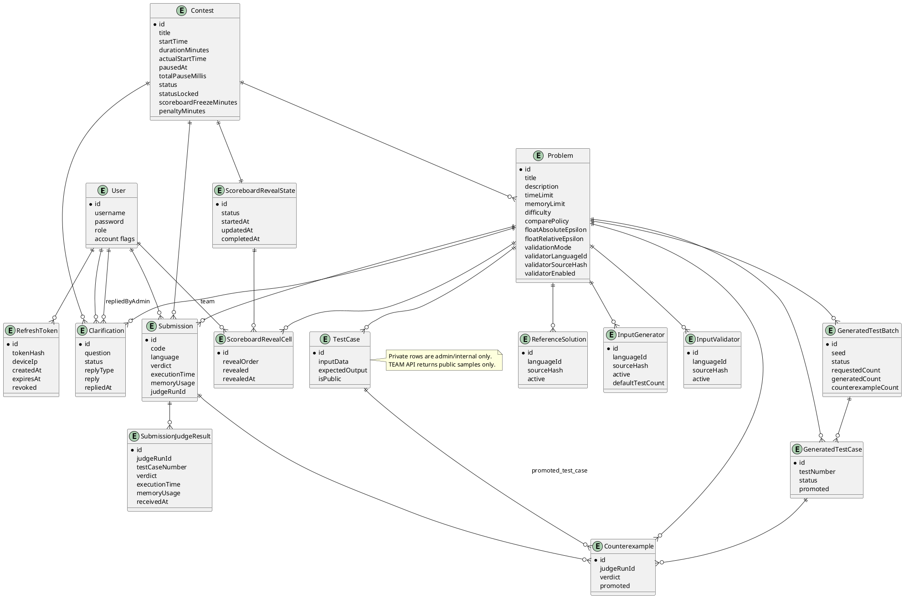

## Figure 16 - Submission Judging Mini ER Diagram

- Report section: 6.2 Data Architecture Design
- Diagram type: Mini ER diagram
- Purpose: Focus on per-test-case result tracking and rejudge.
- Description: Shows the submission-to-result structure used for per-test-case verdict tracking, duplicate callback idempotency, and rejudge run separation.
- Code alignment: `Submission`, `SubmissionJudgeResult`, `SubmissionJudgeResultRepository`, `Judge0CallbackService`, and Flyway `submission_judge_results` table definition.
- Current status: Implemented.
- Actors/components/swimlanes/entities: Submission, SubmissionJudgeResult, Problem, TestCase.
- What the diagram should show: Submission has `judgeRunId`; each result has `judgeRunId`, `testCaseNumber`, verdict, time, memory; unique constraint on `(submission_id, judge_run_id, test_case_number)`; TestCase is not directly referenced by foreign key.
- What the diagram must NOT include: User account or contest lifecycle details unless needed for foreign-key context.
- AI image-generation prompt: Create a focused mini ER diagram for AuraC2 judging. Show Submission linked to Problem and many SubmissionJudgeResult rows. Highlight judgeRunId on Submission and SubmissionJudgeResult, testCaseNumber, verdict, executionTime, memoryUsage, and the unique constraint submission_id + judge_run_id + test_case_number. Show TestCase under Problem and note that judge result stores testCaseNumber rather than a direct TestCase foreign key.
- PlantUML:

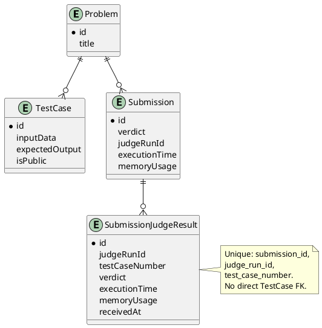

## Figure 17 - Relational Schema Diagram

- Report section: 6.2 Data Architecture Design
- Diagram type: Logical database schema diagram
- Purpose: Provide implementation-level table names and important columns.
- Actors/components/swimlanes/entities: `users`, `refresh_tokens`, `contests`, `problems`, `test_cases`, `clarifications`, `submissions`, `submission_judge_results`, `scoreboard_reveal_states`, `scoreboard_reveal_cells`, `reference_solutions`, `input_generators`, `input_validators`, `generated_test_batches`, `generated_test_cases`, `counterexamples`.
- Description: Shows table-level implementation columns, including validator configuration fields added to `problems` and Phase 8 oracle/generated-test tables.
- Code alignment: Flyway migrations `V1__baseline_schema.sql`, `V2__problem_compare_policy.sql`, `V3__problem_custom_validators.sql`, `V4__reference_oracle_generated_tests.sql`, and `V5__generated_test_batch_partial_status.sql`.
- Current status: Implemented.
- What the diagram should show: Tables, primary keys, foreign keys, enum-as-string fields including `problems.compare_policy`, `problems.validation_mode`, generated batch/case status, important NOT NULL columns, indexes for lookup paths, and unique constraints.
- What the diagram must NOT include: Unimplemented tables such as announcements, security alerts, contest membership, or generic scoreboard snapshots.
- AI image-generation prompt: Create a relational schema diagram for AuraC2 using actual table names: users, refresh_tokens, contests, problems, test_cases, clarifications, submissions, submission_judge_results, scoreboard_reveal_states, and scoreboard_reveal_cells. Show primary keys, foreign keys, enum string fields including problems.compare_policy and problems.validation_mode, float epsilon columns, validator configuration columns, useful indexes, NOT NULL required fields, and unique constraints such as users.username, submission_judge_results submission_id plus judge_run_id plus test_case_number, scoreboard_reveal_states contest_id, and scoreboard_reveal_cells reveal_state_id plus team_id plus problem_id. Keep the diagram compact and readable.
- PlantUML:

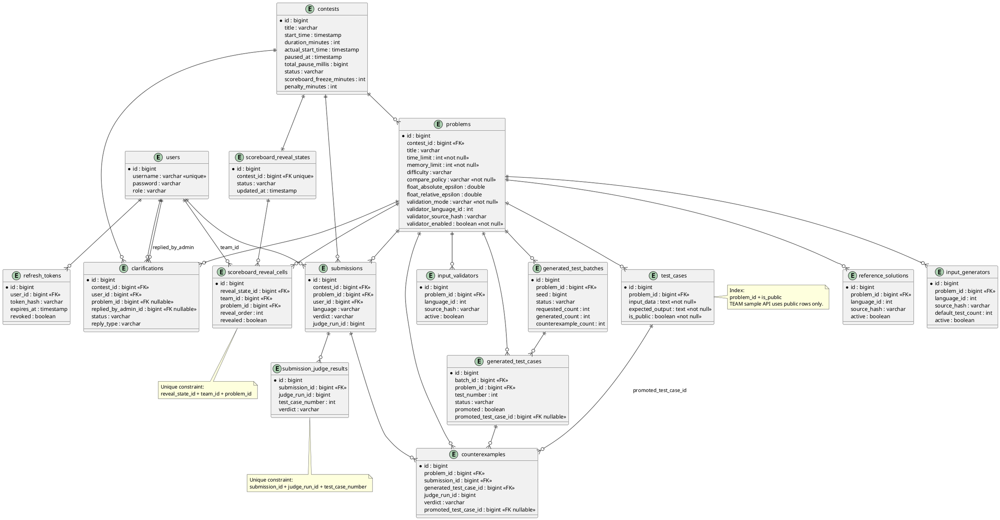

## Figure 18 - Hybrid Deterministic Oracle and Generated Tests Diagram

- Report section: 6.1 Application Architecture Design / Judging Extension
- Diagram type: Activity/component flow diagram
- Purpose: Show the implemented admin reference-solution oracle, candidate generated tests, counterexample storage, and promotion paths.
- Description: Shows the primary pre-contest test-preparation workflow and the secondary counterexample-search workflow. Admins configure reference/generator/validator programs, run them through Judge0, store generated candidate cases, promote valid generated cases into official hidden tests, optionally compare a selected submission deterministically, record counterexamples, and promote a counterexample into an official hidden test for later rejudge.
- Code alignment: `OracleAdminController`, `OracleService`, `OracleJudge0ExecutionService`, `OraclePanel`, `ReferenceSolution`, `InputGenerator`, `InputValidator`, `GeneratedTestBatch`, `GeneratedTestCase`, `Counterexample`, `TestCase`, `V4__reference_oracle_generated_tests.sql`, `V5__generated_test_batch_partial_status.sql`.
- Current status: Implemented backend/admin UI.
- Actors/components/swimlanes/entities: Administrator, OracleAdminController, OracleService, Judge0 API, reference solution, input generator, input validator, generated test batch/case tables, selected submission, OutputComparator/CustomValidatorService, counterexample table, hidden TestCase table, RejudgeService.
- What the diagram should show: Admin configures source programs; generator runs in Judge0 using seed and test number; optional input validator runs in Judge0 and rejects invalid generated inputs; reference solution runs in Judge0 to produce deterministic expected output; generated cases are candidates until promoted; admin can promote one, selected, or all valid generated cases to `TestCase.isPublic=false`; optional counterexample search runs a selected team submission in Judge0 on generated input; compare policy or custom validator makes deterministic accept/reject decision; mismatch stores counterexample; counterexample promotion also creates `TestCase.isPublic=false`; rejudge can then use promoted hidden tests through the normal judging pipeline.
- What the diagram must NOT include: ML probability scoring, host shell execution, interactive protocols, or claims that generated tests prove correctness.
- AI image-generation prompt: Create a clean technical flow diagram for AuraC2 hybrid deterministic judging. Show two admin workflows: Test Preparation and Counterexample Search. In Test Preparation, Administrator configures ReferenceSolution, InputGenerator, and optional InputValidator, then OracleService sends generator, validator, and reference solution executions to Judge0 with wait=true and resource limits, stores GeneratedTestBatch and GeneratedTestCase candidates, and promotes one/selected/all valid cases into hidden official TestCase rows. In Counterexample Search, show optional selected submission execution through Judge0, deterministic compare policy or custom validator decision, Counterexample storage on mismatch, counterexample promotion, and rejudge through the existing judging pipeline. Add explicit notes: no ML verdict, no backend host execution, generated tests do not prove correctness.
- PlantUML:

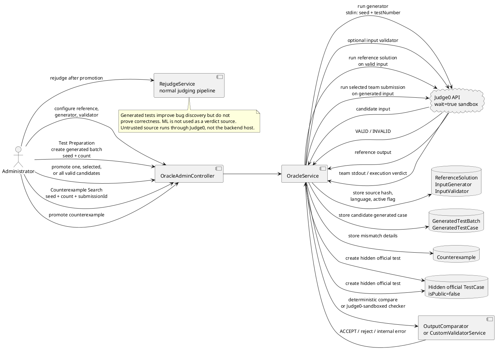
