# AuraC2 Report Rebuild - Diagram Prompts

Use these prompts after Phase 1 review to generate small, focused diagrams. All figures are kept and renumbered according to their order of appearance in `report-draft-google-docs.md`. Do not merge diagrams. If a generated image becomes dense, keep the same figure but simplify labels rather than combining it with another figure.

## Figure 1 - System Context Diagram

- Report section: 2.2 Current System Architecture
- Diagram type: C4-style system context diagram
- Purpose: Show the major runtime actors and external systems around AuraC2.
- Actors/components/swimlanes/entities: Admin/Team browser, React frontend, Spring Boot backend, PostgreSQL, RabbitMQ, Judge0 API, SSE clients, Judge0 callback endpoint.
- What the diagram should show: Browser-to-frontend usage, frontend REST calls to backend, backend SSE stream to browser, backend JPA persistence, RabbitMQ submission queue, backend Judge0 requests, and Judge0 callback into backend.
- What the diagram must NOT include: Individual controllers, DTOs, all database tables, or future-only systems such as security monitoring and report export.
- AI image-generation prompt: Create a clean academic system context diagram for AuraC2, a university programming contest control system. Use simple boxes and labeled arrows. Show Browser/React Frontend, Spring Boot Backend, PostgreSQL Database, RabbitMQ, Judge0 API, SSE clients, REST API, submission queue, and Judge0 callback endpoint. Use a formal blue-gray palette, readable labels, and no decorative elements.
- PlantUML:

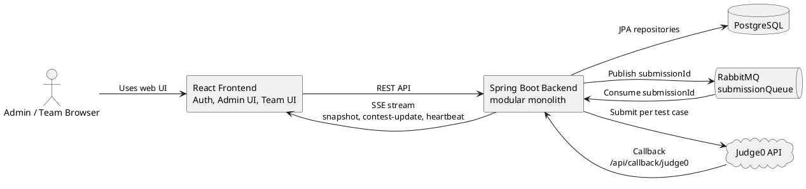

## Figure 2 - Backend Modular Architecture Diagram

- Report section: 2.3 Main Modules
- Diagram type: Component/module diagram
- Purpose: Show the current Spring Boot modular monolith package structure.
- Actors/components/swimlanes/entities: `authServer`, `contestServer`, `submissionServer`, Spring Security, PostgreSQL, RabbitMQ, Judge0.
- What the diagram should show: Authentication controllers/services/entities/repositories/filter/config; contest controllers/services/entities/repositories/events/schedulers/SSE/problems/test cases/clarifications; submission controllers/services/entities/repositories/queues/Judge0 callbacks/per-test-case results/rejudge.
- What the diagram must NOT include: Frontend component hierarchy or every DTO class.
- AI image-generation prompt: Create a modular backend architecture diagram for AuraC2 as a Spring Boot modular monolith. Show three main packages: authServer, contestServer, and submissionServer. Inside each package show only major responsibilities: controllers, services, entities, repositories, filters/config for auth; contest lifecycle, events, schedulers, SSE, problems, test cases, clarifications for contest; submissions, RabbitMQ, Judge0 callbacks, per-test-case results, and rejudge for submission. Add PostgreSQL, RabbitMQ, and Judge0 as external dependencies. Keep it compact and academic.
- PlantUML:

```plantuml
@startuml
skinparam componentStyle rectangle
package "authServer" {
  [AuthController]
  [JwtAuthFilter]
  [Login / Register / Refresh / Logout Services]
  [User + RefreshToken]
}
package "contestServer" {
  [ContestController]
  [ContestService + LifecycleService]
  [Transition + Sync Schedulers]
  [SSE Broadcaster]
  [Problem / TestCase / Clarification Services]
}
package "submissionServer" {
  [SubmissionController]
  [SubmissionProducer / SubmissionConsumer]
  [Judge0Service + CallbackService]
  [RejudgeService]
  [Submission + JudgeResult]
}
database "PostgreSQL" as DB
queue "RabbitMQ" as MQ
cloud "Judge0" as J0
[User + RefreshToken] --> DB
[ContestService + LifecycleService] --> DB
[Problem / TestCase / Clarification Services] --> DB
[Submission + JudgeResult] --> DB
[SubmissionProducer / SubmissionConsumer] --> MQ
[Judge0Service + CallbackService] --> J0
@enduml
```

## Figure 3 - Current Scope vs Future Scope Diagram

- Report section: 2.5 Current Scope vs Future Scope
- Diagram type: Four-column scope/status diagram
- Purpose: Visually distinguish implemented, partially implemented, planned/future, and deprecated/removed features.
- Actors/components/swimlanes/entities: Implemented scope, partial scope, future scope, deprecated/removed scope.
- What the diagram should show: Implemented: login, admin-protected team registration, refresh rotation/logout revocation, admin bootstrap, user admin, contest lifecycle, SSE contest updates, problem/test-case create/update/delete, submission queue, Judge0 callback, per-case results, rejudge backend/UI, clarifications backend/UI, scoreboard ranking/freeze/reveal. Partial: team workspace polish, result queue, time/memory enforcement, local/offline deployment. Future: announcements, security monitor, statistics endpoints, participation/join workflow, report/export workflow, full LAN-first Judge0. Removed: email verification.
- What the diagram must NOT include: Detailed code paths, class names, or unverified features.
- AI image-generation prompt: Create a clean status diagram for AuraC2 with four labeled groups: Implemented, Partially Implemented, Planned/Future Work, Deprecated/Removed. Include concise feature chips. Make clear that registration is admin-protected, logout revocation is implemented, clarifications are wired, rejudge UI exists, and scoreboard ranking/freeze/reveal are implemented. Use formal academic styling and avoid clutter.
- PlantUML:

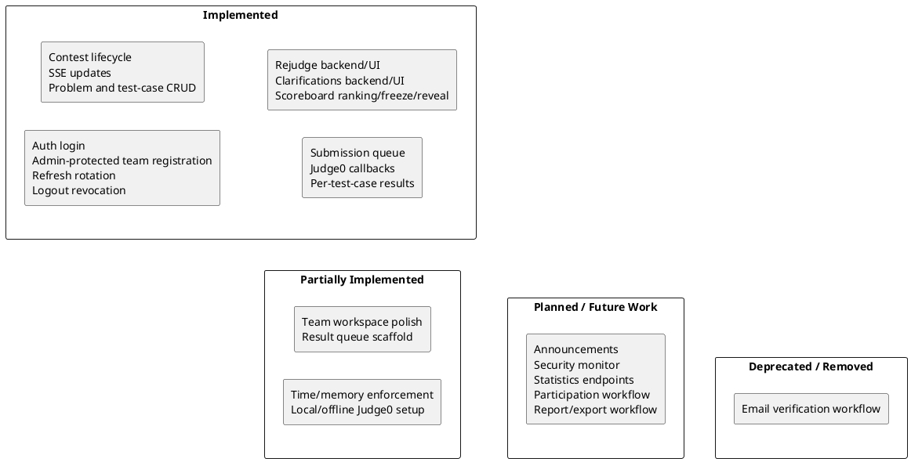

## Figure 4 - Contest Administration Use Case Diagram

- Report section: 5.1 Use Case Diagrams
- Diagram type: UML use case diagram
- Purpose: Show administrator operations currently implemented or partially implemented.
- Actors/components/swimlanes/entities: Administrator, AuraC2 backend.
- What the diagram should show: Manage team accounts, register team account, create contest, view contest buckets, start/pause/resume/end contest, force end with jury override, create/update/delete problems, create/update/delete test cases, review submissions, use rejudge controls, view/administer clarifications, manage admin scoreboard reveal controls.
- What the diagram must NOT include: Scoreboard ranking, security monitoring implementation, announcements, or team-only actions.
- AI image-generation prompt: Create a small UML use case diagram for AuraC2 contest administration. Actor: Administrator. Use cases: Manage Team Accounts, Register Team Account, Create Contest, View Contest Buckets, Start Contest, Pause Contest, Resume Contest, End Contest, Force End With Jury Override, Manage Problems, Manage Test Cases, Review Submissions, Rejudge, Answer Clarifications, and Manage Scoreboard Reveal. Mark only Statistics and Security Monitor as partial or future. Keep it readable and academic.
- PlantUML:

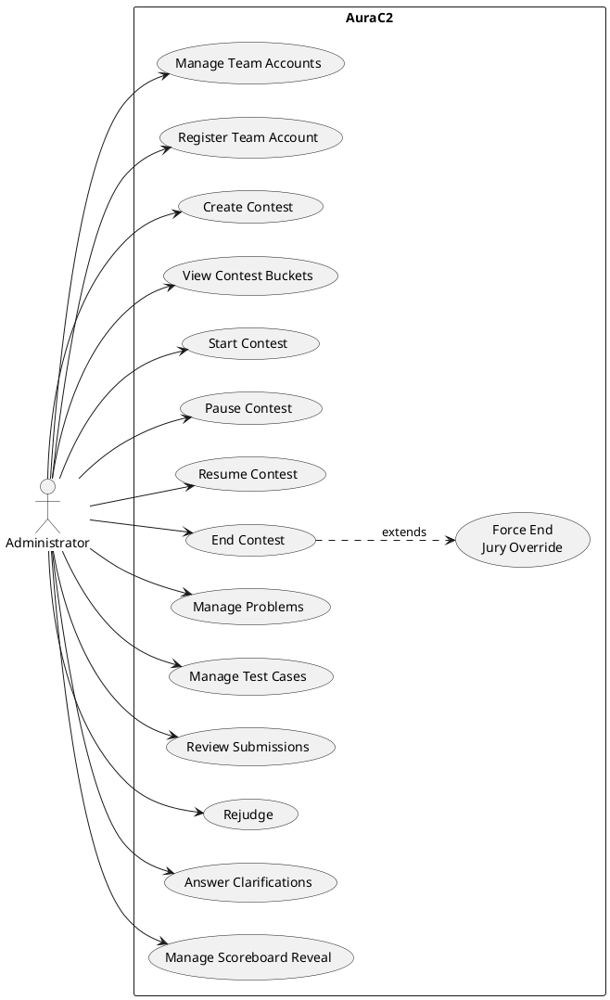

## Figure 5 - Team Contest Workspace Use Case Diagram

- Report section: 5.1 Use Case Diagrams
- Diagram type: UML use case diagram
- Purpose: Show current team capabilities.
- Actors/components/swimlanes/entities: Team User, AuraC2 backend/frontend.
- What the diagram should show: Log in, view active contest, view problem list, select problem, write code, save local draft, submit code, view own submission history, view submitted code, view public/team scoreboard, submit clarifications, and view own/public clarification answers.
- What the diagram must NOT include: Admin user management or rejudge as a team action.
- AI image-generation prompt: Create a UML use case diagram for AuraC2 team workspace. Actor: Team User. Include implemented use cases for login, view active contest, view problems, select problem, write code, local draft persistence, submit code, view own submission history, view submitted code, view scoreboard, submit clarifications, and view clarification answers.
- PlantUML:

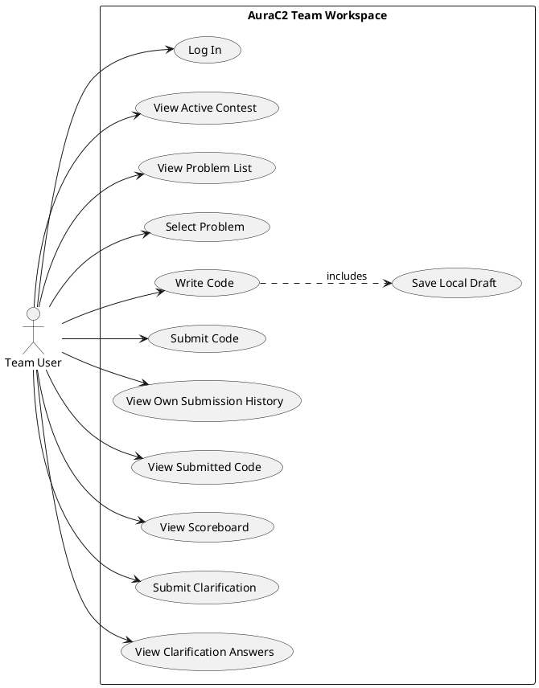

## Figure 6 - Authentication and Session Lifecycle Activity Diagram

- Report section: 5.3 Activity Diagrams for Complicated Behaviors
- Diagram type: Activity diagram with swimlanes
- Purpose: Explain login, admin-protected registration, access-token usage, refresh-token rotation, and logout revocation.
- Actors/components/swimlanes/entities: Visitor/Admin/Team, React frontend, SecurityConfiguration, JwtAuthFilter, AuthController/AuthFacade, Login/Register/Refresh/Logout services, RefreshToken table.
- What the diagram should show: Admin-authenticated team registration, route-level ADMIN registration guard, JWT filter processing `/auth/register`, method security, login request, password validation, access token issue, refresh cookie creation at `/auth`, protected request with Bearer token, 401/refresh flow, old refresh-token revocation, new cookie issue, logout receiving `/auth` cookie, server-side revocation, cookie clearing, and no-security profile allowed only in local/test.
- What the diagram must NOT include: Contest lifecycle, RabbitMQ, Judge0, or unrelated admin functions.
- AI image-generation prompt: Create a formal activity diagram with swimlanes for AuraC2 authentication. Show Administrator registering team accounts through route-level ADMIN authorization and method-level protection, then show normal login, JWT access token, HTTP-only refresh_token cookie scoped to /auth, persisted refresh-token hash, refresh rotation, revoked-token check, and logout that receives the same /auth cookie and revokes it. Include notes that JwtAuthFilter does not skip /auth/register and that the no-security profile is guarded for local/test only. Keep labels readable.
- PlantUML:

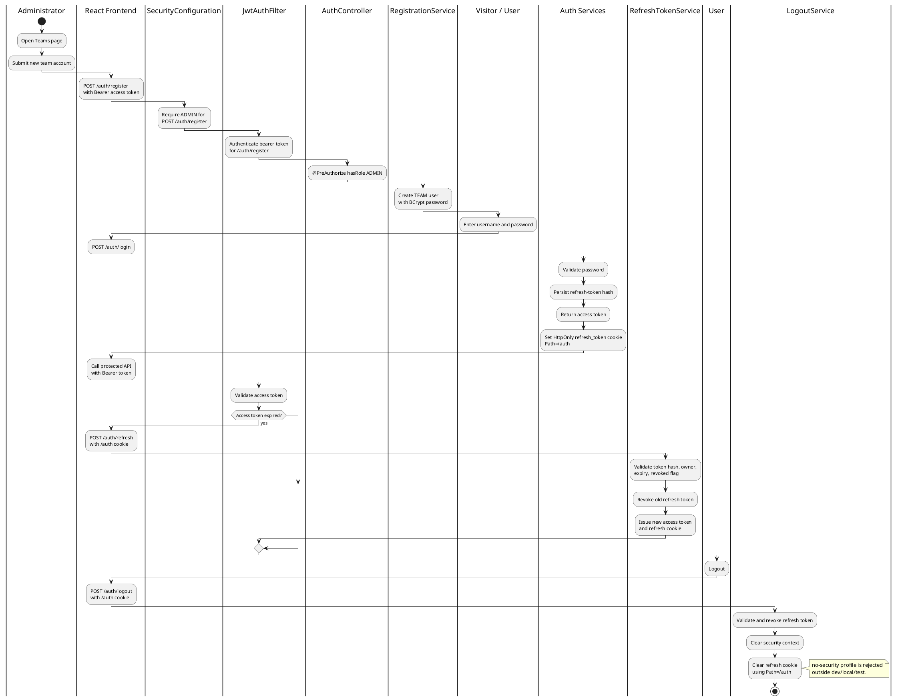

## Figure 7 - Persisted State vs Effective State Diagram

- Report section: 5.3 Activity Diagrams for Complicated Behaviors
- Diagram type: Conceptual state/data diagram
- Purpose: Preserve the distinction between database status and computed current status.
- Actors/components/swimlanes/entities: Contest row fields, current time, `ContestLifecycleService`, response DTO.
- What the diagram should show: Persisted fields `status`, `startTime`, `durationMinutes`, `actualStartTime`, `pausedAt`, `totalPauseMillis`, `statusLocked`, `scoreboardFreezeMinutes`, and `penaltyMinutes`; inputs to effective state resolver; outputs `effectiveState`, `remainingMillis`, `effectiveEndTime`, `scoreboardFrozen`.
- What the diagram must NOT include: UI buttons, RabbitMQ, or Judge0.
- AI image-generation prompt: Create a conceptual diagram explaining AuraC2 persisted contest state versus effective contest state. On the left show database fields: status, startTime, durationMinutes, actualStartTime, pausedAt, totalPauseMillis, statusLocked, scoreboardFreezeMinutes, penaltyMinutes. In the center show ContestLifecycleService plus current time. On the right show computed outputs: effectiveState, remainingMillis, effectiveEndTime, scoreboardFrozen, frozen window. Add note: schedulers reduce the gap between effective state and persisted state.
- PlantUML:

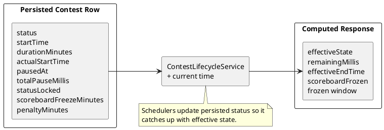

## Figure 8 - Exact-Time Scheduler and Fallback Sync Diagram

- Report section: 5.3 Activity Diagrams for Complicated Behaviors
- Diagram type: Activity diagram
- Purpose: Explain why both scheduler mechanisms exist.
- Actors/components/swimlanes/entities: `ContestUpdatedEvent`, `ContestTransitionScheduler`, `TaskScheduler`, `ContestStatusSyncScheduler`, `ContestStatusSyncService`, `ContestStatusSyncExecutor`, `ContestRepository`.
- What the diagram should show: Event schedules exact next transition, task fires at start/end time, fallback scheduler periodically calls same sync service, sync executor locks row, checks effective state, updates persisted status, and publishes auto event.
- What the diagram must NOT include: Problem/test-case data or submission judging internals.
- AI image-generation prompt: Create a split activity diagram for AuraC2 schedulers. Left side: exact-time scheduler reacts to ContestUpdatedEvent, computes next transition instant, schedules one-shot task, fires at time. Right side: fallback scheduler runs every configured delay. Both call ContestStatusSyncService, which delegates to ContestStatusSyncExecutor, locks the contest row, resolves effective state, updates persisted status, and publishes AUTO_START or AUTO_END.
- PlantUML:

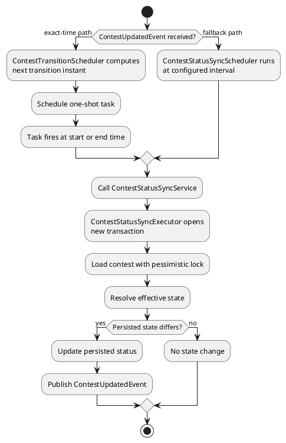

## Figure 9 - SSE Connection and Contest Update Flow

- Report section: 5.3 Activity Diagrams for Complicated Behaviors
- Diagram type: Sequence diagram
- Purpose: Show snapshot, incremental update, heartbeat, cleanup, REST fallback, and polling fallback.
- Actors/components/swimlanes/entities: `ContestOverview`, `useContestStream`, `EventSource`, `ContestStreamController`, `ContestStreamBroadcaster`, `ContestService`, REST contest endpoints.
- What the diagram should show: EventSource connects, backend sends snapshot, frontend hydrates buckets, `ContestUpdatedEvent` triggers broadcast, frontend places contest in correct bucket, heartbeat keeps connection alive, failure cleanup, REST hydration after no snapshot, polling when closed.
- What the diagram must NOT include: Judge0, RabbitMQ, or database schema.
- AI image-generation prompt: Create an SSE sequence diagram for AuraC2 contest updates. Show React ContestOverview/useContestStream opening EventSource to /api/contest/stream, backend creating SseEmitter, ContestService building snapshot, frontend applying snapshot, ContestUpdatedEvent causing ContestStreamBroadcaster to send contest-update, frontend moving contest between active/upcoming/paused/ended buckets, heartbeat every 15 seconds, emitter cleanup on failure, REST hydration after no snapshot, and 10-second polling when stream is closed.
- PlantUML:

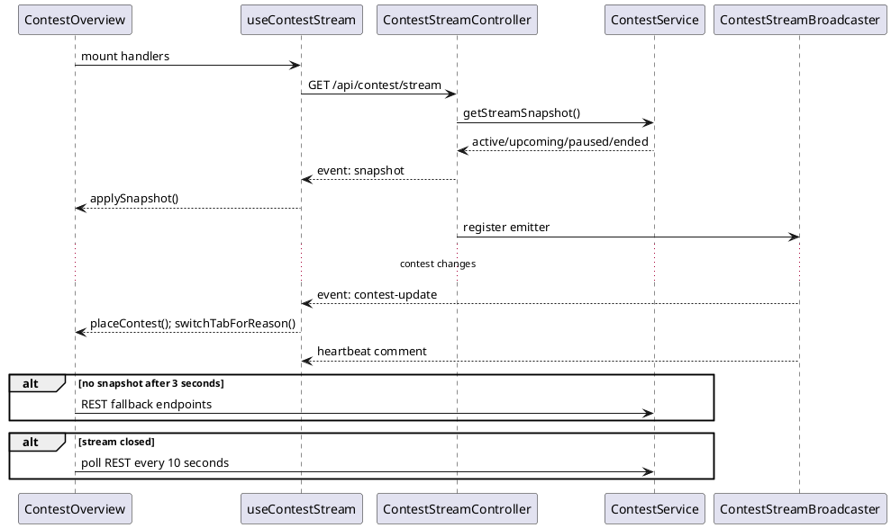

## Figure 10 - Judge0 Callback and Per-Test-Case Result Flow

- Report section: 5.3 Activity Diagrams for Complicated Behaviors
- Diagram type: Activity diagram
- Purpose: Highlight signed callback verification, stale-callback protection, idempotent per-case storage, and final verdict aggregation.
- Actors/components/swimlanes/entities: Judge0 API, CallbackHandler, Judge0CallbackSignatureService, Judge0CallbackService, SubmissionRepository row lock, SubmissionJudgeResultRepository, TestCaseRepository.
- What the diagram should show: Callback received with `submissionId`, `judgeRunId`, `testCaseNumber`, and `signature`; signature verified before state changes; submission row locked; stale `judgeRunId` rejected; invalid test case rejected; non-terminal statuses ignored; duplicate per-case result ignored; new result saved; count results for current run; wait if incomplete; aggregate earliest non-accepted result or accepted; store max execution time and memory.
- What the diagram must NOT include: UI screen design or rejudge selection forms.
- AI image-generation prompt: Create an activity diagram for AuraC2 Judge0 callback processing. Show callback with submissionId, judgeRunId, testCaseNumber, and signature; signature verification before any state mutation; row lock on Submission; stale callback check; expected test count check; invalid test-case check; terminal verdict check; duplicate result ignored; new SubmissionJudgeResult saved; count received results; if incomplete wait; if complete aggregate final verdict, max execution time, max memory, and save Submission.
- PlantUML:

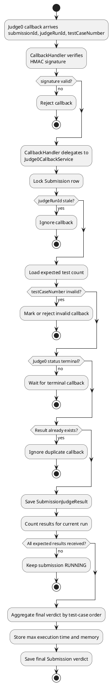

## Figure 11 - Rejudge Workflow Diagram

- Report section: 5.3 Activity Diagrams for Complicated Behaviors
- Diagram type: Activity diagram
- Purpose: Show rejudge backend and admin UI behavior.
- Actors/components/swimlanes/entities: Administrator, RejudgeView, RejudgeController, RejudgeService, SubmissionRepository, SubmissionProducer, RabbitMQ, SubmissionConsumer, Judge0 callback flow.
- What the diagram should show: Admin chooses problem/contest rejudge or force rejudge in the UI, service validates scope, selects submissions, skips active verdicts unless force is used, sets eligible submissions to `PENDING_REJUDGE`, clears aggregate execution/memory, saves, publishes after commit, consumer increments `judgeRunId` and reuses Judge0 flow, stale old callbacks rejected.
- What the diagram must NOT include: Team rejudge access.
- AI image-generation prompt: Create an AuraC2 rejudge workflow diagram. Show Administrator using RejudgeView to call RejudgeController for problem or contest scope. RejudgeService validates request, loads submissions, skips PENDING/PENDING_REJUDGE/RUNNING unless force is requested, sets eligible submissions to PENDING_REJUDGE, clears aggregate metrics, saves, publishes submission IDs after transaction commit, RabbitMQ consumer reuses the Judge0 judging flow, increments judgeRunId, and old callbacks are rejected.
- PlantUML:

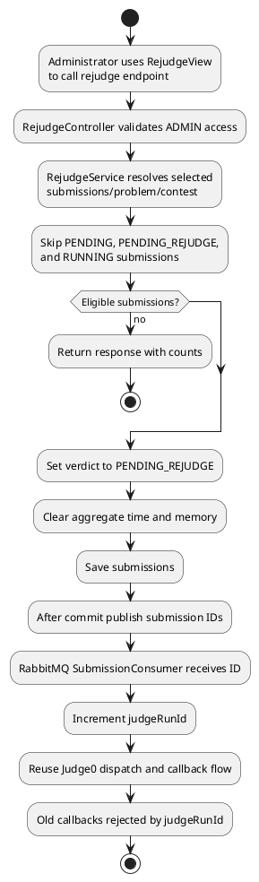

## Figure 12 - Clarification Workflow Diagram

- Report section: 5.3 Activity Diagrams for Complicated Behaviors
- Diagram type: Component interaction diagram
- Purpose: Show the implemented clarification workflow.
- Actors/components/swimlanes/entities: Team User, Administrator, Team Clarifications UI, Admin ClarificationsView, ClarificationController, ClarificationService, ClarificationRepository, Clarification SSE stream.
- What the diagram should show: Team UI submits and fetches own/public clarifications; admin UI fetches pending/all clarifications, replies publicly or privately, and both sides receive clarification SSE refresh events.
- What the diagram must NOT include: Scoreboard, submission judging, or future announcements.
- AI image-generation prompt: Create a clear workflow diagram for AuraC2 clarifications. Show Team Clarifications UI submitting questions and fetching own/public answers, Admin ClarificationsView fetching pending/all questions and sending public/private replies, ClarificationController and ClarificationService persisting to ClarificationRepository, and SSE updates refreshing both UIs.
- PlantUML:

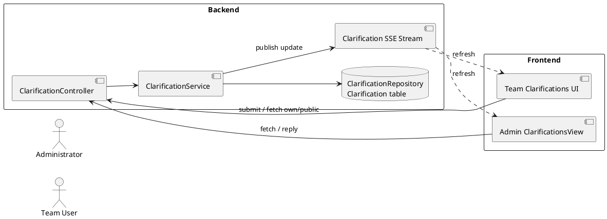

## Figure 13 - Contest Lifecycle Architecture Diagram

- Report section: 6.1 Application Architecture Design / Context Diagram
- Diagram type: Component interaction diagram
- Purpose: Show how contest lifecycle writes, events, schedulers, row locking, and SSE cooperate.
- Actors/components/swimlanes/entities: Admin UI, ContestController, ContestService, ContestLifecycleService, ContestRepository/PostgreSQL, ContestUpdatedEvent, ContestTransitionScheduler, ContestStatusSyncScheduler, ContestStatusSyncService, ContestStatusSyncExecutor, ContestStreamBroadcaster, Browser SSE clients.
- What the diagram should show: Admin creates/changes contest, service saves and publishes event, transactional listeners run after commit, exact-time scheduler reschedules/cancels tasks, fallback sync runs periodically, executor locks row and syncs persisted state, broadcaster sends SSE update.
- What the diagram must NOT include: Submission queue or Judge0 callback internals.
- AI image-generation prompt: Create a clean architecture diagram for AuraC2 contest lifecycle. Show Admin React UI, ContestController, ContestService, ContestLifecycleService, ContestRepository/PostgreSQL, ContestUpdatedEvent, ContestTransitionScheduler, ContestStatusSyncScheduler, ContestStatusSyncService, ContestStatusSyncExecutor, and ContestStreamBroadcaster. Label manual transitions, auto transitions, row lock, event after commit, and SSE contest-update to browsers.
- PlantUML:

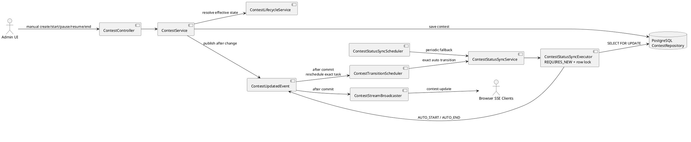

## Figure 14 - Submission and Asynchronous Judging Architecture Diagram

- Report section: 6.1 Application Architecture Design / Context Diagram
- Diagram type: Architecture flow diagram
- Purpose: Show submission persistence, after-commit RabbitMQ publishing, Judge0 dispatch with signed callback URL, callback verification, and final result persistence.
- Actors/components/swimlanes/entities: Team UI, SubmissionController, SubmissionService, SubmissionRepository/PostgreSQL, SubmissionProducer, RabbitMQ, SubmissionConsumer, TestCaseRepository, LanguageMapper, Judge0Service, Judge0CallbackSignatureService, Judge0 API, CallbackHandler, Judge0CallbackService, SubmissionJudgeResult.
- What the diagram should show: Submission request, save PENDING row, publish submissionId only after commit, consume message, lock/claim submission, map language, increment judgeRunId, mark RUNNING, fetch test cases, send each test to Judge0 with signed callback URL, callback verifies signature, persists per-case result idempotently, aggregate final verdict.
- What the diagram must NOT include: Contest lifecycle scheduler details or frontend admin screens.
- AI image-generation prompt: Create a technical architecture diagram for AuraC2 asynchronous judging. Show Team React UI submitting code to SubmissionController and SubmissionService, PostgreSQL storing a PENDING Submission, SubmissionProducer publishing submissionId to RabbitMQ submissionQueue after commit, SubmissionConsumer consuming it with a row lock, fetching test cases, LanguageMapper, Judge0Service and Judge0CallbackSignatureService sending one request per test case to Judge0 with signed callback URL, Judge0 calling CallbackHandler, CallbackHandler verifying signature, Judge0CallbackService storing SubmissionJudgeResult rows idempotently and updating final Submission verdict. Label judgeRunId, testCaseNumber, and signature.
- PlantUML:

```plantuml
@startuml
left to right direction
actor "Team UI" as Team
component "SubmissionController" as SC
component "SubmissionService" as SS
database "PostgreSQL\nSubmissionRepository" as DB
queue "RabbitMQ\nsubmissionQueue" as MQ
component "SubmissionConsumer" as Consumer
component "TestCaseRepository" as TCR
component "LanguageMapper" as LM
component "Judge0Service" as J0S
component "Judge0CallbackSignatureService" as Sig
cloud "Judge0 API" as J0
component "CallbackHandler" as CB
component "Judge0CallbackService" as CBS
database "SubmissionJudgeResult" as Results
Team --> SC : POST /api/submissions
SC --> SS
SS --> DB : save PENDING submission
SS --> MQ : after commit\npublish submissionId
MQ --> Consumer : consume submissionId
Consumer --> DB : lock, increment judgeRunId\nmark RUNNING
Consumer --> TCR : fetch test cases
Consumer --> LM : map language
Consumer --> J0S : dispatch each test case
J0S --> Sig : sign submissionId,\njudgeRunId, testCaseNumber
J0S --> J0 : source, stdin,\nexpected output, signed callback URL
J0 --> CB : callback with submissionId,\njudgeRunId, testCaseNumber,\nsignature
CB --> Sig : verify signature
CB --> CBS
CBS --> Results : save per-case result\nidempotently
CBS --> DB : aggregate final verdict
@enduml
```

## Figure 15 - Current ER Diagram

- Report section: 6.2 Data Architecture Design
- Diagram type: ER diagram
- Purpose: Represent the current persistent model accurately.
- Actors/components/swimlanes/entities: User, RefreshToken, Contest, Problem, TestCase, Clarification, Submission, SubmissionJudgeResult.
- What the diagram should show: One User to many RefreshToken; Contest to many Problem; Problem to many TestCase; User/Contest/Problem to Submission; Submission to many SubmissionJudgeResult; Contest/User/optional Problem/admin User to Clarification.
- What the diagram must NOT include: Scoreboard, SecurityAlert, Team entity, contest-membership table, Announcement entity, unless added in future code.
- AI image-generation prompt: Create a readable ER diagram for the current AuraC2 database. Entities: User, RefreshToken, Contest, Problem, TestCase, Clarification, Submission, SubmissionJudgeResult. Show primary keys, important fields, and cardinalities. Emphasize that Team is represented by User.role = TEAM. Do not include future-only tables such as Scoreboard, SecurityAlert, Announcement, or ContestMembership.
- PlantUML:

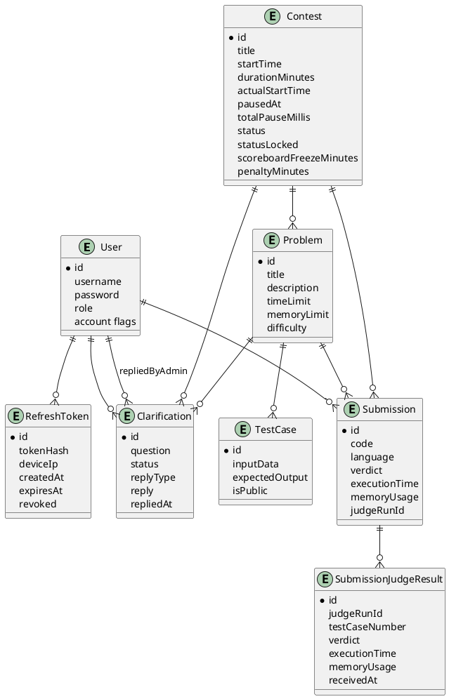

## Figure 16 - Submission Judging Mini ER Diagram

- Report section: 6.2 Data Architecture Design
- Diagram type: Mini ER diagram
- Purpose: Focus on per-test-case result tracking and rejudge.
- Actors/components/swimlanes/entities: Submission, SubmissionJudgeResult, Problem, TestCase.
- What the diagram should show: Submission has `judgeRunId`; each result has `judgeRunId`, `testCaseNumber`, verdict, time, memory; unique constraint on `(submission_id, judge_run_id, test_case_number)`; TestCase is not directly referenced by foreign key.
- What the diagram must NOT include: User account or contest lifecycle details unless needed for foreign-key context.
- AI image-generation prompt: Create a focused mini ER diagram for AuraC2 judging. Show Submission linked to Problem and many SubmissionJudgeResult rows. Highlight judgeRunId on Submission and SubmissionJudgeResult, testCaseNumber, verdict, executionTime, memoryUsage, and the unique constraint submission_id + judge_run_id + test_case_number. Show TestCase under Problem and note that judge result stores testCaseNumber rather than a direct TestCase foreign key.
- PlantUML:

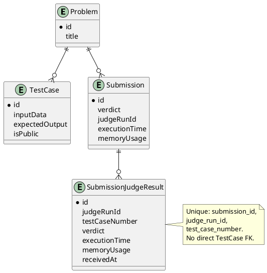

## Figure 17 - Relational Schema Diagram

- Report section: 6.2 Data Architecture Design
- Diagram type: Logical database schema diagram
- Purpose: Provide implementation-level table names and important columns.
- Actors/components/swimlanes/entities: `users`, `refresh_tokens`, `contests`, `problems`, `test_cases`, `clarifications`, `submissions`, `submission_judge_results`.
- What the diagram should show: Tables, primary keys, foreign keys, enum-as-string fields, and unique constraints.
- What the diagram must NOT include: Unimplemented tables such as scoreboard, announcements, security alerts, or contest membership.
- AI image-generation prompt: Create a relational schema diagram for AuraC2 using actual table names: users, refresh_tokens, contests, problems, test_cases, clarifications, submissions, submission_judge_results. Show primary keys, foreign keys, enum string fields, and unique constraints such as users.username and submission_judge_results submission_id plus judge_run_id plus test_case_number. Keep the diagram compact and readable.
- PlantUML:

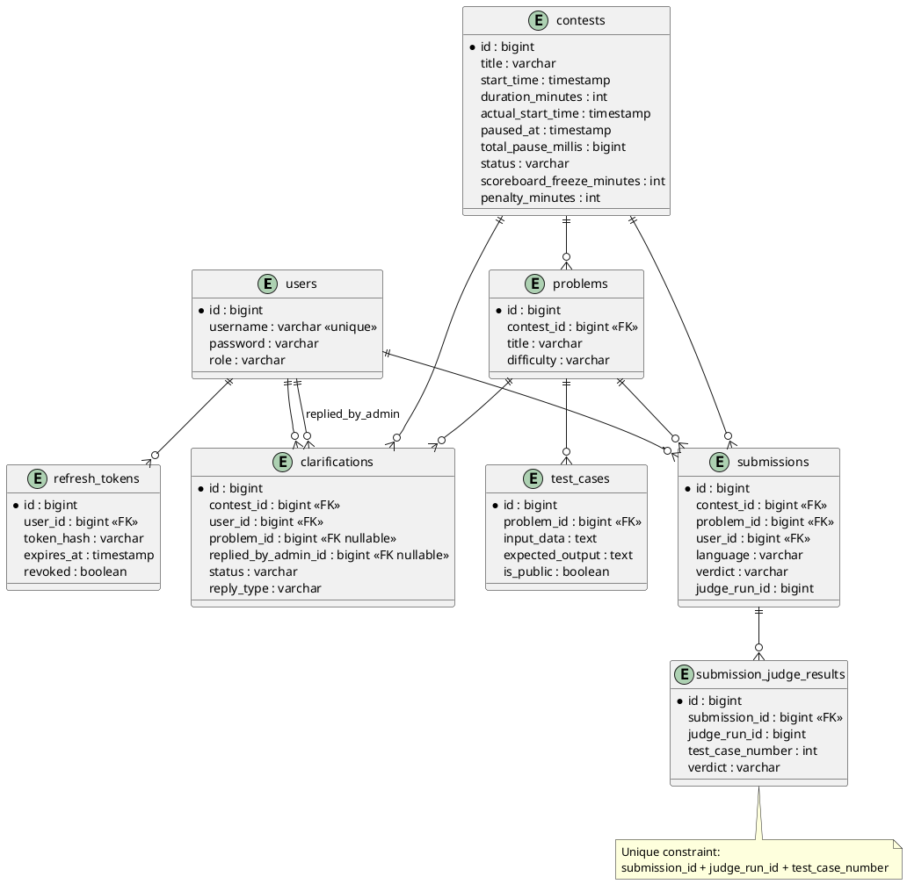
