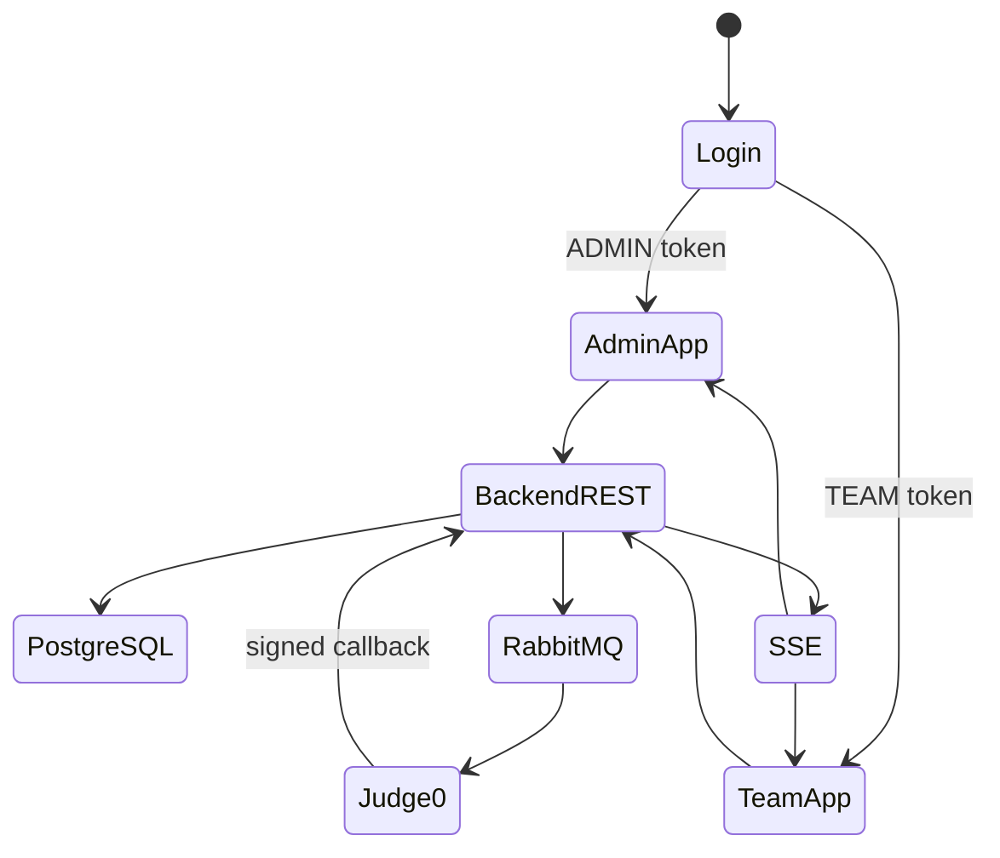
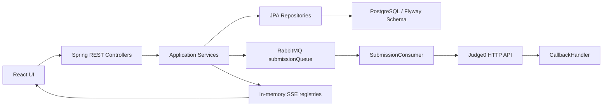
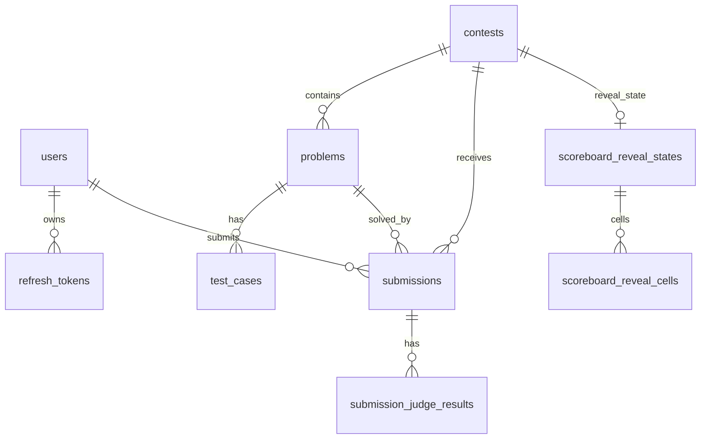

# System Analysis Packet: System Overview

## 1. Scope

This packet covers the current local AuraC2 implementation at project level: backend module layout, frontend layout, infrastructure dependencies, Flyway migrations, RabbitMQ, Judge0, SSE, and feature classification based on inspected code. It intentionally excludes deep per-flow details that are covered in packets 01-15.

## 2. Local Inspection Summary

* Current working directory: `C:\Users\user\Desktop\AuraC2`
* Git branch if available: `main...origin/main`
* Git status summary before packet writing: `.env`, `UI/src/admin/components/TeamsView.tsx`, `UI/src/admin/types/api.ts`, and `admin-account.txt` were already modified or untracked outside this documentation task.
* Important searched folders: `backend/src/main/java`, `backend/src/main/resources`, `backend/src/test`, `UI/src`.
* Tests were inspected by file listing and targeted searches. Tests were not run.

## 3. Files Inspected

| File path | Purpose in this subsystem | Why it matters |
| --------- | ------------------------- | -------------- |
| `backend/pom.xml` | Backend build and dependency declaration | Proves Spring Boot, JPA, Flyway, AMQP, PostgreSQL, JWT stack |
| `backend/src/main/resources/application.yml` | Runtime configuration | Proves PostgreSQL, RabbitMQ, Judge0, JWT, scheduler, bootstrap defaults |
| `backend/src/main/java/com/server/contestControl` | Backend source root | Shows modular-monolith package structure |
| `backend/src/main/resources/db/migration` | Flyway migrations | Defines actual schema authority |
| `UI/package.json` | Frontend build and dependency declaration | Proves React/Vite/TypeScript and SSE client library |
| `UI/src/App.tsx` | Frontend root role router | Proves ADMIN/TEAM app split |
| `UI/src/admin/App.tsx` | Admin app shell | Shows admin views and route mapping |
| `UI/src/team/App.tsx` | Team app shell | Shows contest-state landing/workspace gate |
| `UI/src/hooks` | SSE and draft hooks | Shows live-update client behavior |

## 4. Main Components

| Component | Path | Type | Responsibility | Important methods/functions |
| --------- | ---- | ---- | -------------- | --------------------------- |
| Auth server package | `backend/src/main/java/com/server/contestControl/authServer` | Backend module | Users, roles, JWT, refresh tokens, bootstrap admin | `SecurityConfiguration.securityFilterChain`, `JwtAuthFilter.doFilterInternal` |
| Contest server package | `backend/src/main/java/com/server/contestControl/contestServer` | Backend module | Contests, problems, test cases, clarifications, oracle, scoreboard, moderation | `ContestService`, `ProblemService`, `ScoreboardService`, `ContestTeamModerationService` |
| Submission server package | `backend/src/main/java/com/server/contestControl/submissionServer` | Backend module | Official submissions, RabbitMQ, Judge0, callbacks, rejudge, run lab | `SubmissionService.submitCode`, `SubmissionConsumer.handleSubmission`, `Judge0CallbackService.handleJudge0Callback` |
| Shared SSE package | `backend/src/main/java/com/server/contestControl/shared/sse` | Backend support module | Emitter registry and heartbeat | `SseEmitterRegistry.register`, `SseHeartbeatScheduler.heartbeat` |
| Flyway migrations | `backend/src/main/resources/db/migration` | SQL schema | Database schema versioning | `V1__baseline_schema.sql` through `V11__admin_run_lab_audit_fields.sql` |
| Admin React app | `UI/src/admin` | Frontend module | Admin console | `AdminApp`, `TeamsView`, `ProblemsView`, `ScoreboardView` |
| Team React app | `UI/src/team` | Frontend module | Contestant workspace | `TeamApp`, `TeamWorkspace`, `CodeEditor` |
| Frontend hooks | `UI/src/hooks` | Frontend support | SSE reconnect, scoreboard gap detection, code drafts | `useContestStream`, `useSubmissionStream`, `useScoreboardStream`, `useClarificationStream` |

## 5. Entry Points

| Entry point | Trigger | File/class | Method/function | Auth/role requirement | Request/response model |
| ----------- | ------- | ---------- | --------------- | --------------------- | ---------------------- |
| REST auth | Browser login/refresh/logout/register | `AuthController` | `login`, `refreshToken`, `logout`, `register` | Login/refresh/logout public; register ADMIN | `LoginRequest`, `LoginResponse`, `RefreshResponse`, `RegisterRequest` |
| REST contest | Admin/manual state and public state probes | `ContestController` | create/update/start/pause/resume/end/get active/upcoming/paused/ended | Mutations ADMIN; state probes public | `ContestRequest`, `ContestResponse` |
| REST problems/testcases | Admin CRUD and team reads | `ProblemController`, `TestCaseController` | CRUD/list/sample endpoints | Admin for mutations, TEAM/ADMIN for reads | `ProblemResponse`, `TestCaseResponse` |
| REST submissions | Team official submit/history, admin submissions | `SubmissionController`, `AdminController` | `submit`, `getMy`, `getAllSubmissions` | TEAM/ADMIN | `SubmissionRequest`, `SubmissionResponse` |
| RabbitMQ consumer | Message on `submissionQueue` | `SubmissionConsumer` | `handleSubmission` | Internal queue | Submission id |
| Judge0 callback | Judge0 HTTP PUT | `CallbackHandler` | `handleJudge0Callback` | Public path plus HMAC signature | `Judge0Response` |
| SSE streams | Browser stream connect | Stream controllers | `stream` methods | Admin/team/public depending endpoint | `SseEmitter` named events |
| Schedulers | Spring scheduling/application ready | contest schedulers, heartbeat | `syncAllEligibleContests`, `heartbeat`, `onApplicationReady` | Internal | None |

## 6. Runtime Flow

1. The browser loads `UI/src/App.tsx`, reads `access_token` from local storage, decodes role from JWT claims, and mounts either `AdminApp` or `TeamApp`. If no access token exists, it calls `/auth/refresh` using the HttpOnly refresh cookie.
2. Backend HTTP security is stateless. `SecurityConfiguration.securityFilterChain` permits public and callback routes, restricts `/api/admin/**` to ADMIN, `/api/team/**` to TEAM, and attaches `JwtAuthFilter`.
3. Admins create contests/problems/test cases and team accounts through REST controllers. Data persists through JPA repositories into the Flyway-managed PostgreSQL schema.
4. Team official submissions call `SubmissionService.submitCode`, which validates active contest/problem/moderation, saves a `Submission`, and after commit publishes its id to RabbitMQ.
5. `SubmissionConsumer.handleSubmission` locks the submission row, marks it RUNNING, and dispatches one asynchronous Judge0 request per official test case. Callback URLs include submission id, judgeRunId, test case number, and HMAC signature.
6. Judge0 callbacks enter `CallbackHandler`, signature verification gates `Judge0CallbackService`, and the service records per-test results, rejects stale/duplicate callbacks, aggregates final verdict, and emits finalization events after commit.
7. Scoreboard, submission, clarification, and contest updates use in-memory SSE registries. The frontend uses `@microsoft/fetch-event-source` with bearer headers, watchdogs, retry backoff, and refresh-on-401.
8. Contest lifecycle has both effective-state reads and persisted-state sync. Exact-time scheduling and periodic fallback synchronize eligible contests with row locks.

## 7. Code Evidence

### Evidence: Backend dependencies

Path: `backend/pom.xml`

```xml
<artifactId>spring-boot-starter-data-jpa</artifactId>
<artifactId>flyway-core</artifactId>
<artifactId>postgresql</artifactId>
<artifactId>spring-boot-starter-amqp</artifactId>
<artifactId>jjwt-api</artifactId>
```

This proves:

* Backend uses Spring Data JPA, Flyway, PostgreSQL, RabbitMQ/AMQP, and JWT libraries.
* The schema should be grounded in JPA entities plus Flyway SQL, not README prose.

### Evidence: Infrastructure defaults

Path: `backend/src/main/resources/application.yml`

```yaml
spring:
  datasource:
    url: ${DB_URL:jdbc:postgresql://localhost:5432/authserver}
  rabbitmq:
    host: ${RABBITMQ_HOST:localhost}
judge0:
  url: ${JUDGE0_URL:https://ce.judge0.com/submissions?wait=false}
  callback-url: ${JUDGE0_CALLBACK_URL:http://localhost:8080/api/callback/judge0}
```

This proves:

* Local runtime expects PostgreSQL and RabbitMQ.
* Judge0 is configured as an external HTTP integration with a callback base URL.

### Evidence: Frontend role split

Path: `UI/src/App.tsx`

```tsx
const role: Role = useMemo(
  () => (token ? decodeJwtRole(token) : "UNKNOWN"),
  [token]
);

if (!token) return <LoginPage onLoginSuccess={onLoginSuccess} />;
if (role === "UNKNOWN") return <LoginPage onLoginSuccess={onLoginSuccess} />;

return role === "ADMIN"
  ? <AdminApp onLogout={onLogout} />
  : <TeamApp onLogout={onLogout} />;
```

This proves:

* The SPA has a root ADMIN/TEAM split driven by access-token claims.
* There is no React-router server route guard; the app conditionally mounts role apps.

## 8. Data Model

| Model | Type | Path | Important fields | Relationships/constraints | Runtime meaning |
| ----- | ---- | ---- | ---------------- | ------------------------- | --------------- |
| `User` | JPA entity | `authServer/entity/User.java` | `username`, `password`, account flags, `role` | Unique username; one-to-many refresh tokens | Login identity and role authority source |
| `RefreshToken` | JPA entity | `authServer/entity/RefreshToken.java` | `tokenHash`, `revoked`, `expiresAt`, `user` | FK user; token/user indexes | Persistent refresh-token rotation and revocation |
| `Contest` | JPA entity | `contestServer/entity/Contest.java` | `status`, `statusLocked`, `startTime`, `actualStartTime`, `totalPauseMillis`, `scoreboardFreezeMinutes`, `penaltyMinutes` | Problems child collection | Contest clock, lifecycle, scoring settings |
| `Problem` | JPA entity | `contestServer/entity/Problem.java` | statement fields, compare policy, validator fields | FK contest; test cases child collection | Problem definition and judging policy |
| `TestCase` | JPA entity | `contestServer/entity/TestCase.java` | `inputData`, `expectedOutput`, `isPublic` | FK problem | Official samples and hidden tests |
| `Submission` | JPA entity | `submissionServer/entity/Submission.java` | `code`, `language`, `verdict`, `judgeRunId` | FK contest/problem/user | Official scoring attempt |
| `SubmissionJudgeResult` | JPA entity | `submissionServer/entity/SubmissionJudgeResult.java` | `judgeRunId`, `testCaseNumber`, verdict, Judge0 status, diagnostic | Unique submission/run/case | Idempotent callback result record |
| `ScoreboardRevealState/Cell` | JPA entities | `contestServer/scoreboard/entity` | reveal status, cell reveal order, revealed flag | Contest unique state; cell unique state/team/problem | Freeze reveal workflow |
| `Clarification` | JPA entity | `contestServer/entity/Clarification.java` | question, reply, status, replyType | FK contest/problem/user/admin | Contest Q&A |
| Oracle entities | JPA entities | `contestServer/oracle/entity` | program source/hash, batch status, generated tests, counterexamples | FKs problem/user/submission/testcase | Admin-generated candidate test workflow |
| Moderation entities | JPA entities | `contestServer/moderation/entity` | team status, hidden/submit/run flags, audit JSON | Unique contest/team; audit indexes | Contest-scoped team sanctions and audit |

## 9. Security and Authorization

* Public endpoints include `/auth/login`, `/auth/refresh`, `/auth/logout`, Judge0 callback routes, public contest status probes, public scoreboard routes, and public answered clarifications.
* ADMIN endpoints include `/api/admin/**`, contest mutations, problem/testcase mutations, oracle, rejudge, moderation, Run Lab, and admin SSE streams.
* TEAM endpoints include `/api/team/**`, official submissions, problem reads, sample reads, clarification submit/my views, and team stream.
* Method-level security is enabled in `SecurityConfiguration` through `@EnableMethodSecurity`, and many controllers also declare `@PreAuthorize`.
* Sensitive boundaries: refresh token is HttpOnly cookie path `/auth`; access token is held in browser local storage; admin source export endpoints reveal oracle/custom validator sources only to ADMIN.

## 10. Transactions and Consistency

* Core writes use `@Transactional` services: auth refresh/login, contest create/update/status, problem/testcase CRUD, submissions, callbacks, rejudge, oracle, moderation, scoreboard reveal.
* Contest auto-sync uses `REQUIRES_NEW` and pessimistic row locking in `ContestStatusSyncExecutor.syncContestStatus`.
* Submission and rejudge publish RabbitMQ messages after transaction commit using `TransactionSynchronization`.
* Callback finalization publishes SSE and scoreboard events after commit. Some consumer failure paths publish inside the queue transaction; see packet 15.
* No outbox table was found; RabbitMQ/SSE publish failures after DB commit are logged but not persisted for retry.

## 11. Async / Events / Queues / SSE

* RabbitMQ queue: `submissionQueue`, exchange `submissionExchange`, routing key `submission.submit`.
* Unused/scaffolded queue: `resultQueue` plus empty `ResultProducer`/`ResultConsumer`.
* SSE registries are in-memory: contest, team, submission, clarification, scoreboard.
* Heartbeat sends named `ping` every 15 seconds.
* Contest lifecycle emits `ContestUpdatedEvent`; submissions emit `SubmissionFinalizedEvent` and `SubmissionRejudgeQueuedEvent`; clarifications emit created/replied events.
* Single-node limitation: no distributed event bus or persistent replay was found for SSE.

## 12. State Transitions

| From | To | Trigger | Code location | Guard/validation |
| ---- | -- | ------- | ------------- | ---------------- |
| no token | login | Login form | `AuthController.login` | Password match |
| UPCOMING | RUNNING | manual start or auto sync | `ContestService.updateStatus`, `ContestStatusSyncExecutor.syncContestStatus` | valid transition, no other persisted RUNNING for manual start |
| RUNNING | PAUSED | manual pause | `ContestService.updateStatus` | valid transition |
| PAUSED | RUNNING | manual resume | `ContestService.updateStatus` | accumulates pause duration |
| RUNNING | ENDED | auto end or manual end | `ContestStatusSyncExecutor`, `ContestService.updateStatus` | effective end reached unless jury override |
| PENDING | RUNNING | queue consumer | `SubmissionConsumer.handleSubmission` | verdict queueable and test cases exist |
| RUNNING | final verdict | Judge0 callbacks | `Judge0CallbackService.handleJudge0Callback` | all terminal callbacks recorded |
| ACTIVE | DISQUALIFIED | admin moderation | `ContestTeamModerationService.applyAction` | reason required |



## 13. Mermaid Skeletons





## 14. Tests

| Test file | What it verifies | Important test methods | Missing coverage |
| --------- | ---------------- | ---------------------- | ---------------- |
| `backend/src/test/java/com/server/contestControl/persistence/SchemaMigrationDefinitionTest.java` | Migration definition expectations | See file for methods | Full DB integration not confirmed in this run |
| `backend/src/test/java/com/server/contestControl/authServer/security/RouteAuthorizationSecurityTest.java` | Route authorization | See file for methods | Not run here |
| `backend/src/test/java/com/server/contestControl/contestServer/service/ContestServiceTest.java` | Contest service behavior | See file for methods | Not run here |
| `backend/src/test/java/com/server/contestControl/submissionServer/queue/submission/SubmissionConsumerTest.java` | Queue consumer behavior | See file for methods | Not run here |
| `UI/src/hooks/useScoreboardStream.test.tsx` | Scoreboard SSE hook behavior | Hook test methods | Only scoreboard hook tests found, not all SSE hooks |

## 15. Edge Cases

| Edge case | Code location | Current behavior | Risk level |
| --------- | ------------- | ---------------- | ---------- |
| RabbitMQ unavailable after submission commit | `SubmissionService.publishSubmission` | Logs error after DB commit; no retry/outbox | High |
| SSE server restart | `SseEmitterRegistry`, `ScoreboardSseAdapter` | In-memory emitters/snapshots lost | Medium |
| Multiple app nodes | all SSE registries, `ScoreboardVersionService` | No cross-node fanout or shared version state found | High |
| Contest effective state not persisted yet | `ContestLifecycleService`, `ContestStatusSyncExecutor` | Reads can treat state as RUNNING/ENDED before scheduler sync | Medium |
| Public endpoint scope | `SecurityConfiguration`, `JwtAuthFilter` | Public scoreboard and answered clarifications are permitted | Low if intended |

## 16. Risks / Weaknesses / Gaps

* No durable outbox for RabbitMQ or SSE event publishing.
* Result queue classes exist but are empty/scaffolded.
* In-memory SSE and scoreboard versioning limit horizontal scaling.
* `application.yml` contains development defaults and sensitive-looking mail/JWT/Judge0 defaults that should be externalized in deployment.
* Some comments/docs in code are helpful but not implementation truth; behavior is grounded here in methods/entities/migrations.
* Tests were inspected but not executed during this packet generation.

## 17. Final Evidence Table

| Claim | Evidence path | Class/method/field | Confidence |
| ----- | ------------- | ------------------ | ---------- |
| Backend is a Spring Boot modular monolith | `backend/pom.xml`, `backend/src/main/java/com/server/contestControl` | package structure plus Spring Boot dependencies | Strong |
| Database schema is Flyway-managed PostgreSQL | `application.yml`, `backend/src/main/resources/db/migration` | Flyway config and migrations | Strong |
| RabbitMQ is used for official submission dispatch | `RabbitMQConfig`, `SubmissionProducer`, `SubmissionConsumer` | `SUBMISSION_QUEUE`, `sendSubmission`, `@RabbitListener` | Strong |
| Judge0 callback flow exists | `CallbackHandler`, `Judge0Service`, `Judge0CallbackService` | signed callback URL and callback handler | Strong |
| SSE is in-memory and single-node unless otherwise deployed | `SseEmitterRegistry` | in-memory lists/maps | Strong |
| Result queue is scaffolded/unused | `ResultProducer`, `ResultConsumer`, `RabbitMQConfig` | empty producer/consumer plus configured queue | Strong |
