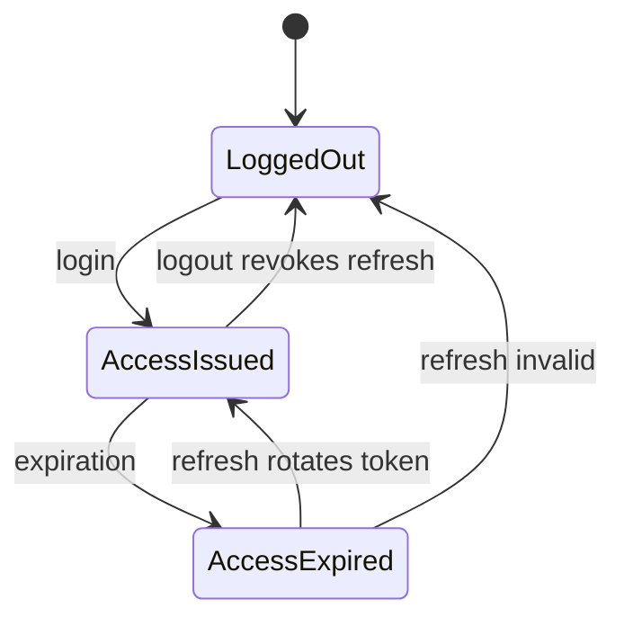
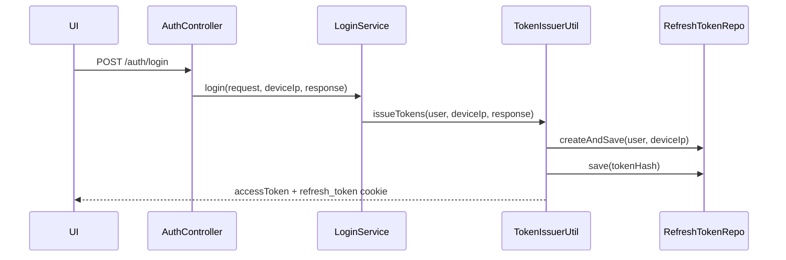
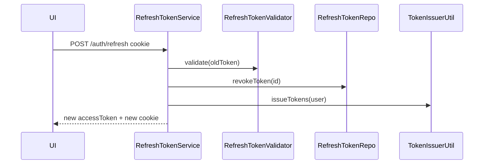

# System Analysis Packet: Auth and Session

## 1. Scope

This packet covers login, admin-protected team registration, JWT validation, access-token authority mapping, refresh-token persistence and rotation, logout revocation, refresh cookie configuration, bootstrap admin creation, and the local/test `no-security` guard. It excludes frontend role routing except where token claims are consumed; packet 14 covers routing.

## 2. Local Inspection Summary

* Current working directory: `C:\Users\user\Desktop\AuraC2`
* Git branch if available: `main...origin/main`
* Git status summary: pre-existing local changes were present in `.env`, `UI/src/admin/components/TeamsView.tsx`, `UI/src/admin/types/api.ts`, and `admin-account.txt`; packet files are new documentation outputs.
* Important searched folders: `backend/src/main/java/com/server/contestControl/authServer`, `backend/src/test/java/com/server/contestControl/authServer`, `UI/src/auth`, `UI/src/services`.
* Tests inspected: auth/security-related tests were listed and searched. Tests were not run.

## 3. Files Inspected

| File path | Purpose in this subsystem | Why it matters |
| --------- | ------------------------- | -------------- |
| `backend/src/main/java/com/server/contestControl/authServer/config/SecurityConfiguration.java` | HTTP security rules | Defines public/admin/team/authenticated boundaries |
| `backend/src/main/java/com/server/contestControl/authServer/filter/JwtAuthFilter.java` | Bearer token authentication | Validates access JWT and populates Spring Security context |
| `backend/src/main/java/com/server/contestControl/authServer/controller/AuthController.java` | Auth REST entry points | Exposes register/login/refresh/logout |
| `backend/src/main/java/com/server/contestControl/authServer/service/login/LoginService.java` | Password login | Issues tokens after password verification |
| `backend/src/main/java/com/server/contestControl/authServer/service/register/RegistrationService.java` | Team/admin registration service | Creates users and enforces single admin behavior |
| `backend/src/main/java/com/server/contestControl/authServer/service/refreshToken/RefreshTokenService.java` | Refresh endpoint service | Validates, revokes, rotates refresh token |
| `backend/src/main/java/com/server/contestControl/authServer/service/refreshToken/RefreshTokenValidator.java` | Refresh-token validation | Checks JWT, persisted hash, revocation, ownership |
| `backend/src/main/java/com/server/contestControl/authServer/service/logout/LogoutService.java` | Logout service | Revokes refresh token and clears cookie |
| `backend/src/main/java/com/server/contestControl/authServer/entity/User.java` | User model | Provides authorities |
| `backend/src/main/java/com/server/contestControl/authServer/entity/RefreshToken.java` | Refresh token model | Persists refresh hash/revocation/expiry |
| `backend/src/main/java/com/server/contestControl/authServer/util/TokenIssuerUtil.java` | Token issuing helper | Creates refresh entity, hashes refresh token, writes cookie |
| `backend/src/main/java/com/server/contestControl/authServer/util/CookieUtil.java` | Cookie helper | Defines refresh cookie path/security flags |
| `backend/src/main/java/com/server/contestControl/authServer/startup/AdminBootstrapRunner.java` | Startup admin bootstrap | Creates or resets one admin and writes credentials file |
| `backend/src/main/java/com/server/contestControl/authServer/config/NoSecurityProfileGuard.java` | Safety guard | Blocks no-security profile except dev/local/test |
| `UI/src/auth/jwt.ts` | Frontend JWT decoder | Shows frontend reads `authorities` claim |

## 4. Main Components

| Component | Path | Type | Responsibility | Important methods/functions |
| --------- | ---- | ---- | -------------- | --------------------------- |
| `SecurityConfiguration` | `authServer/config/SecurityConfiguration.java` | Config | Stateless security, route rules, method security | `securityFilterChain` |
| `JwtAuthFilter` | `authServer/filter/JwtAuthFilter.java` | Filter | Skip public paths, validate access token, set authentication | `doFilterInternal` |
| `AuthController` | `authServer/controller/AuthController.java` | REST controller | Register/login/refresh/logout endpoints | `register`, `login`, `refreshToken`, `logout` |
| `AuthFacade` | `authServer/service/auth/AuthFacade.java` | Service facade | Orchestrates auth services | `login`, `refreshToken`, `logout`, `registerTeam` |
| `LoginService` | `authServer/service/login/LoginService.java` | Service | Password check and token issue | `login` |
| `RegistrationService` | `authServer/service/register/RegistrationService.java` | Service | User creation | `registerTeam`, `register` |
| `RefreshTokenService` | `authServer/service/refreshToken/RefreshTokenService.java` | Service | Rotate refresh token | `refresh` |
| `RefreshTokenValidator` | `authServer/service/refreshToken/RefreshTokenValidator.java` | Service | Refresh JWT and DB validation | `validate` |
| `LogoutService` | `authServer/service/logout/LogoutService.java` | Service | Revoke refresh token and clear cookie | `logout` |
| `JwtService` and strategies | `authServer/service/jwt` | Service | Access/refresh token generation and validation | `generateToken`, `extractUsername`, `isTokenValid` |
| `User` | `authServer/entity/User.java` | Entity | Spring `UserDetails`, role authorities | `getAuthorities` |
| `RefreshToken` | `authServer/entity/RefreshToken.java` | Entity | Refresh-token persistence | `tokenHash`, `revoked`, `expiresAt` |
| `AdminBootstrapRunner` | `authServer/startup/AdminBootstrapRunner.java` | Startup runner | Ensures admin account | `run` |
| `NoSecurityProfileGuard` | `authServer/config/NoSecurityProfileGuard.java` | Startup guard | Prevents unsafe no-security use | `validate` |

## 5. Entry Points

| Entry point | Trigger | File/class | Method/function | Auth/role requirement | Request/response model |
| ----------- | ------- | ---------- | --------------- | --------------------- | ---------------------- |
| `POST /auth/login` | Login form | `AuthController` | `login` | Public | `LoginRequest` -> `LoginResponse` plus refresh cookie |
| `POST /auth/refresh` | UI boot/401 retry | `AuthController` | `refreshToken` | Public cookie route | `RefreshResponse` plus new refresh cookie |
| `POST /auth/logout` | UI logout | `AuthController` | `logout` | Public cookie route | `LogoutResponse` and cleared cookie |
| `POST /auth/register` | Admin create team | `AuthController` | `register` | `hasRole('ADMIN')` | `RegisterRequest` -> `RegisterResponse` |
| JWT filter | Any protected HTTP request | `JwtAuthFilter` | `doFilterInternal` | Protected route dependent | Bearer access token |
| Startup runner | Application start | `AdminBootstrapRunner` | `run` | Internal | Writes admin credentials file if needed |
| Startup guard | Application start | `NoSecurityProfileGuard` | `run`/`validate` | Internal | Fails startup on unsafe profile set |

## 6. Runtime Flow

1. Login posts username/password to `AuthController.login`.
2. `LoginService.login` loads `User` by username, verifies password through `PasswordEncoder.matches`, and calls `TokenIssuerUtil.issueTokens`.
3. `TokenIssuerUtil.issueTokens` creates a `RefreshToken` row, generates access and refresh JWTs, hashes the refresh JWT into `RefreshToken.tokenHash`, saves it, and writes `refresh_token` as an HttpOnly cookie.
4. The frontend stores only the access token in local storage. `UI/src/auth/jwt.ts` decodes role from `role`, `roles`, `authorities`, or `scope`; backend access tokens prove role through authorities.
5. Protected requests pass through `JwtAuthFilter`. It skips public/cookie/callback/static paths, extracts bearer token, validates it as `TokenType.ACCESS`, loads `UserDetails`, and sets a `UsernamePasswordAuthenticationToken`.
6. Refresh posts no body to `/auth/refresh`; `RefreshTokenService.refresh` extracts the refresh cookie, validates JWT and DB state, revokes the old token row, and issues a fresh access/refresh pair.
7. Logout posts to `/auth/logout`; the service validates the refresh cookie, revokes it if present/current, clears security context, and clears the cookie at path `/auth`.
8. Admin registration goes through `POST /auth/register`, protected by both `SecurityConfiguration` and method-level `@PreAuthorize`, and creates a TEAM user through `RegistrationService.registerTeam`.
9. On startup, `AdminBootstrapRunner` fails if more than one ADMIN exists; otherwise it creates or optionally resets exactly one admin and writes plaintext credentials to the configured file.

## 7. Code Evidence

### Evidence: `SecurityConfiguration.securityFilterChain`

Path: `backend/src/main/java/com/server/contestControl/authServer/config/SecurityConfiguration.java`

```java
@Configuration
@EnableWebSecurity
@EnableMethodSecurity
@Profile("!no-security")
public class SecurityConfiguration {
    @Bean
    public SecurityFilterChain securityFilterChain(HttpSecurity http) throws Exception {
        http.csrf(AbstractHttpConfigurer::disable)
            .formLogin(AbstractHttpConfigurer::disable)
            .httpBasic(AbstractHttpConfigurer::disable)
            .authorizeHttpRequests(auth -> auth
                .requestMatchers("/auth/login", "/auth/refresh", "/auth/logout",
                        "/api/callback/judge0/**").permitAll()
                .requestMatchers(HttpMethod.POST, "/auth/register").hasRole("ADMIN")
                .requestMatchers("/api/admin/**").hasRole("ADMIN")
                .requestMatchers("/api/team/**").hasRole("TEAM")
                .anyRequest().authenticated())
            .sessionManagement(sess ->
                sess.sessionCreationPolicy(SessionCreationPolicy.STATELESS))
            .addFilterBefore(jwtAuthFilter, UsernamePasswordAuthenticationFilter.class);
        return http.build();
    }
}
```

This proves:

* Security is stateless and method security is enabled.
* Register is admin-only while login/refresh/logout and Judge0 callback are public.

### Evidence: `JwtAuthFilter.doFilterInternal`

Path: `backend/src/main/java/com/server/contestControl/authServer/filter/JwtAuthFilter.java`

```java
final String token = TokenExtractor.extractToken(request);
if (token == null || token.isBlank()) {
    filterChain.doFilter(request, response);
    return;
}

final String username = jwtService.extractUsername(token, TokenType.ACCESS);
UserDetails userDetails = userDetailsService.loadUserByUsername(username);

if (!jwtService.isTokenValid(token, userDetails, TokenType.ACCESS)) {
    SecurityContextHolder.clearContext();
    response.sendError(HttpServletResponse.SC_UNAUTHORIZED, "Invalid token");
    return;
}

UsernamePasswordAuthenticationToken auth =
        new UsernamePasswordAuthenticationToken(userDetails, null, userDetails.getAuthorities());
SecurityContextHolder.getContext().setAuthentication(auth);
filterChain.doFilter(request, response);
```

This proves:

* Access JWT validation is performed per protected request.
* Spring authorities come from the loaded user, not from trusting arbitrary request data.

### Evidence: `RefreshTokenService.refresh`

Path: `backend/src/main/java/com/server/contestControl/authServer/service/refreshToken/RefreshTokenService.java`

```java
@Transactional
public RefreshResponse refresh(HttpServletRequest request, HttpServletResponse response) {
    String oldToken = TokenExtractor.extractFromCookie(request);
    if (oldToken == null) throw new MissingTokenException();

    TokenValidationResult result = refreshTokenValidator.validate(oldToken);
    User user = result.user();

    refreshTokenRepoService.revokeToken(result.refreshTokenId());

    String newAccessToken = tokenIssuerUtil.issueTokens(user, request.getRemoteAddr(), response);
    return new RefreshResponse(newAccessToken);
}
```

This proves:

* Refresh is token rotation: old persisted token is revoked before a new pair is issued.
* Refresh relies on the HttpOnly cookie, not a bearer token.

### Evidence: `TokenIssuerUtil.issueTokens` and `CookieUtil`

Path: `backend/src/main/java/com/server/contestControl/authServer/util/TokenIssuerUtil.java`

```java
RefreshToken refreshEntity = refreshTokenRepoService.createAndSave(user, deviceIp);

String accessToken  = jwtService.generateToken(user, TokenType.ACCESS, null);
String refreshToken = jwtService.generateToken(user, TokenType.REFRESH, refreshEntity.getId());

refreshEntity.setTokenHash(TokenHashUtil.hash(refreshToken));
refreshTokenRepoService.save(refreshEntity);

CookieUtil.addRefreshToCookie(response, refreshToken, cookieConfig.isProd());
```

Path: `backend/src/main/java/com/server/contestControl/authServer/util/CookieUtil.java`

```java
ResponseCookie cookie = ResponseCookie.from("refresh_token", refreshToken)
        .httpOnly(true)
        .secure(isProd)
        .sameSite(isProd ? "Strict" : "Lax")
        .path("/auth")
        .maxAge(Duration.ofDays(7))
        .build();
```

This proves:

* The DB stores a hash, not the raw refresh JWT.
* The refresh cookie is HttpOnly and scoped to `/auth`.

## 8. Data Model

| Model | Type | Path | Important fields | Relationships/constraints | Runtime meaning |
| ----- | ---- | ---- | ---------------- | ------------------------- | --------------- |
| `User` | Entity | `authServer/entity/User.java` | `id`, `username`, `password`, account flags, `role` | Unique username; `idx_users_role_username`; one-to-many refresh tokens | Authentication principal and role source |
| `Role` | Enum | `authServer/enums/Role.java` | `ADMIN`, `TEAM` | Stored as string in `users.role` | Authorization categories |
| `RefreshToken` | Entity | `authServer/entity/RefreshToken.java` | `tokenHash`, `deviceIp`, `createdAt`, `expiresAt`, `revoked`, `user` | FK to user; indexes on token hash and user/revoked/expires | Refresh-token session state and revocation |
| Access JWT | Runtime token | `AccessTokenStrategy`, `JwtService` | subject username, token type, authorities | Signed by configured secret | Short-lived bearer credential |
| Refresh JWT | Runtime token | `RefreshTokenStrategy`, `JwtService` | subject username, token id, token type | Signed by refresh secret; id maps to DB row | Rotatable session credential |
| Refresh cookie | HTTP cookie | `CookieUtil` | `refresh_token`, HttpOnly, SameSite, path `/auth` | 7 day max age | Browser storage for refresh token |

## 9. Security and Authorization

* `/auth/login`, `/auth/refresh`, and `/auth/logout` are public in the filter chain and skipped by `JwtAuthFilter`.
* `/auth/register` is protected twice: route matcher requires ADMIN and method annotation has `@PreAuthorize("hasRole('ADMIN')")`.
* `/api/admin/**` is ADMIN-only; `/api/team/**` is TEAM-only; submissions and problem reads allow TEAM/ADMIN.
* Public routes skipped by `JwtAuthFilter` include public scoreboard, public clarifications, active/upcoming/paused/ended contest probes, and Judge0 callback.
* `NoSecurityProfileGuard` allows `no-security` only with `dev`, `local`, or `test`, and rejects production-like or unspecified profile combinations.
* Access token in frontend local storage increases XSS impact. Refresh token is better protected with HttpOnly cookie but still sent to `/auth` routes.

## 10. Transactions and Consistency

* `RefreshTokenService.refresh` is transactional and revokes the old refresh token before issuing the replacement.
* `LoginService.login` is transactional in inspected code; it creates a refresh token row as part of issue flow.
* `LogoutService.logout` validates the refresh token and revokes the DB row, then clears the cookie.
* `TokenIssuerUtil.issueTokens` saves a `RefreshToken` row before hashing the generated token into it, then saves again. The un-hashed interim state is inside the issuing transaction in normal service calls.
* Admin bootstrap is not annotated transactional; it uses repository operations during startup.

## 11. Async / Events / Queues / SSE

This subsystem has no RabbitMQ or SSE behavior. It has startup runners:

* `AdminBootstrapRunner` creates/resets admin credentials on application startup.
* `NoSecurityProfileGuard` fails startup on unsafe `no-security` profile use.

## 12. State Transitions

| From | To | Trigger | Code location | Guard/validation |
| ---- | -- | ------- | ------------- | ---------------- |
| No access token | Access token issued | `POST /auth/login` | `LoginService.login`, `TokenIssuerUtil.issueTokens` | Username exists and password matches |
| Refresh token active | Refresh token revoked plus new active token | `POST /auth/refresh` | `RefreshTokenService.refresh` | JWT valid, hash matches, not revoked, user owns token |
| Refresh token active | Revoked | `POST /auth/logout` | `LogoutService.logout` | Refresh cookie validates |
| No admin user | Admin user created | Application startup | `AdminBootstrapRunner.run` | `countByRole(ADMIN) == 0` |
| One admin user | Password reset or unchanged | Application startup | `AdminBootstrapRunner.handleExistingAdmin` | `resetExistingPasswordOrDefault` |



## 13. Mermaid Skeletons





## 14. Tests

| Test file | What it verifies | Important test methods | Missing coverage |
| --------- | ---------------- | ---------------------- | ---------------- |
| `authServer/controller/AuthControllerSecurityTest.java` | Auth endpoint security | Inspect file for method names | Tests not run here |
| `authServer/security/RouteAuthorizationSecurityTest.java` | Route authorization matrix | Inspect file for method names | Tests not run here |
| `authServer/filter/JwtAuthFilterTest.java` | Filter token behavior | Inspect file for method names | Tests not run here |
| `authServer/util/CookieUtilTest.java` | Cookie flags/path | Inspect file for method names | Tests not run here |
| `authServer/config/NoSecurityProfileGuardTest.java` | no-security profile guard | Inspect file for method names | Tests not run here |

## 15. Edge Cases

| Edge case | Code location | Current behavior | Risk level |
| --------- | ------------- | ---------------- | ---------- |
| Missing refresh cookie on refresh | `RefreshTokenService.refresh` | Throws `MissingTokenException` | Low |
| Logout without valid refresh cookie | `LogoutService` | Public endpoint still validates cookie; not proven idempotent | Medium |
| Multiple admins already in DB | `AdminBootstrapRunner.run` | Fails startup | Medium |
| Frontend expects `role` claim | `UI/src/auth/jwt.ts`, access token strategy | Frontend also reads `authorities`, so current token works | Low |
| Access token stored in local storage | `UI/src/auth/tokenStore.ts` | Simple localStorage persistence | Medium |

## 16. Risks / Weaknesses / Gaps

* `application.yml` contains development defaults for JWT secrets and Judge0 callback secret. Production must override them.
* `AdminBootstrapRunner` writes plaintext admin credentials to `admin-account.txt`; operational process must delete/store securely.
* Refresh cookie is HttpOnly but access token is in local storage, so XSS would expose bearer access.
* Logout appears dependent on a valid refresh cookie; an idempotent logout behavior was not proven.
* No refresh token cleanup job was found in inspected code; expired/revoked rows may accumulate unless handled elsewhere.

## 17. Final Evidence Table

| Claim | Evidence path | Class/method/field | Confidence |
| ----- | ------------- | ------------------ | ---------- |
| Register is admin-protected | `SecurityConfiguration.java`, `AuthController.java` | `POST /auth/register`, `@PreAuthorize` | Strong |
| Access JWT drives Spring Security context | `JwtAuthFilter.java` | `doFilterInternal` | Strong |
| Refresh token rotation persists/revokes DB token | `RefreshTokenService.java`, `RefreshToken.java` | `refresh`, `revoked`, `tokenHash` | Strong |
| Refresh cookie path is `/auth` | `CookieUtil.java` | `REFRESH_COOKIE_PATH` | Strong |
| A startup bootstrap admin exists | `AdminBootstrapRunner.java` | `run`, `writeCredentialsFile` | Strong |
| no-security profile is guarded | `NoSecurityProfileGuard.java` | `validate` | Strong |
