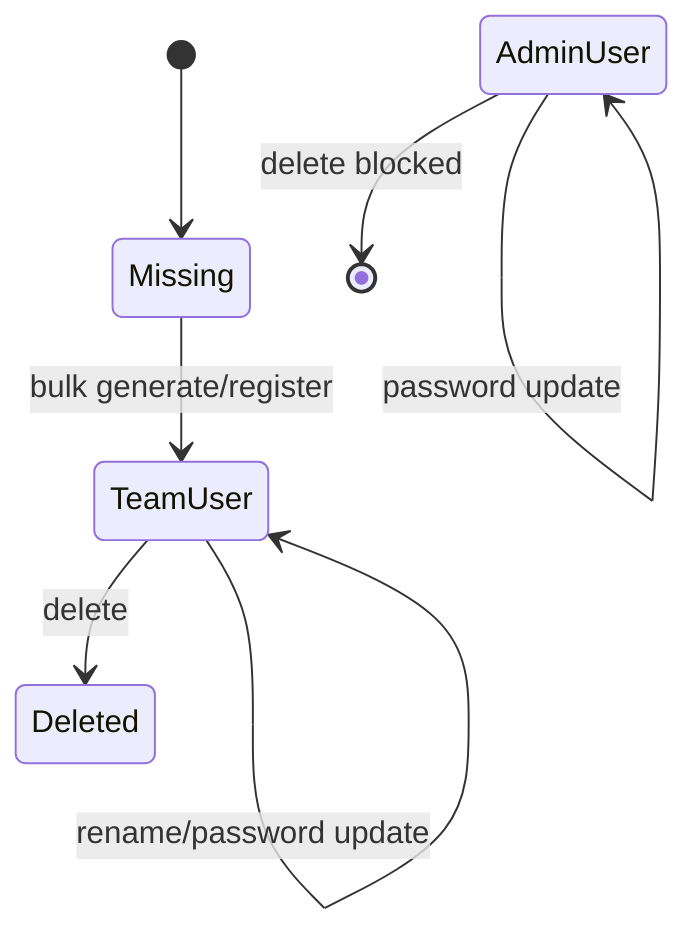
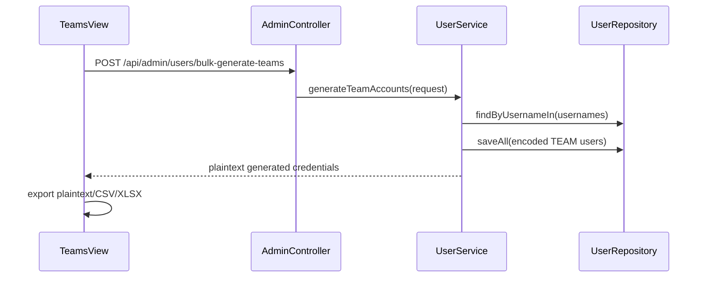

# System Analysis Packet: User, Team, and Admin Management

## 1. Scope

This packet covers admin user management APIs, global team account behavior, bulk team generation, password handling, plaintext credential export in the admin UI, admin deletion protection, and related tests. It excludes authentication session mechanics, which are covered in packet 01, and contest-scoped team moderation, which is covered in packet 12.

## 2. Local Inspection Summary

* Current working directory: `C:\Users\user\Desktop\AuraC2`
* Git branch if available: `main...origin/main`
* Git status summary: pre-existing local changes were present in `.env`, `UI/src/admin/components/TeamsView.tsx`, `UI/src/admin/types/api.ts`, and `admin-account.txt`; this task writes only `docs/system-packets`.
* Important searched folders: `backend/src/main/java/com/server/contestControl/authServer/service/user`, `backend/src/main/java/com/server/contestControl/contestServer/controller`, `UI/src/admin/components`, `UI/src/admin/utils`.
* Tests inspected: user/admin tests were listed. Tests were not run.

## 3. Files Inspected

| File path | Purpose in this subsystem | Why it matters |
| --------- | ------------------------- | -------------- |
| `backend/src/main/java/com/server/contestControl/contestServer/controller/AdminController.java` | Admin users REST API | Defines user list, bulk generation, update, delete, admin submission listing |
| `backend/src/main/java/com/server/contestControl/authServer/service/user/UserService.java` | User management service | Implements bulk team generation and password/user update behavior |
| `backend/src/main/java/com/server/contestControl/authServer/entity/User.java` | User entity | Defines role and password storage |
| `backend/src/main/java/com/server/contestControl/authServer/repository/UserRepository.java` | User queries | Provides duplicate and role lookup methods |
| `backend/src/main/java/com/server/contestControl/authServer/startup/AdminBootstrapRunner.java` | Admin startup behavior | Ensures one bootstrap admin and writes credentials file |
| `UI/src/admin/components/TeamsView.tsx` | Admin team UI | Implements account list, bulk generation UI, moderation tabs |
| `UI/src/admin/utils/teamCredentialExport.ts` | Credential export utilities | Builds plaintext, CSV, XLSX credential exports and CSV formula defense |
| `backend/src/test/java/com/server/contestControl/authServer/service/user/UserServiceBulkTeamGenerationTest.java` | Bulk generation tests | Verifies service constraints |
| `backend/src/test/java/com/server/contestControl/contestServer/controller/AdminControllerBulkTeamGenerationSecurityTest.java` | Security tests | Verifies admin protection for bulk generation |

## 4. Main Components

| Component | Path | Type | Responsibility | Important methods/functions |
| --------- | ---- | ---- | -------------- | --------------------------- |
| `AdminController` | `contestServer/controller/AdminController.java` | REST controller | ADMIN user CRUD and bulk team generation | `getAllUsers`, `generateTeamAccounts`, `updateUserName`, `updateUserPassword`, `deleteUser` |
| `UserService` | `authServer/service/user/UserService.java` | Service | User CRUD and bulk team generation | `generateTeamAccounts`, `updateUserPassword`, `deleteUser` |
| `User` | `authServer/entity/User.java` | Entity | Username/password/role account model | `getAuthorities`, `role`, account flags |
| `UserRepository` | `authServer/repository/UserRepository.java` | Repository | User lookup and duplicate detection | `findByUsername`, `findByUsernameIn`, `countByRole` |
| `AdminBootstrapRunner` | `authServer/startup/AdminBootstrapRunner.java` | Startup runner | Creates/resets admin credentials | `run`, `handleExistingAdmin` |
| `TeamsView` | `UI/src/admin/components/TeamsView.tsx` | React component | Accounts UI, bulk generation, credential exports | `loadUsers`, bulk action handlers |
| `teamCredentialExport` | `UI/src/admin/utils/teamCredentialExport.ts` | Frontend utility | Plaintext/CSV/XLSX credential export | `credentialsPlainText`, `credentialsCsv`, `credentialsXlsx` |

## 5. Entry Points

| Entry point | Trigger | File/class | Method/function | Auth/role requirement | Request/response model |
| ----------- | ------- | ---------- | --------------- | --------------------- | ---------------------- |
| `GET /api/admin/users` | Admin opens teams/accounts view | `AdminController` | `getAllUsers` | ADMIN | `List<UserResponse>` |
| `POST /api/admin/users/bulk-generate-teams` | Admin submits bulk generation form | `AdminController` | `generateTeamAccounts` | ADMIN | `BulkTeamGenerationRequest` -> `List<GeneratedTeamCredentialResponse>` |
| `PUT /api/admin/users/{userId}/name` | Admin edits username | `AdminController` | `updateUserName` | ADMIN | `UpdateUserNameRequest` -> 204 |
| `PUT /api/admin/users/{userId}/password` | Admin edits password | `AdminController` | `updateUserPassword` | ADMIN | `UpdatePasswordRequest` -> 204 |
| `DELETE /api/admin/users/{userId}` | Admin deletes account | `AdminController` | `deleteUser` | ADMIN | 204 or admin-delete exception |
| `POST /auth/register` | Admin single team register modal | `AuthController` | `register` | ADMIN | `RegisterRequest` |
| UI export actions | Admin clicks copy/download | `TeamsView`, `teamCredentialExport.ts` | export helpers | ADMIN UI only | plaintext, CSV, XLSX blob |
| Startup bootstrap | App start | `AdminBootstrapRunner` | `run` | Internal | `admin-account.txt` file if needed |

## 6. Runtime Flow

1. Admin UI calls `getAllUsers` from `UI/src/admin/services/api.ts`, which fetches `GET /api/admin/users` with bearer auth.
2. `AdminController.getAllUsers` delegates to `UserService.getAllUsers`.
3. `UserService.getAllUsers` maps every user to `UserResponse(id, username, role)` and does not include password hashes.
4. For bulk team creation, the UI submits prefix, start number, end number, and password length.
5. `UserService.generateTeamAccounts` validates request body, trims prefix, applies defaults, rejects blank prefix, start greater than end, and password length below 8.
6. The service constructs usernames as `prefix + number`, checks duplicates in one repository call through `findByUsernameIn`, and aborts the entire batch if any duplicates exist.
7. For each username, the service generates a plaintext password with `SecureRandom`, encodes it via `PasswordEncoder`, saves TEAM users, and returns plaintext credentials to the admin response.
8. The frontend keeps generated credentials in component state and can export them as plaintext, CSV, or XLSX. CSV export prefixes spreadsheet-formula-leading cells with an apostrophe.
9. User password update encodes the new password and saves it. User deletion rejects ADMIN role accounts and deletes non-admin accounts by id.

## 7. Code Evidence

### Evidence: `AdminController` user routes

Path: `backend/src/main/java/com/server/contestControl/contestServer/controller/AdminController.java`

```java
@RestController
@RequestMapping("/api/admin/users")
@RequiredArgsConstructor
@PreAuthorize("hasRole('ADMIN')")
public class AdminController {
    @GetMapping
    public ResponseEntity<List<UserResponse>> getAllUsers() {
        return ResponseEntity.ok(userService.getAllUsers());
    }

    @PostMapping("/bulk-generate-teams")
    public ResponseEntity<List<GeneratedTeamCredentialResponse>> generateTeamAccounts(
            @RequestBody BulkTeamGenerationRequest request
    ) {
        return ResponseEntity.ok(userService.generateTeamAccounts(request));
    }
}
```

This proves:

* User management endpoints are under `/api/admin/users`.
* The controller class is ADMIN-protected.

### Evidence: `UserService.generateTeamAccounts`

Path: `backend/src/main/java/com/server/contestControl/authServer/service/user/UserService.java`

```java
@Transactional
public List<GeneratedTeamCredentialResponse> generateTeamAccounts(BulkTeamGenerationRequest request) {
    String prefix = request.getPrefix() == null ? "" : request.getPrefix().trim();
    int startNumber = request.getStartNumber() == null ? 1 : request.getStartNumber();
    int endNumber = request.getEndNumber() == null ? 20 : request.getEndNumber();
    int passwordLength = request.getPasswordLength() == null
            ? DEFAULT_BULK_PASSWORD_LENGTH
            : request.getPasswordLength();

    validateTeamGenerationRequest(prefix, startNumber, endNumber, passwordLength);

    List<String> usernames = new ArrayList<>();
    for (int number = startNumber; number <= endNumber; number++) {
        usernames.add(prefix + number);
    }

    List<String> duplicateUsernames = userRepository.findByUsernameIn(usernames)
            .stream().map(User::getUsername).sorted(Comparator.naturalOrder()).toList();
    if (!duplicateUsernames.isEmpty()) {
        throw new DuplicateTeamUsernamesException(duplicateUsernames);
    }
```

This proves:

* Bulk generation is all-or-nothing on duplicate usernames.
* Prefix, numeric range, and password length are validated server-side.

### Evidence: Password hashing and plaintext response

Path: `backend/src/main/java/com/server/contestControl/authServer/service/user/UserService.java`

```java
for (String username : usernames) {
    String password = generatePassword(passwordLength);
    users.add(User.builder()
            .username(username)
            .password(passwordEncoder.encode(password))
            .role(Role.TEAM)
            .build());
    generated.add(new GeneratedTeamCredentialResponse(username, password, Role.TEAM.name()));
}

userRepository.saveAll(users);
return generated;
```

This proves:

* Stored passwords are encoded.
* Plaintext generated passwords are intentionally returned once to the admin.

### Evidence: CSV formula defense

Path: `UI/src/admin/utils/teamCredentialExport.ts`

```tsx
const CSV_FORMULA_PREFIX_PATTERN = /^[=+\-@\t\r\n]/;

function csvEscape(value: string | number | null | undefined): string {
  const text = spreadsheetSafeCell(String(value ?? ""));
  return /[",\n\r]/.test(text) ? `"${text.replace(/"/g, '""')}"` : text;
}

function spreadsheetSafeCell(value: string): string {
  return CSV_FORMULA_PREFIX_PATTERN.test(value) ? `'${value}` : value;
}
```

This proves:

* CSV export has a client-side spreadsheet formula injection mitigation.
* This protection applies to exported values, not to database storage.

## 8. Data Model

| Model | Type | Path | Important fields | Relationships/constraints | Runtime meaning |
| ----- | ---- | ---- | ---------------- | ------------------------- | --------------- |
| `User` | Entity | `authServer/entity/User.java` | `username`, `password`, `role`, account flags | Unique username, index `(role, username)` | Global ADMIN/TEAM account |
| `Role` | Enum | `authServer/enums/Role.java` | `ADMIN`, `TEAM` | Persisted as string | Determines app and backend permissions |
| `BulkTeamGenerationRequest` | DTO | `contestServer/dto/BulkTeamGenerationRequest.java` | `prefix`, `startNumber`, `endNumber`, `passwordLength` | Request body | Bulk generation input |
| `GeneratedTeamCredentialResponse` | DTO | `contestServer/dto/GeneratedTeamCredentialResponse.java` | `username`, `password`, `role` | Response body | One-time plaintext credential output |
| `UserResponse` | DTO | `contestServer/dto/UserResponse.java` | `id`, `username`, `role` | Response body | Safe user list without password hash |

## 9. Security and Authorization

* `AdminController` is class-level `@PreAuthorize("hasRole('ADMIN')")`.
* `SecurityConfiguration` also protects `/api/admin/**` with ADMIN role.
* `POST /auth/register` creates TEAM accounts and is ADMIN-only.
* Password hashes are not returned in `UserResponse`.
* Bulk generated plaintext passwords are returned to admin and kept in frontend state for export. This is useful but sensitive.
* Admin deletion is blocked in `UserService.deleteUser`.

## 10. Transactions and Consistency

* Bulk generation is annotated with `jakarta.transaction.Transactional`; if duplicate detection or save fails, the batch should roll back.
* `updateUserName`, `updateUserPassword`, and `deleteUser` are not explicitly annotated in inspected code; repository methods provide individual persistence operations.
* Duplicate username check happens before save, but there is also a database unique constraint on `users.username`, so concurrent duplicate creation should still fail at DB level.
* Deleting a user may interact with FKs from submissions/clarifications/moderation. No explicit guard except ADMIN deletion was found in `UserService.deleteUser`.

## 11. Async / Events / Queues / SSE

This subsystem has no async event, queue, or SSE behavior for basic user management. Team moderation UI tabs can publish scoreboard SSE through moderation actions, but that is covered in packet 12.

## 12. State Transitions

| From | To | Trigger | Code location | Guard/validation |
| ---- | -- | ------- | ------------- | ---------------- |
| Nonexistent username | TEAM user created | Bulk generation or `/auth/register` | `UserService.generateTeamAccounts`, `RegistrationService.registerTeam` | Duplicate username rejected |
| Existing user | Username changed | `PUT /api/admin/users/{id}/name` | `UserService.updateUserName` | New username not duplicate |
| Existing user | Password changed | `PUT /api/admin/users/{id}/password` | `UserService.updateUserPassword` | Password encoded before save |
| TEAM user | Deleted | `DELETE /api/admin/users/{id}` | `UserService.deleteUser` | ADMIN users rejected |



## 13. Mermaid Skeletons



## 14. Tests

| Test file | What it verifies | Important test methods | Missing coverage |
| --------- | ---------------- | ---------------------- | ---------------- |
| `authServer/service/user/UserServiceBulkTeamGenerationTest.java` | Bulk team generation behavior | Inspect file for exact method names | Tests not run here |
| `contestServer/controller/AdminControllerBulkTeamGenerationSecurityTest.java` | Bulk generation route security | Inspect file for exact method names | Tests not run here |
| `authServer/controller/AuthControllerSecurityTest.java` | Register/auth route security | Inspect file for exact method names | Tests not run here |

## 15. Edge Cases

| Edge case | Code location | Current behavior | Risk level |
| --------- | ------------- | ---------------- | ---------- |
| Blank bulk prefix | `UserService.validateTeamGenerationRequest` | Rejected | Low |
| Duplicate team usernames in batch | `UserService.generateTeamAccounts` | Entire request rejected before save | Low |
| Concurrent duplicate username creation | DB unique constraint plus service check | Service check may race; DB unique catches | Medium |
| Deleting user with existing submissions | `UserService.deleteUser` | No explicit check found; DB FK may fail | Medium |
| Plaintext generated credentials lost after UI state clears | `TeamsView` | Not recoverable from backend because only hash stored | Low if intended |

## 16. Risks / Weaknesses / Gaps

* Generated team passwords are returned plaintext and stored temporarily in UI state. This is expected for credential handoff but sensitive.
* `admin-account.txt` exists locally and was already dirty/untracked before this work; bootstrap admin credentials files should not be committed.
* User deletion does not include subsystem-aware cleanup or preflight checks beyond blocking ADMIN deletion.
* Account flags exist on `User`, but no admin UI behavior for locking/expiring accounts was verified in code.

## 17. Final Evidence Table

| Claim | Evidence path | Class/method/field | Confidence |
| ----- | ------------- | ------------------ | ---------- |
| Admin user endpoints are ADMIN-only | `AdminController.java`, `SecurityConfiguration.java` | class `@PreAuthorize`, `/api/admin/**` | Strong |
| Bulk generation creates TEAM users | `UserService.java` | `generateTeamAccounts`, `Role.TEAM` | Strong |
| Passwords are encoded before storage | `UserService.java` | `passwordEncoder.encode(password)` | Strong |
| Plaintext generated passwords are returned to admin | `GeneratedTeamCredentialResponse`, `UserService.generateTeamAccounts` | `new GeneratedTeamCredentialResponse(username, password, ...)` | Strong |
| Admin users cannot be deleted through `UserService.deleteUser` | `UserService.java` | `if (user.getRole() == Role.ADMIN)` | Strong |
| CSV export defends against formula-leading cells | `teamCredentialExport.ts` | `spreadsheetSafeCell` | Strong |
