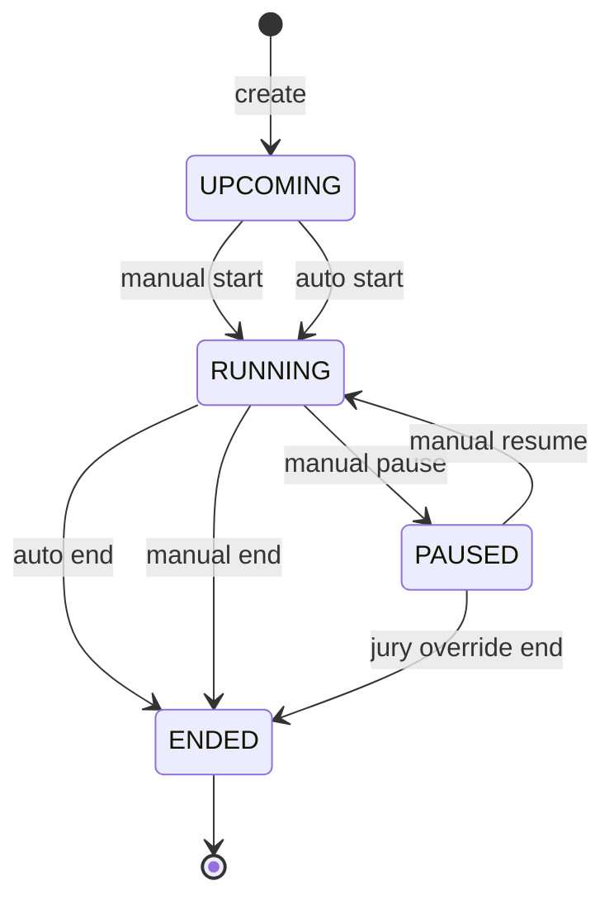
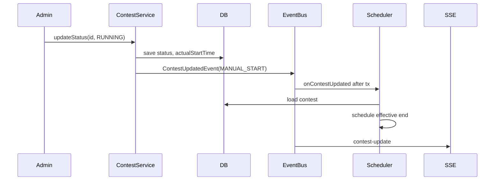
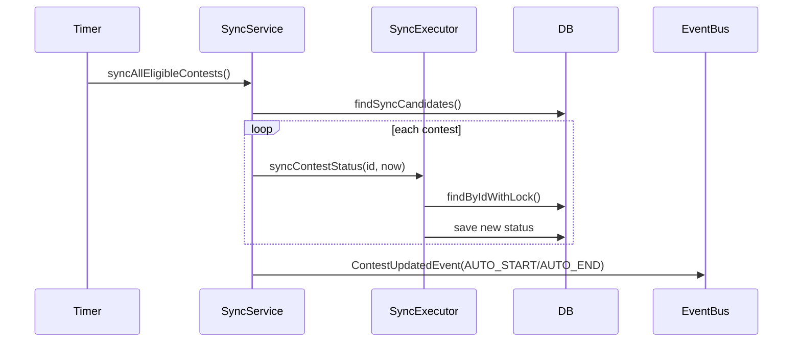

# System Analysis Packet: Contest Lifecycle and Scheduler

## 1. Scope

This packet covers contest persisted state versus effective state, manual transitions, automatic start/end, pause/resume timing, jury override, after-commit events, exact-time scheduler, periodic fallback scheduler, row locking, startup recovery, and lifecycle tests. It excludes scoreboard ranking details except freeze-related fields needed for lifecycle context.

## 2. Local Inspection Summary

* Current working directory: `C:\Users\user\Desktop\AuraC2`
* Git branch if available: `main...origin/main`
* Git status summary: pre-existing local changes were present outside docs; packet generation writes only Markdown under `docs/system-packets`.
* Important searched folders: `backend/src/main/java/com/server/contestControl/contestServer/entity`, `service`, `scheduler`, `controller`, `repository`, `sse`.
* Tests inspected: contest lifecycle and scheduler tests were listed. Tests were not run.

## 3. Files Inspected

| File path | Purpose in this subsystem | Why it matters |
| --------- | ------------------------- | -------------- |
| `backend/src/main/java/com/server/contestControl/contestServer/entity/Contest.java` | Contest entity | Defines persisted lifecycle and timing fields |
| `backend/src/main/java/com/server/contestControl/contestServer/enums/ContestStatus.java` | Status enum | Defines lifecycle statuses |
| `backend/src/main/java/com/server/contestControl/contestServer/controller/ContestController.java` | REST lifecycle API | Manual create/update/start/pause/resume/end and public state probes |
| `backend/src/main/java/com/server/contestControl/contestServer/service/ContestService.java` | Main lifecycle service | Manual transitions, effective-state reads, snapshot building |
| `backend/src/main/java/com/server/contestControl/contestServer/service/ContestLifecycleService.java` | Effective-state calculator | Computes effective state/end/remaining/freeze |
| `backend/src/main/java/com/server/contestControl/contestServer/service/ContestStatusSyncService.java` | Sync coordinator | Finds eligible contests and delegates writes |
| `backend/src/main/java/com/server/contestControl/contestServer/service/ContestStatusSyncExecutor.java` | Sync executor | Uses `REQUIRES_NEW` and pessimistic row lock |
| `backend/src/main/java/com/server/contestControl/contestServer/scheduler/ContestTransitionScheduler.java` | Exact-time scheduler | Schedules one-shot transition checks and startup recovery |
| `backend/src/main/java/com/server/contestControl/contestServer/scheduler/ContestStatusSyncScheduler.java` | Periodic fallback scheduler | Runs sync on configured fixed delay |
| `backend/src/main/java/com/server/contestControl/contestServer/repository/ContestRepository.java` | Contest repository | Provides row-locking and sync candidates |
| `backend/src/main/java/com/server/contestControl/contestServer/event/ContestUpdatedEvent.java` | Domain event | Drives SSE/scheduler/scoreboard updates |

## 4. Main Components

| Component | Path | Type | Responsibility | Important methods/functions |
| --------- | ---- | ---- | -------------- | --------------------------- |
| `Contest` | `entity/Contest.java` | Entity | Stores contest timing and lifecycle | `getEndTime`, `status`, `statusLocked`, `actualStartTime`, `totalPauseMillis` |
| `ContestStatus` | `enums/ContestStatus.java` | Enum | Lifecycle states | `UPCOMING`, `RUNNING`, `PAUSED`, `ENDED` |
| `ContestController` | `controller/ContestController.java` | REST controller | Exposes lifecycle endpoints | `createContest`, `startContest`, `pauseContest`, `resumeContest`, `endContest` |
| `ContestService` | `service/ContestService.java` | Service | Manual transitions and state responses | `createContest`, `updateContestDetails`, `updateStatus`, `getStreamSnapshot` |
| `ContestLifecycleService` | `service/ContestLifecycleService.java` | Service | Effective state and timing math | `resolveEffectiveState`, `resolveEffectiveEndTime`, `resolveRemainingMillis` |
| `ContestStatusSyncService` | `service/ContestStatusSyncService.java` | Service | Auto-sync orchestration | `syncAllEligibleContests` |
| `ContestStatusSyncExecutor` | `service/ContestStatusSyncExecutor.java` | Service | Isolated write transaction with row lock | `syncContestStatus` |
| `ContestTransitionScheduler` | `scheduler/ContestTransitionScheduler.java` | Scheduler/listener | Exact-time one-shot scheduling | `reschedule`, `onContestUpdated`, `onApplicationReady` |
| `ContestStatusSyncScheduler` | `scheduler/ContestStatusSyncScheduler.java` | Scheduler | Periodic fallback sync | scheduled method |
| `ContestUpdatedEvent` | `event/ContestUpdatedEvent.java` | Event | Broadcast reason plus contest snapshot | `Reason` enum |

## 5. Entry Points

| Entry point | Trigger | File/class | Method/function | Auth/role requirement | Request/response model |
| ----------- | ------- | ---------- | --------------- | --------------------- | ---------------------- |
| `POST /api/contest` | Admin creates contest | `ContestController` | `createContest` | ADMIN | `ContestRequest` -> `ContestResponse` |
| `PUT /api/contest/{id}` | Admin edits contest | `ContestController` | update details | ADMIN | `ContestUpdateRequest` -> `ContestResponse` |
| `PUT /api/contest/{id}/start` | Admin manual start | `ContestController` | start | ADMIN | `ContestResponse` |
| `PUT /api/contest/{id}/pause` | Admin manual pause | `ContestController` | pause | ADMIN | `ContestResponse` |
| `PUT /api/contest/{id}/resume` | Admin manual resume | `ContestController` | resume | ADMIN | `ContestResponse` |
| `PUT /api/contest/{id}/end?juryOverride=` | Admin manual end | `ContestController` | end | ADMIN | `ContestResponse` or no body depending controller |
| `GET /api/contest/active` | UI/public state probe | `ContestController` | get active | Public | `ContestResponse` |
| `GET /api/contest/upcoming` | UI/public state probe | `ContestController` | get upcoming | Public | `ContestResponse` |
| `GET /api/contest/paused` | UI/public state probe | `ContestController` | get paused | Public | `ContestResponse` |
| `GET /api/contest/ended` | UI/public state probe | `ContestController` | get ended contests | Public | `List<ContestResponse>` |
| `@Scheduled` fallback | Timer | `ContestStatusSyncScheduler` | scheduled sync method | Internal | None |
| Exact-time task | `TaskScheduler` one-shot | `ContestTransitionScheduler` | `triggerSyncAndChain` | Internal | None |
| Startup recovery | Application ready | `ContestTransitionScheduler` | `onApplicationReady` | Internal | None |
| Event listener | `ContestUpdatedEvent` | `ContestTransitionScheduler`, SSE adapters, scoreboard adapter | listener methods | Internal | Event payload |

## 6. Runtime Flow

1. Create contest: `ContestService.createContest` checks no existing contest has effective UPCOMING/RUNNING/PAUSED state, requires future start time, validates freeze minutes less than duration, saves status UPCOMING, then publishes `ContestUpdatedEvent(CREATED, response)`.
2. Update contest: `ContestService.updateContestDetails` loads the contest, resolves effective state, validates fields, and applies allowed changes by state. UPCOMING allows timing edits; RUNNING/PAUSED lock start time and only allow duration increase; ENDED locks timing/freeze/penalty.
3. Manual start: `ContestService.updateStatus` validates transition, checks another persisted RUNNING contest when starting from UPCOMING, stamps `actualStartTime=now`, sets status RUNNING, saves, publishes MANUAL_START.
4. Manual pause: transition RUNNING to PAUSED, stamps `pausedAt=now`, saves, publishes MANUAL_PAUSE.
5. Manual resume: transition PAUSED to RUNNING, adds elapsed pause time to `totalPauseMillis`, clears `pausedAt`, saves, publishes MANUAL_RESUME.
6. Manual end: transition RUNNING/PAUSED to ENDED. Without `juryOverride`, service requires a non-null effective end time and now at/after it. Paused contests need override because effective end is null while paused.
7. Effective reads: public `getActiveContest`, `getUpcomingContest`, `getPausedContest`, `getEndedContests`, and SSE snapshots scan contests and classify by `ContestLifecycleService.resolveEffectiveState`, not just persisted status.
8. Auto-sync fallback: `ContestStatusSyncService` finds sync candidates and delegates each to `ContestStatusSyncExecutor.syncContestStatus`, which opens `REQUIRES_NEW`, locks the row, applies only UPCOMING->RUNNING and RUNNING->ENDED if status is not locked, and stamps auto-start actualStartTime to scheduled start if possible.
9. Exact-time scheduler: `ContestTransitionScheduler` listens for contest update events after transaction, loads the contest in `REQUIRES_NEW`, cancels old task, schedules next transition instant based on persisted status. On startup it reschedules from all contests.
10. Events: contest events feed admin/team SSE adapters and scoreboard updates. Scheduler uses events to keep in-memory scheduled futures aligned with DB changes.

## 7. Code Evidence

### Evidence: `ContestLifecycleService.resolveEffectiveState`

Path: `backend/src/main/java/com/server/contestControl/contestServer/service/ContestLifecycleService.java`

```java
public ContestStatus resolveEffectiveState(Contest contest, Instant now) {
    ContestStatus persistedStatus = contest.getStatus();
    if (persistedStatus == ContestStatus.ENDED) return ContestStatus.ENDED;
    if (persistedStatus == ContestStatus.PAUSED) return ContestStatus.PAUSED;

    if (persistedStatus == ContestStatus.RUNNING) {
        Instant effectiveEndTime = resolveEffectiveEndTime(contest, now);
        if (effectiveEndTime != null && !now.isBefore(effectiveEndTime)
                && !Boolean.TRUE.equals(contest.getStatusLocked())) {
            return ContestStatus.ENDED;
        }
        return ContestStatus.RUNNING;
    }

    if (contest.getStartTime() != null && !now.isBefore(contest.getStartTime())
            && !Boolean.TRUE.equals(contest.getStatusLocked())) {
        return ContestStatus.RUNNING;
    }
    return ContestStatus.UPCOMING;
}
```

This proves:

* Effective state can differ from persisted state.
* `statusLocked` blocks automatic effective transition for UPCOMING/RUNNING.

### Evidence: Manual transition bookkeeping

Path: `backend/src/main/java/com/server/contestControl/contestServer/service/ContestService.java`

```java
case RUNNING -> {
    if (contestRepository.existsByStatus(ContestStatus.RUNNING)
            && current != ContestStatus.PAUSED) {
        throw new InvalidContestStateException("Another contest is already running.");
    }
    if (current == ContestStatus.UPCOMING) {
        contest.setActualStartTime(now);
    } else if (current == ContestStatus.PAUSED) {
        Instant pausedAt = contest.getPausedAt();
        if (pausedAt != null) {
            long existing = contest.getTotalPauseMillis() != null
                    ? contest.getTotalPauseMillis() : 0L;
            contest.setTotalPauseMillis(existing + (now.toEpochMilli() - pausedAt.toEpochMilli()));
        }
        contest.setPausedAt(null);
    }
}
case PAUSED -> contest.setPausedAt(now);
case ENDED -> {
    if (!juryOverride) {
        Instant effectiveEnd = contestLifecycleService.resolveEffectiveEndTime(contest, now);
        if (effectiveEnd == null || now.isBefore(effectiveEnd)) {
            throw new InvalidContestStateException("Cannot end contest before its effective end time. Use jury override to force end.");
        }
    }
}
```

This proves:

* Manual start and resume have different clock behavior.
* Jury override is required for early or paused manual end.

### Evidence: `ContestStatusSyncExecutor.syncContestStatus`

Path: `backend/src/main/java/com/server/contestControl/contestServer/service/ContestStatusSyncExecutor.java`

```java
@Transactional(propagation = Propagation.REQUIRES_NEW)
public Optional<ContestStatus> syncContestStatus(Long contestId, Instant now) {
    Contest contest = contestRepository.findByIdWithLock(contestId).orElse(null);
    if (contest == null) return Optional.empty();

    ContestStatus persistedStatus = contest.getStatus();
    ContestStatus effectiveState = contestLifecycleService.resolveEffectiveState(contest, now);
    if (persistedStatus == effectiveState) return Optional.empty();
    if (!isAllowedAutoTransition(persistedStatus, effectiveState)) return Optional.empty();
    if (Boolean.TRUE.equals(contest.getStatusLocked())) return Optional.empty();

    if (persistedStatus == ContestStatus.UPCOMING && effectiveState == ContestStatus.RUNNING) {
        Instant scheduledStart = contest.getStartTime();
        contest.setActualStartTime(scheduledStart != null ? scheduledStart : now);
    }
    contest.setStatus(effectiveState);
    contestRepository.save(contest);
    return Optional.of(effectiveState);
}
```

This proves:

* Auto-sync writes in a separate transaction and locks the contest row.
* Auto-start stamps `actualStartTime` to scheduled start, not scheduler execution time, when possible.

## 8. Data Model

| Model | Type | Path | Important fields | Relationships/constraints | Runtime meaning |
| ----- | ---- | ---- | ---------------- | ------------------------- | --------------- |
| `Contest` | Entity | `contestServer/entity/Contest.java` | `status`, `statusLocked`, `startTime`, `durationMinutes`, `actualStartTime`, `pausedAt`, `totalPauseMillis`, `scoreboardFreezeMinutes`, `penaltyMinutes` | Problems one-to-many; migration indexes status/start | Lifecycle, clock, freeze, scoring |
| `ContestStatus` | Enum | `contestServer/enums/ContestStatus.java` | `UPCOMING`, `RUNNING`, `PAUSED`, `ENDED` | String persisted | Persisted/effective lifecycle states |
| `ContestRequest` | DTO | `contestServer/dto/contest/ContestRequest.java` | title, startTime, duration, freeze, penalty | Input validation in service | Create contest payload |
| `ContestResponse` | DTO | `contestServer/dto/contest/ContestResponse.java` | persisted status, effectiveState, remainingMillis, effectiveEndTime, scoreboardFrozen | SSE/REST response | Frontend clock and state payload |
| `ContestUpdatedEvent` | Event | `contestServer/event/ContestUpdatedEvent.java` | `Reason`, snapshot | Event listeners | Drives SSE, scheduler, scoreboard |
| Migration contest table | SQL | `db/migration/V1__baseline_schema.sql` | status, status_locked, pause fields, freeze, penalty | `idx_contests_status_start_time`, `idx_contests_start_time` | Physical schema |

## 9. Security and Authorization

* Contest mutations are admin-only in controller/security configuration.
* State probes `/api/contest/active`, `/upcoming`, `/paused`, `/ended` are public in `SecurityConfiguration`.
* Contest SSE admin stream is `@PreAuthorize("hasRole('ADMIN')")`; team stream uses `/api/team/stream` and TEAM role.
* Effective state returned publicly may expose contest title/timing for active/upcoming/paused/ended contests by design.

## 10. Transactions and Consistency

* `ContestService.createContest`, `updateContestDetails`, and `updateStatus` are transactional.
* `ContestStatusSyncExecutor.syncContestStatus` uses `REQUIRES_NEW` and `ContestRepository.findByIdWithLock` for row-level consistency.
* `ContestService.buildResponseForId` uses `REQUIRES_NEW, readOnly=true` so event consumers can rebuild from committed state.
* `ContestTransitionScheduler.onContestUpdated` is a `@TransactionalEventListener(fallbackExecution=true)` and itself opens `REQUIRES_NEW` for rescheduling.
* Race gap: `createContest` scans all contests for conflicting effective states but no unique DB constraint or row/table lock was found to prevent two concurrent create requests.
* Manual start checks `existsByStatus(RUNNING)` using persisted status. Effective RUNNING but unsynced UPCOMING contests may not be caught by that exact query.

## 11. Async / Events / Queues / SSE

* `ContestUpdatedEvent` reasons include `CREATED`, `UPDATED`, manual transition reasons, and auto transition reasons.
* `ContestSseAdapter` and `TeamContestSseAdapter` publish contest updates after transaction.
* `ContestTransitionScheduler` consumes contest events to schedule/cancel one-shot tasks.
* `ContestStatusSyncScheduler` periodically calls sync as a fallback.
* No RabbitMQ is used for contest lifecycle.

## 12. State Transitions

| From | To | Trigger | Code location | Guard/validation |
| ---- | -- | ------- | ------------- | ---------------- |
| none | UPCOMING | Create contest | `ContestService.createContest` | future start; no effective UPCOMING/RUNNING/PAUSED |
| UPCOMING | RUNNING | Manual start | `ContestService.updateStatus` | valid transition; no other persisted RUNNING |
| UPCOMING | RUNNING | Auto sync | `ContestStatusSyncExecutor.syncContestStatus` | start time passed; not locked; row lock |
| RUNNING | PAUSED | Manual pause | `ContestService.updateStatus` | valid transition |
| PAUSED | RUNNING | Manual resume | `ContestService.updateStatus` | valid transition; accumulates pause millis |
| RUNNING | ENDED | Auto sync | `ContestStatusSyncExecutor.syncContestStatus` | effective end passed; not locked; row lock |
| RUNNING/PAUSED | ENDED | Manual end | `ContestService.updateStatus` | effective end reached or jury override |
| ENDED | any | Any transition | `ContestService.isValidTransition` | rejected |



## 13. Mermaid Skeletons





## 14. Tests

| Test file | What it verifies | Important test methods | Missing coverage |
| --------- | ---------------- | ---------------------- | ---------------- |
| `contestServer/service/ContestLifecycleServiceTest.java` | Effective state/end/remaining/freeze calculations | Inspect file for exact method names | Tests not run here |
| `contestServer/service/ContestServiceTest.java` | Manual lifecycle service behavior | Inspect file for exact method names | Tests not run here |
| `contestServer/service/ContestStatusSyncExecutorTest.java` | Auto-sync write behavior | Inspect file for exact method names | Tests not run here |
| `contestServer/service/ContestStatusSyncServiceTest.java` | Sync orchestration/event behavior | Inspect file for exact method names | Tests not run here |
| `contestServer/scheduler/ContestTransitionSchedulerTest.java` | One-shot scheduler behavior | Inspect file for exact method names | Tests not run here |
| `contestServer/scheduler/ContestStatusSyncSchedulerTest.java` | Periodic scheduler behavior | Inspect file for exact method names | Tests not run here |

## 15. Edge Cases

| Edge case | Code location | Current behavior | Risk level |
| --------- | ------------- | ---------------- | ---------- |
| Server restarts with pending contest transitions | `ContestTransitionScheduler.onApplicationReady` | Rebuilds scheduled futures from DB | Low |
| Scheduler task target time already passed | `ContestTransitionScheduler.reschedule` | Schedules immediate catch-up | Low |
| Paused contest manual end without override | `ContestService.updateStatus` | Rejected because effective end is null | Low |
| Concurrent auto-sync tasks | `ContestStatusSyncExecutor.syncContestStatus` | Row lock serializes per-contest transition | Low |
| Concurrent contest creation | `ContestService.createContest` | No DB-level uniqueness/lock found | Medium |
| Status locked contest | `ContestLifecycleService`, `ContestStatusSyncExecutor` | Auto transition skipped/effective state remains persisted | Low if intended |

## 16. Risks / Weaknesses / Gaps

* Single active/upcoming contest invariant is enforced in service scans, not by database constraint.
* Manual start uses persisted `existsByStatus(RUNNING)`, which may miss effective RUNNING contests before sync.
* In-memory exact-time scheduler requires startup rebuild; periodic fallback helps but does not distribute scheduling across nodes.
* `statusLocked` field exists and is honored by lifecycle/sync, but no admin endpoint for toggling it was identified in inspected lifecycle code.
* Tests were not run during packet creation.

## 17. Final Evidence Table

| Claim | Evidence path | Class/method/field | Confidence |
| ----- | ------------- | ------------------ | ---------- |
| Effective state can differ from persisted state | `ContestLifecycleService.java` | `resolveEffectiveState` | Strong |
| Pause/resume shifts contest clock | `ContestService.java`, `ContestLifecycleService.java` | `pausedAt`, `totalPauseMillis`, `resolveEffectiveEndTime` | Strong |
| Auto-sync uses row locking and `REQUIRES_NEW` | `ContestStatusSyncExecutor.java`, `ContestRepository.java` | `syncContestStatus`, `findByIdWithLock` | Strong |
| Exact-time scheduler is in-memory but rebuilt on startup | `ContestTransitionScheduler.java` | `pendingTasks`, `onApplicationReady` | Strong |
| Manual early end requires jury override | `ContestService.updateStatus` | ENDED branch | Strong |
| Single active contest creation can race | `ContestService.createContest`, migrations | no unique DB constraint found | Medium |
