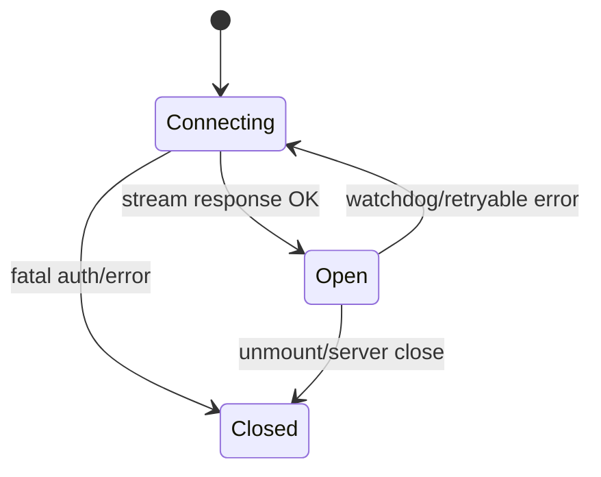
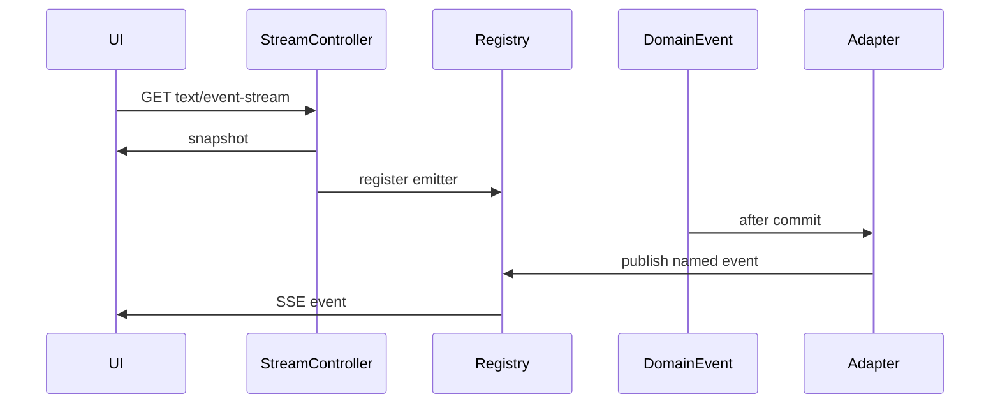
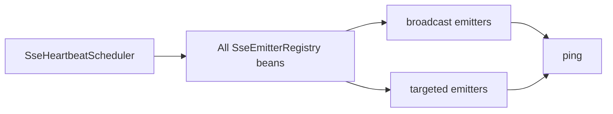

# System Analysis Packet: SSE Live Events

## 1. Scope

This packet covers the implemented server-sent events infrastructure: registries, heartbeat, contest/team/submission/clarification/scoreboard streams, snapshot/update event types, frontend `fetchEventSource` hooks, reconnect behavior, REST fallback where present, and single-node limitations. It excludes the business logic that emits events except where needed to explain event payloads.

## 2. Local Inspection Summary

* Current working directory: `C:\Users\user\Desktop\AuraC2`
* Git branch if available: `main...origin/main`
* Git status summary: pre-existing non-doc changes were observed; packet creation writes only `docs/system-packets`.
* Important searched folders: `backend/src/main/java/com/server/contestControl/shared/sse`, `contestServer/sse`, `contestServer/controller`, `submissionServer/sse`, `UI/src/hooks`.
* Tests inspected: SSE registry and scoreboard SSE tests were listed. Tests were not run.

## 3. Files Inspected

| File path | Purpose in this subsystem | Why it matters |
| --------- | ------------------------- | -------------- |
| `backend/src/main/java/com/server/contestControl/shared/sse/SseEmitterRegistry.java` | Base registry | In-memory broadcast and targeted emitter management |
| `backend/src/main/java/com/server/contestControl/shared/sse/SsePublisher.java` | Event publisher helper | Builds named JSON SSE events |
| `backend/src/main/java/com/server/contestControl/shared/sse/SseHeartbeatScheduler.java` | Heartbeat scheduler | Sends named `ping` every 15 seconds |
| `backend/src/main/java/com/server/contestControl/contestServer/controller/ContestStreamController.java` | Admin contest stream | Sends contest snapshot and registers broadcast emitter |
| `backend/src/main/java/com/server/contestControl/contestServer/controller/TeamStreamController.java` | Team contest stream | Sends contest snapshot and registers team-targeted emitter |
| `backend/src/main/java/com/server/contestControl/submissionServer/controller/SubmissionStreamController.java` | Submission streams | Team/admin submission update streams |
| `backend/src/main/java/com/server/contestControl/contestServer/controller/ClarificationStreamController.java` | Clarification streams | Team/admin clarification streams by contest |
| `backend/src/main/java/com/server/contestControl/contestServer/scoreboard/controller/ScoreboardStreamController.java` | Public scoreboard stream | Sends public snapshot and registers contest-targeted emitter |
| `backend/src/main/java/com/server/contestControl/contestServer/scoreboard/controller/AdminScoreboardStreamController.java` | Admin scoreboard stream | Sends admin snapshot and registers contest-targeted emitter |
| `UI/src/hooks/useContestStream.ts` | Frontend contest SSE hook | Auth headers, watchdog, reconnect |
| `UI/src/hooks/useSubmissionStream.ts` | Frontend submission SSE hook | Admin/team endpoint selection |
| `UI/src/hooks/useClarificationStream.ts` | Frontend clarification SSE hook | Role-based endpoint selection |
| `UI/src/hooks/useScoreboardStream.ts` | Frontend scoreboard SSE hook | Version gap detection and fallback hook |

## 4. Main Components

| Component | Path | Type | Responsibility | Important methods/functions |
| --------- | ---- | ---- | -------------- | --------------------------- |
| `SseEmitterRegistry` | `shared/sse/SseEmitterRegistry.java` | Support class | Manage broadcast and targeted emitters | `register`, `broadcastAll`, `publishTo`, `keepAliveAll` |
| `SseHeartbeatScheduler` | `shared/sse/SseHeartbeatScheduler.java` | Scheduler | Send `ping` heartbeat to every registry | `heartbeat` |
| `ContestSseRegistry` | `contestServer/sse/contest` | Registry bean | Admin contest updates | inherited registry methods |
| `TeamSseRegistry` | `contestServer/sse/team` | Registry bean | Team contest stream and team-targeted events | inherited registry methods |
| `SubmissionSsePublisher` | `submissionServer/sse` | Publisher | Build and dispatch submission update events | `buildEvent`, `publish`, `dispatch` |
| `ClarificationSseAdapter` | `contestServer/sse/clarification` | Event listener | Publish clarification created/replied/public events | listener methods |
| `ScoreboardSseAdapter` | `contestServer/scoreboard/sse` | Event listener | Publish scoreboard updates/freeze/reveal | `publishScoreboardUpdate`, `publishRevealStep`, `publishFreeze` |
| Frontend hooks | `UI/src/hooks` | React hooks | Connect streams and handle retry/watchdog | `useContestStream`, `useScoreboardStream` |

## 5. Entry Points

| Entry point | Trigger | File/class | Method/function | Auth/role requirement | Request/response model |
| ----------- | ------- | ---------- | --------------- | --------------------- | ---------------------- |
| `GET /api/contest/stream` | Admin app connects | `ContestStreamController` | `stream` | ADMIN | SSE `snapshot`, `contest-update`, `ping` |
| `GET /api/team/stream` | Team app connects | `TeamStreamController` | `stream` | TEAM | SSE `snapshot`, `contest-update`, `ping` |
| `GET /api/submissions/stream` | Team workspace connects | `SubmissionStreamController` | team stream | TEAM | SSE `submission-update`, `ping` |
| `GET /api/admin/submissions/stream` | Admin submissions view connects | `SubmissionStreamController` | admin stream | ADMIN | SSE `submission-update`, `ping` |
| `GET /api/clarifications/my/stream/{contestId}` | Team clarifications modal connects | `ClarificationStreamController` | team stream | TEAM | clarification event names |
| `GET /api/clarifications/admin/stream/{contestId}` | Admin clarifications connects | `ClarificationStreamController` | admin stream | ADMIN | clarification event names |
| `GET /api/scoreboard/contests/{contestId}/stream` | Public/team scoreboard connects | `ScoreboardStreamController` | stream | Public | `snapshot`, scoreboard events, `ping` |
| `GET /api/admin/scoreboard/contests/{contestId}/stream` | Admin scoreboard connects | `AdminScoreboardStreamController` | stream | ADMIN | `snapshot`, scoreboard events, `ping` |
| `@Scheduled fixedDelay=15000` | Timer | `SseHeartbeatScheduler` | `heartbeat` | Internal | Named `ping` event |

## 6. Runtime Flow

1. A browser hook opens an SSE endpoint using `@microsoft/fetch-event-source` so it can attach `Authorization: Bearer <accessToken>` on protected streams.
2. Stream controllers create `SseEmitter` with 30 minute timeout for contest/team streams and send an initial `snapshot` before registration. If the initial send fails, the dead emitter is not registered.
3. `SseEmitterRegistry.register(emitter)` stores broadcast clients in a `CopyOnWriteArrayList`; `register(id, emitter)` stores targeted clients in a `ConcurrentHashMap<Long, List<SseEmitter>>`.
4. Registry callbacks remove emitters on completion, timeout, or error. Failed sends remove the dead emitter from its relevant bucket.
5. Domain services publish Spring events. Adapters annotated with `@TransactionalEventListener(fallbackExecution=true)` build event payloads after commit when invoked from transactional flows.
6. `SseHeartbeatScheduler.heartbeat` sends named event `ping` every 15 seconds through `keepAliveAll`, reaching both broadcast and targeted emitters.
7. Frontend hooks reset a watchdog on any named event, ignore `ping` as application data, retry with exponential backoff, and attempt one token refresh on 401.
8. Scoreboard hook additionally checks payload versions; when it sees a gap, it calls the provided REST fallback handler.

## 7. Code Evidence

### Evidence: `SseEmitterRegistry` storage and cleanup

Path: `backend/src/main/java/com/server/contestControl/shared/sse/SseEmitterRegistry.java`

```java
private final List<SseEmitter> emitters = new CopyOnWriteArrayList<>();
private final Map<Long, List<SseEmitter>> targetedEmitters = new ConcurrentHashMap<>();

public void register(Long id, SseEmitter emitter) {
    targetedEmitters.computeIfAbsent(id, k -> new CopyOnWriteArrayList<>()).add(emitter);
    emitter.onCompletion(() -> removeTargeted(id, emitter));
    emitter.onTimeout(() -> {
        removeTargeted(id, emitter);
        completeSafely(emitter);
    });
    emitter.onError(t -> removeTargeted(id, emitter));
}

public void keepAliveAll(SseEmitter.SseEventBuilder event) {
    for (SseEmitter emitter : emitters) {
        safeBroadcastSend(emitter, event);
    }
    targetedEmitters.forEach((id, list) ->
            list.forEach(emitter -> safeTargetedSend(id, emitter, event)));
}
```

This proves:

* SSE clients are tracked in process memory.
* Targeted and broadcast clients both receive heartbeat through `keepAliveAll`.

### Evidence: Heartbeat is a named event

Path: `backend/src/main/java/com/server/contestControl/shared/sse/SseHeartbeatScheduler.java`

```java
@Scheduled(fixedDelay = 15_000)
public void heartbeat() {
    registries.forEach(r -> r.keepAliveAll(SseEmitter.event().name("ping").data("ping")));
}
```

This proves:

* Heartbeat interval is 15 seconds.
* The server intentionally sends `ping` as a named event instead of a comment.

### Evidence: Contest stream initial snapshot

Path: `backend/src/main/java/com/server/contestControl/contestServer/controller/ContestStreamController.java`

```java
@PreAuthorize("hasRole('ADMIN')")
@GetMapping(value = "/stream", produces = MediaType.TEXT_EVENT_STREAM_VALUE)
public SseEmitter stream() {
    SseEmitter emitter = new SseEmitter(STREAM_TIMEOUT_MILLIS);
    ContestStreamSnapshot snapshot = contestService.getStreamSnapshot();
    boolean sent = contestSseRegistry.safeBroadcastSend(emitter, SseEmitter.event()
            .name("snapshot")
            .data(snapshot, MediaType.APPLICATION_JSON));
    if (!sent) return emitter;
    contestSseRegistry.register(emitter);
    return emitter;
}
```

This proves:

* The contest stream sends a snapshot before registering.
* The admin contest stream is role-protected.

### Evidence: Frontend watchdog and refresh behavior

Path: `UI/src/hooks/useContestStream.ts`

```tsx
await fetchEventSource(streamUrl(endpoint), {
  signal: controller.signal,
  openWhenHidden: true,
  headers: { Authorization: `Bearer ${getAccessToken() ?? ""}` },
  onopen: async (response) => {
    const contentType = response.headers.get("content-type") ?? "";
    if (response.ok && contentType.includes("text/event-stream")) {
      attempt = 0;
      setConnectionState("open");
      armWatchdog();
      return;
    }
    if (response.status === 401) {
      const newToken = await ensureRefreshedOnce();
      if (newToken) throw new RetryAfterRefreshError();
      throw new FatalSseError("unauthorized");
    }
  },
  onmessage: (ev) => {
    armWatchdog();
    if (ev.event === "ping") return;
  }
});
```

This proves:

* Frontend SSE uses bearer auth and refresh-on-401.
* Watchdog liveness depends on named events, including server pings.

## 8. Data Model

| Model | Type | Path | Important fields | Relationships/constraints | Runtime meaning |
| ----- | ---- | ---- | ---------------- | ------------------------- | --------------- |
| `ContestStreamSnapshot` | DTO/record | `contestServer/sse/contest` | active, upcoming, paused, ended | None | Initial contest stream payload |
| `ContestStreamUpdate` | DTO/record | `contestServer/sse/contest` | reason, snapshot | Event payload | Contest update message |
| `SubmissionStreamEvent` | DTO/record | `submissionServer/sse` | event type, submission payload | None | Submission update payload |
| `ClarificationStreamEvent` | DTO/record | `contestServer/sse/clarification` | event type, clarification data | None | Clarification update payload |
| `ScoreboardUpdatePayload` | DTO/record | `contestServer/scoreboard/dto` | eventType, version, previousVersion, changed rows, snapshot | None | Versioned scoreboard update |
| `SseEmitter` | Runtime object | Spring MVC | timeout and connection callbacks | In-memory registry only | Browser stream connection |

## 9. Security and Authorization

* Contest admin stream requires ADMIN.
* Team stream requires TEAM.
* Submission streams split TEAM and ADMIN endpoints.
* Clarification streams split TEAM and ADMIN endpoints.
* Public scoreboard stream is permitted by `SecurityConfiguration` through `/api/scoreboard/**`; admin scoreboard stream is under `/api/admin/**`.
* Frontend hooks still attach Authorization when available to many streams, but public scoreboard does not require it.

## 10. Transactions and Consistency

* Contest, clarification, and scoreboard adapters use `@TransactionalEventListener(fallbackExecution=true)`.
* Submission service and callback service often build events inside a transaction and dispatch after commit.
* `fallbackExecution=true` means listener code can run even if an event is published outside a transaction.
* No durable event store or replay buffer was found. Missed events are recovered only where the frontend has REST fallback or initial snapshot.
* Scoreboard payloads include versions and the frontend detects gaps. Contest/submission/clarification streams do not have equivalent version gap handling.

## 11. Async / Events / Queues / SSE

* SSE is the subsystem's core async behavior.
* Event classes/adapters:
  * `ContestUpdatedEvent` -> contest/team/scoreboard SSE.
  * `SubmissionFinalizedEvent`, `SubmissionRejudgeQueuedEvent` -> scoreboard SSE.
  * Submission service/callback/rejudge -> submission SSE.
  * `ClarificationCreatedEvent`, `ClarificationRepliedEvent` -> clarification SSE.
* No RabbitMQ is used directly by the SSE infrastructure.
* Native browser reconnect is not used; `fetchEventSource` plus custom retry handles reconnect.

## 12. State Transitions

| From | To | Trigger | Code location | Guard/validation |
| ---- | -- | ------- | ------------- | ---------------- |
| No stream | Connecting | React hook mount | `useContestStream`, other hooks | Endpoint and token selected |
| Connecting | Open | SSE `onopen` with `text/event-stream` | frontend hooks | HTTP 200 and stream content type |
| Open | Connecting | Silent watchdog timeout or retryable error | frontend hooks | Exponential backoff |
| Connecting/Open | Closed | Fatal auth/explicit unmount | frontend hooks | 401 refresh failure or cleanup |
| Registered emitter | Removed | completion/timeout/error/send failure | `SseEmitterRegistry` | Registry callbacks |



## 13. Mermaid Skeletons





## 14. Tests

| Test file | What it verifies | Important test methods | Missing coverage |
| --------- | ---------------- | ---------------------- | ---------------- |
| `shared/sse/SseEmitterRegistryTest.java` | Registry cleanup/publish behavior | Inspect file for exact methods | Tests not run here |
| `contestServer/scoreboard/sse/ScoreboardSseAdapterTest.java` | Scoreboard event adapter behavior | Inspect file for exact methods | Tests not run here |
| `contestServer/scoreboard/sse/ScoreboardSsePublisherTest.java` | Scoreboard publisher behavior | Inspect file for exact methods | Tests not run here |
| `UI/src/hooks/useScoreboardStream.test.tsx` | Frontend scoreboard stream handling and version gaps | Inspect file for exact methods | No equivalent hook tests found for all streams |

## 15. Edge Cases

| Edge case | Code location | Current behavior | Risk level |
| --------- | ------------- | ---------------- | ---------- |
| Initial snapshot send fails | Stream controllers | Emitter returned but not registered | Low |
| Dead connection during publish | `SseEmitterRegistry.safe*Send` | Removes emitter from relevant list | Low |
| Idle proxy/browser closes connection | `SseHeartbeatScheduler`, frontend hooks | Ping every 15s; watchdog aborts after 30s silence | Medium |
| App restart | In-memory registries | All connections and last snapshots lost | Medium |
| Multi-node deployment | All registries | No cross-node fanout/replay found | High |
| Missed non-scoreboard event | Contest/submission/clarification hooks | No versioned replay; relies on snapshot/refetch behavior where implemented | Medium |

## 16. Risks / Weaknesses / Gaps

* SSE registries are process-local and not horizontally scalable without sticky sessions or a shared event bus.
* Scoreboard has version-gap fallback; other streams do not show equivalent version tracking.
* `fallbackExecution=true` makes listeners run even outside transactions, which is useful but can blur after-commit assumptions if events are published from non-transactional code.
* There is no persistent event history for reconnect replay.

## 17. Final Evidence Table

| Claim | Evidence path | Class/method/field | Confidence |
| ----- | ------------- | ------------------ | ---------- |
| SSE registries are in-memory | `SseEmitterRegistry.java` | `CopyOnWriteArrayList`, `ConcurrentHashMap` | Strong |
| Heartbeat sends named `ping` every 15s | `SseHeartbeatScheduler.java` | `@Scheduled(fixedDelay = 15_000)` | Strong |
| Contest streams send initial snapshot | `ContestStreamController.java`, `TeamStreamController.java` | `stream` | Strong |
| Frontend uses `fetchEventSource` with bearer headers | `UI/src/hooks/useContestStream.ts` and peer hooks | `fetchEventSource` options | Strong |
| Scoreboard stream has version gap fallback | `UI/src/hooks/useScoreboardStream.ts` | version handling | Strong |
| No durable replay was found | SSE code inspected | no event store/replay table | Medium |
