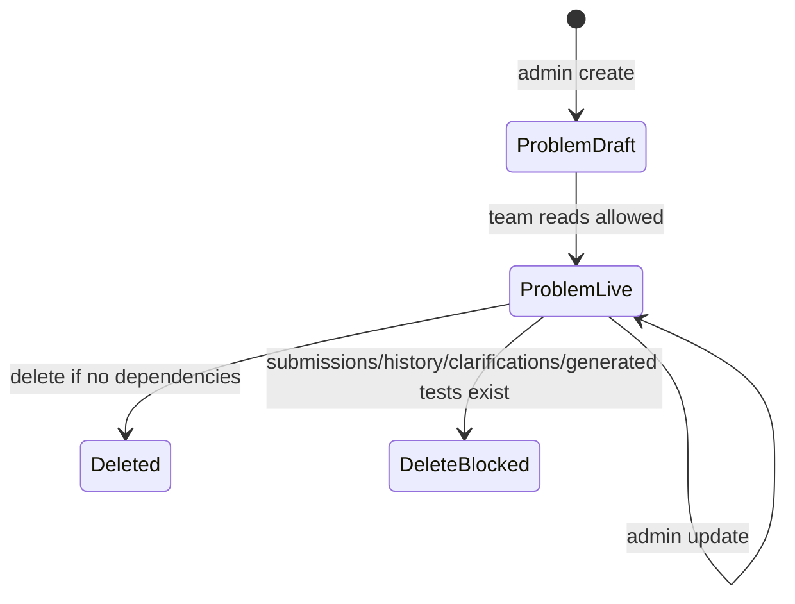
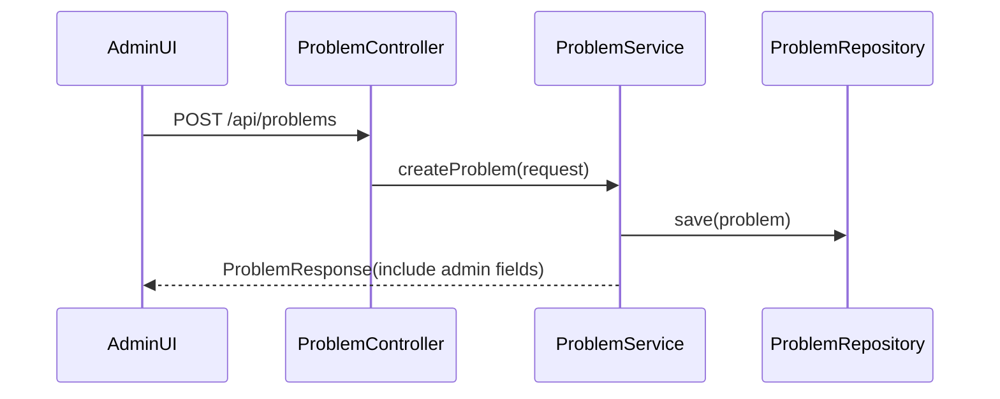
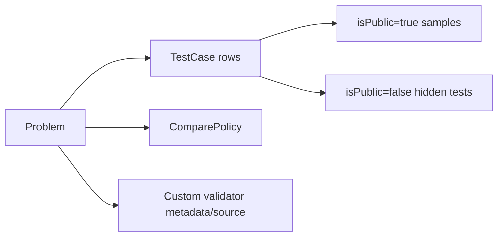

# System Analysis Packet: Problems, Test Cases, and Statements

## 1. Scope

This packet covers problem CRUD, structured statements, public notes, admin notes, compare-policy fields, custom validator metadata, test case CRUD, public samples, DTO safety, statement PDF/booklet export, prompt export connection points, deletion behavior, and frontend problem/testcase components. It excludes official judging execution details, covered in packet 06, and oracle-generated tests, covered in packet 11.

## 2. Local Inspection Summary

* Current working directory: `C:\Users\user\Desktop\AuraC2`
* Git branch if available: `main...origin/main`
* Git status summary: pre-existing non-doc local changes were observed; only docs are modified by this task.
* Important searched folders: `contestServer/entity`, `controller`, `service`, `statement`, `prompt`, `UI/src/admin/components`, `UI/src/team/components`.
* Tests inspected: problem, testcase, PDF, prompt export tests were listed. Tests were not run.

## 3. Files Inspected

| File path | Purpose in this subsystem | Why it matters |
| --------- | ------------------------- | -------------- |
| `backend/src/main/java/com/server/contestControl/contestServer/entity/Problem.java` | Problem entity | Defines statement, compare, validator, and runtime fields |
| `backend/src/main/java/com/server/contestControl/contestServer/entity/TestCase.java` | Test case entity | Defines official inputs/outputs and sample flag |
| `backend/src/main/java/com/server/contestControl/contestServer/controller/ProblemController.java` | Problem REST API | Role split and moderation workspace checks |
| `backend/src/main/java/com/server/contestControl/contestServer/service/ProblemService.java` | Problem business rules | Create/update/delete/compare/validator logic |
| `backend/src/main/java/com/server/contestControl/contestServer/controller/TestCaseController.java` | Test case REST API | Admin CRUD and public sample endpoint |
| `backend/src/main/java/com/server/contestControl/contestServer/service/TestCaseService.java` | Test case business rules | Duplicate checks and public sample filtering |
| `backend/src/main/java/com/server/contestControl/contestServer/service/TestCaseDuplicateService.java` | Duplicate normalizer | Defines trim-based duplicate policy |
| `backend/src/main/java/com/server/contestControl/contestServer/statement` | PDF exports | Contestant-safe statement/booklet export |
| `backend/src/main/java/com/server/contestControl/contestServer/prompt` | Prompt export services | Public-safe/admin prompt generation, not implementation truth beyond code |
| `UI/src/admin/components/ProblemsView.tsx` | Admin problem/testcase UI | Uses statements, test cases, oracle panels |
| `UI/src/admin/components/CreateProblemModal.tsx` | Admin create UI | Custom validator/statement fields |
| `UI/src/admin/components/EditProblemModal.tsx` | Admin edit UI | Existing validator source hidden unless replaced |
| `UI/src/team/components/ProblemStatementPanel.tsx` | Team statement/testcase UI | Shows statements, samples, run results |

## 4. Main Components

| Component | Path | Type | Responsibility | Important methods/functions |
| --------- | ---- | ---- | -------------- | --------------------------- |
| `Problem` | `entity/Problem.java` | Entity | Problem metadata, statement, compare policy, validator config | `hasActiveCustomValidator`, statement fields |
| `TestCase` | `entity/TestCase.java` | Entity | Official test case input/output/sample flag | `isPublic` |
| `ProblemController` | `controller/ProblemController.java` | REST controller | Problem CRUD/list/detail | `createProblem`, `updateProblem`, `deleteProblem`, `getProblemsByContest` |
| `ProblemService` | `service/ProblemService.java` | Service | Validation, DTO mapping, deletion guards | `createProblem`, `updateProblem`, `deleteProblem`, `applyCompareSettings`, `applyValidatorSettings` |
| `TestCaseController` | `controller/TestCaseController.java` | REST controller | Test case CRUD and samples | `addTestCase`, `getPublicTestCases` |
| `TestCaseService` | `service/TestCaseService.java` | Service | Test case validation and duplicate rejection | `addTestCase`, `updateTestCase`, `getPublicTestCases` |
| `TestCaseDuplicateService` | `service/TestCaseDuplicateService.java` | Service | Normalize and detect duplicate inputs/outputs | `normalizeInput`, `exactDuplicateExists`, `inputDuplicateExistsForPromotion` |
| `ProblemStatementPdfService` | `statement` | Service | Generate safe PDF statement/booklet models | statement/booklet methods |
| `PromptExportService` | `prompt` | Service | Prompt preview/export text | prompt preview methods |

## 5. Entry Points

| Entry point | Trigger | File/class | Method/function | Auth/role requirement | Request/response model |
| ----------- | ------- | ---------- | --------------- | --------------------- | ---------------------- |
| `POST /api/problems` | Admin creates problem | `ProblemController` | `createProblem` | ADMIN | `ProblemRequest` -> `ProblemResponse` |
| `PUT /api/problems/{id}` | Admin edits problem | `ProblemController` | `updateProblem` | ADMIN | `ProblemUpdateRequest` -> `ProblemResponse` |
| `DELETE /api/problems/{id}` | Admin deletes problem | `ProblemController` | `deleteProblem` | ADMIN | 204 or conflict |
| `GET /api/problems/{id}` | Admin/team opens problem | `ProblemController` | `getProblem` | ADMIN/TEAM | `ProblemResponse` |
| `GET /api/problems/contest/{id}` | Admin/team lists contest problems | `ProblemController` | `getProblemsByContest` | ADMIN/TEAM | `List<ProblemResponse>` |
| `POST /api/testcases/{problemId}` | Admin adds official test | `TestCaseController` | `addTestCase` | ADMIN | `TestCaseRequest` -> `TestCaseResponse` |
| `PUT /api/testcases/{id}` | Admin updates official test | `TestCaseController` | `updateTestCase` | ADMIN | `TestCaseUpdateRequest` -> `TestCaseResponse` |
| `DELETE /api/testcases/{id}` | Admin deletes official test | `TestCaseController` | `deleteTestCase` | ADMIN | 204 |
| `GET /api/testcases/problem/{problemId}` | Admin lists all tests | `TestCaseController` | `getTestCases` | ADMIN | `List<TestCaseResponse>` |
| `GET /api/testcases/public/problem/{problemId}` | Team/admin lists samples | `TestCaseController` | `getPublicTestCases` | TEAM/ADMIN | `List<PublicTestCaseResponse>` |
| Admin PDF exports | Admin downloads statement/booklet | `ProblemStatementPdfController` | PDF endpoints | ADMIN | PDF bytes |
| Prompt preview | Admin opens prompt export panel | `PromptExportController` | preview | ADMIN | prompt export DTO |

## 6. Runtime Flow

1. Admin creates a problem through `ProblemController.createProblem`.
2. `ProblemService.createProblem` loads the contest, assigns balloon color fallback based on existing problem count, sets structured statement fields, parses difficulty, applies compare policy, and applies validator settings.
3. Compare policy validation rejects epsilon fields unless policy is `FLOAT_TOLERANCE`, and requires a positive absolute or relative epsilon for float tolerance.
4. Validator configuration is allowed only with `ValidationMode.CUSTOM_VALIDATOR`. Built-in compare policy clears validator fields. Enabled custom validator requires source and language id and stores SHA-256 source hash.
5. `ProblemResponse.from(problem, index, includeAdminFields)` includes admin notes only for admin reads; validator source is not returned through normal problem responses, only hash/language/enabled metadata.
6. Admin adds/updates test cases through `TestCaseService`. Input and expected output are trimmed through `TestCaseDuplicateService`. Exact duplicates are rejected.
7. Public sample reads call `findByProblemIdAndIsPublicTrueOrderByIdAsc` and return `PublicTestCaseResponse`. Samples intentionally include expected output.
8. Team problem/testcase reads call moderation workspace checks before returning data for non-admin users.
9. Deleting a problem is guarded: service rejects deletion if submissions, scoreboard reveal history, clarifications, generated batches, or counterexamples reference it. If safe, it deletes oracle program rows and official test cases before deleting the problem.
10. PDF statement export uses contestant-safe model fields and public samples only. Prompt export is admin-only and has visibility modes; code must be treated as source, not old docs.

## 7. Code Evidence

### Evidence: Problem reads hide admin fields from teams

Path: `backend/src/main/java/com/server/contestControl/contestServer/controller/ProblemController.java`

```java
@GetMapping("/{id}")
@PreAuthorize("hasAnyRole('ADMIN', 'TEAM')")
public ResponseEntity<ProblemResponse> getProblem(@PathVariable Long id, Authentication authentication) {
    ProblemResponse response = problemService.getProblem(id, isAdmin(authentication));
    if (!isAdmin(authentication)) {
        moderationService.assertWorkspaceVisible(response.getContestId(), authentication.getName());
    }
    return ResponseEntity.ok(response);
}

@GetMapping("/contest/{id}")
@PreAuthorize("hasAnyRole('ADMIN', 'TEAM')")
public ResponseEntity<List<ProblemResponse>> getProblemsByContest(
        @PathVariable Long id,
        Authentication authentication
) {
    if (!isAdmin(authentication)) {
        moderationService.assertWorkspaceVisible(id, authentication.getName());
    }
    return ResponseEntity.ok(problemService.getAllProblems(id, isAdmin(authentication)));
}
```

This proves:

* Team reads are checked against contest moderation visibility.
* `includeAdminFields` is based on ADMIN authority.

### Evidence: Compare and validator settings

Path: `backend/src/main/java/com/server/contestControl/contestServer/service/ProblemService.java`

```java
private void applyCompareSettings(
        Problem problem,
        ComparePolicy comparePolicy,
        Double floatAbsoluteEpsilon,
        Double floatRelativeEpsilon
) {
    validateEpsilon("floatAbsoluteEpsilon", floatAbsoluteEpsilon);
    validateEpsilon("floatRelativeEpsilon", floatRelativeEpsilon);

    if (comparePolicy != ComparePolicy.FLOAT_TOLERANCE
            && (floatAbsoluteEpsilon != null || floatRelativeEpsilon != null)) {
        throw new InvalidComparePolicyException(
                "Floating-point epsilon values are only valid for FLOAT_TOLERANCE compare policy");
    }

    if (comparePolicy == ComparePolicy.FLOAT_TOLERANCE
            && !hasPositiveEpsilon(floatAbsoluteEpsilon, floatRelativeEpsilon)) {
        throw new InvalidComparePolicyException(
                "FLOAT_TOLERANCE requires a positive absolute or relative epsilon");
    }
}
```

This proves:

* Compare policy rules are enforced server-side.
* Float tolerance requires at least one positive epsilon.

### Evidence: Test case duplicate handling and samples

Path: `backend/src/main/java/com/server/contestControl/contestServer/service/TestCaseService.java`

```java
String normalizedInput = testCaseDuplicateService.normalizeInput(request.getInputData());
String normalizedOutput = testCaseDuplicateService.normalizeOutput(request.getExpectedOutput());

if (testCaseDuplicateService.exactDuplicateExists(problemId, normalizedInput, normalizedOutput)) {
    throw new DuplicateTestCaseException();
}

TestCase testCase = TestCase.builder()
        .problem(problem)
        .inputData(normalizedInput)
        .expectedOutput(normalizedOutput)
        .isPublic(request.isPublic())
        .build();
```

Path: `backend/src/main/java/com/server/contestControl/contestServer/service/TestCaseService.java`

```java
@Transactional(readOnly = true)
public List<PublicTestCaseResponse> getPublicTestCases(Long problemId) {
    return testCaseRepository.findByProblemIdAndIsPublicTrueOrderByIdAsc(problemId)
            .stream()
            .map(PublicTestCaseResponse::fromEntity)
            .toList();
}
```

This proves:

* Official test input/output is normalized by trimming before storage.
* Team sample endpoint only returns `isPublic=true` cases.

### Evidence: Structured statement migration

Path: `backend/src/main/resources/db/migration/V6__structured_problem_statements.sql`

```sql
ALTER TABLE problems
    ADD COLUMN statement TEXT,
    ADD COLUMN input_format TEXT,
    ADD COLUMN output_format TEXT,
    ADD COLUMN constraints_text TEXT,
    ADD COLUMN public_notes TEXT,
    ADD COLUMN admin_notes TEXT;
```

This proves:

* Structured statement fields are part of the actual schema.
* `admin_notes` is physically stored separately from contestant-facing notes.

## 8. Data Model

| Model | Type | Path | Important fields | Relationships/constraints | Runtime meaning |
| ----- | ---- | ---- | ---------------- | ------------------------- | --------------- |
| `Problem` | Entity | `contestServer/entity/Problem.java` | `title`, `description`, `statement`, `inputFormat`, `outputFormat`, `constraintsText`, `publicNotes`, `adminNotes`, `timeLimit`, `memoryLimit`, `difficulty`, `comparePolicy`, float epsilons, validator fields, `balloonColor` | Many-to-one contest; one-to-many test cases | Problem definition and judging policy |
| `TestCase` | Entity | `contestServer/entity/TestCase.java` | `inputData`, `expectedOutput`, `isPublic` | Many-to-one problem | Official samples and hidden cases |
| `ComparePolicy` | Enum | `contestServer/enums/ComparePolicy.java` | `EXACT`, `NORMALIZED_TEXT`, `TOKEN_NORMALIZED`, `FLOAT_TOLERANCE` | DB check in V2 | Output comparison strategy |
| `ValidationMode` | Enum | `contestServer/enums/ValidationMode.java` | `BUILTIN_COMPARE_POLICY`, `CUSTOM_VALIDATOR` | DB check in V3 | Whether custom validator overrides built-in compare |
| `ProblemResponse` | DTO | `contestServer/dto/problem/ProblemResponse.java` | statement fields, adminNotes conditional, validator source hash | Response model | Team-safe/admin-enriched problem data |
| `TestCaseResponse` | DTO | `contestServer/dto/testcase/TestCaseResponse.java` | input, expected output, public flag | Admin response | Full official tests |
| `PublicTestCaseResponse` | DTO | `contestServer/dto/testcase/PublicTestCaseResponse.java` | sample input/expected output | Team/admin sample response | Contestant-visible samples |

## 9. Security and Authorization

* Problem create/update/delete are ADMIN-only.
* Problem reads are TEAM/ADMIN. Non-admin reads call moderation workspace visibility checks.
* Test case CRUD and all-test listing are ADMIN-only.
* Public sample listing requires TEAM/ADMIN and also checks moderation for non-admin.
* Normal problem response does not expose validator source; source reveal is an admin oracle endpoint covered in packet 11.
* `adminNotes` is included only when `includeAdminFields` is true.

## 10. Transactions and Consistency

* Problem create/update/delete are transactional.
* Test case add/update/delete are transactional; list/sample reads are read-only transactional.
* Problem deletion checks dependent submissions, reveal cells, clarifications, generated batches, and counterexamples before deleting related oracle/testcase rows.
* Duplicate test case detection is service-level, with no unique DB constraint found for `(problem_id, input_data, expected_output)`.
* Promotion from generated tests uses `TestCaseDuplicateService.inputDuplicateExistsForPromotion`, covered in packet 11.

## 11. Async / Events / Queues / SSE

Basic problem/testcase CRUD has no direct SSE, queue, or event publishing found. Downstream systems react indirectly because:

* Official judging reads `Problem` and `TestCase` at submission consumption/callback time.
* Scoreboard reveal deletion guards protect historical state.
* Oracle generated tests can promote into `TestCase`.

## 12. State Transitions

| From | To | Trigger | Code location | Guard/validation |
| ---- | -- | ------- | ------------- | ---------------- |
| none | Problem created | Admin POST | `ProblemService.createProblem` | Contest exists, difficulty/compare/validator valid |
| Problem | Problem updated | Admin PUT | `ProblemService.updateProblem` | Same validation; validator source hash updates |
| Problem | Deleted | Admin DELETE | `ProblemService.deleteProblem` | No submissions/reveal/clarification/generated/counterexample dependencies |
| none | TestCase created | Admin POST | `TestCaseService.addTestCase` | Problem exists, no exact duplicate |
| TestCase | Updated | Admin PUT | `TestCaseService.updateTestCase` | No exact duplicate excluding self |
| TestCase | Deleted | Admin DELETE | `TestCaseService.deleteTestCase` | Test case exists |



## 13. Mermaid Skeletons





## 14. Tests

| Test file | What it verifies | Important test methods | Missing coverage |
| --------- | ---------------- | ---------------------- | ---------------- |
| `contestServer/service/ProblemServiceTest.java` | Problem validation/deletion behavior | Inspect file for exact methods | Tests not run here |
| `contestServer/service/ProblemDeletionPersistenceTest.java` | Deletion conflicts and persistence dependencies | Inspect file for exact methods | Tests not run here |
| `contestServer/service/TestCaseServiceTest.java` | Test case add/update/sample behavior | Inspect file for exact methods | Tests not run here |
| `contestServer/dto/problem/ProblemResponseTest.java` | DTO field exposure | Inspect file for exact methods | Tests not run here |
| `contestServer/statement/ProblemStatementPdfServiceTest.java` | Statement PDF export behavior | Inspect file for exact methods | Tests not run here |
| `contestServer/prompt/PromptExportServiceTest.java` | Prompt export behavior | Inspect file for exact methods | Tests not run here |

## 15. Edge Cases

| Edge case | Code location | Current behavior | Risk level |
| --------- | ------------- | ---------------- | ---------- |
| Float epsilon supplied for non-float policy | `ProblemService.applyCompareSettings` | Rejected | Low |
| Float policy without positive epsilon | `ProblemService.applyCompareSettings` | Rejected | Low |
| Enabling custom validator without source/language | `ProblemService.applyValidatorSettings` | Rejected | Low |
| Duplicate test case after trimming | `TestCaseService`, `TestCaseDuplicateService` | Rejected | Low |
| Duplicate test race | Test case service plus DB schema | No unique DB constraint found | Medium |
| Team disqualified tries to read problems/samples | controllers plus moderation service | Forbidden through workspace visibility check | Low |

## 16. Risks / Weaknesses / Gaps

* Test case duplicate policy trims input/output; it does not canonicalize line endings beyond trim in `TestCaseDuplicateService`.
* No unique DB constraint was found for duplicate official test cases.
* Public sample response includes expected output, which is normal for samples but should not be reused for hidden tests.
* Deleting a problem is intentionally conservative; many historical references block deletion.
* Validator source is stored in `problems.validator_source`; normal DTO hides it, but admin source reveal endpoints exist in oracle/admin tooling.

## 17. Final Evidence Table

| Claim | Evidence path | Class/method/field | Confidence |
| ----- | ------------- | ------------------ | ---------- |
| Structured statement fields are implemented | `Problem.java`, `V6__structured_problem_statements.sql` | `statement`, `inputFormat`, `adminNotes` | Strong |
| Admin notes are not returned to teams | `ProblemController.java`, `ProblemResponse.java` | `includeAdminFields` | Strong |
| Public samples are filtered by `isPublic` | `TestCaseService.java` | `getPublicTestCases` | Strong |
| Compare policies are server-validated | `ProblemService.java`, `V2__problem_compare_policy.sql` | `applyCompareSettings`, DB checks | Strong |
| Custom validator metadata/source is stored on problems | `ProblemService.java`, `V3__problem_custom_validators.sql` | validator fields | Strong |
| Problem deletion is dependency-aware | `ProblemService.deleteProblem` | dependency checks | Strong |
