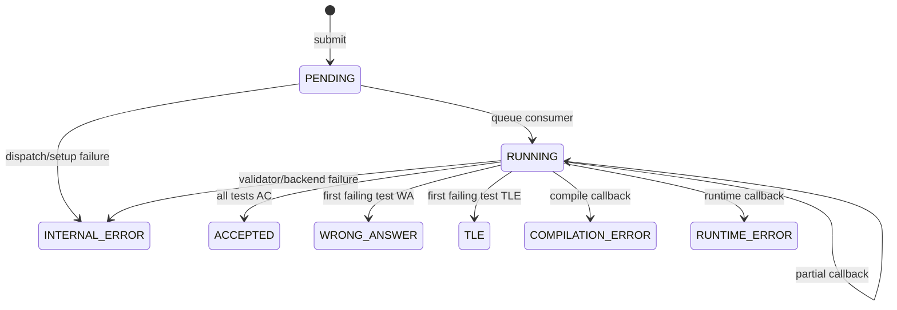
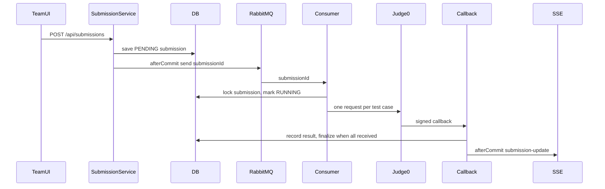

# System Analysis Packet: Submission Judging, RabbitMQ, and Judge0

## 1. Scope

This packet covers official scoring submissions: submit validation, active contest/problem checks, moderation guards, after-commit RabbitMQ publish, queue consumer claim/lock, `judgeRunId`, Judge0 one-request-per-test-case dispatch, signed callback URLs, stale/duplicate callback handling, compare policies, custom validators, final verdict aggregation, zero-test behavior, SSE/scoreboard events, and publish-failure risks. It excludes non-scoring Run, which is packet 07, and rejudge, which is packet 08.

## 2. Local Inspection Summary

* Current working directory: `C:\Users\user\Desktop\AuraC2`
* Git branch if available: `main...origin/main`
* Git status summary: pre-existing non-doc changes were observed; only packet docs are written by this task.
* Important searched folders: `backend/src/main/java/com/server/contestControl/submissionServer`, `contestServer/repository`, `contestServer/service`, `shared/sse`, `UI/src/team`.
* Tests inspected: submission, consumer, Judge0, callback, comparator, validator tests were listed. Tests were not run.

## 3. Files Inspected

| File path | Purpose in this subsystem | Why it matters |
| --------- | ------------------------- | -------------- |
| `backend/src/main/java/com/server/contestControl/submissionServer/controller/SubmissionController.java` | Submission REST API | Team/admin submit/history entry points |
| `backend/src/main/java/com/server/contestControl/submissionServer/service/submission/SubmissionService.java` | Submit service | Validates and persists submissions, publishes after commit |
| `backend/src/main/java/com/server/contestControl/submissionServer/entity/Submission.java` | Submission entity | Verdict and judgeRunId state |
| `backend/src/main/java/com/server/contestControl/submissionServer/entity/SubmissionJudgeResult.java` | Per-test result entity | Unique callback idempotency model |
| `backend/src/main/java/com/server/contestControl/submissionServer/config/RabbitMQConfig.java` | Queue config | Defines submission queue/exchange/routing keys |
| `backend/src/main/java/com/server/contestControl/submissionServer/queue/submission/SubmissionProducer.java` | Queue producer | Publishes committed submission id |
| `backend/src/main/java/com/server/contestControl/submissionServer/queue/submission/SubmissionConsumer.java` | Queue consumer | Locks submission and dispatches Judge0 |
| `backend/src/main/java/com/server/contestControl/submissionServer/service/judge/Judge0Service.java` | Judge0 async dispatch | Builds one request per test case and callback URL |
| `backend/src/main/java/com/server/contestControl/submissionServer/service/callback/CallbackHandler.java` | Callback controller | Public signed Judge0 callback entry point |
| `backend/src/main/java/com/server/contestControl/submissionServer/service/callback/Judge0CallbackService.java` | Callback processing | Stale/duplicate handling and aggregation |
| `backend/src/main/java/com/server/contestControl/submissionServer/service/callback/Judge0CallbackSignatureService.java` | Signature service | HMAC signing and production secret guard |
| `backend/src/main/java/com/server/contestControl/submissionServer/service/compare/OutputComparator.java` | Built-in comparison | EXACT, normalized, token, float compare |
| `backend/src/main/java/com/server/contestControl/submissionServer/service/validator/CustomValidatorService.java` | Custom output validation | Runs validator through Judge0 synchronously |
| `backend/src/main/java/com/server/contestControl/submissionServer/util/LanguageMapper.java` | Language mapping | Converts frontend language names to Judge0 ids |
| `backend/src/main/resources/db/migration/V1__baseline_schema.sql` | Submission schema | Defines submissions and judge result uniqueness |

## 4. Main Components

| Component | Path | Type | Responsibility | Important methods/functions |
| --------- | ---- | ---- | -------------- | --------------------------- |
| `SubmissionController` | `submissionServer/controller` | REST controller | Submit and submission history | endpoint methods |
| `SubmissionService` | `service/submission/SubmissionService.java` | Service | Official submit validation/persistence | `submitCode`, `getSubmissionById`, `getAllSubmission` |
| `Submission` | `entity/Submission.java` | Entity | Official attempt | `verdict`, `judgeRunId`, `@PrePersist` |
| `SubmissionJudgeResult` | `entity/SubmissionJudgeResult.java` | Entity | Per-test callback result | `judgeRunId`, `testCaseNumber`, unique constraint |
| `SubmissionProducer` | `queue/submission/SubmissionProducer.java` | RabbitMQ producer | Publish submission id | `sendSubmission` |
| `SubmissionConsumer` | `queue/submission/SubmissionConsumer.java` | RabbitMQ consumer | Claim submission and dispatch Judge0 | `handleSubmission` |
| `Judge0Service` | `service/judge/Judge0Service.java` | HTTP integration | Async Judge0 request per test | `sendSingleTest` |
| `CallbackHandler` | `service/callback/CallbackHandler.java` | REST controller | Signed callback endpoint | callback methods |
| `Judge0CallbackService` | `service/callback/Judge0CallbackService.java` | Service | Record/aggregate callback results | `handleJudge0Callback` |
| `OutputComparator` | `service/compare/OutputComparator.java` | Service | Built-in output compare | `compare` |
| `CustomValidatorService` | `service/validator/CustomValidatorService.java` | Service | Validator-driven compare | `validate` |
| `SubmissionSsePublisher` | `submissionServer/sse` | Publisher | Team/admin live submission updates | `buildEvent`, `dispatch` |

## 5. Entry Points

| Entry point | Trigger | File/class | Method/function | Auth/role requirement | Request/response model |
| ----------- | ------- | ---------- | --------------- | --------------------- | ---------------------- |
| `POST /api/submissions` | Team/admin official submit | `SubmissionController` | submit endpoint | TEAM/ADMIN by security config | `SubmissionRequest` -> `SubmissionResponse` |
| `GET /api/submissions/{id}` | Submission detail | `SubmissionController` | detail endpoint | TEAM/ADMIN; owner or admin in service | `SubmissionResponse` |
| `GET /api/submissions/my` | Team problem history | `SubmissionController` | my by problem | TEAM/ADMIN | `List<SubmissionResponse>` |
| `GET /api/submissions/my/all` | Team all history | `SubmissionController` | all mine | TEAM | `List<SubmissionResponse>` |
| `GET /api/admin/users/submissions` | Admin submissions view | `AdminController` | `getAllSubmissions` | ADMIN | `List<SubmissionResponse>` |
| RabbitMQ `submissionQueue` | Producer publishes id | `SubmissionConsumer` | `handleSubmission` | Internal | Long submission id |
| `PUT /api/callback/judge0/{submissionId}/{judgeRunId}/{testCaseNumber}` | Judge0 callback | `CallbackHandler` | signed callback | Public path plus signature | `Judge0Response` -> text/HTTP status |
| `PUT /api/callback/judge0/{submissionId}/{testCaseNumber}` | Legacy callback | `CallbackHandler` | legacy callback | Public path plus signature | `Judge0Response` |
| SSE submission streams | Frontend connects | `SubmissionStreamController` | stream endpoints | TEAM/ADMIN | `submission-update` events |

## 6. Runtime Flow

1. Team submits source through `SubmissionService.submitCode`.
2. Service loads current authenticated `User`, gets active contest via `ContestService.getContestEntity`, loads `Problem`, checks optional request contest id, checks problem belongs to active contest, and calls `ContestTeamModerationService.assertSubmitAllowed`.
3. Service saves a `Submission` with verdict PENDING and returns `SubmissionResponse`. `Submission.@PrePersist` defaults `createdAt`, `verdict`, and `judgeRunId` if needed.
4. While still in the transaction, service builds a submission CREATED SSE event, then registers an after-commit task to publish the submission id to RabbitMQ and dispatch the CREATED SSE event.
5. `SubmissionConsumer.handleSubmission` receives the id, locks the submission with contest/problem/user, skips if verdict is not PENDING/PENDING_REJUDGE, reads all official test cases ordered by id, maps language, handles zero tests as INTERNAL_ERROR, increments/reserves `judgeRunId`, marks RUNNING, and publishes RUNNING SSE.
6. For each official test case, `Judge0Service.sendSingleTest` sends a Judge0 request with source code, language id, stdin, expected output according to expected-output policy, problem resource limits, and signed callback URL containing submission id, judgeRunId, test number, and HMAC signature.
7. Judge0 callback enters `CallbackHandler`, which verifies signature through `Judge0CallbackSignatureService`.
8. `Judge0CallbackService.handleJudge0Callback` locks the submission row, rejects stale callbacks where callback judgeRunId differs from current judgeRunId, ignores callbacks for non-RUNNING submissions, checks test number bounds, ignores non-terminal statuses, and applies custom validator or built-in comparison if needed.
9. Callback result is inserted into `SubmissionJudgeResult`. Existing result or DB unique violation is treated as duplicate callback and ignored.
10. If not all expected test results are received, the service returns a waiting message. Once all are present, it computes first non-AC by test number as final verdict, or ACCEPTED if all accepted, stores max execution time/memory, saves submission, and after commit dispatches FINALIZED SSE plus `SubmissionFinalizedEvent` for scoreboard.

## 7. Code Evidence

### Evidence: Submit validation and after-commit queue publish

Path: `backend/src/main/java/com/server/contestControl/submissionServer/service/submission/SubmissionService.java`

```java
Contest contest = contestService.getContestEntity();
Problem problem = problemService.getProblemEntity(request.problemId());

if (request.contestId() != null && !request.contestId().equals(contest.getId())) {
    throw new InvalidSubmissionRequestException("Submission contestId does not match the active contest.");
}
if (!problem.getContest().getId().equals(contest.getId())) {
    throw new InvalidSubmissionRequestException("Problem does not belong to the active contest.");
}

moderationService.assertSubmitAllowed(contest, user);

Submission savedSubmission = submissionRepository.save(submission);
SubmissionStreamEvent createdEvent =
        submissionSsePublisher.buildEvent(SubmissionStreamEventType.CREATED, savedSubmission);
publishAfterCommit(() -> {
    publishSubmission(savedSubmission.getId());
    submissionSsePublisher.dispatch(createdEvent);
});
```

This proves:

* Official submit requires active contest/problem membership and moderation submit permission.
* RabbitMQ publish happens after DB commit.

### Evidence: Queue consumer claim and Judge0 dispatch

Path: `backend/src/main/java/com/server/contestControl/submissionServer/queue/submission/SubmissionConsumer.java`

```java
@RabbitListener(queues = RabbitMQConfig.SUBMISSION_QUEUE)
@Transactional
public void handleSubmission(Long submissionId) {
    Submission submission = submissionRepository.findByIdWithContestProblemUserForUpdate(submissionId)
            .orElseThrow(() -> new RuntimeException("Submission not found"));

    if (!QUEUEABLE_VERDICTS.contains(submission.getVerdict())) {
        return;
    }

    List<TestCase> testCases = testCaseRepository.findByProblemIdOrderByIdAsc(submission.getProblem().getId());
    if (submission.getVerdict() == Verdict.PENDING) {
        Long nextJudgeRunId = submission.getJudgeRunId() == null ? 1L : submission.getJudgeRunId() + 1;
        submission.setJudgeRunId(nextJudgeRunId);
    }
    submission.setVerdict(Verdict.RUNNING);
    submissionRepository.save(submission);

    for (int i = 0; i < testCases.size(); i++) {
        judge0Service.sendSingleTest(submission, testCases.get(i), i + 1, languageId);
    }
}
```

This proves:

* Consumer row-locks and only processes queueable verdicts.
* New PENDING submissions increment `judgeRunId` before dispatch.
* Judge0 receives one request per official test case.

### Evidence: Callback stale/duplicate/final aggregation

Path: `backend/src/main/java/com/server/contestControl/submissionServer/service/callback/Judge0CallbackService.java`

```java
Submission submission = submissionRepository.findByIdForUpdate(submissionId)
        .orElseThrow(() -> new RuntimeException("Submission not found"));

if (isStaleCallback(submission, judgeRunId)) {
    return ResponseEntity.ok("Stale callback ignored");
}
if (submission.getVerdict() != Verdict.RUNNING) {
    return ResponseEntity.ok("Submission is no longer running");
}

boolean recorded = recordJudgeResult(submission, effectiveJudgeRunId,
        testCaseNumber, verdict, response, comparisonVerdict.diagnostic());
if (!recorded) {
    return ResponseEntity.ok("Duplicate callback ignored");
}

long receivedCount = judgeResultRepository.countBySubmission_IdAndJudgeRunId(
        submissionId, effectiveJudgeRunId);
if (receivedCount < expectedTestCaseCount) {
    return ResponseEntity.ok("Test Case " + testCaseNumber + " received; waiting");
}

Verdict finalVerdict = finalVerdict(results);
submission.setVerdict(finalVerdict);
submission.setExecutionTime(maxExecutionTime(results));
submission.setMemoryUsage(maxMemoryUsage(results));
```

This proves:

* Stale callbacks are rejected by `judgeRunId`.
* Duplicate callbacks are ignored.
* Final verdict waits until all expected cases have terminal results.

### Evidence: Judge result uniqueness in schema

Path: `backend/src/main/resources/db/migration/V1__baseline_schema.sql`

```sql
CREATE TABLE submission_judge_results (
    id BIGSERIAL PRIMARY KEY,
    submission_id BIGINT NOT NULL,
    judge_run_id BIGINT NOT NULL,
    test_case_number INTEGER NOT NULL,
    verdict VARCHAR(255) NOT NULL,
    CONSTRAINT fk_submission_judge_results_submission
        FOREIGN KEY (submission_id) REFERENCES submissions (id),
    CONSTRAINT uk_submission_judge_result_run_case
        UNIQUE (submission_id, judge_run_id, test_case_number)
);
```

This proves:

* Database uniqueness enforces one result per submission/run/testcase.
* Duplicate callback handling has a DB backstop.

## 8. Data Model

| Model | Type | Path | Important fields | Relationships/constraints | Runtime meaning |
| ----- | ---- | ---- | ---------------- | ------------------------- | --------------- |
| `Submission` | Entity | `submissionServer/entity/Submission.java` | `contest`, `problem`, `user`, `code`, `language`, `verdict`, `createdAt`, `executionTime`, `memoryUsage`, `judgeRunId` | FKs contest/problem/user; indexes in V1 | Official scoring attempt |
| `SubmissionJudgeResult` | Entity | `submissionServer/entity/SubmissionJudgeResult.java` | `submission`, `judgeRunId`, `testCaseNumber`, verdict, Judge0 status, diagnostic, receivedAt | Unique `(submission_id, judge_run_id, test_case_number)` | Per-test callback result and idempotency |
| `Verdict` | Enum | `submissionServer/enums/Verdict.java` | ACCEPTED, WRONG_ANSWER, TLE, COMPILATION_ERROR, RUNTIME_ERROR, INTERNAL_ERROR, PENDING, PENDING_REJUDGE, RUNNING | Stored as string | Submission lifecycle and scoring result |
| `TestCase` | Entity | `contestServer/entity/TestCase.java` | input/expected/public flag | FK problem | Judge0 test source |
| `Problem` | Entity | `contestServer/entity/Problem.java` | time/memory limits, compare policy, validator config | FK contest | Judge resource and comparison policy |
| RabbitMQ constants | Config | `RabbitMQConfig.java` | queue/exchange/routing keys | Durable queue config | Internal submit pipeline |

## 9. Security and Authorization

* `/api/submissions/**` requires TEAM or ADMIN by security config.
* `SubmissionService.getSubmissionById` enforces owner-or-admin before returning a submission.
* Team history endpoints infer user from token/request and return only that user's submissions.
* Admin submissions endpoint is under `/api/admin/users/submissions`.
* Judge0 callback path is public in security config but protected by HMAC signature verification.
* `SubmissionResponse` includes source code; this is sensitive but bounded by owner/admin access for normal endpoints.

## 10. Transactions and Consistency

* `SubmissionService.submitCode` is transactional and publishes RabbitMQ/SSE after commit.
* `SubmissionConsumer.handleSubmission` is transactional and locks the submission row with repository `findByIdWithContestProblemUserForUpdate`.
* `Judge0CallbackService.handleJudge0Callback` is transactional and locks submission row.
* Callback finalization publishes SSE and scoreboard event after commit.
* Publish failure after submission commit is logged and not retried by an outbox.
* Consumer zero-test and internal dispatch error paths publish SSE/events inside the consumer transaction in inspected code, not through the same after-commit helper.

## 11. Async / Events / Queues / SSE

* RabbitMQ:
  * Queue `submissionQueue`.
  * Exchange/routing key configured in `RabbitMQConfig`.
  * Producer sends `Long submissionId`.
  * Consumer listens with `@RabbitListener`.
* Judge0:
  * Asynchronous official judging uses callback URLs signed by HMAC.
  * One Judge0 request is sent per official test case.
* SSE:
  * Submission CREATED, RUNNING, FINALIZED, REJUDGE_QUEUED events are sent to team/admin stream audiences.
  * Finalized/rejudge events drive scoreboard SSE via domain events.
* Empty/scaffolded queue classes for result queue were found; no runtime use proven.

## 12. State Transitions

| From | To | Trigger | Code location | Guard/validation |
| ---- | -- | ------- | ------------- | ---------------- |
| none | PENDING | Official submit | `SubmissionService.submitCode`, `Submission.@PrePersist` | Active contest/problem/moderation |
| PENDING | RUNNING | Queue consumer | `SubmissionConsumer.handleSubmission` | Queueable verdict, language maps, tests exist |
| PENDING | INTERNAL_ERROR | Queue consumer | `SubmissionConsumer.handleSubmission` | zero tests or unsupported language/dispatch failure |
| RUNNING | RUNNING | Partial callback | `Judge0CallbackService.handleJudge0Callback` | terminal result recorded but not all tests received |
| RUNNING | final verdict | Last callback | `Judge0CallbackService.handleJudge0Callback` | all expected tests recorded |
| RUNNING | ignored | Stale/duplicate callback | `Judge0CallbackService` | judgeRunId mismatch or existing result |



## 13. Mermaid Skeletons



## 14. Tests

| Test file | What it verifies | Important test methods | Missing coverage |
| --------- | ---------------- | ---------------------- | ---------------- |
| `submissionServer/service/submission/SubmissionServiceValidationTest.java` | Submit validation | Inspect file for methods | Tests not run here |
| `submissionServer/queue/submission/SubmissionConsumerTest.java` | Queue consumer behavior | Inspect file for methods | Tests not run here |
| `submissionServer/service/judge/Judge0ServiceTest.java` | Judge0 request building | Inspect file for methods | Tests not run here |
| `submissionServer/service/callback/Judge0CallbackServiceTest.java` | Callback handling | Inspect file for methods | Tests not run here |
| `submissionServer/service/callback/CallbackHandlerSecurityTest.java` | Signature/callback security | Inspect file for methods | Tests not run here |
| `submissionServer/service/compare/OutputComparatorTest.java` | Built-in compare policies | Inspect file for methods | Tests not run here |
| `submissionServer/service/validator/CustomValidatorServiceTest.java` | Custom validator behavior | Inspect file for methods | Tests not run here |

## 15. Edge Cases

| Edge case | Code location | Current behavior | Risk level |
| --------- | ------------- | ---------------- | ---------- |
| RabbitMQ publish fails after submit commit | `SubmissionService.publishSubmission` | Logs error; submission remains committed PENDING | High |
| Problem has zero test cases | `SubmissionConsumer.handleSubmission` | Marks INTERNAL_ERROR and publishes event inside transaction | Medium |
| Duplicate Judge0 callback | `Judge0CallbackService.recordJudgeResult`, DB unique constraint | Ignored | Low |
| Stale callback after rejudge | `Judge0CallbackService.isStaleCallback` | Ignored by judgeRunId mismatch | Low |
| Custom validator fails to dispatch | `CustomValidatorService` | Can convert comparison to INTERNAL_ERROR | Medium |
| Unsupported language | `SubmissionConsumer.handleSubmission` | Marks INTERNAL_ERROR | Low |

## 16. Risks / Weaknesses / Gaps

* No outbox or retry table for RabbitMQ publish after commit.
* `ResultProducer`/`ResultConsumer` are scaffolded/empty while `resultQueue` is configured.
* Some consumer failure paths publish SSE/domain events before commit.
* Official submissions expose code in responses to owner/admin; this is expected but sensitive.
* Team submission history methods parse token from `HttpServletRequest` rather than using the `SecurityContext` in inspected service code.

## 17. Final Evidence Table

| Claim | Evidence path | Class/method/field | Confidence |
| ----- | ------------- | ------------------ | ---------- |
| Submit validates active contest/problem | `SubmissionService.java` | `submitCode` | Strong |
| RabbitMQ publish is after commit | `SubmissionService.java` | `publishAfterCommit` | Strong |
| Consumer locks submission and dispatches per test | `SubmissionConsumer.java` | `handleSubmission` | Strong |
| Callbacks are signed and stale-protected | `CallbackHandler.java`, `Judge0CallbackSignatureService.java`, `Judge0CallbackService.java` | callback methods, `isStaleCallback` | Strong |
| Duplicate callback idempotency has DB constraint | `V1__baseline_schema.sql` | `uk_submission_judge_result_run_case` | Strong |
| Publish failure risk exists | `SubmissionService.publishSubmission` | catch logs after commit | Strong |
