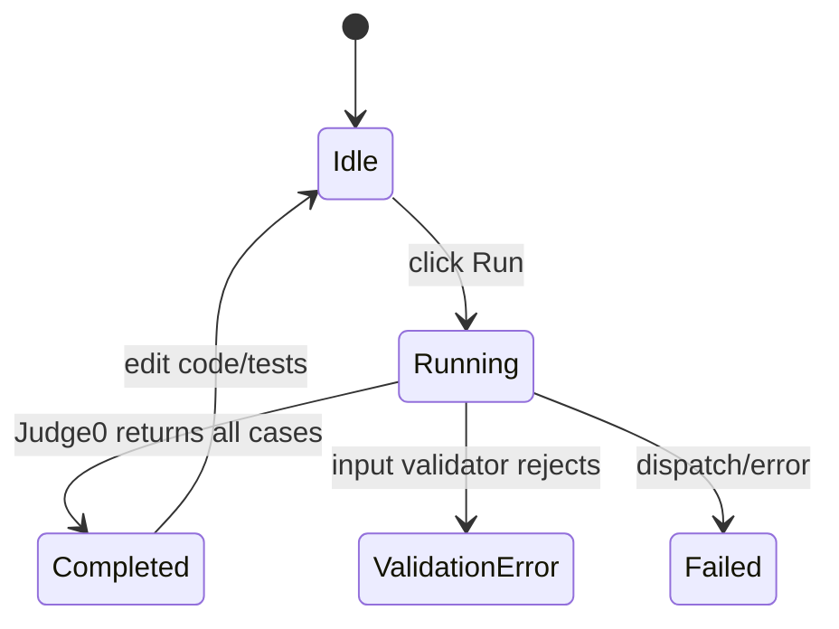
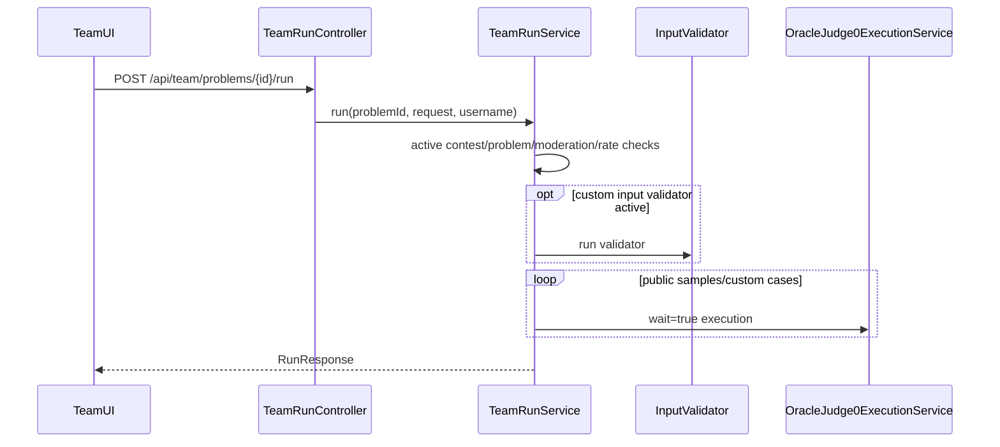

# System Analysis Packet: Team Run and Custom Tests

## 1. Scope

This packet covers the non-scoring team Run workflow: public samples, owner-scoped saved custom tests, inline custom tests, active input validator usage, synchronous Judge0 execution, no `Submission` rows, no scoreboard or penalty impact, rate limits, moderation guards, and transient UI results. It excludes official submission judging, covered in packet 06.

## 2. Local Inspection Summary

* Current working directory: `C:\Users\user\Desktop\AuraC2`
* Git branch if available: `main...origin/main`
* Git status summary: pre-existing non-doc changes were observed; only docs are modified.
* Important searched folders: `backend/src/main/java/com/server/contestControl/submissionServer/run`, `contestServer/oracle/service`, `contestServer/oracle/entity`, `UI/src/team`.
* Tests inspected: `TeamRunServiceTest` and `OracleJudge0ExecutionServiceTest` were listed. Tests were not run.

## 3. Files Inspected

| File path | Purpose in this subsystem | Why it matters |
| --------- | ------------------------- | -------------- |
| `backend/src/main/java/com/server/contestControl/submissionServer/run/controller/TeamRunController.java` | Run/custom-test REST API | Defines team-only endpoints |
| `backend/src/main/java/com/server/contestControl/submissionServer/run/service/TeamRunService.java` | Main run service | Validates context, saved tests, rate limits, synchronous execution |
| `backend/src/main/java/com/server/contestControl/submissionServer/run/entity/UserCustomTestCase.java` | Custom test entity | Owner-scoped saved custom tests |
| `backend/src/main/java/com/server/contestControl/submissionServer/run/repository/UserCustomTestCaseRepository.java` | Custom test queries | Ensures owner/contest/problem scoping |
| `backend/src/main/java/com/server/contestControl/contestServer/oracle/service/OracleJudge0ExecutionService.java` | Sync Judge0 runner | Runs code with `wait=true` |
| `backend/src/main/java/com/server/contestControl/contestServer/oracle/entity/InputValidator.java` | Input validator config | Optional validation for custom run inputs |
| `backend/src/main/resources/db/migration/V9__team_custom_run_tests.sql` | Custom test schema | Defines saved custom tests table |
| `UI/src/team/TeamWorkspace.tsx` | Team workspace | Loads samples/custom tests and stores run response |
| `UI/src/team/components/CodeEditor.tsx` | Code editor | Calls Run and Submit as separate actions |
| `UI/src/team/components/ProblemStatementPanel.tsx` | Test Cases tab | Displays samples/custom tests/run results |

## 4. Main Components

| Component | Path | Type | Responsibility | Important methods/functions |
| --------- | ---- | ---- | -------------- | --------------------------- |
| `TeamRunController` | `submissionServer/run/controller/TeamRunController.java` | REST controller | Team custom tests and run endpoints | `getCustomTests`, `createCustomTest`, `updateCustomTest`, `deleteCustomTest`, `run` |
| `TeamRunService` | `submissionServer/run/service/TeamRunService.java` | Service | Non-scoring execution and saved custom test management | `run`, `createCustomTest`, `updateCustomTest`, `deleteCustomTest` |
| `UserCustomTestCase` | `submissionServer/run/entity/UserCustomTestCase.java` | Entity | Saved custom test input/expected output | `owner`, `contest`, `problem`, `inputData`, `expectedOutput` |
| `UserCustomTestCaseRepository` | `submissionServer/run/repository` | Repository | Owner-scoped lookup | query methods by owner/contest/problem |
| `OracleJudge0ExecutionService` | `contestServer/oracle/service` | Service | Synchronous Judge0 execution | `run` |
| `InputValidator` | `contestServer/oracle/entity` | Entity | Optional active input validator program | `active`, `source`, `languageId` |
| `TeamWorkspace` | `UI/src/team/TeamWorkspace.tsx` | React component | Loads samples/custom tests and handles run results | handlers for custom tests/run |
| `CodeEditor` | `UI/src/team/components/CodeEditor.tsx` | React component | Run/Submit controls | run/submit handlers |

## 5. Entry Points

| Entry point | Trigger | File/class | Method/function | Auth/role requirement | Request/response model |
| ----------- | ------- | ---------- | --------------- | --------------------- | ---------------------- |
| `GET /api/team/problems/{problemId}/custom-tests` | Team opens Test Cases tab | `TeamRunController` | `getCustomTests` | TEAM | `List<CustomTestCaseResponse>` |
| `POST /api/team/problems/{problemId}/custom-tests` | Team saves custom test | `TeamRunController` | `createCustomTest` | TEAM | create request -> response |
| `PUT /api/team/problems/{problemId}/custom-tests/{customTestId}` | Team edits custom test | `TeamRunController` | `updateCustomTest` | TEAM | update request -> response |
| `DELETE /api/team/problems/{problemId}/custom-tests/{customTestId}` | Team deletes custom test | `TeamRunController` | `deleteCustomTest` | TEAM | 204 |
| `POST /api/team/problems/{problemId}/run` | Team clicks Run | `TeamRunController` | `run` | TEAM | `RunRequest` -> `RunResponse` |
| Synchronous Judge0 call | Run service executes case | `OracleJudge0ExecutionService` | `run` | Internal | `SandboxExecutionResult` |
| UI Run button | Team clicks Run | `CodeEditor` | run handler | TEAM UI | `RunResponse` shown transiently |

## 6. Runtime Flow

1. Team workspace loads contest problems, public samples, and saved custom tests for the selected problem.
2. Saved custom tests are scoped by authenticated team, active contest, problem, and custom test id. Teams cannot fetch another owner's saved tests through repository methods used by service.
3. Creating/updating custom tests validates active contest/problem context, normalizes input, enforces maximum saved test count, and stores optional expected output.
4. Clicking Run calls `TeamRunService.run`. The service validates active contest, verifies problem belongs to active contest, checks moderation workspace and run permission, applies in-memory per-user rate limiting, validates source/language size, and builds run cases.
5. Run cases can include public samples, selected saved custom tests, and inline custom cases. Hidden official tests are not used.
6. If an active input validator exists, custom inputs are validated by running validator source through Judge0. Invalid input returns a validation error result for that case.
7. Each case is executed synchronously through `OracleJudge0ExecutionService.run`, which rewrites Judge0 URL to `wait=true&base64_encoded=true`.
8. The service compares output using direct Judge0 expected output, custom validator, or `OutputComparator` depending on case/problem configuration.
9. The service returns a `RunResponse` to the UI. It does not create `Submission` rows, does not publish RabbitMQ messages, does not emit scoreboard events, and does not affect penalty.

## 7. Code Evidence

### Evidence: Synchronous Judge0 for run/oracle

Path: `backend/src/main/java/com/server/contestControl/contestServer/oracle/service/OracleJudge0ExecutionService.java`

```java
public SandboxExecutionResult run(
        String source,
        int languageId,
        String stdin,
        String expectedOutput,
        Double cpuTimeLimitSeconds,
        Integer memoryLimitKilobytes
) {
    Judge0SubmissionDTO dto = new Judge0SubmissionDTO(
            source, languageId, stdin, expectedOutput, null,
            cpuTimeLimitSeconds, memoryLimitKilobytes
    ).base64Encoded();

    Judge0Response response = judge0RestTemplate.postForObject(
            synchronousJudge0Url(),
            dto,
            Judge0Response.class
    );
    return fromResponse(response);
}

String synchronousJudge0Url() {
    return UriComponentsBuilder.fromUriString(judge0Url)
            .replaceQueryParam("wait", "true")
            .replaceQueryParam("base64_encoded", "true")
            .toUriString();
}
```

This proves:

* Team Run uses synchronous Judge0 execution through this shared service.
* It is separate from official asynchronous callback judging.

### Evidence: Custom test schema

Path: `backend/src/main/resources/db/migration/V9__team_custom_run_tests.sql`

```sql
CREATE TABLE user_custom_test_cases (
    id BIGSERIAL PRIMARY KEY,
    problem_id BIGINT NOT NULL,
    contest_id BIGINT NOT NULL,
    owner_user_id BIGINT NOT NULL,
    input_data TEXT NOT NULL,
    expected_output TEXT,
    created_at TIMESTAMP(6) NOT NULL,
    updated_at TIMESTAMP(6) NOT NULL,
    CONSTRAINT fk_user_custom_tests_problem
        FOREIGN KEY (problem_id) REFERENCES problems (id),
    CONSTRAINT fk_user_custom_tests_contest
        FOREIGN KEY (contest_id) REFERENCES contests (id),
    CONSTRAINT fk_user_custom_tests_owner
        FOREIGN KEY (owner_user_id) REFERENCES users (id)
);
```

This proves:

* Saved custom tests are persisted separately from official `test_cases`.
* Ownership is explicit through `owner_user_id`.

### Evidence: Team workspace separates Run and Submit

Path: `UI/src/team/TeamWorkspace.tsx`

```tsx
<CodeEditor
  contestId={contest.id}
  problem={selectedProblem}
  customTestCaseIds={customTestIds}
  submitEnabled={teamAccess.submitEnabled}
  runEnabled={teamAccess.runEnabled}
  onSubmitted={handleSubmitted}
  onRunStarted={handleRunStarted}
  onRunCompleted={handleRunCompleted}
  onRunFailed={handleRunFailed}
  onRunInvalidated={handleRunInvalidated}
/>
```

This proves:

* Run and Submit are separate UI flows.
* Moderation flags separately disable submit and run controls.

## 8. Data Model

| Model | Type | Path | Important fields | Relationships/constraints | Runtime meaning |
| ----- | ---- | ---- | ---------------- | ------------------------- | --------------- |
| `UserCustomTestCase` | Entity | `submissionServer/run/entity/UserCustomTestCase.java` | `problem`, `contest`, `owner`, `inputData`, `expectedOutput`, timestamps | FKs problem/contest/user, index owner/contest/problem | Team-owned saved non-scoring test |
| `RunRequest` | DTO | `submissionServer/run/dto` | source, language, include public samples, selected custom ids, inline custom tests | Request validation in service | Non-scoring execution request |
| `RunResponse` | DTO | `submissionServer/run/dto` | case results and summary | Response only, not persisted as submission | Transient UI result |
| `InputValidator` | Entity | `contestServer/oracle/entity/InputValidator.java` | problem, languageId, source, hash, active | FK problem/user | Optional custom input validation |
| `SandboxExecutionResult` | Record | `OracleJudge0ExecutionService.java` | verdict, status, stdout, stderr, time, memory, diagnostic | Runtime only | Synchronous Judge0 result |

## 9. Security and Authorization

* All `TeamRunController` endpoints are TEAM-only.
* Service methods use authenticated username and user lookup, then owner-scope custom tests.
* `ContestTeamModerationService.assertWorkspaceVisible` and `assertRunAllowed` prevent disqualified or run-disabled teams from using the workspace/run.
* Run does not expose hidden official test cases. It uses public samples and team-owned custom tests.

## 10. Transactions and Consistency

* Custom test create/update/delete methods are transactional.
* Run itself is non-transactional in inspected summary and performs synchronous external Judge0 calls.
* No `Submission` or `SubmissionJudgeResult` writes occur in the run flow.
* Rate limiting is in-memory per user and therefore not shared across nodes.
* Saved custom test limits are enforced in service code; no unique DB constraint was found for custom test content.

## 11. Async / Events / Queues / SSE

The team Run subsystem has no RabbitMQ, Judge0 callback, SSE, or scoreboard event behavior. It performs synchronous HTTP calls to Judge0 using `wait=true` and returns the result directly to the request.

## 12. State Transitions

| From | To | Trigger | Code location | Guard/validation |
| ---- | -- | ------- | ------------- | ---------------- |
| none | Custom test saved | Team POST custom test | `TeamRunService.createCustomTest` | active contest/problem, owner, count limit |
| Custom test | Updated | Team PUT custom test | `TeamRunService.updateCustomTest` | owner/contest/problem scoped |
| Custom test | Deleted | Team DELETE custom test | `TeamRunService.deleteCustomTest` | owner/contest/problem scoped |
| Idle UI | Running | Team clicks Run | `TeamRunService.run`, `CodeEditor` | run enabled, rate limit, language/source validation |
| Running | Run completed | Synchronous Judge0 responses | `TeamRunService.run` | per-case result aggregation |
| Running | Validation error | Input validator rejects custom input | `TeamRunService` input validator path | active input validator |



## 13. Mermaid Skeletons



## 14. Tests

| Test file | What it verifies | Important test methods | Missing coverage |
| --------- | ---------------- | ---------------------- | ---------------- |
| `submissionServer/run/service/TeamRunServiceTest.java` | Team Run behavior, samples/custom tests, owner scoping, validators | Inspect file for exact methods | Tests not run here |
| `contestServer/oracle/service/OracleJudge0ExecutionServiceTest.java` | Synchronous Judge0 URL/request behavior | Inspect file for exact methods | Tests not run here |
| `contestServer/runlab/service/AdminRunLabServiceTest.java` | Admin Run Lab, related sync execution path | Inspect file for exact methods | Not team-specific |

## 15. Edge Cases

| Edge case | Code location | Current behavior | Risk level |
| --------- | ------------- | ---------------- | ---------- |
| Hidden tests expected in Run | `TeamRunService` | Not used; public samples/custom cases only | Low |
| Run-disabled team | `ContestTeamModerationService.assertRunAllowed` | Request rejected | Low |
| Many rapid runs | `TeamRunService` in-memory limiter | Limited per user per process | Medium |
| Multi-node rate limiting | `TeamRunService` in-memory limiter | Not shared | Medium |
| Custom input validator fails | `TeamRunService`, `OracleJudge0ExecutionService` | Returns validation/error result | Medium |
| Judge0 slow/unavailable | Synchronous run | Request waits/fails; no queue fallback | Medium |

## 16. Risks / Weaknesses / Gaps

* Team Run rate limiting is process-local.
* Synchronous Judge0 calls can tie up request threads under load.
* Run results are transient and not stored, which is intentional but means no audit trail for teams.
* Input validator source is admin-managed and executed through Judge0; validator correctness is not guaranteed by framework.
* No scoreboard, submission, or penalty impact was found in code for Run.

## 17. Final Evidence Table

| Claim | Evidence path | Class/method/field | Confidence |
| ----- | ------------- | ------------------ | ---------- |
| Team Run uses synchronous Judge0 | `OracleJudge0ExecutionService.java` | `synchronousJudge0Url`, `run` | Strong |
| Saved custom tests are owner-scoped rows | `V9__team_custom_run_tests.sql`, `UserCustomTestCase.java` | `owner_user_id`, `owner` | Strong |
| Run and Submit are separate UI paths | `TeamWorkspace.tsx`, `CodeEditor.tsx` | separate props/handlers | Strong |
| Run has no official submission row | `TeamRunService.java` inspected, no `SubmissionRepository.save` in run path | `run` | Strong |
| Run does not affect scoreboard | no scoreboard event or submission write in run path | `TeamRunService.run` | Strong |
| Rate limiting is in-memory | `TeamRunService.java` | `ConcurrentMap<Long, Deque<Instant>>` | Strong |
