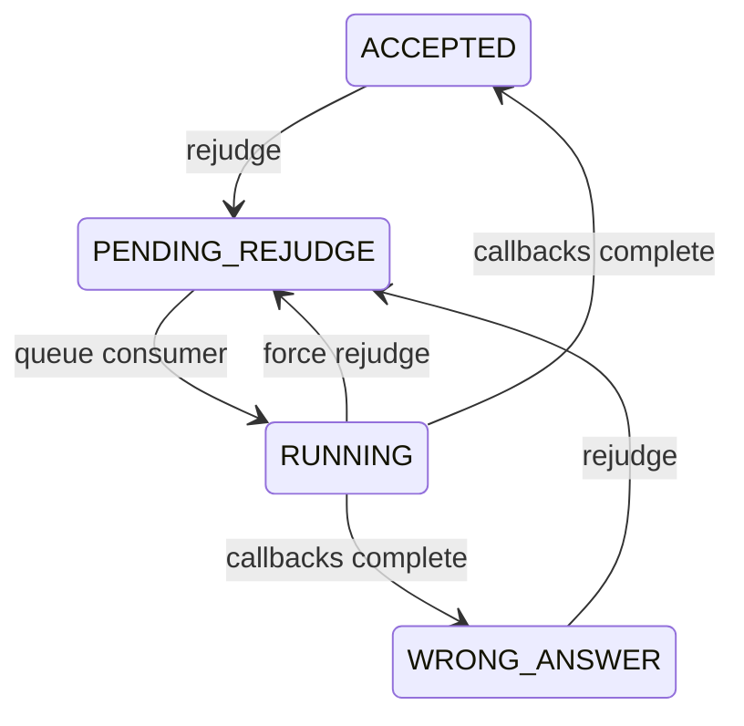
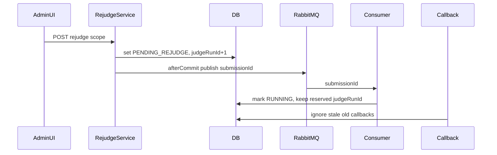

# System Analysis Packet: Rejudge

## 1. Scope

This packet covers admin rejudge operations for selected submissions, all submissions for a problem, and all submissions for a contest; normal versus force behavior; `judgeRunId` increment/superseding; stale callback protection; after-commit RabbitMQ publishing; SSE/scoreboard events; frontend rejudge UI; and response accuracy risks when publish fails. It excludes the normal official judging pipeline except where rejudge reuses it.

## 2. Local Inspection Summary

* Current working directory: `C:\Users\user\Desktop\AuraC2`
* Git branch if available: `main...origin/main`
* Git status summary: pre-existing non-doc changes were observed; only Markdown packets are created by this task.
* Important searched folders: `backend/src/main/java/com/server/contestControl/submissionServer/service/rejudge`, `controller`, `queue`, `sse`, `UI/src/admin/components`.
* Tests inspected: `RejudgeServiceTest` was listed. Tests were not run.

## 3. Files Inspected

| File path | Purpose in this subsystem | Why it matters |
| --------- | ------------------------- | -------------- |
| `backend/src/main/java/com/server/contestControl/submissionServer/controller/RejudgeController.java` | Admin rejudge REST API | Defines selected/problem/contest and force endpoints |
| `backend/src/main/java/com/server/contestControl/submissionServer/service/rejudge/RejudgeService.java` | Rejudge business logic | Reserves judgeRunId, sets PENDING_REJUDGE, publishes after commit |
| `backend/src/main/java/com/server/contestControl/submissionServer/entity/Submission.java` | Submission state | Stores verdict and judgeRunId |
| `backend/src/main/java/com/server/contestControl/submissionServer/queue/submission/SubmissionProducer.java` | RabbitMQ producer | Requeues submission ids |
| `backend/src/main/java/com/server/contestControl/submissionServer/queue/submission/SubmissionConsumer.java` | Reused queue consumer | Processes PENDING_REJUDGE without incrementing judgeRunId |
| `backend/src/main/java/com/server/contestControl/submissionServer/service/callback/Judge0CallbackService.java` | Callback protection | Rejects stale callback judgeRunId |
| `backend/src/main/java/com/server/contestControl/submissionServer/event/SubmissionRejudgeQueuedEvent.java` | Scoreboard event | Signals scoreboard updates for rejudge queueing |
| `UI/src/admin/components/RejudgeView.tsx` | Admin UI | Provides rejudge and force rejudge controls |
| `backend/src/test/java/com/server/contestControl/submissionServer/service/rejudge/RejudgeServiceTest.java` | Unit tests | Covers normal/force behavior per test names |

## 4. Main Components

| Component | Path | Type | Responsibility | Important methods/functions |
| --------- | ---- | ---- | -------------- | --------------------------- |
| `RejudgeController` | `submissionServer/controller/RejudgeController.java` | REST controller | Admin rejudge endpoints | selected/problem/contest methods |
| `RejudgeService` | `submissionServer/service/rejudge/RejudgeService.java` | Service | Select submissions, reserve run id, queue after commit | `rejudgeSelectedSubmissions`, `rejudgeProblem`, `rejudgeContest`, force variants |
| `SubmissionProducer` | `queue/submission/SubmissionProducer.java` | Producer | Send submission id back to queue | `sendSubmission` |
| `SubmissionConsumer` | `queue/submission/SubmissionConsumer.java` | Consumer | Processes `PENDING_REJUDGE` | `handleSubmission` |
| `Judge0CallbackService` | `service/callback/Judge0CallbackService.java` | Service | Reject old callbacks | `isStaleCallback`, `handleJudge0Callback` |
| `SubmissionSsePublisher` | `submissionServer/sse` | Publisher | Rejudge queued live update | `buildEvent`, `dispatch` |
| `RejudgeView` | `UI/src/admin/components/RejudgeView.tsx` | React component | Admin rejudge controls and force warning | UI action handlers |

## 5. Entry Points

| Entry point | Trigger | File/class | Method/function | Auth/role requirement | Request/response model |
| ----------- | ------- | ---------- | --------------- | --------------------- | ---------------------- |
| `POST /api/admin/rejudge/submissions` | Admin selected rejudge | `RejudgeController` | selected method | ADMIN | `RejudgeSubmissionsRequest` -> `RejudgeResponse` |
| `POST /api/admin/rejudge/problem/{problemId}` | Admin problem rejudge | `RejudgeController` | problem method | ADMIN | `RejudgeResponse` |
| `POST /api/admin/rejudge/contests/{contestId}` | Admin contest rejudge | `RejudgeController` | contest method | ADMIN | `RejudgeResponse` |
| `POST /api/admin/rejudge/force/submissions` | Admin selected force rejudge | `RejudgeController` | force selected | ADMIN | `RejudgeResponse` |
| `POST /api/admin/rejudge/force/problem/{problemId}` | Admin problem force rejudge | `RejudgeController` | force problem | ADMIN | `RejudgeResponse` |
| `POST /api/admin/rejudge/force/contests/{contestId}` | Admin contest force rejudge | `RejudgeController` | force contest | ADMIN | `RejudgeResponse` |
| RabbitMQ `submissionQueue` | Rejudge after-commit publish | `SubmissionConsumer` | `handleSubmission` | Internal | Long submission id |

## 6. Runtime Flow

1. Admin selects a rejudge scope in `RejudgeView` and calls one of the admin API functions.
2. `RejudgeService` validates scope: selected ids must be positive and nonempty; problem/contest ids must exist.
3. It loads submissions by selected ids, problem id, or contest id.
4. Normal rejudge skips active verdicts: PENDING, PENDING_REJUDGE, RUNNING.
5. Force rejudge queues both active and final submissions.
6. For each queued submission, service increments `judgeRunId`, sets verdict `PENDING_REJUDGE`, clears execution time/memory, and saves all queued rows.
7. It builds `REJUDGE_QUEUED` submission SSE events and `SubmissionRejudgeQueuedEvent` scoreboard events while entities are loaded.
8. After DB commit, service republishes each queued submission id to RabbitMQ and dispatches SSE/scoreboard events.
9. `SubmissionConsumer` processes PENDING_REJUDGE without incrementing `judgeRunId` again.
10. Old Judge0 callbacks still in flight are ignored because `Judge0CallbackService.isStaleCallback` compares callback judgeRunId to current submission judgeRunId.

## 7. Code Evidence

### Evidence: `RejudgeService` reserves new judgeRunId

Path: `backend/src/main/java/com/server/contestControl/submissionServer/service/rejudge/RejudgeService.java`

```java
for (Submission submission : submissions) {
    if (!force && ACTIVE_VERDICTS.contains(submission.getVerdict())) {
        skippedIds.add(submission.getId());
        continue;
    }

    Long currentRunId = submission.getJudgeRunId();
    Long nextJudgeRunId = (currentRunId == null) ? 1L : currentRunId + 1;
    submission.setJudgeRunId(nextJudgeRunId);
    submission.setVerdict(Verdict.PENDING_REJUDGE);
    submission.setExecutionTime(null);
    submission.setMemoryUsage(null);
    submissionsToQueue.add(submission);
    queuedIds.add(submission.getId());
}
```

This proves:

* Rejudge supersedes old callbacks by advancing `judgeRunId`.
* Normal rejudge skips active submissions unless force is used.

### Evidence: Rejudge publish after commit

Path: `backend/src/main/java/com/server/contestControl/submissionServer/service/rejudge/RejudgeService.java`

```java
submissionRepository.saveAll(submissionsToQueue);
publishAfterCommit(queuedIds);

registerAfterCommit(() -> {
    sseEvents.forEach(submissionSsePublisher::dispatch);
    scoreboardEvents.forEach(eventPublisher::publishEvent);
});
```

This proves:

* Queue republish and live events happen after DB commit.
* Response queued count is computed before publish success is known.

### Evidence: Consumer does not increment reserved rejudge run

Path: `backend/src/main/java/com/server/contestControl/submissionServer/queue/submission/SubmissionConsumer.java`

```java
if (submission.getVerdict() == Verdict.PENDING) {
    Long nextJudgeRunId = submission.getJudgeRunId() == null ? 1L : submission.getJudgeRunId() + 1;
    submission.setJudgeRunId(nextJudgeRunId);
}
// PENDING_REJUDGE: judgeRunId was already reserved by RejudgeService

submission.setVerdict(Verdict.RUNNING);
submissionRepository.save(submission);
```

This proves:

* Rejudge uses the run id reserved by `RejudgeService`.
* Normal PENDING submissions increment in consumer.

### Evidence: Stale callback rejection

Path: `backend/src/main/java/com/server/contestControl/submissionServer/service/callback/Judge0CallbackService.java`

```java
private boolean isStaleCallback(Submission submission, Long callbackJudgeRunId) {
    Long currentJudgeRunId = normalizeJudgeRunId(submission.getJudgeRunId());

    if (callbackJudgeRunId == null) {
        return currentJudgeRunId != 0L;
    }

    return !callbackJudgeRunId.equals(currentJudgeRunId);
}
```

This proves:

* Old callbacks from a previous judge run are ignored after rejudge advances the run id.

## 8. Data Model

| Model | Type | Path | Important fields | Relationships/constraints | Runtime meaning |
| ----- | ---- | ---- | ---------------- | ------------------------- | --------------- |
| `Submission` | Entity | `submissionServer/entity/Submission.java` | `verdict`, `judgeRunId`, `executionTime`, `memoryUsage` | FK contest/problem/user | Rejudge state is stored on the same official submission |
| `SubmissionJudgeResult` | Entity | `submissionServer/entity/SubmissionJudgeResult.java` | `judgeRunId`, `testCaseNumber`, verdict | Unique submission/run/case | Old results remain but current responses filter by current run |
| `RejudgeResponse` | DTO | `submissionServer/dto/RejudgeResponse.java` | scope, requested/found/queued/skipped ids, missing ids | Response body | Admin feedback |
| `SubmissionRejudgeQueuedEvent` | Event | `submissionServer/event` | submission/contest/problem/user ids | Event bus | Scoreboard update trigger |

## 9. Security and Authorization

* All rejudge endpoints are under `/api/admin/rejudge` and require ADMIN.
* No team rejudge endpoint was found.
* Rejudge does not expose extra data beyond submission ids/counts in the response.
* Force rejudge can supersede active in-flight Judge0 work but does not cancel external Judge0 executions.

## 10. Transactions and Consistency

* Rejudge service methods are transactional.
* `judgeRunId` reservation, verdict change, and metric clearing happen in the DB transaction before publish.
* RabbitMQ publish occurs after commit and logs failures, but queued count in response is not adjusted for publish failure.
* Old judge result rows are not deleted; consumers/responses use current `judgeRunId`.
* Stale callbacks are handled at callback time, protecting DB state from old Judge0 jobs.

## 11. Async / Events / Queues / SSE

* Rejudge reuses `submissionQueue`.
* After commit, each queued id is sent via `SubmissionProducer.sendSubmission`.
* After commit, each queued submission dispatches `REJUDGE_QUEUED` SSE.
* After commit, `SubmissionRejudgeQueuedEvent` triggers scoreboard update through scoreboard SSE adapter.
* External Judge0 jobs from previous runs are not cancelled; stale callbacks are ignored.

## 12. State Transitions

| From | To | Trigger | Code location | Guard/validation |
| ---- | -- | ------- | ------------- | ---------------- |
| final verdict | PENDING_REJUDGE | normal rejudge | `RejudgeService.rejudgeSubmissions` | active verdicts skipped |
| PENDING/RUNNING/PENDING_REJUDGE | PENDING_REJUDGE | force rejudge | `RejudgeService.rejudgeSubmissions(force=true)` | force selected |
| PENDING_REJUDGE | RUNNING | queue consumer | `SubmissionConsumer.handleSubmission` | no judgeRunId increment |
| RUNNING | final verdict | Judge0 callbacks | `Judge0CallbackService` | current judgeRunId only |
| old running callback | ignored | callback after rejudge | `isStaleCallback` | callback judgeRunId mismatch |



## 13. Mermaid Skeletons



## 14. Tests

| Test file | What it verifies | Important test methods | Missing coverage |
| --------- | ---------------- | ---------------------- | ---------------- |
| `submissionServer/service/rejudge/RejudgeServiceTest.java` | Normal skip active, force behavior, judgeRunId advance, publish after commit | Inspect file for exact methods | Tests not run here |
| `submissionServer/service/callback/Judge0CallbackServiceTest.java` | Stale callback protection | Inspect file for exact methods | Tests not run here |

## 15. Edge Cases

| Edge case | Code location | Current behavior | Risk level |
| --------- | ------------- | ---------------- | ---------- |
| Empty selected ids | `RejudgeService.normalizeSubmissionIds` | Rejected | Low |
| Missing selected submission ids | `RejudgeService.missingSubmissionIds` | Reported in response | Low |
| Active submission normal rejudge | `ACTIVE_VERDICTS` check | Skipped | Low |
| Active submission force rejudge | force path | Queued and run id advanced | Medium |
| RabbitMQ publish failure after commit | `publishSubmissions` | Logged, response still says queued | High |
| Old Judge0 callback after force rejudge | `Judge0CallbackService.isStaleCallback` | Ignored | Low |

## 16. Risks / Weaknesses / Gaps

* Rejudge response queued count does not reflect RabbitMQ publish failures after commit.
* There is no persistent outbox/retry for failed rejudge queue publishes.
* Force rejudge supersedes but does not physically cancel external Judge0 jobs.
* Old judge results remain in DB and require current-run filtering everywhere.

## 17. Final Evidence Table

| Claim | Evidence path | Class/method/field | Confidence |
| ----- | ------------- | ------------------ | ---------- |
| Normal rejudge skips active submissions | `RejudgeService.java` | `ACTIVE_VERDICTS`, `rejudgeSubmissions` | Strong |
| Force rejudge queues active submissions | `RejudgeService.java` | force variants | Strong |
| Rejudge advances judgeRunId | `RejudgeService.java` | `nextJudgeRunId` | Strong |
| Consumer does not increment PENDING_REJUDGE run id | `SubmissionConsumer.java` | PENDING-only increment branch | Strong |
| Stale callbacks are rejected | `Judge0CallbackService.java` | `isStaleCallback` | Strong |
| Queue publish failure can make response optimistic | `RejudgeService.java` | `publishSubmissions` logging | Strong |
