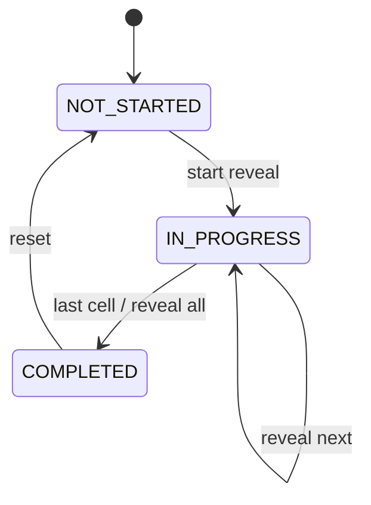
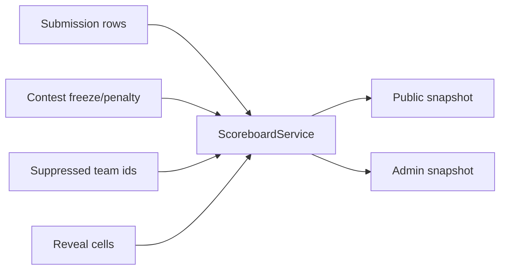
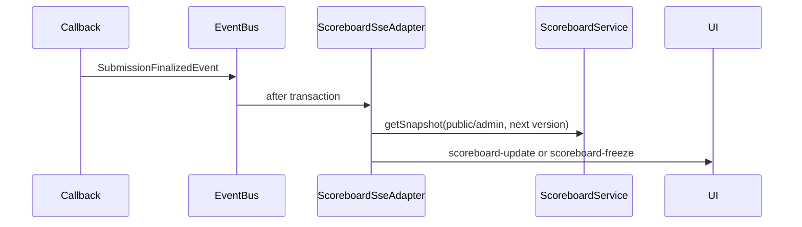

# System Analysis Packet: Scoreboard Freeze and Reveal

## 1. Scope

This packet covers scoreboard ranking, solved count, penalty, first-to-solve, pending attempts, public freeze masking, admin versus public snapshots, reveal workflow, moderation filtering, scoreboard SSE, and frontend scoreboard behavior. It excludes official judging details except as scoreboard inputs.

## 2. Local Inspection Summary

* Current working directory: `C:\Users\user\Desktop\AuraC2`
* Git branch if available: `main...origin/main`
* Git status summary: pre-existing non-doc changes were observed; only docs are modified by this task.
* Important searched folders: `backend/src/main/java/com/server/contestControl/contestServer/scoreboard`, `submissionServer/entity`, `UI/src/admin/components`, `UI/src/team/components`, `UI/src/components/scoreboard`.
* Tests inspected: scoreboard backend and frontend tests were listed. Tests were not run.

## 3. Files Inspected

| File path | Purpose in this subsystem | Why it matters |
| --------- | ------------------------- | -------------- |
| `backend/src/main/java/com/server/contestControl/contestServer/scoreboard/controller/ScoreboardController.java` | Public scoreboard REST | Public snapshot endpoint |
| `backend/src/main/java/com/server/contestControl/contestServer/scoreboard/controller/AdminScoreboardController.java` | Admin scoreboard/reveal REST | Admin snapshot and reveal controls |
| `backend/src/main/java/com/server/contestControl/contestServer/scoreboard/service/ScoreboardService.java` | Snapshot/update builder | Applies freeze, reveal, moderation filtering |
| `backend/src/main/java/com/server/contestControl/contestServer/scoreboard/service/ScoreboardCalculator.java` | Ranking/cell scoring | Solved count, penalty, attempts, first solve |
| `backend/src/main/java/com/server/contestControl/contestServer/scoreboard/service/ScoreboardFreezePolicy.java` | Freeze rules | Public/admin freeze behavior |
| `backend/src/main/java/com/server/contestControl/contestServer/scoreboard/service/ScoreboardRevealService.java` | Reveal workflow | Builds and advances reveal queue |
| `backend/src/main/java/com/server/contestControl/contestServer/scoreboard/sse/ScoreboardSseAdapter.java` | Event adapter | Publishes update/freeze/reveal events |
| `backend/src/main/java/com/server/contestControl/contestServer/scoreboard/entity/ScoreboardRevealState.java` | Reveal state entity | One reveal state per contest |
| `backend/src/main/java/com/server/contestControl/contestServer/scoreboard/entity/ScoreboardRevealCell.java` | Reveal cell entity | Ordered hidden cell reveal queue |
| `UI/src/admin/components/ScoreboardView.tsx` | Admin scoreboard UI | Admin/live/presentation/reveal controls |
| `UI/src/team/components/Scoreboard.tsx` | Team/public scoreboard UI | Public frozen scoreboard |
| `UI/src/components/scoreboard/ScoreboardTable.tsx` | Shared table | Cell rendering states |
| `UI/src/hooks/useScoreboardStream.ts` | Scoreboard SSE hook | Version gap fallback |

## 4. Main Components

| Component | Path | Type | Responsibility | Important methods/functions |
| --------- | ---- | ---- | -------------- | --------------------------- |
| `ScoreboardService` | `scoreboard/service/ScoreboardService.java` | Service | Build public/admin snapshots and update payloads | `getSnapshot`, `getPublicSnapshot`, `getAdminSnapshot`, `buildUpdatePayload` |
| `ScoreboardCalculator` | `scoreboard/service/ScoreboardCalculator.java` | Service | Rank rows and compute cells | `calculateRows`, `hiddenCellsAfterFreeze` |
| `ScoreboardFreezePolicy` | `scoreboard/service/ScoreboardFreezePolicy.java` | Service | Determine freeze time and audience freeze | `isFrozenForAudience`, `isBeforeFreeze` |
| `ScoreboardRevealService` | `scoreboard/service/ScoreboardRevealService.java` | Service | Start/step/all/reset reveal | `start`, `revealNext`, `revealAll`, `reset` |
| `ScoreboardSseAdapter` | `scoreboard/sse/ScoreboardSseAdapter.java` | Event listener | Publish updates on submissions/rejudge/contest/moderation | `publishScoreboardUpdate`, `publishRevealStep`, `publishFreeze` |
| `ScoreboardRevealState` | `scoreboard/entity` | Entity | Reveal status per contest | `status`, `startedAt`, `completedAt` |
| `ScoreboardRevealCell` | `scoreboard/entity` | Entity | Reveal queue entries | `team`, `problem`, `revealOrder`, `revealed` |
| `ScoreboardView` | `UI/src/admin/components` | React component | Admin scoreboard and reveal controls | load/reveal handlers |
| `ScoreboardTable` | `UI/src/components/scoreboard` | React component | Shared cell rendering | hidden/revealed/pending/solved rendering |

## 5. Entry Points

| Entry point | Trigger | File/class | Method/function | Auth/role requirement | Request/response model |
| ----------- | ------- | ---------- | --------------- | --------------------- | ---------------------- |
| `GET /api/scoreboard/contests/{contestId}` | Public/team scoreboard load | `ScoreboardController` | get public snapshot | Public | `ScoreboardSnapshot` |
| `GET /api/admin/scoreboard/contests/{contestId}` | Admin scoreboard load | `AdminScoreboardController` | get admin snapshot | ADMIN | `ScoreboardSnapshot` |
| `GET /api/admin/scoreboard/contests/{contestId}/reveal` | Admin reveal state | `AdminScoreboardController` | get state | ADMIN | `ScoreboardRevealResponse` |
| `POST /api/admin/scoreboard/contests/{contestId}/reveal/start` | Admin starts reveal | `AdminScoreboardController` | start | ADMIN | `ScoreboardRevealResponse` |
| `POST /api/admin/scoreboard/contests/{contestId}/reveal/next` | Admin reveals one cell | `AdminScoreboardController` | next | ADMIN | `ScoreboardRevealResponse` |
| `POST /api/admin/scoreboard/contests/{contestId}/reveal/all` | Admin reveals all | `AdminScoreboardController` | all | ADMIN | `ScoreboardRevealResponse` |
| `POST /api/admin/scoreboard/contests/{contestId}/reveal/reset` | Admin resets reveal | `AdminScoreboardController` | reset | ADMIN | `ScoreboardRevealResponse` |
| `GET /api/scoreboard/contests/{contestId}/stream` | Public stream connect | `ScoreboardStreamController` | stream | Public | SSE snapshot/update/freeze/reveal |
| `GET /api/admin/scoreboard/contests/{contestId}/stream` | Admin stream connect | `AdminScoreboardStreamController` | stream | ADMIN | SSE snapshot/update/reveal |

## 6. Runtime Flow

1. REST or SSE snapshot request calls `ScoreboardService.getSnapshot(contestId, audience, version)`.
2. Service loads contest, problems, all TEAM users, all contest submissions, and contest moderation-suppressed team ids.
3. Teams and submissions belonging to hidden/disqualified team ids are filtered out for both public and admin snapshots in current code.
4. Service computes freeze time and whether public view is frozen. Admin view uses `ScoreboardViewMode.ADMIN_LIVE` and does not hide frozen submissions.
5. When public is frozen, `ScoreboardCalculator.hiddenCellsAfterFreeze` marks cells with submissions at or after freeze time. Revealed cells are read from `ScoreboardRevealCell`.
6. Public visible submissions exclude frozen submissions unless the corresponding cell is revealed. Hidden/revealed cell flags are passed into row calculation.
7. `ScoreboardCalculator.calculateRows` groups visible team submissions by team/problem, finds first accepted submission per problem, counts wrong penalty attempts before AC, pending attempts, solved minutes from `actualStartTime`, and total penalty.
8. Rows are ranked by `ScoreboardRankingService`: solved descending, penalty ascending, then team name/id tie-breaks; equal solved+penalty share rank.
9. Reveal can start only when effective contest state is ENDED. `ScoreboardRevealService.start` deletes previous reveal cells, creates an IN_PROGRESS state, builds a queue from hidden public cells in reverse ranked row order, and marks COMPLETE if no queue.
10. `revealNext`, `revealAll`, and `reset` mutate reveal cells/state and admin controller publishes scoreboard SSE events after service returns.
11. `ScoreboardSseAdapter` publishes on submission finalized, rejudge queued, contest update, and moderation actions. Public events become `scoreboard-freeze` when current metadata says frozen.

## 7. Code Evidence

### Evidence: Moderation filtering and freeze masking

Path: `backend/src/main/java/com/server/contestControl/contestServer/scoreboard/service/ScoreboardService.java`

```java
List<User> teams = userRepository.findAllByRoleOrderByUsernameAscIdAsc(Role.TEAM);
List<Submission> allSubmissions = submissionRepository.findAllByContestIdForScoreboard(contestId);
Set<Long> suppressedTeamIds = moderationService.scoreboardSuppressedTeamIds(contestId);
List<User> visibleTeams = teams.stream()
        .filter(team -> !suppressedTeamIds.contains(team.getId()))
        .toList();
List<Submission> moderationVisibleSubmissions = allSubmissions.stream()
        .filter(submission -> submission.getUser() == null
                || !suppressedTeamIds.contains(submission.getUser().getId()))
        .toList();

Set<ScoreboardCellKey> publicHiddenCells = !publicFrozen
        ? Set.of()
        : calculator.hiddenCellsAfterFreeze(freezeTime, moderationVisibleSubmissions);
```

This proves:

* Hidden/disqualified teams are excluded before scoring.
* Freeze hidden cells are computed from moderation-visible submissions.

### Evidence: Scoring logic

Path: `backend/src/main/java/com/server/contestControl/contestServer/scoreboard/service/ScoreboardCalculator.java`

```java
private static final Set<Verdict> WRONG_PENALTY_VERDICTS = EnumSet.of(
        Verdict.WRONG_ANSWER,
        Verdict.TLE,
        Verdict.COMPILATION_ERROR,
        Verdict.RUNTIME_ERROR
);

private CellScore scoreCell(Contest contest, List<Submission> submissions) {
    List<Submission> ordered = submissions.stream()
            .filter(submission -> submission.getVerdict() != null)
            .sorted(this::compareSubmissionTime)
            .toList();

    Optional<Submission> firstAccepted = firstAccepted(ordered);
    int pendingCount = countPendingAttempts(ordered);

    if (firstAccepted.isPresent()) {
        Submission accepted = firstAccepted.get();
        List<Submission> beforeAccepted = ordered.stream()
                .filter(submission -> compareSubmissionTime(submission, accepted) < 0)
                .toList();
        int wrongAttempts = countWrongPenaltyAttempts(beforeAccepted);
        int solvedMinutes = solvedMinutes(contest, accepted);
        int penalty = solvedMinutes + wrongAttempts * penaltyMinutes(contest);
        return new CellScore(true, wrongAttempts + 1, wrongAttempts, pendingCount, solvedMinutes, penalty);
    }
```

This proves:

* Penalty is solved minutes plus wrong penalty attempts before first AC.
* INTERNAL_ERROR is terminal for reveal but not a wrong penalty verdict in this code.

### Evidence: Reveal starts only after ended contest

Path: `backend/src/main/java/com/server/contestControl/contestServer/scoreboard/service/ScoreboardRevealService.java`

```java
@Transactional
public ScoreboardRevealResponse start(Long contestId) {
    Contest contest = endedContest(contestId);
    ScoreboardRevealState state = revealStateRepository.findByContest_Id(contestId)
            .orElseGet(() -> ScoreboardRevealState.builder()
                    .contest(contest)
                    .status(RevealStatus.NOT_STARTED)
                    .build());

    if (state.getId() != null) {
        revealCellRepository.deleteByRevealState_Id(state.getId());
    }
    state.setStatus(RevealStatus.IN_PROGRESS);
    revealStateRepository.save(state);
    List<ScoreboardRevealCell> queue = buildRevealQueue(contest, state);
    revealCellRepository.saveAll(queue);
```

This proves:

* Reveal start requires `endedContest`.
* Starting reveal rebuilds the reveal cell queue.

### Evidence: Public event name changes when frozen

Path: `backend/src/main/java/com/server/contestControl/contestServer/scoreboard/sse/ScoreboardSseAdapter.java`

```java
String eventName = forcedEventName;
if (eventName == null) {
    eventName = current.metadata().scoreboardFrozen()
            ? ScoreboardSsePublisher.SCOREBOARD_FREEZE
            : ScoreboardSsePublisher.SCOREBOARD_UPDATE;
}
```

This proves:

* Public scoreboard update event name is data-dependent during freeze.

## 8. Data Model

| Model | Type | Path | Important fields | Relationships/constraints | Runtime meaning |
| ----- | ---- | ---- | ---------------- | ------------------------- | --------------- |
| `ScoreboardSnapshot` | DTO | `scoreboard/dto` | metadata, rows | Response payload | Full scoreboard state |
| `ScoreboardMetadata` | DTO | `scoreboard/dto` | contestId, audience, version, frozen, freezeTime, reveal status, columns | Response payload | Client metadata and version |
| `ScoreboardRow` | DTO | `scoreboard/dto` | rank, teamId, teamName, solved, penalty, cells | Response payload | One team standing |
| `ScoreboardProblemCell` | DTO | `scoreboard/dto` | solved, attempts, pending, firstToSolve, hidden/revealed | Response payload | One team/problem cell |
| `ScoreboardRevealState` | Entity | `scoreboard/entity` | contest, status, startedAt, updatedAt, completedAt | Unique contest | Reveal session |
| `ScoreboardRevealCell` | Entity | `scoreboard/entity` | revealState, team, problem, revealOrder, revealed, revealedAt | Unique revealState/team/problem | Reveal queue item |
| `Contest` | Entity | `contestServer/entity/Contest.java` | `scoreboardFreezeMinutes`, `penaltyMinutes`, `actualStartTime` | Contest settings | Scoring/freeze inputs |
| `Submission` | Entity | `submissionServer/entity/Submission.java` | verdict, createdAt, user, problem | Scoreboard query | Scoring input |

## 9. Security and Authorization

* Public scoreboard REST and SSE are permitted by `SecurityConfiguration` under `/api/scoreboard/**`.
* Admin scoreboard REST/SSE and reveal controls are under `/api/admin/scoreboard/**` and require ADMIN.
* Public snapshot hides frozen cells and moderation-suppressed teams.
* Admin snapshot uses live submissions, but current code still filters out moderation-suppressed teams before row calculation.

## 10. Transactions and Consistency

* `ScoreboardService` is read-only transactional.
* `ScoreboardRevealService` mutating methods are transactional.
* `ScoreboardSseAdapter` uses `@TransactionalEventListener(fallbackExecution=true)` for submission/rejudge/contest events.
* `ScoreboardVersionService` and `ScoreboardSseAdapter.lastSnapshots` are in-memory, so versions/diffs reset on restart.
* Admin controller publishes reveal SSE after service call returns, not through an outbox.

## 11. Async / Events / Queues / SSE

* Scoreboard SSE streams send initial snapshots.
* Events:
  * `SubmissionFinalizedEvent` -> scoreboard update/freeze.
  * `SubmissionRejudgeQueuedEvent` -> scoreboard update.
  * `ContestUpdatedEvent` -> scoreboard update.
  * Moderation action controller explicitly calls `publishScoreboardUpdate`.
  * Reveal admin actions explicitly call `publishRevealStep` or `publishFreeze`.
* Frontend `useScoreboardStream` detects version gaps and calls fallback full REST load.

## 12. State Transitions

| From | To | Trigger | Code location | Guard/validation |
| ---- | -- | ------- | ------------- | ---------------- |
| NOT_STARTED | IN_PROGRESS | Admin start reveal | `ScoreboardRevealService.start` | contest effective state ENDED |
| IN_PROGRESS | IN_PROGRESS | Reveal next with more cells | `ScoreboardRevealService.revealNext` | state exists; contest ended |
| IN_PROGRESS | COMPLETED | Reveal last cell or reveal all | `ScoreboardRevealService.revealNext/revealAll` | state exists; contest ended |
| COMPLETED | NOT_STARTED | Reset reveal | `ScoreboardRevealService.reset` | state exists; contest ended |
| Public not frozen | Frozen | contest remaining time enters freeze window | `ScoreboardFreezePolicy`, `ScoreboardService` | freezeMinutes set |
| Frozen | Reveal visible | reveal cell marked | `ScoreboardRevealService` | cell revealed |



## 13. Mermaid Skeletons





## 14. Tests

| Test file | What it verifies | Important test methods | Missing coverage |
| --------- | ---------------- | ---------------------- | ---------------- |
| `contestServer/scoreboard/service/ScoreboardCalculatorTest.java` | Ranking/cell scoring | Inspect file for methods | Tests not run here |
| `contestServer/scoreboard/service/ScoreboardFreezePolicyTest.java` | Freeze policy | Inspect file for methods | Tests not run here |
| `contestServer/scoreboard/service/ScoreboardRevealServiceTest.java` | Reveal workflow | Inspect file for methods | Tests not run here |
| `contestServer/scoreboard/service/ScoreboardRevealVisibilityTest.java` | Public reveal visibility | Inspect file for methods | Tests not run here |
| `contestServer/scoreboard/service/ScoreboardServiceTest.java` | Snapshot behavior | Inspect file for methods | Tests not run here |
| `UI/src/admin/components/ScoreboardView.test.tsx` | Admin UI behavior | Inspect file for methods | Tests not run here |
| `UI/src/components/scoreboard/ScoreboardTable.test.tsx` | Table rendering | Inspect file for methods | Tests not run here |
| `UI/src/hooks/useScoreboardStream.test.tsx` | Stream/gap behavior | Inspect file for methods | Tests not run here |

## 15. Edge Cases

| Edge case | Code location | Current behavior | Risk level |
| --------- | ------------- | ---------------- | ---------- |
| Submission exactly at freeze time | `ScoreboardService.isFrozenSubmission`, `ScoreboardCalculator.hiddenCellsAfterFreeze` | Treated as frozen because visibility requires before freeze | Low |
| INTERNAL_ERROR before AC | `ScoreboardCalculator.WRONG_PENALTY_VERDICTS` | Not counted as wrong penalty attempt | Medium if policy expects penalty |
| Moderation hidden/disqualified team in admin view | `ScoreboardService` | Excluded for admin and public snapshots | Medium if admins expect full raw board |
| App restart | `ScoreboardSseAdapter.lastSnapshots`, `ScoreboardVersionService` | Diff/version state resets | Medium |
| Reveal start with no hidden cells | `ScoreboardRevealService.start` | Immediately COMPLETED | Low |

## 16. Risks / Weaknesses / Gaps

* In-memory scoreboard versioning and last snapshots limit multi-node/restart consistency.
* Admin snapshot currently filters moderation-suppressed teams; this may be intended, but it means admin does not see a raw all-team board through this service.
* No durable event/outbox for scoreboard SSE.
* Ranking depends on `contest.actualStartTime`; if null, solved minutes can become 0.
* INTERNAL_ERROR is terminal for reveal but not a wrong-penalty verdict.

## 17. Final Evidence Table

| Claim | Evidence path | Class/method/field | Confidence |
| ----- | ------------- | ------------------ | ---------- |
| Scoreboard ranks TEAM users only | `ScoreboardService.java`, `ScoreboardCalculator.java` | `findAllByRoleOrderByUsernameAscIdAsc(Role.TEAM)`, `isTeamSubmission` | Strong |
| Freeze masks public cells after freeze | `ScoreboardService.java`, `ScoreboardCalculator.java` | `publicHiddenCells`, `hiddenCellsAfterFreeze` | Strong |
| Reveal queue persists in DB | `ScoreboardRevealState.java`, `ScoreboardRevealCell.java`, V1 migration | reveal entities/tables | Strong |
| Public scoreboard is unauthenticated | `SecurityConfiguration.java`, `ScoreboardController.java` | `/api/scoreboard/**` | Strong |
| Scoreboard SSE has versioned payloads | `ScoreboardSseAdapter.java`, `ScoreboardService.buildUpdatePayload` | `version`, `previousVersion` | Strong |
| Version/diff state is in-memory | `ScoreboardSseAdapter.java`, `ScoreboardVersionService.java` | `ConcurrentHashMap` | Strong |
