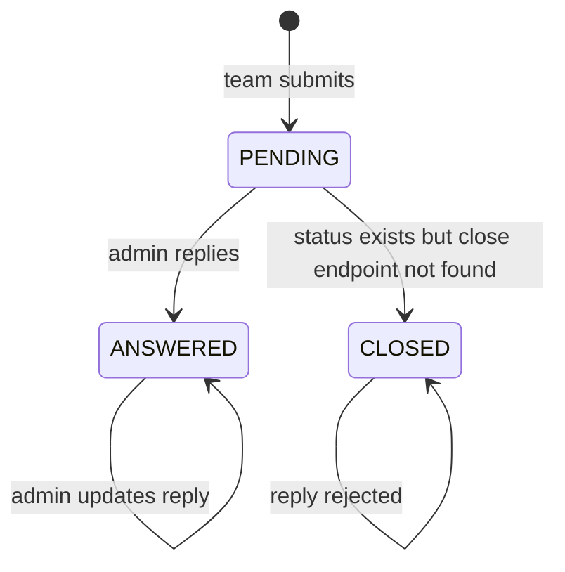
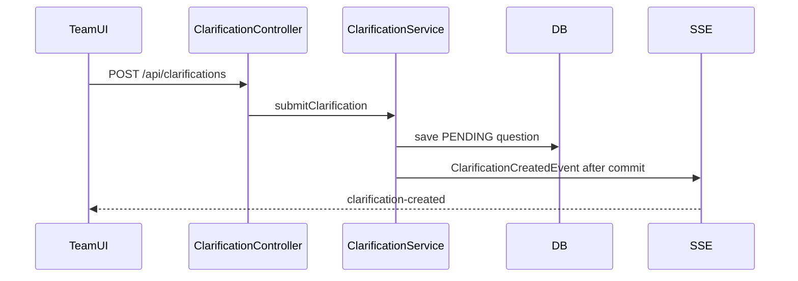
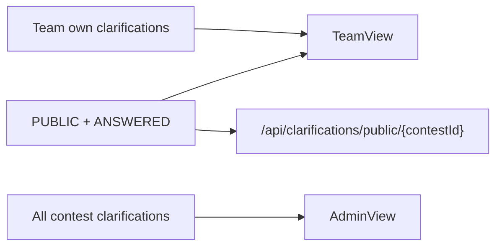

# System Analysis Packet: Clarifications

## 1. Scope

This packet covers team clarification questions, own/public visibility, admin replies, public/private reply types, pending/all admin views, public answered endpoint, SSE refresh, and authorization. It excludes broader contest lifecycle except where clarifications depend on contest state.

## 2. Local Inspection Summary

* Current working directory: `C:\Users\user\Desktop\AuraC2`
* Git branch if available: `main...origin/main`
* Git status summary: pre-existing non-doc changes were observed; only docs are created/updated.
* Important searched folders: `backend/src/main/java/com/server/contestControl/contestServer/controller`, `service`, `entity`, `dto/clarification`, `sse/clarification`, `UI/src/team/components`, `UI/src/admin/components`.
* Tests inspected: no dedicated clarification service/controller test file was found in the listed tests; problem deletion tests cover clarification references. Tests were not run.

## 3. Files Inspected

| File path | Purpose in this subsystem | Why it matters |
| --------- | ------------------------- | -------------- |
| `backend/src/main/java/com/server/contestControl/contestServer/entity/Clarification.java` | Clarification entity | Stores question, reply, status, reply type |
| `backend/src/main/java/com/server/contestControl/contestServer/controller/ClarificationController.java` | Clarification REST API | Defines team/admin/public endpoints |
| `backend/src/main/java/com/server/contestControl/contestServer/service/ClarificationService.java` | Business logic | Validates contest state/problem ownership and visibility |
| `backend/src/main/java/com/server/contestControl/contestServer/repository/ClarificationRepository.java` | Queries | Own/public/admin query methods |
| `backend/src/main/java/com/server/contestControl/contestServer/dto/clarification` | DTOs | Request/response models |
| `backend/src/main/java/com/server/contestControl/contestServer/enums/ClarificationStatus.java` | Status enum | PENDING/ANSWERED/CLOSED |
| `backend/src/main/java/com/server/contestControl/contestServer/enums/ClarificationType.java` | Reply visibility enum | PUBLIC/PRIVATE |
| `backend/src/main/java/com/server/contestControl/contestServer/enums/StandardReply.java` | Standard reply enum | ICPC-style canned replies |
| `backend/src/main/java/com/server/contestControl/contestServer/sse/clarification/ClarificationSseAdapter.java` | SSE adapter | Publishes created/replied/public events |
| `backend/src/main/java/com/server/contestControl/contestServer/controller/ClarificationStreamController.java` | SSE endpoints | Admin/team clarification streams |
| `UI/src/team/components/Clarifications.tsx` | Team UI | Own/public clarification display and ask form |
| `UI/src/admin/components/ClarificationsView.tsx` | Admin UI | Admin list/reply/filter behavior |

## 4. Main Components

| Component | Path | Type | Responsibility | Important methods/functions |
| --------- | ---- | ---- | -------------- | --------------------------- |
| `Clarification` | `entity/Clarification.java` | Entity | Q&A persistence | `question`, `reply`, `status`, `replyType`, `standardReply` |
| `ClarificationController` | `controller/ClarificationController.java` | REST controller | Team submit/my, admin list/reply, public answered | endpoint methods |
| `ClarificationService` | `service/ClarificationService.java` | Service | Validation, visibility, reply logic, events | `submitClarification`, `replyClarification`, `fetchClarificationsForTeam` |
| `ClarificationRepository` | `repository/ClarificationRepository.java` | Repository | Query own/public/admin clarifications | query methods |
| `ClarificationSseAdapter` | `sse/clarification` | Event listener | Publish clarification SSE | event listener methods |
| `ClarificationStreamController` | `controller/ClarificationStreamController.java` | SSE controller | Team/admin streams | stream methods |
| `Clarifications` | `UI/src/team/components/Clarifications.tsx` | React component | Team ask/view clarifications | load/submit handlers |
| `ClarificationsView` | `UI/src/admin/components/ClarificationsView.tsx` | React component | Admin reply/filter | load/reply handlers |

## 5. Entry Points

| Entry point | Trigger | File/class | Method/function | Auth/role requirement | Request/response model |
| ----------- | ------- | ---------- | --------------- | --------------------- | ---------------------- |
| `POST /api/clarifications` | Team asks question | `ClarificationController` | `submitClarification` | TEAM | `ClarificationRequest` -> `ClarificationResponse` |
| `GET /api/clarifications/my/{contestId}` | Team opens clarification modal | `ClarificationController` | `getMyClarifications` | TEAM | `List<ClarificationResponse>` |
| `GET /api/clarifications/admin/contest/{contestId}` | Admin loads contest clarifications | `ClarificationController` | `getContestClarifications` | ADMIN | `List<ClarificationResponse>` |
| `GET /api/clarifications/admin/all` | Admin all clarifications | `ClarificationController` | `getAllClarifications` | ADMIN | `List<ClarificationResponse>` |
| `PUT /api/clarifications/admin/{id}/reply` | Admin replies/updates reply | `ClarificationController` | `replyClarification` | ADMIN | `ReplyRequest` -> `ClarificationResponse` |
| `GET /api/clarifications/public/{contestId}` | Public answered clarifications | `ClarificationController` | `getPublicClarifications` | Public | `List<ClarificationResponse>` |
| `GET /api/clarifications/my/stream/{contestId}` | Team SSE connect | `ClarificationStreamController` | team stream | TEAM | clarification SSE events |
| `GET /api/clarifications/admin/stream/{contestId}` | Admin SSE connect | `ClarificationStreamController` | admin stream | ADMIN | clarification SSE events |

## 6. Runtime Flow

1. Team submits a question through `POST /api/clarifications`.
2. `ClarificationService.submitClarification` loads the contest and requires persisted `contest.status == RUNNING`. It does not use effective contest state in the inspected code.
3. If problem id is provided, service verifies problem exists and belongs to the contest.
4. Service saves `Clarification` with default status PENDING and publishes `ClarificationCreatedEvent`.
5. Team fetches `/my/{contestId}`. Service again requires persisted contest status RUNNING, loads the team's own clarifications and all PUBLIC ANSWERED clarifications for the contest, de-duplicates, sorts created desc, and maps to responses.
6. Admin fetches all or contest-specific clarifications without the team visibility filter.
7. Admin replies through `replyClarification`. CLOSED clarifications are rejected. Standard reply can set canned text and clear custom reply; `StandardReply.CUSTOM` requires custom text; no standard reply also requires custom text. Service sets `replyType` from request, stamps `repliedAt` if first reply, sets admin, marks ANSWERED, saves, and publishes `ClarificationRepliedEvent`.
8. Public endpoint returns only PUBLIC ANSWERED clarifications.
9. SSE adapter notifies admin stream on creation/reply, the asking team on creation/reply, and all contest audience team ids for PUBLIC answered replies.

## 7. Code Evidence

### Evidence: Team submit requires persisted RUNNING

Path: `backend/src/main/java/com/server/contestControl/contestServer/service/ClarificationService.java`

```java
Contest contest = contestRepository.findById(request.contestId())
        .orElseThrow(() -> new ContestNotFoundException(request.contestId()));

if (contest.getStatus() != ContestStatus.RUNNING) {
    throw new InvalidContestStateException("Contest is not running. Cannot submit clarification.");
}

Problem problem = null;
if (request.problemId() != null) {
    problem = problemRepository.findById(request.problemId())
            .orElseThrow(() -> new ProblemNotFoundException(request.problemId()));
    if (problem.getContest() == null || !problem.getContest().getId().equals(contest.getId())) {
        throw new ProblemDoesNotBelongToContestException(request.problemId(), request.contestId());
    }
}
```

This proves:

* Clarification submit validates contest and problem membership.
* It checks persisted status, not `ContestLifecycleService.resolveEffectiveState`.

### Evidence: Team visibility combines own plus public answered

Path: `backend/src/main/java/com/server/contestControl/contestServer/service/ClarificationService.java`

```java
List<Clarification> myClarifications = clarificationRepository
        .findByUserIdAndContestIdOrderByCreatedAtDesc(user.getId(), contestId);

List<Clarification> publicClarifications = clarificationRepository
        .findByContestIdAndReplyTypeAndStatusOrderByCreatedAtDesc(
                contestId,
                ClarificationType.PUBLIC,
                ClarificationStatus.ANSWERED
        );

Set<Long> seenIds = myClarifications.stream()
        .map(Clarification::getId)
        .collect(Collectors.toSet());
```

This proves:

* Teams see their own clarifications and public answered clarifications.
* Pending clarifications from other teams are not included.

### Evidence: Reply logic

Path: `backend/src/main/java/com/server/contestControl/contestServer/service/ClarificationService.java`

```java
if (clarification.getStatus() == ClarificationStatus.CLOSED) {
    throw new ClarificationAlreadyClosedException(clarificationId);
}

if (request.standardReply() != null && request.standardReply() != StandardReply.CUSTOM) {
    clarification.setStandardReply(request.standardReply());
    clarification.setReply(null);
} else if (request.standardReply() == StandardReply.CUSTOM) {
    if (request.reply() == null || request.reply().isBlank()) {
        throw new InvalidReplyException("Custom reply text is required when standardReply is CUSTOM");
    }
    clarification.setStandardReply(StandardReply.CUSTOM);
    clarification.setReply(request.reply());
} else {
    if (request.reply() == null || request.reply().isBlank()) {
        throw new InvalidReplyException("Either standardReply or custom reply text is required");
    }
    clarification.setStandardReply(null);
    clarification.setReply(request.reply());
}

clarification.setReplyType(request.replyType());
clarification.setStatus(ClarificationStatus.ANSWERED);
```

This proves:

* CLOSED status blocks reply updates.
* `replyType` is copied from the request; no null guard is visible here.

## 8. Data Model

| Model | Type | Path | Important fields | Relationships/constraints | Runtime meaning |
| ----- | ---- | ---- | ---------------- | ------------------------- | --------------- |
| `Clarification` | Entity | `contestServer/entity/Clarification.java` | contest, problem, user, question, createdAt, standardReply, reply, repliedAt, repliedByAdmin, status, replyType | FKs contest/problem/user/admin; indexes in entity/migration | Contest Q&A |
| `ClarificationStatus` | Enum | `contestServer/enums/ClarificationStatus.java` | PENDING, ANSWERED, CLOSED | Stored as string | Reply lifecycle |
| `ClarificationType` | Enum | `contestServer/enums/ClarificationType.java` | PRIVATE, PUBLIC | Stored as string | Reply visibility |
| `StandardReply` | Enum | `contestServer/enums/StandardReply.java` | NO_COMMENT, READ_PROBLEM_STATEMENT_CAREFULLY, YES, NO, ANSWERED, CUSTOM | Stored as string | Canned reply selection |
| `ClarificationRequest` | DTO | `dto/clarification/ClarificationRequest.java` | contestId, problemId, question | Request | Team question |
| `ReplyRequest` | DTO | `dto/clarification/ReplyRequest.java` | standardReply, reply, replyType | Request | Admin reply |
| `ClarificationResponse` | DTO | `dto/clarification/ClarificationResponse.java` | id, contest/problem/user info, question/reply/status/type | Response | Team/admin/public display |

## 9. Security and Authorization

* `POST /api/clarifications` is TEAM-only.
* `/api/clarifications/my/**` and team stream are TEAM-only.
* `/api/clarifications/admin/**` and admin stream are ADMIN-only.
* `/api/clarifications/public/**` is public.
* Public responses are built with `ClarificationResponse.fromEntity`; inspected summary indicates username is included in response, so public answered clarifications may expose asking usernames.

## 10. Transactions and Consistency

* Submit and reply methods are transactional.
* Team/admin/public fetch methods are read-only transactional.
* Events are published from service methods; SSE adapter uses transactional event listener, so normal transactional calls publish after commit.
* No locking or duplicate suppression is used for clarification replies; concurrent admin replies could last-write-wins.
* Clarification service uses persisted contest status, which may diverge from effective state before scheduler sync.

## 11. Async / Events / Queues / SSE

* `ClarificationCreatedEvent` and `ClarificationRepliedEvent` are published by service methods.
* `ClarificationSseAdapter` publishes event names such as created/replied/public answered to admin and team registries.
* Team and admin frontend components use `useClarificationStream` and refresh data on events.
* No RabbitMQ is used.

## 12. State Transitions

| From | To | Trigger | Code location | Guard/validation |
| ---- | -- | ------- | ------------- | ---------------- |
| none | PENDING | Team asks question | `ClarificationService.submitClarification` | persisted contest RUNNING; problem belongs to contest |
| PENDING | ANSWERED | Admin replies | `ClarificationService.replyClarification` | reply text/standard reply valid |
| ANSWERED | ANSWERED | Admin updates reply | `replyClarification` | not CLOSED |
| CLOSED | CLOSED | Admin attempts reply | `replyClarification` | rejected |



## 13. Mermaid Skeletons





## 14. Tests

| Test file | What it verifies | Important test methods | Missing coverage |
| --------- | ---------------- | ---------------------- | ---------------- |
| `contestServer/service/ProblemDeletionPersistenceTest.java` | Problem deletion rejects clarification references | `rejectsProblemDeletionWhenClarificationsReferenceProblem` | Not a clarification workflow test |
| `contestServer/service/ProblemServiceTest.java` | Problem deletion rejects clarifications | `deleteProblemRejectsProblemWithClarifications` | Not a clarification workflow test |
| No dedicated clarification service/controller test found | N/A | N/A | Submit/reply/visibility/SSE coverage missing or not found |

## 15. Edge Cases

| Edge case | Code location | Current behavior | Risk level |
| --------- | ------------- | ---------------- | ---------- |
| Effective RUNNING but persisted UPCOMING | `ClarificationService.submitClarification` | Rejected because persisted status is checked | Medium |
| Admin reply with null `replyType` | `ClarificationService.replyClarification` | Sets null; public/private visibility unclear | Medium |
| Public answered clarification includes username | `ClarificationResponse.fromEntity` | Public endpoint may expose asking team username | Medium |
| Concurrent admin replies | `replyClarification` | Last save wins; no lock/version found | Medium |
| CLOSED clarification | `replyClarification` | Reply rejected | Low |

## 16. Risks / Weaknesses / Gaps

* Clarification lifecycle uses persisted contest status instead of effective state.
* No dedicated clarification tests were found in the test list.
* `ReplyRequest.replyType` has no visible null validation in service.
* Public endpoint may expose the username of the asking team through the shared response DTO.
* No endpoint for setting CLOSED status was identified, despite enum support.

## 17. Final Evidence Table

| Claim | Evidence path | Class/method/field | Confidence |
| ----- | ------------- | ------------------ | ---------- |
| Teams can submit clarifications only during persisted RUNNING | `ClarificationService.java` | `submitClarification`, `contest.getStatus()` | Strong |
| Teams see own plus public answered clarifications | `ClarificationService.java` | `fetchClarificationsForTeam` | Strong |
| Admin can reply with standard or custom reply | `ClarificationService.java`, `StandardReply.java` | `replyClarification` | Strong |
| Public endpoint returns PUBLIC ANSWERED clarifications | `ClarificationController.java`, `ClarificationService.java` | `getPublicClarifications`, `fetchPublicClarifications` | Strong |
| Clarification SSE exists | `ClarificationStreamController.java`, `ClarificationSseAdapter.java` | stream/listener methods | Strong |
| Dedicated clarification tests not found | test file listing | no `ClarificationServiceTest` found | Medium |
