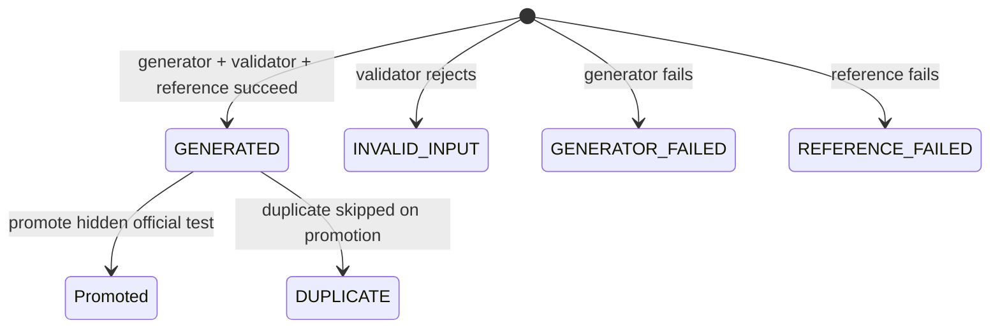
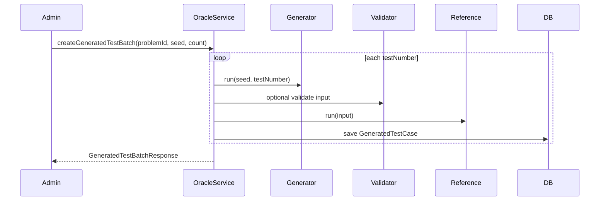
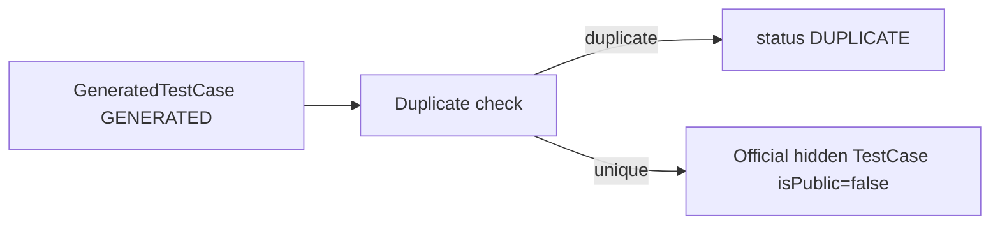

# System Analysis Packet: Oracle Generated Tests and Validators

## 1. Scope

This packet covers the admin-side oracle/generated-test subsystem: reference solutions, input generators, input validators, deterministic generated batches, generated test promotion into hidden official test cases, duplicate skipping, counterexample search, source visibility controls, custom output validator source reveal, and limitations. It excludes official submission judging except where counterexample search evaluates an existing submission.

## 2. Local Inspection Summary

* Current working directory: `C:\Users\user\Desktop\AuraC2`
* Git branch if available: `main...origin/main`
* Git status summary: pre-existing non-doc changes were observed; packet files are the only intended edits.
* Important searched folders: `backend/src/main/java/com/server/contestControl/contestServer/oracle`, `contestServer/prompt`, `contestServer/service/TestCaseDuplicateService.java`, `UI/src/admin/components/OraclePanel.tsx`, migrations V3-V8.
* Tests inspected: `OracleServiceTest`, `OracleJudge0ExecutionServiceTest`, prompt tests, validator tests were listed. Tests were not run.

## 3. Files Inspected

| File path | Purpose in this subsystem | Why it matters |
| --------- | ------------------------- | -------------- |
| `backend/src/main/java/com/server/contestControl/contestServer/oracle/controller/OracleAdminController.java` | Admin oracle REST API | Defines configure/generate/promote/source endpoints |
| `backend/src/main/java/com/server/contestControl/contestServer/oracle/service/OracleService.java` | Main oracle service | Implements program config, generation, promotion, counterexamples |
| `backend/src/main/java/com/server/contestControl/contestServer/oracle/service/OracleJudge0ExecutionService.java` | Synchronous Judge0 execution | Runs reference/generator/validator/team code with `wait=true` |
| `backend/src/main/java/com/server/contestControl/contestServer/oracle/entity/ReferenceSolution.java` | Reference solution entity | Stores active source/hash/language |
| `backend/src/main/java/com/server/contestControl/contestServer/oracle/entity/InputGenerator.java` | Generator entity | Stores deterministic generator source/default count |
| `backend/src/main/java/com/server/contestControl/contestServer/oracle/entity/InputValidator.java` | Input validator entity | Stores active input validator source |
| `backend/src/main/java/com/server/contestControl/contestServer/oracle/entity/GeneratedTestBatch.java` | Batch entity | Stores seed/status/counts/source hashes |
| `backend/src/main/java/com/server/contestControl/contestServer/oracle/entity/GeneratedTestCase.java` | Generated test entity | Stores generated input/reference output/status/promotion |
| `backend/src/main/java/com/server/contestControl/contestServer/oracle/entity/Counterexample.java` | Counterexample entity | Stores failing generated input for a submission |
| `backend/src/main/java/com/server/contestControl/contestServer/service/TestCaseDuplicateService.java` | Duplicate check | Skips duplicate generated promotions |
| `backend/src/main/resources/db/migration/V4__reference_oracle_generated_tests.sql` | Oracle schema | Defines oracle tables and constraints |
| `backend/src/main/resources/db/migration/V5__generated_test_batch_partial_status.sql` | Batch status migration | Adds PARTIAL |
| `backend/src/main/resources/db/migration/V8__generated_test_duplicate_status.sql` | Duplicate status migration | Adds DUPLICATE generated case status |
| `UI/src/admin/components/OraclePanel.tsx` | Admin UI | Exposes config/generate/promote/counterexample workflows |

## 4. Main Components

| Component | Path | Type | Responsibility | Important methods/functions |
| --------- | ---- | ---- | -------------- | --------------------------- |
| `OracleAdminController` | `oracle/controller/OracleAdminController.java` | REST controller | Admin endpoints for programs, batches, promotion, sources | configure/get/source/generate/promote methods |
| `OracleService` | `oracle/service/OracleService.java` | Service | Main generated-test workflow | `configureReferenceSolution`, `createGeneratedTestBatch`, `promoteGeneratedTestCaseEntities`, `evaluateSubmission` |
| `OracleJudge0ExecutionService` | `oracle/service/OracleJudge0ExecutionService.java` | Service | Synchronous Judge0 execution | `run`, `synchronousJudge0Url` |
| Oracle entities | `oracle/entity` | JPA entities | Store programs, batches, generated cases, counterexamples | entity fields |
| `TestCaseDuplicateService` | `contestServer/service` | Service | Normalize and detect duplicates | `inputDuplicateExistsForPromotion` |
| `CustomValidatorService` | `submissionServer/service/validator` | Service | Used for generated output comparison when active | `validate` |
| `OutputComparator` | `submissionServer/service/compare` | Service | Compare generated reference output to team output | `compare` |
| `OraclePanel` | `UI/src/admin/components/OraclePanel.tsx` | React component | Admin workflow UI | submit/generate/promote handlers |

## 5. Entry Points

| Entry point | Trigger | File/class | Method/function | Auth/role requirement | Request/response model |
| ----------- | ------- | ---------- | --------------- | --------------------- | ---------------------- |
| `POST /api/admin/oracle/problems/{problemId}/reference-solution` | Admin configures reference | `OracleAdminController` | `configureReferenceSolution` | ADMIN | `OracleProgramRequest` -> `OracleProgramResponse` |
| `POST /api/admin/oracle/problems/{problemId}/input-generator` | Admin configures generator | `OracleAdminController` | `configureInputGenerator` | ADMIN | program request/response |
| `POST /api/admin/oracle/problems/{problemId}/input-validator` | Admin configures input validator | `OracleAdminController` | `configureInputValidator` | ADMIN | program request/response |
| `GET /api/admin/oracle/.../source` | Admin reveals source | `OracleAdminController` | source methods | ADMIN | `OracleProgramSourceResponse` |
| `POST /api/admin/oracle/problems/{problemId}/generated-batches` | Admin generates candidates/counterexamples | `OracleAdminController` | `createGeneratedBatch` | ADMIN | `GeneratedTestBatchRequest` -> response |
| `GET /api/admin/oracle/problems/{problemId}/generated-batches` | Admin lists batches | `OracleAdminController` | `generatedBatches` | ADMIN | list responses |
| `GET /api/admin/oracle/problems/{problemId}/counterexamples` | Admin lists counterexamples | `OracleAdminController` | `counterexamples` | ADMIN | list responses |
| `POST /api/admin/oracle/generated-test-cases/{id}/promote` | Admin promotes one generated test | `OracleAdminController` | `promoteGeneratedTestCase` | ADMIN | `GeneratedTestPromotionResponse` |
| `POST /api/admin/oracle/generated-test-cases/promote-selected` | Admin promotes selected | `OracleAdminController` | `promoteSelectedGeneratedTestCases` | ADMIN | promotion response |
| `POST /api/admin/oracle/generated-batches/{batchId}/promote-valid` | Admin promotes valid batch cases | `OracleAdminController` | `promoteAllValidGeneratedTestCases` | ADMIN | promotion response |
| `POST /api/admin/oracle/counterexamples/{id}/promote` | Admin promotes counterexample | `OracleAdminController` | `promoteCounterexample` | ADMIN | `TestCaseResponse` |

## 6. Runtime Flow

1. Admin configures a reference solution, input generator, and optional input validator. Each configuration validates positive language id and nonblank source, deactivates existing programs of that kind for the problem, hashes source with SHA-256, and saves the new program.
2. Admin creates a generated batch. `OracleService.createGeneratedTestBatch` loads problem, admin user, active reference solution, active input generator, optional active input validator, optional target submission, requested count, and seed.
3. For each test number, service runs the input generator through synchronous Judge0 with stdin `seed + "\n" + testNumber + "\n"`.
4. If generator fails, a generated case is saved with `GENERATOR_FAILED` and the batch may become FAILED/PARTIAL.
5. If an input validator exists, generated input is run through the validator. It must print ACCEPT/ACCEPTED/OK/VALID or REJECT/REJECTED/INVALID. Rejected inputs are saved as `INVALID_INPUT`.
6. The reference solution is run on valid generated input. If it fails, generated case status is `REFERENCE_FAILED`; if it succeeds, generated input/reference output are saved as `GENERATED`.
7. If a submission id was provided, the team submission code is run against the generated input and compared by active custom validator or built-in compare policy. Non-accepted outcomes are stored as `Counterexample`.
8. Promotion creates hidden official `TestCase` rows (`isPublic=false`). Promotion skips already promoted cases, invalid cases, duplicates within the request, and duplicates against existing official test inputs; duplicate generated cases are marked `DUPLICATE`.
9. Counterexample promotion creates a hidden official test case with generated input and reference output and marks both generated case and counterexample promoted.
10. Generated tests are deterministic only insofar as the configured generator uses the seed/testNumber protocol. The code does not prove correctness; it executes user-provided programs through Judge0. No ML or AI service call was found in oracle generation code.

## 7. Code Evidence

### Evidence: Oracle endpoints are admin-only

Path: `backend/src/main/java/com/server/contestControl/contestServer/oracle/controller/OracleAdminController.java`

```java
@RestController
@RequestMapping("/api/admin/oracle")
@PreAuthorize("hasRole('ADMIN')")
@RequiredArgsConstructor
public class OracleAdminController {
    @PostMapping("/problems/{problemId}/reference-solution")
    public ResponseEntity<OracleProgramResponse> configureReferenceSolution(
            @PathVariable Long problemId,
            @Valid @RequestBody OracleProgramRequest request,
            Authentication authentication
    ) {
        return ResponseEntity.ok(
                oracleService.configureReferenceSolution(problemId, request, authentication.getName())
        );
    }
}
```

This proves:

* Oracle workflows are admin-only.
* Admin username is recorded for created programs/batches.

### Evidence: Generated batch loop

Path: `backend/src/main/java/com/server/contestControl/contestServer/oracle/service/OracleService.java`

```java
for (int testNumber = 1; testNumber <= testCount; testNumber++) {
    OracleJudge0ExecutionService.SandboxExecutionResult generatedInput =
            oracleJudge0ExecutionService.run(
                    generator.getSource(),
                    generator.getLanguageId(),
                    generatorStdin(seed, testNumber)
            );

    if (!generatedInput.accepted()) {
        saveGeneratedCase(batch, problem, testNumber, seed, null, null,
                GeneratedTestCaseStatus.GENERATOR_FAILED,
                diagnostic("Input generator failed", generatedInput));
        break;
    }

    String inputData = normalizeGeneratedInput(generatedInput.stdout());
    InputValidationResult validation = validateGeneratedInput(validator, inputData);
```

This proves:

* Generator is run once per requested test number.
* Seed and test number are the deterministic inputs to the generator.

### Evidence: Promotion duplicate skipping

Path: `backend/src/main/java/com/server/contestControl/contestServer/oracle/service/OracleService.java`

```java
String normalizedInput = testCaseDuplicateService.normalizeInput(generatedTestCase.getInputData());
boolean duplicateInRequest = !seenInputsInRequest.add(normalizedInput);
boolean duplicateOfficial = testCaseDuplicateService.inputDuplicateExistsForPromotion(
        generatedTestCase.getProblem().getId(),
        generatedTestCase.getInputData()
);

if (duplicateInRequest || duplicateOfficial) {
    skippedDuplicate++;
    generatedTestCase.setStatus(GeneratedTestCaseStatus.DUPLICATE);
    generatedTestCase.setDiagnostic(duplicateOfficial
            ? "Skipped during promotion: an official test case with the same input already exists."
            : "Skipped during promotion: another selected generated candidate has the same input.");
    generatedTestCaseRepository.save(generatedTestCase);
    skipped.add(GeneratedTestCaseResponse.from(generatedTestCase));
    continue;
}

TestCase officialHiddenTestCase = TestCase.builder()
        .problem(generatedTestCase.getProblem())
        .inputData(testCaseDuplicateService.normalizeInput(generatedTestCase.getInputData()))
        .expectedOutput(testCaseDuplicateService.normalizeOutput(generatedTestCase.getReferenceOutput()))
        .isPublic(false)
        .build();
```

This proves:

* Promotion creates hidden official tests.
* Duplicate generated inputs are skipped and marked.

### Evidence: Oracle schema

Path: `backend/src/main/resources/db/migration/V4__reference_oracle_generated_tests.sql`

```sql
CREATE TABLE reference_solutions (
    id BIGSERIAL PRIMARY KEY,
    problem_id BIGINT NOT NULL,
    language_id INTEGER NOT NULL,
    source TEXT NOT NULL,
    source_hash VARCHAR(64) NOT NULL,
    active BOOLEAN NOT NULL DEFAULT TRUE
);

CREATE TABLE generated_test_cases (
    id BIGSERIAL PRIMARY KEY,
    batch_id BIGINT NOT NULL,
    problem_id BIGINT NOT NULL,
    test_number INTEGER NOT NULL,
    seed BIGINT NOT NULL,
    input_data TEXT,
    reference_output TEXT,
    status VARCHAR(32) NOT NULL,
    promoted BOOLEAN NOT NULL DEFAULT FALSE,
    promoted_test_case_id BIGINT
);
```

This proves:

* Program source and generated input/reference output are persisted.
* Generated cases have promotion linkage to official test cases.

## 8. Data Model

| Model | Type | Path | Important fields | Relationships/constraints | Runtime meaning |
| ----- | ---- | ---- | ---------------- | ------------------------- | --------------- |
| `ReferenceSolution` | Entity | `oracle/entity/ReferenceSolution.java` | problem, languageId, source, sourceHash, active, createdBy | FK problem/user, active index | Trusted output producer |
| `InputGenerator` | Entity | `oracle/entity/InputGenerator.java` | problem, languageId, source, sourceHash, active, defaultTestCount | default count 1-100 check | Generates candidate inputs |
| `InputValidator` | Entity | `oracle/entity/InputValidator.java` | problem, languageId, source, sourceHash, active | FK problem/user | Validates generated/custom inputs |
| `GeneratedTestBatch` | Entity | `oracle/entity/GeneratedTestBatch.java` | seed, source hashes, status, requested/generated/invalid/counterexample counts | status checks V4/V5 | One generation run |
| `GeneratedTestCase` | Entity | `oracle/entity/GeneratedTestCase.java` | batch, problem, testNumber, seed, inputData, referenceOutput, status, promoted | unique batch/test number; status checks V8 | Candidate hidden test |
| `Counterexample` | Entity | `oracle/entity/Counterexample.java` | problem, submission, generated test, judgeRunId, generated input, reference output, team output, verdict | FKs problem/submission/generated/testcase | Stored failing generated input |
| `TestCase` | Entity | `contestServer/entity/TestCase.java` | inputData, expectedOutput, isPublic | Official test table | Promotion target |

## 9. Security and Authorization

* All oracle endpoints are under `/api/admin/oracle` and class-level ADMIN protected.
* Normal `ProblemResponse` hides validator source; oracle admin source endpoints reveal reference/generator/input-validator/custom-output-validator source.
* Oracle program source fields are sensitive because they can contain official/reference logic.
* Prompt export UI warns that source inclusion is sensitive. In code terms, source reveal is admin-only.

## 10. Transactions and Consistency

* Program configuration, batch creation, promotion, and counterexample promotion are transactional.
* Configuring a new active program deactivates existing programs of the same kind for that problem before saving.
* Batch creation runs external Judge0 calls inside the transaction in inspected code, so long-running external work can hold DB transaction resources.
* Promotion uses duplicate checks but no DB unique constraint on official test input was found.
* Source hashes record which generator/reference source version produced a batch.

## 11. Async / Events / Queues / SSE

* Oracle generation uses synchronous Judge0 calls through `OracleJudge0ExecutionService` with `wait=true`.
* No RabbitMQ, callback URL, or SSE behavior is used by oracle generation.
* Official hidden `TestCase` promotions affect future official judging once saved, but do not automatically rejudge old submissions unless admin invokes rejudge.

## 12. State Transitions

| From | To | Trigger | Code location | Guard/validation |
| ---- | -- | ------- | ------------- | ---------------- |
| active program | inactive | configure new program | `OracleService.deactivate*` | same problem/kind |
| none | generated batch COMPLETED | generation all/mostly succeeds | `createGeneratedTestBatch` | active reference and generator |
| COMPLETED | PARTIAL | invalid/fewer generated/failure diagnostic | `createGeneratedTestBatch` | generated count less than requested or invalids |
| COMPLETED/PARTIAL | FAILED | no generated cases | `createGeneratedTestBatch` | `generatedCount == 0` |
| GENERATED case | promoted hidden TestCase | promote endpoint | `promoteGeneratedTestCaseEntities` | status generated, not duplicate |
| GENERATED case | DUPLICATE | promotion duplicate skip | `promoteGeneratedTestCaseEntities` | duplicate in request or official tests |
| counterexample | promoted hidden TestCase | promote counterexample | `promoteCounterexample` | counterexample exists |



## 13. Mermaid Skeletons





## 14. Tests

| Test file | What it verifies | Important test methods | Missing coverage |
| --------- | ---------------- | ---------------------- | ---------------- |
| `contestServer/oracle/service/OracleServiceTest.java` | Oracle generation/promotion behavior | Inspect file for methods | Tests not run here |
| `contestServer/oracle/service/OracleJudge0ExecutionServiceTest.java` | Synchronous Judge0 request behavior | Inspect file for methods | Tests not run here |
| `submissionServer/service/validator/CustomValidatorServiceTest.java` | Custom output validator decisions | Inspect file for methods | Tests not run here |
| `contestServer/prompt/PromptExportServiceTest.java` | Prompt export visibility | Inspect file for methods | Tests not run here |
| `contestServer/prompt/PromptVisibilityPolicyTest.java` | Prompt visibility policy | Inspect file for methods | Tests not run here |

## 15. Edge Cases

| Edge case | Code location | Current behavior | Risk level |
| --------- | ------------- | ---------------- | ---------- |
| No active reference solution | `OracleService.activeReferenceSolution` | Throws configuration exception | Low |
| No active input generator | `OracleService.activeInputGenerator` | Throws configuration exception | Low |
| Generator produces invalid input | `validateGeneratedInput` | Saves INVALID_INPUT and continues | Low |
| Reference solution fails | generation loop | Saves REFERENCE_FAILED and continues | Medium |
| Duplicate generated input promoted | `promoteGeneratedTestCaseEntities` | Skips, marks DUPLICATE | Low |
| Long Judge0 runs inside transaction | `createGeneratedTestBatch` | Transaction stays open during external calls | Medium |

## 16. Risks / Weaknesses / Gaps

* Generated tests do not prove correctness; they reflect the configured generator/reference/validator programs.
* No ML/AI generation was found in oracle code; UI mentions AI only as external review warning/prompt export context.
* External Judge0 calls happen synchronously inside transactional service methods.
* Program source is persisted in DB and can be revealed by admins; it is sensitive.
* Duplicate skipping is service-level, not enforced by an official test unique constraint.
* Promoting tests does not automatically rejudge existing submissions.

## 17. Final Evidence Table

| Claim | Evidence path | Class/method/field | Confidence |
| ----- | ------------- | ------------------ | ---------- |
| Oracle endpoints are ADMIN-only | `OracleAdminController.java` | `@PreAuthorize("hasRole('ADMIN')")` | Strong |
| Generator uses seed/testNumber stdin | `OracleService.java` | `generatorStdin`, generation loop | Strong |
| Reference solution produces expected output | `OracleService.createGeneratedTestBatch` | reference execution branch | Strong |
| Generated tests promote into hidden official tests | `OracleService.promoteGeneratedTestCaseEntities` | `isPublic(false)` | Strong |
| Duplicate generated promotions are skipped | `OracleService.java`, `TestCaseDuplicateService.java`, V8 migration | `DUPLICATE` status | Strong |
| Oracle is not ML-based in inspected code | `OracleService.java`, `OracleJudge0ExecutionService.java` | user-provided programs run through Judge0 | Strong |
