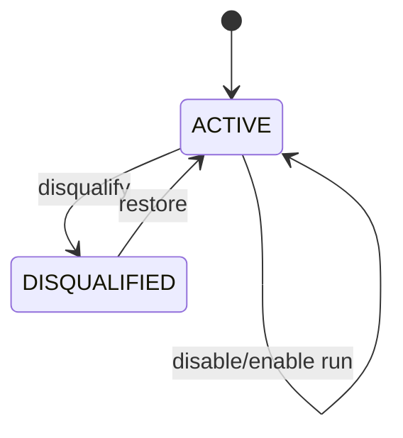
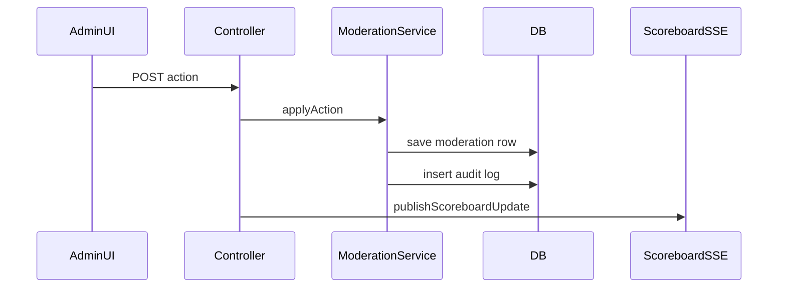
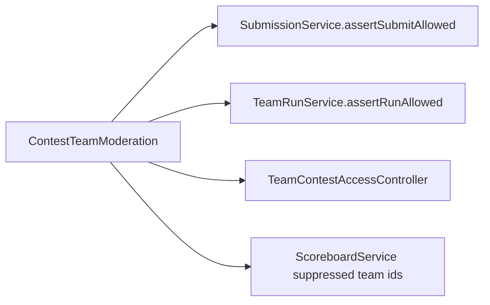

# System Analysis Packet: Contest Team Moderation and Audit

## 1. Scope

This packet covers contest-scoped team moderation: hide/show scoreboard, disqualify/restore, disable/enable submit, disable/enable run, reason requirements, audit logs, CSV export, team access gate, guards in submissions/runs/problem visibility, scoreboard filtering, Admin Run Lab audit entries, and preservation of stored submissions. It excludes global team account creation, covered in packet 02.

## 2. Local Inspection Summary

* Current working directory: `C:\Users\user\Desktop\AuraC2`
* Git branch if available: `main...origin/main`
* Git status summary: pre-existing non-doc changes were observed; only Markdown packet files are intended edits.
* Important searched folders: `backend/src/main/java/com/server/contestControl/contestServer/moderation`, `contestServer/runlab`, `submissionServer/service`, `UI/src/admin/components`, `UI/src/team`.
* Tests inspected: moderation service/repository/CSV tests and Admin Run Lab tests were listed. Tests were not run.

## 3. Files Inspected

| File path | Purpose in this subsystem | Why it matters |
| --------- | ------------------------- | -------------- |
| `backend/src/main/java/com/server/contestControl/contestServer/moderation/entity/ContestTeamModeration.java` | Team moderation state | Stores contest/team flags and reason |
| `backend/src/main/java/com/server/contestControl/contestServer/moderation/entity/ContestModerationAuditLog.java` | Audit log entity | Records admin actions and Run Lab audits |
| `backend/src/main/java/com/server/contestControl/contestServer/moderation/service/ContestTeamModerationService.java` | Main service | Applies actions, guards workspace/submit/run, provides suppressed ids |
| `backend/src/main/java/com/server/contestControl/contestServer/moderation/controller/AdminTeamModerationController.java` | Admin REST API | Team moderation and logs/CSV endpoints |
| `backend/src/main/java/com/server/contestControl/contestServer/moderation/controller/TeamContestAccessController.java` | Team access API | Team blocked-page/access flags |
| `backend/src/main/java/com/server/contestControl/contestServer/moderation/service/ContestModerationCsvExporter.java` | CSV export | Spreadsheet-safe audit CSV |
| `backend/src/main/java/com/server/contestControl/contestServer/runlab/service/AdminRunLabService.java` | Run Lab audit producer | Writes ADMIN_RUN_LAB_EXECUTION audit rows |
| `backend/src/main/resources/db/migration/V10__contest_team_moderation.sql` | Moderation schema | State and audit tables |
| `backend/src/main/resources/db/migration/V11__admin_run_lab_audit_fields.sql` | Run Lab audit migration | Makes team nullable and adds problem/language/source fields |
| `UI/src/admin/components/TeamsView.tsx` | Admin UI | Moderation tabs/actions/log export |
| `UI/src/team/App.tsx` | Team app gate | Blocks disqualified teams |
| `UI/src/team/TeamWorkspace.tsx` | Workspace flags | Passes submit/run enabled flags to editor |

## 4. Main Components

| Component | Path | Type | Responsibility | Important methods/functions |
| --------- | ---- | ---- | -------------- | --------------------------- |
| `ContestTeamModeration` | `moderation/entity` | Entity | Per-contest team status and flags | `status`, `hiddenFromScoreboard`, `submitEnabled`, `runEnabled`, `reason` |
| `ContestModerationAuditLog` | `moderation/entity` | Entity | Audit trail | `actionType`, `oldValueJson`, `newValueJson`, run lab fields |
| `ContestTeamModerationService` | `moderation/service` | Service | Apply actions, guards, audit, suppressed ids | `applyAction`, `assertSubmitAllowed`, `assertRunAllowed`, `scoreboardSuppressedTeamIds` |
| `AdminTeamModerationController` | `moderation/controller` | REST controller | Admin moderation/log endpoints | `moderateTeam`, `logs`, `exportLogsCsv` |
| `TeamContestAccessController` | `moderation/controller` | REST controller | Team access status | `access` |
| `ContestModerationCsvExporter` | `moderation/service` | Component | CSV export with formula defense | `export`, `spreadsheetSafe` |
| `AdminRunLabService` | `contestServer/runlab/service` | Service | Admin custom run and audit row | `run` |
| `TeamsView` | `UI/src/admin/components` | React component | Admin moderation/accounts/logs UI | action/log/export handlers |
| `TeamApp` | `UI/src/team/App.tsx` | React component | Team contest access gate | `TeamContestGate` |

## 5. Entry Points

| Entry point | Trigger | File/class | Method/function | Auth/role requirement | Request/response model |
| ----------- | ------- | ---------- | --------------- | --------------------- | ---------------------- |
| `GET /api/admin/team-moderation/contests/{contestId}/teams` | Admin opens moderation tab | `AdminTeamModerationController` | `teams` | ADMIN | `List<ContestTeamModerationResponse>` |
| `POST /api/admin/team-moderation/contests/{contestId}/teams/{teamId}/actions` | Admin applies action | `AdminTeamModerationController` | `moderateTeam` | ADMIN | `ModerationActionRequest` -> response |
| `GET /api/admin/team-moderation/logs` | Admin views logs | `AdminTeamModerationController` | `logs` | ADMIN | `List<ModerationAuditLogResponse>` |
| `GET /api/admin/team-moderation/logs.csv` | Admin exports logs | `AdminTeamModerationController` | `exportLogsCsv` | ADMIN | CSV bytes |
| `GET /api/team/contests/{contestId}/access` | Team enters running contest | `TeamContestAccessController` | `access` | TEAM | `TeamContestAccessResponse` |
| `POST /api/admin/run-lab/run` | Admin runs custom input in Run Lab | `AdminRunLabController` | `run` | ADMIN | `AdminRunLabRequest` -> response plus audit |
| Submission guard | Team submits official code | `SubmissionService` | `submitCode` | TEAM | Throws if disabled/disqualified |
| Run guard | Team uses Run | `TeamRunService` | `run` | TEAM | Throws if disabled/disqualified |
| Scoreboard filtering | Scoreboard snapshot | `ScoreboardService` | `getSnapshot` | Public/ADMIN depending endpoint | Suppressed teams excluded |

## 6. Runtime Flow

1. Admin opens `TeamsView` moderation tab and loads contest teams via `ContestTeamModerationService.listForContest`.
2. Service loads all TEAM users and overlays existing `ContestTeamModeration` rows. Teams without rows get an active default response.
3. Admin applies an action. `applyAction` requires an action type, rejects `ADMIN_RUN_LAB_EXECUTION` as a moderation mutation, requires reason for hide/disqualify/disable submit/disable run, loads contest/team/admin, and creates or updates the contest/team row.
4. Service snapshots old and new moderation values as JSON and saves a `ContestModerationAuditLog` with action, admin, team, reason, old value, and new value.
5. Controller calls `ScoreboardSseAdapter.publishScoreboardUpdate` after moderation mutation so public/admin scoreboards refresh.
6. Team app calls `/api/team/contests/{contestId}/access` before mounting workspace. Disqualified teams receive `workspaceVisible=false` and the UI shows a blocked page.
7. Problem/sample reads call workspace visibility checks. Official submission calls `assertSubmitAllowed`; non-scoring Run calls `assertRunAllowed`.
8. Scoreboard calls `scoreboardSuppressedTeamIds` and excludes hidden/disqualified teams and their submissions from snapshots.
9. Admin Run Lab writes audit logs with `ADMIN_RUN_LAB_EXECUTION`, nullable team, problem/language/source hash/execution mode fields, and does not mutate team moderation.
10. Moderation does not delete existing submissions; stored submissions remain in DB but may be hidden from scoreboard or future submit/run can be blocked.

## 7. Code Evidence

### Evidence: Reason requirements and action mutation

Path: `backend/src/main/java/com/server/contestControl/contestServer/moderation/service/ContestTeamModerationService.java`

```java
private static final Set<ModerationActionType> REASON_REQUIRED_ACTIONS = EnumSet.of(
        ModerationActionType.HIDE_FROM_SCOREBOARD,
        ModerationActionType.DISQUALIFY_TEAM,
        ModerationActionType.DISABLE_SUBMIT,
        ModerationActionType.DISABLE_RUN
);

if (REASON_REQUIRED_ACTIONS.contains(request.actionType()) && reason == null) {
    throw new ContestTeamModerationException("Reason is required for this moderation action.");
}
```

```java
private void mutate(ContestTeamModeration moderation, ModerationActionType actionType, String reason) {
    switch (actionType) {
        case HIDE_FROM_SCOREBOARD -> moderation.setHiddenFromScoreboard(true);
        case SHOW_ON_SCOREBOARD -> moderation.setHiddenFromScoreboard(false);
        case DISQUALIFY_TEAM -> {
            moderation.setStatus(ContestTeamStatus.DISQUALIFIED);
            moderation.setHiddenFromScoreboard(true);
            moderation.setSubmitEnabled(false);
            moderation.setRunEnabled(false);
        }
        case RESTORE_TEAM -> {
            moderation.setStatus(ContestTeamStatus.ACTIVE);
            moderation.setHiddenFromScoreboard(false);
            moderation.setSubmitEnabled(true);
            moderation.setRunEnabled(true);
        }
        case DISABLE_SUBMIT -> moderation.setSubmitEnabled(false);
        case ENABLE_SUBMIT -> moderation.setSubmitEnabled(true);
        case DISABLE_RUN -> moderation.setRunEnabled(false);
        case ENABLE_RUN -> moderation.setRunEnabled(true);
    }
}
```

This proves:

* Reason is mandatory for punitive actions.
* Disqualification also hides scoreboard and disables submit/run.

### Evidence: Submission and run guards

Path: `backend/src/main/java/com/server/contestControl/contestServer/moderation/service/ContestTeamModerationService.java`

```java
public void assertSubmitAllowed(Contest contest, User user) {
    if (contest == null || user == null || user.getRole() != Role.TEAM) {
        return;
    }
    ContestTeamModeration moderation = moderationRepository
            .findByContest_IdAndTeam_Id(contest.getId(), user.getId())
            .orElse(null);
    if (statusOf(moderation) == ContestTeamStatus.DISQUALIFIED) {
        throw new InvalidSubmissionRequestException("Your team is disqualified from this contest.");
    }
    if (!submitEnabledOf(moderation)) {
        throw new InvalidSubmissionRequestException("Submissions are disabled for your team.");
    }
}
```

This proves:

* TEAM users are blocked from official submissions when disqualified or submit disabled.

### Evidence: Team access gate response

Path: `backend/src/main/java/com/server/contestControl/contestServer/moderation/service/ContestTeamModerationService.java`

```java
boolean disqualified = status == ContestTeamStatus.DISQUALIFIED;
boolean submitEnabled = submitEnabledOf(moderation);
boolean runEnabled = runEnabledOf(moderation);
return new TeamContestAccessResponse(
        contest.getId(),
        status,
        hiddenFromScoreboardOf(moderation),
        submitEnabled,
        runEnabled,
        !disqualified,
        disqualified ? "You are disqualified from this contest." : null
);
```

This proves:

* Team workspace visibility is denied only for disqualification.
* Submit/run flags are returned separately.

### Evidence: Moderation schema

Path: `backend/src/main/resources/db/migration/V10__contest_team_moderation.sql`

```sql
CREATE TABLE contest_team_moderations (
    id BIGSERIAL PRIMARY KEY,
    contest_id BIGINT NOT NULL,
    team_id BIGINT NOT NULL,
    status VARCHAR(32) NOT NULL DEFAULT 'ACTIVE',
    hidden_from_scoreboard BOOLEAN NOT NULL DEFAULT FALSE,
    submit_enabled BOOLEAN NOT NULL DEFAULT TRUE,
    run_enabled BOOLEAN NOT NULL DEFAULT TRUE,
    reason TEXT,
    updated_by_admin_id BIGINT,
    CONSTRAINT uk_contest_team_moderations_contest_team
        UNIQUE (contest_id, team_id)
);
```

This proves:

* Moderation is contest-scoped and one row per contest/team.

## 8. Data Model

| Model | Type | Path | Important fields | Relationships/constraints | Runtime meaning |
| ----- | ---- | ---- | ---------------- | ------------------------- | --------------- |
| `ContestTeamModeration` | Entity | `moderation/entity/ContestTeamModeration.java` | contest, team, status, hiddenFromScoreboard, submitEnabled, runEnabled, reason, updatedByAdmin, timestamps | Unique contest/team; indexes contest/team/scoreboard | Current moderation state |
| `ContestModerationAuditLog` | Entity | `moderation/entity/ContestModerationAuditLog.java` | contest, team nullable after V11, admin, problem, actionType, reason, old/new JSON, languageId, sourceHash, executionMode | Audit indexes; FKs contest/team/admin/problem | Append-only moderation/runlab audit |
| `ContestTeamStatus` | Enum | `moderation/enums/ContestTeamStatus.java` | ACTIVE, DISQUALIFIED | DB check | Workspace visibility state |
| `ModerationActionType` | Enum | `moderation/enums/ModerationActionType.java` | hide/show, disqualify/restore, disable/enable submit/run, ADMIN_RUN_LAB_EXECUTION | DB check V10/V11 | Audit/action vocabulary |
| `TeamContestAccessResponse` | DTO | `moderation/dto` | status, hidden, submitEnabled, runEnabled, workspaceVisible, message | Response | Team workspace gate |
| `ModerationAuditLogResponse` | DTO | `moderation/dto` | audit log fields | Response/CSV | Admin audit display/export |

## 9. Security and Authorization

* Admin moderation/log endpoints are under `/api/admin/team-moderation` and class-level ADMIN protected.
* Team access endpoint is TEAM-only.
* Guards apply server-side in submission, run, problem, and testcase access flows; UI flags are not the only enforcement.
* CSV export is admin-only and uses spreadsheet-safe cell escaping.
* Admin Run Lab is ADMIN-only and writes audit rows without exposing source, only source hash.

## 10. Transactions and Consistency

* `ContestTeamModerationService` is class-level read-only transactional; `applyAction` is write transactional.
* State update and audit log insert happen in the same transaction.
* Controller publishes scoreboard update after service returns; no outbox.
* `ContestTeamModeration` has unique contest/team constraint for duplicate-state protection.
* Audit log search uses criteria queries with fetch joins and filters by contest/team/admin/action/time.

## 11. Async / Events / Queues / SSE

* Moderation itself does not use RabbitMQ.
* After moderation action, controller directly calls `ScoreboardSseAdapter.publishScoreboardUpdate(contestId, "TEAM_MODERATION_" + actionType)`.
* Team app access gate is REST-based, not SSE-based.
* Existing team workspace flags are loaded when workspace mounts; live moderation changes may need UI refresh unless connected scoreboard/problem operations refetch.

## 12. State Transitions

| From | To | Trigger | Code location | Guard/validation |
| ---- | -- | ------- | ------------- | ---------------- |
| no row | ACTIVE defaults | List/access/read | `listForContest`, helper methods | default methods |
| ACTIVE | hidden scoreboard | HIDE_FROM_SCOREBOARD | `mutate` | reason required |
| hidden scoreboard | visible scoreboard | SHOW_ON_SCOREBOARD | `mutate` | no reason required |
| ACTIVE | DISQUALIFIED | DISQUALIFY_TEAM | `mutate` | reason required; hides/disables submit/run |
| DISQUALIFIED | ACTIVE | RESTORE_TEAM | `mutate` | no reason required; resets flags |
| submit enabled | disabled | DISABLE_SUBMIT | `mutate` | reason required |
| run enabled | disabled | DISABLE_RUN | `mutate` | reason required |



## 13. Mermaid Skeletons





## 14. Tests

| Test file | What it verifies | Important test methods | Missing coverage |
| --------- | ---------------- | ---------------------- | ---------------- |
| `contestServer/moderation/service/ContestTeamModerationServiceTest.java` | Moderation actions/guards/defaults | Inspect file for exact methods | Tests not run here |
| `contestServer/moderation/repository/ContestModerationAuditLogRepositoryTest.java` | Audit search/repository behavior | Inspect file for exact methods | Tests not run here |
| `contestServer/moderation/service/ContestModerationCsvExporterTest.java` | CSV export safety | Inspect file for exact methods | Tests not run here |
| `contestServer/runlab/service/AdminRunLabServiceTest.java` | Run Lab audit behavior | Inspect file for exact methods | Tests not run here |

## 15. Edge Cases

| Edge case | Code location | Current behavior | Risk level |
| --------- | ------------- | ---------------- | ---------- |
| Missing reason for disqualify/hide/disable | `ContestTeamModerationService.applyAction` | Rejected | Low |
| Apply action to ADMIN account | `team(teamId)` | Rejected because only TEAM can be moderated | Low |
| Admin Run Lab action through moderation endpoint | `applyAction` | Rejected as non-mutating audit type | Low |
| Disqualified team with old submissions | Scoreboard filter/guards | Stored submissions preserved but hidden/blocked | Medium |
| Multi-node live moderation UI | REST gate plus SSE scoreboard only | Team workspace may not live-update access flags | Medium |

## 16. Risks / Weaknesses / Gaps

* Scoreboard SSE is triggered by moderation, but team workspace access flags may not update live without refetch/reload.
* Moderation does not remove submissions, which is good for audit but requires all readers to apply filters correctly.
* `ContestModerationAuditLog.oldValueJson/newValueJson` are free-form TEXT, not structured JSONB.
* CSV export is spreadsheet-safe, but logs can contain sensitive admin reasons.
* No outbox for scoreboard SSE on moderation actions.

## 17. Final Evidence Table

| Claim | Evidence path | Class/method/field | Confidence |
| ----- | ------------- | ------------------ | ---------- |
| Moderation is contest-scoped | `ContestTeamModeration.java`, `V10__contest_team_moderation.sql` | unique contest/team | Strong |
| Disqualification hides, disables submit, disables run | `ContestTeamModerationService.java` | `mutate(DISQUALIFY_TEAM)` | Strong |
| Reason required for punitive actions | `ContestTeamModerationService.java` | `REASON_REQUIRED_ACTIONS` | Strong |
| Submission and run guards are server-side | `ContestTeamModerationService.java`, `SubmissionService.java`, `TeamRunService.java` | `assertSubmitAllowed`, `assertRunAllowed` | Strong |
| Scoreboard filters suppressed teams | `ScoreboardService.java`, `ContestTeamModerationRepository.java` | `scoreboardSuppressedTeamIds` | Strong |
| Admin Run Lab audit shares audit table | `AdminRunLabService.java`, `V11__admin_run_lab_audit_fields.sql` | `ADMIN_RUN_LAB_EXECUTION` | Strong |
