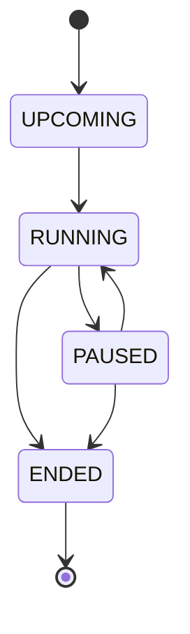
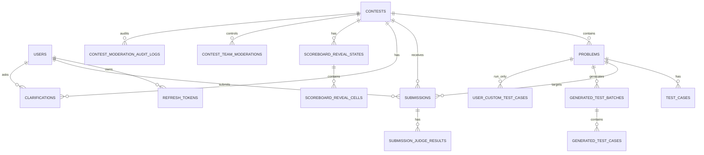
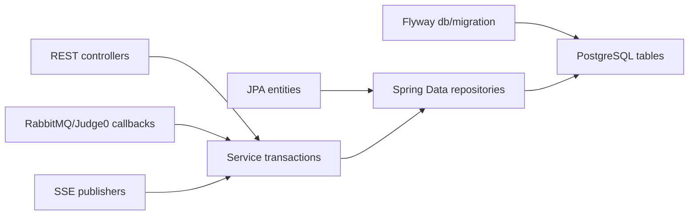

# System Analysis Packet: Data Model Flyway ER

## 1. Scope

This packet covers the implemented persistence model: JPA entities, repositories, enums, Flyway migrations, constraints, indexes, and relationship skeletons. It intentionally excludes behavioral walkthroughs except where fields directly drive runtime behavior.

## 2. Local Inspection Summary

* Current working directory: `C:\Users\user\Desktop\AuraC2`
* Git branch if available: `main...origin/main`
* Git status summary at inspection start: `.env`, `UI/src/admin/components/TeamsView.tsx`, `UI/src/admin/types/api.ts`, and `admin-account.txt` were already modified/untracked; packet files were added later under `docs/system-packets/`.
* Important searched folders: `backend/src/main/java`, `backend/src/main/resources/db/migration`, `backend/src/main/resources/db/manual`, `backend/src/test`, `UI/src`.
* Tests were inspected by filename and targeted grep. Tests were not run.

## 3. Files Inspected

| File path | Purpose in this subsystem | Why it matters |
| --------- | ------------------------- | -------------- |
| `backend/src/main/resources/db/migration/V1__baseline_schema.sql` | Baseline relational schema | Defines core users, contests, problems, test cases, clarifications, submissions, judge results, and scoreboard reveal tables |
| `backend/src/main/resources/db/migration/V2__problem_compare_policy.sql` | Compare-policy schema | Adds problem-level output comparison fields and checks |
| `backend/src/main/resources/db/migration/V3__problem_custom_validators.sql` | Custom validator schema | Adds validator source metadata and validation mode constraints |
| `backend/src/main/resources/db/migration/V4__reference_oracle_generated_tests.sql` | Oracle/generated-test schema | Adds reference solution, generator, validator, generated batch/case, and counterexample tables |
| `backend/src/main/resources/db/migration/V5__generated_test_batch_partial_status.sql` | Generated batch status update | Adds `PARTIAL` to generated batch status check |
| `backend/src/main/resources/db/migration/V6__structured_problem_statements.sql` | Statement field migration | Adds structured statement fields and notes |
| `backend/src/main/resources/db/migration/V7__ensure_clarifications_table.sql` | Clarification repair migration | Documents and applies repair-style clarification table/index creation |
| `backend/src/main/resources/db/migration/V8__generated_test_duplicate_status.sql` | Duplicate generated-test status | Adds `DUPLICATE` generated test status and payload check |
| `backend/src/main/resources/db/migration/V9__team_custom_run_tests.sql` | Team custom tests schema | Stores owner-scoped run-only custom tests |
| `backend/src/main/resources/db/migration/V10__contest_team_moderation.sql` | Moderation schema | Adds contest-scoped team moderation and audit log tables |
| `backend/src/main/resources/db/migration/V11__admin_run_lab_audit_fields.sql` | Admin run lab audit extension | Extends audit logs for admin run lab executions |
| `backend/src/main/java/com/server/contestControl/authServer/user/User.java` | User entity | Defines account fields and role |
| `backend/src/main/java/com/server/contestControl/authServer/auth/RefreshToken.java` | Refresh token entity | Defines persisted refresh-token revocation state |
| `backend/src/main/java/com/server/contestControl/contestServer/contest/Contest.java` | Contest entity | Defines lifecycle, timing, penalty, and freeze fields |
| `backend/src/main/java/com/server/contestControl/contestServer/problem/Problem.java` | Problem entity | Defines statement, compare policy, and validator fields |
| `backend/src/main/java/com/server/contestControl/contestServer/testcase/TestCase.java` | Test case entity | Defines problem-owned public/hidden test data |
| `backend/src/main/java/com/server/contestControl/contestServer/clarification/Clarification.java` | Clarification entity | Defines question/reply/public/private state |
| `backend/src/main/java/com/server/contestControl/submissionServer/submission/Submission.java` | Submission entity | Defines submitted code, verdict, metrics, and `judgeRunId` |
| `backend/src/main/java/com/server/contestControl/submissionServer/submission/SubmissionJudgeResult.java` | Per-test result entity | Defines judge-run scoped result rows |
| `backend/src/main/java/com/server/contestControl/contestServer/scoreboard/ScoreboardRevealState.java` | Reveal state entity | Tracks freeze reveal workflow state |
| `backend/src/main/java/com/server/contestControl/contestServer/scoreboard/ScoreboardRevealCell.java` | Reveal cell entity | Tracks per-team/per-problem reveal state |
| `backend/src/main/java/com/server/contestControl/contestServer/oracle/*.java` | Oracle entities/enums/repositories | Defines generated tests, validators, reference solutions, and counterexamples |
| `backend/src/main/java/com/server/contestControl/contestServer/teamrun/*.java` | Team run entities/repositories | Defines owner-scoped custom run tests |
| `backend/src/main/java/com/server/contestControl/contestServer/moderation/*.java` | Moderation entities/enums/repositories | Defines contest-team moderation and audit logs |

## 4. Main Components

| Component | Path | Type | Responsibility | Important methods/functions |
| --------- | ---- | ---- | -------------- | --------------------------- |
| `User` | `backend/src/main/java/com/server/contestControl/authServer/user/User.java` | Entity | Stores admin/team accounts | fields `username`, `password`, `role`, account flags |
| `RefreshToken` | `backend/src/main/java/com/server/contestControl/authServer/auth/RefreshToken.java` | Entity | Stores refresh token hash and revocation state | fields `tokenHash`, `expiresAt`, `revoked`, `user` |
| `Contest` | `backend/src/main/java/com/server/contestControl/contestServer/contest/Contest.java` | Entity | Stores contest lifecycle/timing config | `getEffectiveStatus()`, timing/freeze fields |
| `Problem` | `backend/src/main/java/com/server/contestControl/contestServer/problem/Problem.java` | Entity | Stores statement, limits, comparison, validator config | compare-policy and validator fields |
| `TestCase` | `backend/src/main/java/com/server/contestControl/contestServer/testcase/TestCase.java` | Entity | Stores public/hidden test data | fields `inputData`, `expectedOutput`, `isPublic` |
| `Clarification` | `backend/src/main/java/com/server/contestControl/contestServer/clarification/Clarification.java` | Entity | Stores question/reply lifecycle | status/reply fields |
| `Submission` | `backend/src/main/java/com/server/contestControl/submissionServer/submission/Submission.java` | Entity | Stores scoring submissions and current judge run | `incrementJudgeRunId()`, verdict fields |
| `SubmissionJudgeResult` | `backend/src/main/java/com/server/contestControl/submissionServer/submission/SubmissionJudgeResult.java` | Entity | Stores per-test result for a judge run | unique key in migration |
| `ScoreboardRevealState` | `backend/src/main/java/com/server/contestControl/contestServer/scoreboard/ScoreboardRevealState.java` | Entity | Stores reveal session status | fields `status`, timestamps |
| `ScoreboardRevealCell` | `backend/src/main/java/com/server/contestControl/contestServer/scoreboard/ScoreboardRevealCell.java` | Entity | Stores revealed/masked cell state | fields `team`, `problem`, `revealed` |
| `ReferenceSolution`, `InputGenerator`, `InputValidator` | `backend/src/main/java/com/server/contestControl/contestServer/oracle` | Entities | Store oracle source artifacts | source/hash/language/enabled fields |
| `GeneratedTestBatch`, `GeneratedTestCase`, `Counterexample` | `backend/src/main/java/com/server/contestControl/contestServer/oracle` | Entities | Store generated tests and mismatches | status/count/source fields |
| `UserCustomTestCase` | `backend/src/main/java/com/server/contestControl/contestServer/teamrun/UserCustomTestCase.java` | Entity | Stores team-owned run-only cases | owner/problem/contest/input/expected |
| `ContestTeamModeration` | `backend/src/main/java/com/server/contestControl/contestServer/moderation/ContestTeamModeration.java` | Entity | Stores contest-scoped team controls | status/hidden/submit/run flags |
| `ContestModerationAuditLog` | `backend/src/main/java/com/server/contestControl/contestServer/moderation/ContestModerationAuditLog.java` | Entity | Stores moderation/audit events | action/admin/team/problem/reason fields |
| Repositories | entity package repositories | Spring Data repositories | Runtime persistence access | `findBy...`, lock queries, list queries |
| Flyway migrations | `backend/src/main/resources/db/migration` | SQL migrations | Actual database schema and constraints | `CREATE TABLE`, `ALTER TABLE`, indexes/checks |

## 5. Entry Points

| Entry point | Trigger | File/class | Method/function | Auth/role requirement | Request/response model |
| ----------- | ------- | ---------- | --------------- | --------------------- | ---------------------- |
| Flyway migration execution | Application startup with Flyway enabled | `backend/src/main/resources/application.yml` plus `db/migration/*.sql` | `spring.flyway.enabled=true` | Not an HTTP auth surface | SQL schema migrations |
| JPA repository access | Runtime service calls | `*Repository.java` files | Spring Data query methods | Depends on caller service/controller | Entity/DTO conversion in services |
| Manual repair SQL | Operator action only | `backend/src/main/resources/db/manual/repair_baseline_schema_for_dev.sql` | SQL script | Outside application runtime | Manual database repair; not Flyway path |

## 6. Runtime Flow

1. At startup, Spring Boot reads `application.yml`, points datasource to PostgreSQL, and enables Flyway migration location `classpath:db/migration`.
2. Flyway applies migrations in version order. `V1` creates baseline tables and indexes. Later migrations alter or add subsystem-specific schema without recreating baseline tables.
3. JPA maps runtime entities to the tables created by the migrations. Services and controllers interact with repositories, and repositories persist/load entity graphs.
4. User/session flow writes `users` and `refresh_tokens`; refresh token revocation uses token hash and `revoked/expires_at`.
5. Contest/problem/testcase flows write `contests`, `problems`, `test_cases`; contest timing fields drive lifecycle and scoreboard penalty/freeze behavior.
6. Submission judging writes `submissions` first, then `submission_judge_results` keyed by submission, judge run, and test case number. `judge_run_id` supersedes stale callbacks.
7. Clarifications write `clarifications` with question/reply/status/reply-type fields. Optional `problem_id` allows general contest questions.
8. Scoreboard reveal writes one state row per contest and cells keyed by state/team/problem. The database enforces uniqueness for those reveal dimensions.
9. Oracle-generated tests write reference/generator/validator artifacts, generated batches/cases, and counterexamples. Promotion into ordinary judging uses hidden `test_cases`.
10. Team run custom tests write `user_custom_test_cases`; these are separate from `submissions` and do not affect scoring.
11. Moderation writes current controls to `contest_team_moderations` and append-only audit entries to `contest_moderation_audit_logs`.
12. Failure behavior is mostly service-specific. Database-level constraints protect some invariants, but many business invariants remain service-level only.

## 7. Code Evidence

### Evidence: `V1__baseline_schema.sql` core tables

Path: `backend/src/main/resources/db/migration/V1__baseline_schema.sql`

```sql
CREATE TABLE users (
    id BIGSERIAL PRIMARY KEY,
    username VARCHAR(100) NOT NULL UNIQUE,
    password VARCHAR(255) NOT NULL,
    account_non_expired BOOLEAN NOT NULL DEFAULT TRUE,
    account_non_locked BOOLEAN NOT NULL DEFAULT TRUE,
    credentials_non_expired BOOLEAN NOT NULL DEFAULT TRUE,
    enabled BOOLEAN NOT NULL DEFAULT TRUE,
    role VARCHAR(20) NOT NULL
);

CREATE TABLE contests (
    id BIGSERIAL PRIMARY KEY,
    title VARCHAR(255) NOT NULL,
    start_time TIMESTAMP NOT NULL,
    duration_minutes INTEGER NOT NULL,
    actual_start_time TIMESTAMP,
    paused_at TIMESTAMP,
    total_pause_millis BIGINT NOT NULL DEFAULT 0,
    description TEXT,
    status VARCHAR(20) NOT NULL,
    status_locked BOOLEAN NOT NULL DEFAULT FALSE,
    scoreboard_freeze_minutes INTEGER NOT NULL DEFAULT 60,
    penalty_minutes INTEGER NOT NULL DEFAULT 20
);
```

This proves:

* Users and contests are first-class persisted tables.
* Contest lifecycle has both scheduled fields and runtime fields such as `actual_start_time`, `paused_at`, `total_pause_millis`, and `status_locked`.

### Evidence: `V1__baseline_schema.sql` submissions and judge results

Path: `backend/src/main/resources/db/migration/V1__baseline_schema.sql`

```sql
CREATE TABLE submissions (
    id BIGSERIAL PRIMARY KEY,
    contest_id BIGINT NOT NULL REFERENCES contests(id) ON DELETE CASCADE,
    problem_id BIGINT NOT NULL REFERENCES problems(id) ON DELETE CASCADE,
    user_id BIGINT NOT NULL REFERENCES users(id) ON DELETE CASCADE,
    code TEXT NOT NULL,
    language VARCHAR(50) NOT NULL,
    verdict VARCHAR(50) NOT NULL,
    created_at TIMESTAMP NOT NULL DEFAULT CURRENT_TIMESTAMP,
    execution_time DOUBLE PRECISION,
    memory_usage BIGINT,
    judge_run_id BIGINT NOT NULL DEFAULT 1
);

ALTER TABLE submission_judge_results
    ADD CONSTRAINT uq_submission_judge_result_run_case
    UNIQUE (submission_id, judge_run_id, test_case_number);
```

This proves:

* Scoring submissions store source code, verdict, runtime metrics, and `judge_run_id`.
* Per-test results are deduplicated by submission, run id, and test case number at the database level.

### Evidence: `V2__problem_compare_policy.sql` and `V3__problem_custom_validators.sql`

Path: `backend/src/main/resources/db/migration/V2__problem_compare_policy.sql`

```sql
ALTER TABLE problems
    ADD COLUMN compare_policy VARCHAR(40) NOT NULL DEFAULT 'EXACT',
    ADD COLUMN float_absolute_epsilon DOUBLE PRECISION,
    ADD COLUMN float_relative_epsilon DOUBLE PRECISION;

ALTER TABLE problems
    ADD CONSTRAINT chk_problems_compare_policy
    CHECK (compare_policy IN ('EXACT', 'NORMALIZED_TEXT', 'TOKEN_NORMALIZED', 'FLOAT_TOLERANCE'));
```

Path: `backend/src/main/resources/db/migration/V3__problem_custom_validators.sql`

```sql
ALTER TABLE problems
    ADD COLUMN validation_mode VARCHAR(40) NOT NULL DEFAULT 'BUILTIN_COMPARE_POLICY',
    ADD COLUMN validator_language_id INTEGER,
    ADD COLUMN validator_source TEXT,
    ADD COLUMN validator_source_hash VARCHAR(64),
    ADD COLUMN validator_enabled BOOLEAN NOT NULL DEFAULT FALSE;
```

This proves:

* Output comparison and custom-validator state are schema-backed problem attributes.
* Compare-policy enum values are constrained by the database.

### Evidence: `V4__reference_oracle_generated_tests.sql` generated-test schema

Path: `backend/src/main/resources/db/migration/V4__reference_oracle_generated_tests.sql`

```sql
CREATE TABLE generated_test_batches (
    id BIGSERIAL PRIMARY KEY,
    problem_id BIGINT NOT NULL REFERENCES problems(id) ON DELETE CASCADE,
    generator_id BIGINT NOT NULL REFERENCES input_generators(id) ON DELETE CASCADE,
    validator_id BIGINT REFERENCES input_validators(id) ON DELETE SET NULL,
    reference_solution_id BIGINT NOT NULL REFERENCES reference_solutions(id) ON DELETE CASCADE,
    requested_count INTEGER NOT NULL,
    generated_count INTEGER NOT NULL DEFAULT 0,
    valid_count INTEGER NOT NULL DEFAULT 0,
    promoted_count INTEGER NOT NULL DEFAULT 0,
    status VARCHAR(32) NOT NULL DEFAULT 'COMPLETED',
    created_at TIMESTAMP NOT NULL DEFAULT CURRENT_TIMESTAMP
);

CREATE TABLE generated_test_cases (
    id BIGSERIAL PRIMARY KEY,
    batch_id BIGINT NOT NULL REFERENCES generated_test_batches(id) ON DELETE CASCADE,
    problem_id BIGINT NOT NULL REFERENCES problems(id) ON DELETE CASCADE,
    input_data TEXT NOT NULL,
    expected_output TEXT,
    status VARCHAR(32) NOT NULL DEFAULT 'GENERATED',
    promoted_test_case_id BIGINT REFERENCES test_cases(id) ON DELETE SET NULL
);
```

This proves:

* Generated tests are persisted separately from promoted ordinary `test_cases`.
* Promotion is tracked by optional `promoted_test_case_id`.

### Evidence: `V10__contest_team_moderation.sql`

Path: `backend/src/main/resources/db/migration/V10__contest_team_moderation.sql`

```sql
CREATE TABLE contest_team_moderations (
    id BIGSERIAL PRIMARY KEY,
    contest_id BIGINT NOT NULL REFERENCES contests(id) ON DELETE CASCADE,
    team_id BIGINT NOT NULL REFERENCES users(id) ON DELETE CASCADE,
    status VARCHAR(32) NOT NULL DEFAULT 'ACTIVE',
    hidden_from_scoreboard BOOLEAN NOT NULL DEFAULT FALSE,
    submit_enabled BOOLEAN NOT NULL DEFAULT TRUE,
    run_enabled BOOLEAN NOT NULL DEFAULT TRUE,
    reason TEXT,
    updated_by_admin_id BIGINT REFERENCES users(id) ON DELETE SET NULL,
    updated_at TIMESTAMP NOT NULL DEFAULT CURRENT_TIMESTAMP,
    UNIQUE (contest_id, team_id)
);

CREATE TABLE contest_moderation_audit_logs (
    id BIGSERIAL PRIMARY KEY,
    contest_id BIGINT NOT NULL REFERENCES contests(id) ON DELETE CASCADE,
    team_id BIGINT NOT NULL REFERENCES users(id) ON DELETE CASCADE,
    admin_id BIGINT REFERENCES users(id) ON DELETE SET NULL,
    action_type VARCHAR(48) NOT NULL,
    reason TEXT NOT NULL,
    old_state_json TEXT,
    new_state_json TEXT,
    created_at TIMESTAMP NOT NULL DEFAULT CURRENT_TIMESTAMP
);
```

This proves:

* Current team moderation state is unique per contest/team.
* Audit logs are append-style rows with old/new state JSON text.

## 8. Data Model

| Model | Type | Path | Important fields | Relationships/constraints | Runtime meaning |
| ----- | ---- | ---- | ---------------- | ------------------------- | --------------- |
| `users` / `User` | Table/entity | `V1`, `User.java` | `username`, `password`, flags, `role` | username unique; indexes role/username | Auth principal, admin/team account |
| `refresh_tokens` / `RefreshToken` | Table/entity | `V1`, `RefreshToken.java` | `token_hash`, `device_ip`, `expires_at`, `revoked` | FK user; indexes token hash and user/revoked/expires | Refresh-token persistence/rotation/revocation |
| `contests` / `Contest` | Table/entity | `V1`, `Contest.java` | `start_time`, `duration_minutes`, `actual_start_time`, `paused_at`, `total_pause_millis`, `status`, `status_locked`, `scoreboard_freeze_minutes`, `penalty_minutes` | indexes status/start and start | Contest lifecycle, scoring timing, freeze config |
| `problems` / `Problem` | Table/entity | `V1`-`V6`, `Problem.java` | statement fields, limits, difficulty, compare policy, validator config | FK contest; compare/check constraints | Judging configuration and problem presentation |
| `test_cases` / `TestCase` | Table/entity | `V1`, `TestCase.java` | `input_data`, `expected_output`, `is_public` | FK problem; indexes problem/public | Public samples and hidden scoring tests |
| `clarifications` / `Clarification` | Table/entity | `V1`, `V7`, `Clarification.java` | question, reply, `status`, `reply_type`, standard reply | FK contest/user/problem/admin | Team questions and admin/public replies |
| `submissions` / `Submission` | Table/entity | `V1`, `Submission.java` | code, language, verdict, metrics, `judge_run_id` | FKs contest/problem/user; indexes | Scored submission record and current judge run |
| `submission_judge_results` / `SubmissionJudgeResult` | Table/entity | `V1`, entity | test case number, verdict, Judge0 metadata, diagnostic | FK submission; unique submission/run/case | Per-test callback/result state |
| `scoreboard_reveal_states` | Table/entity | `V1`, `ScoreboardRevealState.java` | contest, status, timestamps | contest unique | Reveal workflow state per contest |
| `scoreboard_reveal_cells` | Table/entity | `V1`, `ScoreboardRevealCell.java` | state, team, problem, reveal order, revealed | unique state/team/problem | Freeze reveal cell masking/reveal state |
| `reference_solutions` | Table/entity | `V4`, oracle entity | language, source, hash, active | FK problem | Trusted source for generated expected output |
| `input_generators` | Table/entity | `V4`, oracle entity | language, source, hash, seed | FK problem | Deterministic input generation source |
| `input_validators` | Table/entity | `V4`, oracle entity | language, source, hash, active | FK problem | Generated input validation source |
| `generated_test_batches` | Table/entity | `V4`, `V5` | requested/generated/valid/promoted counts, status | FKs problem/generator/validator/reference | Generation run metadata |
| `generated_test_cases` | Table/entity | `V4`, `V8` | input, expected, status, promoted ID | FKs batch/problem/test_case | Generated candidate or promoted hidden test |
| `counterexamples` | Table/entity | `V4` | input, expected, actual, candidate source/hash | FKs problem/batch | Failed candidate evidence |
| `user_custom_test_cases` | Table/entity | `V9`, `UserCustomTestCase.java` | owner, contest, problem, input, expected | FKs owner/contest/problem; owner/contest/problem index | Team-owned run-only tests |
| `contest_team_moderations` | Table/entity | `V10`, moderation entity | status, hidden, submit/run flags, reason | unique contest/team | Contest-scoped team controls |
| `contest_moderation_audit_logs` | Table/entity | `V10`, `V11`, audit entity | action, reason, old/new JSON, problem/source hash fields | FKs contest/team/admin/problem; action check | Moderation/admin-run audit history |

## 9. Security and Authorization

This subsystem has no direct HTTP authorization surface except through callers. Security-sensitive storage includes password hashes in `users.password`, refresh token hashes in `refresh_tokens.token_hash`, submitted source code in `submissions.code`, validator/reference/generator source in oracle/problem fields, and audit/source hashes in moderation logs.

Database constraints do not enforce role-specific ownership for most tables; services/controllers must enforce ADMIN/TEAM visibility. Public data exposure boundaries are therefore primarily implemented in controllers/DTOs, not in schema.

## 10. Transactions and Consistency

The schema provides several hard constraints:

* `users.username` is unique.
* `submission_judge_results` is unique per `(submission_id, judge_run_id, test_case_number)`.
* `scoreboard_reveal_states.contest_id` is unique.
* `scoreboard_reveal_cells` is unique per `(state_id, team_id, problem_id)`.
* `contest_team_moderations` is unique per `(contest_id, team_id)`.
* Enum-like fields have several SQL `CHECK` constraints in migrations.

Important invariants remain service-level only:

* A single active/upcoming contest is not enforced by a database unique partial index.
* Duplicate generated/promoted test content is handled by services, not by a database uniqueness constraint on `test_cases`.
* Clarification reply concurrency has no entity `@Version` field visible in inspected schema.
* Team run rate limits and SSE state are in memory, not schema-backed.

## 11. Async / Events / Queues / SSE

The data model supports async subsystems but does not itself publish events. Async-relevant fields include:

* `submissions.judge_run_id` and `submission_judge_results` unique key for Judge0 callback idempotency/stale callback handling.
* `scoreboard_reveal_states` and `scoreboard_reveal_cells` for reveal events.
* `contest_team_moderations` and audit logs for submit/run/scoreboard filtering.

No outbox table was found in migrations. RabbitMQ/SSE reliability is therefore not schema-backed by an event-outbox pattern.

## 12. State Transitions

| From | To | Trigger | Code location | Guard/validation |
| ---- | -- | ------- | ------------- | ---------------- |
| `ContestStatus.UPCOMING` | `RUNNING` | Manual start or scheduler/status sync | `Contest` + contest services | Service-level lifecycle checks |
| `RUNNING` | `PAUSED` | Admin pause | `Contest` + contest services | Service-level lifecycle checks |
| `PAUSED` | `RUNNING` | Admin resume | `Contest` + contest services | Service-level lifecycle checks |
| `RUNNING`/`PAUSED` | `ENDED` | Admin end or scheduler/status sync | `Contest` + contest services | Service-level lifecycle checks |
| `Verdict.PENDING` | `RUNNING`/terminal verdict | Submission queue/consumer/callback | `Submission`, `SubmissionJudgeResult` | Judge-run scoped callback handling |
| `ClarificationStatus.PENDING` | `ANSWERED`/`CLOSED` | Admin reply/close | `Clarification` + service | Service-level authorization |
| `RevealStatus.NOT_STARTED` | `IN_PROGRESS` | Admin reveal start | Scoreboard reveal entities/services | Contest/state checks |
| `IN_PROGRESS` | `COMPLETED` | Reveal completion | Scoreboard reveal entities/services | Cell progression |
| `ContestTeamStatus.ACTIVE` | `DISQUALIFIED` | Admin moderation | Moderation entities/services | Reason required in service |
| `GeneratedTestCaseStatus.GENERATED` | `DUPLICATE`/promoted | Oracle promotion | Oracle entities/services | Duplicate service checks |



## 13. Mermaid Skeletons





## 14. Tests

| Test file | What it verifies | Important test methods | Missing coverage |
| --------- | ---------------- | ---------------------- | ---------------- |
| `backend/src/test/java/com/server/contestControl/contestServer/contest/ContestServiceTest.java` | Contest lifecycle service behavior against entities/repositories | Inspected by filename/grep | Full schema migration verification not covered by this packet |
| `backend/src/test/java/com/server/contestControl/submissionServer/submission/SubmissionServiceTest.java` | Submission service behavior | Inspected by filename/grep | Database uniqueness/race behavior not fully proven |
| `backend/src/test/java/com/server/contestControl/submissionServer/submission/Judge0CallbackServiceTest.java` | Callback/idempotency behavior | Inspected by filename/grep | External Judge0/RabbitMQ integration not run |
| `backend/src/test/java/com/server/contestControl/contestServer/moderation/*.java` | Moderation behavior | Inspected by filename/grep | Migration-level audit constraints not run |
| `backend/src/test/java/com/server/contestControl/contestServer/oracle/*.java` | Oracle/generated-test behavior | Inspected by filename/grep | End-to-end promotion with DB constraints not run |

Tests were not executed.

## 15. Edge Cases

| Edge case | Code location | Current behavior | Risk level |
| --------- | ------------- | ---------------- | ---------- |
| Multiple active/upcoming contests | `contests` schema plus contest services | No DB unique partial index found; service-level checks only | Medium |
| Duplicate test cases under race | `test_cases` schema | No unique hash/content constraint found | Medium |
| Duplicate Judge0 callbacks | `submission_judge_results` unique key | DB-level unique key supports idempotency | Low |
| Stale Judge0 callback after rejudge | `submissions.judge_run_id` | Current run id is persisted and result rows include run id | Low |
| Multi-node SSE/event replay | migrations | No outbox/event table found | High |
| Clarification table repair | `V7__ensure_clarifications_table.sql` | Migration comments document repair purpose; table also exists in V1 | Low |
| Audit log team nullable after V11 | `V11__admin_run_lab_audit_fields.sql` | `team_id` can be null for admin run lab audit | Low |

## 16. Risks / Weaknesses / Gaps

* No event-outbox table was found for RabbitMQ or SSE publish reliability.
* Several business invariants are enforced in services but not by database constraints.
* Sensitive source code exists in `submissions`, problem validators, reference solutions, generators, validators, and admin run lab audit hashes; DTO/controller boundaries are responsible for limiting exposure.
* `V7` is explicitly a repair-style migration; it is present in code, but its comments should not be treated as proof that every deployed database needed the repair.
* Manual repair SQL under `db/manual` is not part of Flyway runtime migration execution.
* Tests were inspected but not run, so migration compatibility is not validated by this packet.

## 17. Final Evidence Table

| Claim | Evidence path | Class/method/field | Confidence |
| ----- | ------------- | ------------------ | ---------- |
| The application uses Flyway migrations from `classpath:db/migration` | `backend/src/main/resources/application.yml` | `spring.flyway.locations` | Strong |
| Users have unique usernames and role/account flags | `backend/src/main/resources/db/migration/V1__baseline_schema.sql` | `users` table | Strong |
| Contests store persisted lifecycle and timing fields | `backend/src/main/resources/db/migration/V1__baseline_schema.sql` | `contests.status`, `actual_start_time`, `paused_at`, `status_locked` | Strong |
| Problem compare policy is schema-backed | `backend/src/main/resources/db/migration/V2__problem_compare_policy.sql` | `compare_policy` and check constraint | Strong |
| Custom validators are schema-backed | `backend/src/main/resources/db/migration/V3__problem_custom_validators.sql` | `validation_mode`, `validator_source`, `validator_enabled` | Strong |
| Judge results are unique per submission/run/case | `backend/src/main/resources/db/migration/V1__baseline_schema.sql` | `uq_submission_judge_result_run_case` | Strong |
| Generated tests are separate from promoted test cases | `backend/src/main/resources/db/migration/V4__reference_oracle_generated_tests.sql` | `generated_test_cases.promoted_test_case_id` | Strong |
| Moderation state is unique per contest/team | `backend/src/main/resources/db/migration/V10__contest_team_moderation.sql` | `UNIQUE (contest_id, team_id)` | Strong |
| No database outbox was found | `backend/src/main/resources/db/migration` | absence of outbox/event table in inspected migration list | Medium |
| Single active contest is not DB-enforced | `backend/src/main/resources/db/migration` | absence of partial unique index on active statuses | Medium |
