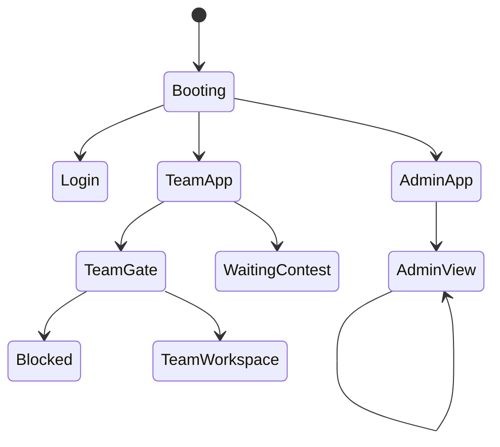
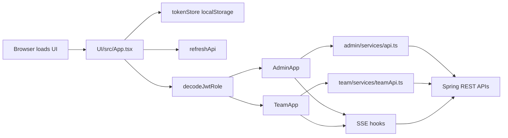
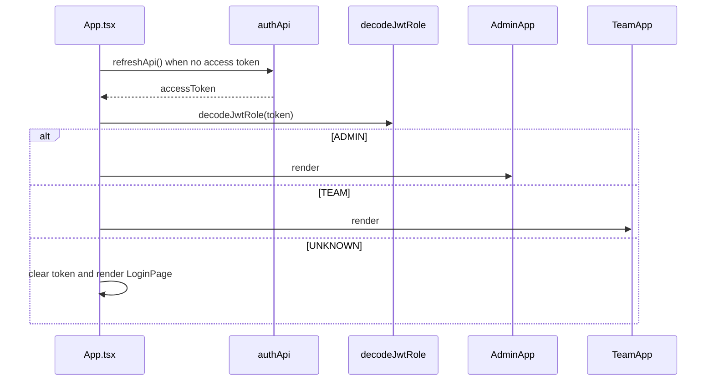
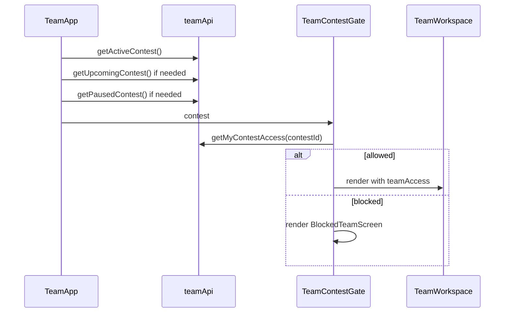

# System Analysis Packet: Frontend Admin Team Routing

## 1. Scope

This packet covers the implemented React/Vite frontend routing, role split, API clients, SSE hooks, admin/team application shells, and notable frontend/backend integration risks. It intentionally excludes detailed UI styling analysis and backend implementation except where needed to prove frontend runtime behavior.

## 2. Local Inspection Summary

* Current working directory: `C:\Users\user\Desktop\AuraC2`
* Git branch if available: `main...origin/main`
* Git status summary at inspection start: `.env`, `UI/src/admin/components/TeamsView.tsx`, `UI/src/admin/types/api.ts`, and `admin-account.txt` were already modified/untracked; packet files were added later under `docs/system-packets/`.
* Important searched folders: `UI/src`, `backend/src/main/java`, `backend/src/main/resources`.
* Tests were inspected by filename/grep on the backend. Frontend tests were not found/run in the inspected commands.

## 3. Files Inspected

| File path | Purpose in this subsystem | Why it matters |
| --------- | ------------------------- | -------------- |
| `UI/src/App.tsx` | Root frontend role gate | Chooses login/admin/team app based on access token and decoded role |
| `UI/src/auth/jwt.ts` | JWT decoding helpers | Determines frontend role from token claims |
| `UI/src/auth/tokenStore.ts` | Access token storage | Stores/removes access token in browser localStorage |
| `UI/src/services/authApi.ts` | Auth API wrapper | Calls login/refresh/logout endpoints with cookies |
| `UI/src/services/http.ts` | Shared API fetch wrapper | Adds Authorization, includes credentials, refreshes on 401 |
| `UI/src/admin/App.tsx` | Admin shell and route switcher | Implements admin view navigation without React Router |
| `UI/src/admin/services/api.ts` | Admin API wrapper | Defines admin, scoreboard, rejudge, oracle, clarification, moderation, and problem calls |
| `UI/src/team/App.tsx` | Team shell and contest gate | Resolves contest state and blocks hidden/disqualified teams |
| `UI/src/team/TeamWorkspace.tsx` | Main team workspace | Loads problems, samples, submissions, custom tests, scoreboard, clarifications |
| `UI/src/team/services/teamApi.ts` | Team API wrapper | Defines team contest, run, custom tests, submissions, scoreboard, clarification calls |
| `UI/src/hooks/useContestStream.ts` | Contest SSE hook | Connects to admin/team contest streams and handles snapshots/updates |
| `UI/src/hooks/useSubmissionStream.ts` | Submission SSE hook | Connects to admin/team submission streams |
| `UI/src/hooks/useClarificationStream.ts` | Clarification SSE hook | Connects to admin/team clarification streams |
| `UI/src/hooks/useScoreboardStream.ts` | Scoreboard SSE hook | Connects to public/admin scoreboard streams and version-gap fallback |
| `backend/src/main/java/com/server/contestControl/authServer/config/SecurityConfiguration.java` | Backend route authorization | Backend authority for route access; used to compare frontend-only guards |

## 4. Main Components

| Component | Path | Type | Responsibility | Important methods/functions |
| --------- | ---- | ---- | -------------- | --------------------------- |
| `App` | `UI/src/App.tsx` | React component | Root auth bootstrap and role gate | `useEffect` refresh bootstrap, `role` memo |
| `decodeJwtRole` | `UI/src/auth/jwt.ts` | Function | Maps JWT claims to `ADMIN`, `TEAM`, or `UNKNOWN` | `decodeJwtPayload`, `decodeJwtRole` |
| `tokenStore` | `UI/src/auth/tokenStore.ts` | Utility module | Stores access token in localStorage | `getAccessToken`, `setAccessToken`, `clearAccessToken` |
| `authApi` | `UI/src/services/authApi.ts` | API module | Login/refresh/logout calls | `loginApi`, `refreshApi`, `logoutApi` |
| `apiFetch` | `UI/src/services/http.ts` | API helper | Authorization header and 401 refresh retry | `apiFetch` |
| `AdminApp` | `UI/src/admin/App.tsx` | React component | Admin view shell and manual path routing | `navigate`, `renderContent`, `loadFallback` |
| `admin api.ts` | `UI/src/admin/services/api.ts` | API module | Admin endpoints | numerous exported functions |
| `TeamApp` | `UI/src/team/App.tsx` | React component | Team contest resolution and access gate | `resolveContest`, `onContestUpdate` |
| `TeamWorkspace` | `UI/src/team/TeamWorkspace.tsx` | React component | Main team workspace | problem/sample/submission/custom-test loaders |
| `TeamContestGate` | `UI/src/team/App.tsx` | React component | Loads team contest access and blocks UI | `getMyContestAccess` |
| `teamApi` | `UI/src/team/services/teamApi.ts` | API module | Team endpoints | `getActiveContest`, `submitSolution`, `runTeamCode`, custom-test and clarification calls |
| `useContestStream` | `UI/src/hooks/useContestStream.ts` | Hook | Contest SSE stream with watchdog and refresh retry | `connect`, event handlers |
| `useSubmissionStream` | `UI/src/hooks/useSubmissionStream.ts` | Hook | Submission SSE stream | EventSource/fetch-event-source handler |
| `useClarificationStream` | `UI/src/hooks/useClarificationStream.ts` | Hook | Clarification SSE stream | EventSource/fetch-event-source handler |
| `useScoreboardStream` | `UI/src/hooks/useScoreboardStream.ts` | Hook | Scoreboard live updates and fallback callback | version-gap logic |

## 5. Entry Points

| Entry point | Trigger | File/class | Method/function | Auth/role requirement | Request/response model |
| ----------- | ------- | ---------- | --------------- | --------------------- | ---------------------- |
| Root app render | Browser loads Vite app | `UI/src/App.tsx` | `App()` | Frontend checks token role; backend enforces API roles | Renders `LoginPage`, `AdminApp`, or `TeamApp` |
| Login submit | User logs in | `UI/src/services/authApi.ts` | `loginApi` | Public frontend call; backend login endpoint | `{ username, password }` -> auth response |
| Refresh bootstrap | App loads with no access token | `UI/src/App.tsx`, `authApi.ts` | `refreshApi` | Refresh cookie required | `{ accessToken }` |
| API request | Any UI API action | `UI/src/services/http.ts`, admin/team API wrappers | `apiFetch` | Authorization bearer token if present | JSON/text/blob depending endpoint |
| Admin navigation | Sidebar click or direct path | `UI/src/admin/App.tsx` | `navigate`, `renderContent` | Frontend requires decoded ADMIN role | React component route views |
| Team contest load | Team app mount | `UI/src/team/App.tsx` | `resolveContest` | Frontend requires decoded TEAM role | contest DTOs |
| Team gate | Contest resolved | `UI/src/team/App.tsx` | `TeamContestGate` | Team endpoint authorization | contest access DTO |
| Contest SSE | Admin/team app mount | `UI/src/hooks/useContestStream.ts` | hook connection | Admin or team stream endpoint | SSE `snapshot`, `contest-update`, `ping` |
| Submission SSE | Admin/team workspace mount | `UI/src/hooks/useSubmissionStream.ts` | hook connection | Admin/team stream endpoint | SSE submission updates |
| Clarification SSE | Dialog/list mount | `UI/src/hooks/useClarificationStream.ts` | hook connection | Admin/team stream endpoint | SSE clarification updates |
| Scoreboard SSE | Scoreboard mount | `UI/src/hooks/useScoreboardStream.ts` | hook connection | Public or admin stream endpoint | SSE snapshot/update/freeze/reveal events |

## 6. Runtime Flow

1. `UI/src/App.tsx` boots with `booting=true` when no access token exists. It calls `refreshApi()` using cookies and stores a returned access token in `localStorage`.
2. The root app decodes the token client-side with `decodeJwtRole`. If the role is missing or unknown, it clears the token and renders `LoginPage`.
3. If role is `ADMIN`, root renders `AdminApp`. If role is `TEAM`, root renders `TeamApp`. This is a frontend navigation decision only; backend controllers/security remain the enforcement boundary.
4. API calls attach `Authorization: Bearer <accessToken>` and `credentials: include`. On HTTP 401, the shared helper calls refresh once, stores the new token, and retries the original request.
5. `AdminApp` uses a local route table and `window.history.pushState` instead of React Router. It maps paths such as `/admin/problems`, `/admin/submissions`, `/admin/rejudge`, and `/admin/run-lab` to components.
6. `AdminApp` opens `useContestStream()` with the default admin endpoint. On stream updates it sets the current contest. If the stream has no contest yet or fails, REST fallback queries active, paused, upcoming, and ended contests.
7. `TeamApp` resolves contest state by querying active, upcoming, then paused contests. It does not cold-load ended contests. Live updates arrive through `useContestStream({ endpoint: "/api/team/stream" })`.
8. Once a team contest exists, `TeamContestGate` calls `getMyContestAccess(contest.id)`. If disqualified or workspace visibility is false, it renders the blocked page; otherwise it renders `TeamWorkspace`.
9. `TeamWorkspace` loads contest problems, public samples, team-owned custom tests, all submissions, and selected-problem submissions. It passes moderation flags into `CodeEditor` for submit/run availability.
10. SSE hooks use `@microsoft/fetch-event-source` with bearer auth and refresh-on-401. `useContestStream` includes a watchdog timeout and native reconnect behavior. `useScoreboardStream` has version-gap fallback through an `onVersionGap` callback.
11. Failure behavior is mostly UI-local: hooks report disconnected/error states and REST fallback loaders are used for some streams. Some workspace data is refreshed by key changes after SSE events.

## 7. Code Evidence

### Evidence: `App` root role gate

Path: `UI/src/App.tsx`

```tsx
function App() {
  const [booting, setBooting] = useState(() => !getAccessToken());
  const [tokenVersion, setTokenVersion] = useState(0);
  const token = getAccessToken();

  useEffect(() => {
    if (token) {
      setBooting(false);
      return;
    }
    let cancelled = false;
    refreshApi()
      .then((response) => {
        if (cancelled) return;
        setAccessToken(response.accessToken);
        setTokenVersion((version) => version + 1);
      })
      .catch(() => {
        if (!cancelled) {
          clearAccessToken();
        }
      })
      .finally(() => {
        if (!cancelled) setBooting(false);
      });
```

This proves:

* The frontend attempts cookie-based refresh during app bootstrap.
* Access tokens are stored client-side after refresh.

### Evidence: `decodeJwtRole`

Path: `UI/src/auth/jwt.ts`

```tsx
export const decodeJwtRole = (token: string | null): RoleName => {
  const payload = decodeJwtPayload(token);
  if (!payload) return "UNKNOWN";

  const roles: string[] = [];
  if (typeof payload.role === "string") roles.push(payload.role);
  if (Array.isArray(payload.roles)) roles.push(...payload.roles.map(String));
  if (Array.isArray(payload.authorities)) roles.push(...payload.authorities.map(String));
  if (typeof payload.scope === "string") roles.push(...payload.scope.split(" "));

  const joined = roles.join(" ").toUpperCase();
  if (joined.includes("ADMIN")) return "ADMIN";
  if (joined.includes("TEAM") || joined.includes("STUDENT") || joined.includes("USER")) return "TEAM";
  return "UNKNOWN";
};
```

This proves:

* Frontend role routing is based on decoded token claims.
* `STUDENT` and `USER` claims are accepted as team-like frontend roles.

### Evidence: `tokenStore`

Path: `UI/src/auth/tokenStore.ts`

```tsx
const ACCESS_TOKEN_KEY = "access_token";

export const getAccessToken = () => localStorage.getItem(ACCESS_TOKEN_KEY);
export const setAccessToken = (token: string) => localStorage.setItem(ACCESS_TOKEN_KEY, token);
export const clearAccessToken = () => localStorage.removeItem(ACCESS_TOKEN_KEY);
```

This proves:

* The access token is persisted in browser `localStorage`.

### Evidence: shared `apiFetch`

Path: `UI/src/services/http.ts`

```tsx
export const apiFetch = async (input: string, init: RequestInit = {}): Promise<Response> => {
  const token = getAccessToken();
  const headers = new Headers(init.headers);
  if (token) {
    headers.set("Authorization", `Bearer ${token}`);
  }

  let response = await fetch(`${API_BASE}${input}`, {
    ...init,
    credentials: "include",
    headers,
  });

  if (response.status !== 401) {
    return response;
  }

  try {
    const refreshResponse = await refreshApi();
    setAccessToken(refreshResponse.accessToken);
    const retryHeaders = new Headers(init.headers);
    retryHeaders.set("Authorization", `Bearer ${refreshResponse.accessToken}`);
    response = await fetch(`${API_BASE}${input}`, {
```

This proves:

* Frontend requests include cookies and bearer tokens.
* The shared helper retries once after a successful refresh.

### Evidence: admin manual route map

Path: `UI/src/admin/App.tsx`

```tsx
const ADMIN_VIEW_ROUTES: Record<AdminView, string> = {
  Overview: "/admin",
  Contests: "/admin/contests",
  Teams: "/admin/teams",
  Problems: "/admin/problems",
  Submissions: "/admin/submissions",
  Clarifications: "/admin/clarifications",
  Scoreboard: "/admin/scoreboard",
  Rejudge: "/admin/rejudge",
  RunLab: "/admin/run-lab",
  RevealDisplay: "/admin/scoreboard/reveal",
};
```

This proves:

* Admin routing is a local view-to-path map, not file-system routing.
* Admin includes rejudge, run lab, scoreboard, clarifications, and reveal display routes.

### Evidence: team contest gate

Path: `UI/src/team/App.tsx`

```tsx
if (loading) {
  return <LoadingScreen />;
}

if (error) {
  return <BlockedTeamScreen reason={error} />;
}

if (!access || access.disqualified || !access.workspaceVisible) {
  return (
    <BlockedTeamScreen
      reason={access?.reason || "Your team is currently blocked from this contest workspace."}
    />
  );
}

return (
  <TeamWorkspace
    contest={contest}
    onLogout={onLogout}
    teamAccess={access}
  />
);
```

This proves:

* Team frontend blocks the workspace when backend access says disqualified or invisible.
* Submit/run flags are passed onward only after the access gate succeeds.

## 8. Data Model

| Model | Type | Path | Important fields | Relationships/constraints | Runtime meaning |
| ----- | ---- | ---- | ---------------- | ------------------------- | --------------- |
| `AuthResponse` | Frontend DTO | `UI/src/services/authApi.ts` | `accessToken`, optional user metadata | Returned by auth/refresh endpoints | Drives frontend token storage and role routing |
| `RoleName` | Frontend union | `UI/src/auth/jwt.ts` | `ADMIN`, `TEAM`, `UNKNOWN` | Derived from JWT claims | Selects root app shell |
| `Contest` | Frontend DTO | `UI/src/admin/types/api.ts`, `UI/src/team/services/teamApi.ts` | `id`, title/status/timing fields | Backend contest DTOs | Admin/team current contest state |
| `TeamContestAccess` | Frontend DTO | `UI/src/team/services/teamApi.ts` and admin types | `workspaceVisible`, `disqualified`, `submitEnabled`, `runEnabled`, reason | Loaded from team access endpoint | Controls blocked screen and editor actions |
| `Submission`/`SubmissionResponse` | Frontend DTO | admin/team services/types | verdict, code, metrics, created time | Loaded from backend submission endpoints | Submission history/admin review |
| `Problem`/`TestCase` | Frontend DTO | admin/team services/types | statement fields, public samples, validator config | Loaded from backend problem/testcase endpoints | Problem list/editor/testcase tabs |
| SSE event payloads | Frontend runtime messages | `UI/src/hooks/*.ts` | event type, data, version where applicable | Sent by backend SSE endpoints | Live updates and fallback decisions |

## 9. Security and Authorization

The frontend performs client-side role routing, but backend security must be treated as authoritative. The root app selects `AdminApp` or `TeamApp` based on decoded JWT claims. API helpers attach bearer tokens and include cookies. Access tokens are stored in `localStorage`, which is convenient but increases exposure if frontend JavaScript is compromised.

Public and authenticated route behavior is not fully encoded in the frontend. For example, public scoreboard endpoints can be called from scoreboard hooks, while admin/team actions rely on backend endpoint authorization. The frontend team gate hides workspace UI for disqualified/hidden teams, but backend `TeamContestAccessController`, submission guards, and run guards are still required to enforce it.

## 10. Transactions and Consistency

No database transactions exist in frontend code. Consistency concerns are client/server synchronization concerns:

* Access token refresh can retry failed requests once; duplicated request wrappers in admin/team modules may diverge from shared behavior.
* Admin contest state is reconciled from SSE snapshots/updates and REST fallback queries.
* Team contest state is reconciled from active/upcoming/paused REST queries and SSE updates; ended contests are not cold-loaded in inspected `TeamApp`.
* Team moderation flags are loaded through `getMyContestAccess`; live moderation changes may require a refetch/reload unless the active component explicitly refreshes access state.
* Scoreboard SSE handles version gaps through a fallback callback; contest/submission/clarification stream hooks have simpler refresh behavior.

## 11. Async / Events / Queues / SSE

Relevant frontend SSE behavior:

* `useContestStream` connects to `/api/contest/stream` by default and `/api/team/stream` when passed by `TeamApp`.
* `useSubmissionStream` supports admin/team endpoints for submission updates.
* `useClarificationStream` supports admin/team clarification endpoints.
* `useScoreboardStream` handles snapshot/update/freeze/reveal-step events and can invoke fallback on version gaps.
* Hooks attach Authorization headers and use refresh-on-401 behavior through `fetchEventSource`.
* The browser/UI relies on reconnect and fallback queries; durable replay is not proven in frontend code.

## 12. State Transitions

| From | To | Trigger | Code location | Guard/validation |
| ---- | -- | ------- | ------------- | ---------------- |
| Booting | Login | No token and refresh fails | `UI/src/App.tsx` | Token absent/invalid |
| Booting | Admin app | Refresh or stored token decodes as ADMIN | `UI/src/App.tsx`, `jwt.ts` | Decoded claim includes ADMIN |
| Booting | Team app | Refresh or stored token decodes as TEAM | `UI/src/App.tsx`, `jwt.ts` | Decoded claim includes TEAM/STUDENT/USER |
| Admin view | Another admin view | Sidebar/path navigation | `UI/src/admin/App.tsx` | Local route map |
| Team loading | Waiting contest | No active/upcoming/paused contest | `UI/src/team/App.tsx` | REST resolution |
| Team loading | Team workspace | Contest exists and access allows | `TeamContestGate` | `!disqualified && workspaceVisible` |
| Team workspace | Blocked screen | Access load error or access denied | `TeamContestGate` | access flags/error |
| Connected SSE | Disconnected/error | Abort/error/watchdog | hooks under `UI/src/hooks` | hook-local retry/fallback behavior |



## 13. Mermaid Skeletons







## 14. Tests

| Test file | What it verifies | Important test methods | Missing coverage |
| --------- | ---------------- | ---------------------- | ---------------- |
| No frontend test files were identified in the inspected output | Not applicable | Not applicable | Root routing, token refresh retry, SSE hooks, and moderation gate behavior need frontend tests |
| Backend security tests were not specifically run | Backend route enforcement | Not applicable | Frontend role routing should be covered by UI tests, not only backend tests |

Tests were not executed.

## 15. Edge Cases

| Edge case | Code location | Current behavior | Risk level |
| --------- | ------------- | ---------------- | ---------- |
| Token has `USER` or `STUDENT` role | `UI/src/auth/jwt.ts` | Frontend routes to team app | Medium |
| Access token stolen via script | `UI/src/auth/tokenStore.ts` | Token is in localStorage | High |
| Refresh fails on boot | `UI/src/App.tsx` | Token cleared, LoginPage rendered | Low |
| Admin/team API wrapper divergence | `UI/src/services/http.ts`, `UI/src/admin/services/api.ts`, `UI/src/team/services/teamApi.ts` | Multiple fetch helpers exist | Medium |
| Direct unknown admin URL | `UI/src/admin/App.tsx` | Manual route map controls selected view; unknown behavior depends path parser | Medium |
| Team opens after contest ended | `UI/src/team/App.tsx` | Cold load checks active/upcoming/paused, not ended | Medium |
| Moderation changes while workspace open | `TeamContestGate`, `TeamWorkspace` | Access loaded before workspace; live refresh not proven globally | Medium |
| SSE version gap outside scoreboard | `UI/src/hooks` | Scoreboard has explicit version-gap fallback; other hooks are simpler | Medium |

## 16. Risks / Weaknesses / Gaps

* Frontend role routing is client-side and should not be treated as authorization.
* Access tokens are stored in `localStorage`.
* API request/refresh logic is duplicated across shared, admin, and team service modules.
* Admin navigation is hand-rolled with `window.history` rather than a router, which can create edge cases for unknown paths and deep links.
* Team cold-load contest resolution does not query ended contests in inspected code.
* Live moderation changes may not immediately disable already-mounted workspace controls unless the relevant component refreshes access state.
* Frontend test coverage was not found in inspected commands.
* Pre-existing dirty files include `UI/src/admin/components/TeamsView.tsx` and `UI/src/admin/types/api.ts`; this packet did not modify them.

## 17. Final Evidence Table

| Claim | Evidence path | Class/method/field | Confidence |
| ----- | ------------- | ------------------ | ---------- |
| Root frontend chooses AdminApp or TeamApp by decoded token role | `UI/src/App.tsx` | `App()` | Strong |
| JWT role decoding maps ADMIN and TEAM-like claims | `UI/src/auth/jwt.ts` | `decodeJwtRole` | Strong |
| Access token is stored in localStorage | `UI/src/auth/tokenStore.ts` | `ACCESS_TOKEN_KEY`, `getAccessToken` | Strong |
| Shared API calls attach bearer token and include cookies | `UI/src/services/http.ts` | `apiFetch` | Strong |
| Admin routing uses a manual route map | `UI/src/admin/App.tsx` | `ADMIN_VIEW_ROUTES` | Strong |
| Team workspace is blocked for disqualified/hidden teams | `UI/src/team/App.tsx` | `TeamContestGate` | Strong |
| Team contest cold load checks active/upcoming/paused | `UI/src/team/App.tsx` | `resolveContest` | Strong |
| Contest SSE default endpoint is admin and team overrides it | `UI/src/hooks/useContestStream.ts`, `UI/src/team/App.tsx` | hook options and call site | Strong |
| Scoreboard stream has version-gap fallback | `UI/src/hooks/useScoreboardStream.ts` | `onVersionGap` behavior | Strong |
| Frontend tests were not found/run | inspected `UI/src` and command history | absence in inspected output | Medium |
