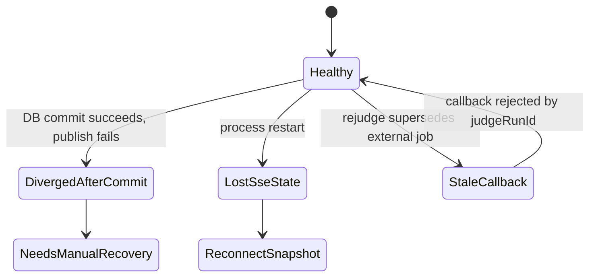
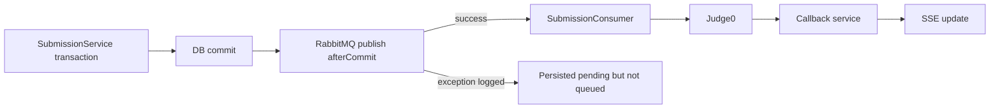
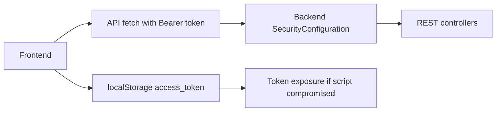
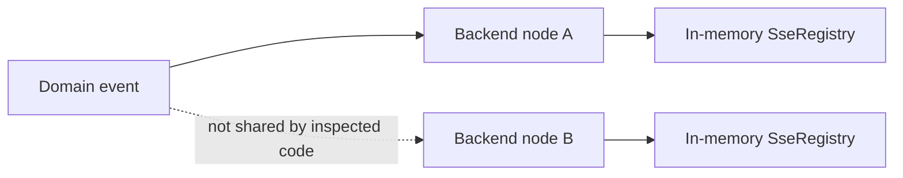

# System Analysis Packet: Known Risks Gaps

## 1. Scope

This packet consolidates risks, gaps, partial implementations, and cross-subsystem concerns found while inspecting the current local implementation. It intentionally excludes proposed fixes and polished design recommendations. Each risk is grounded in inspected code or schema; where a risk is inferred from absence, confidence is marked accordingly.

## 2. Local Inspection Summary

* Current working directory: `C:\Users\user\Desktop\AuraC2`
* Git branch if available: `main...origin/main`
* Git status summary at inspection start: `.env`, `UI/src/admin/components/TeamsView.tsx`, `UI/src/admin/types/api.ts`, and `admin-account.txt` were already modified/untracked; packet files were added later under `docs/system-packets/`.
* Important searched folders: `backend/src/main/java`, `backend/src/main/resources`, `backend/src/test`, `UI/src`.
* Tests were inspected by filename/grep. Tests were not run.

## 3. Files Inspected

| File path | Purpose in this subsystem | Why it matters |
| --------- | ------------------------- | -------------- |
| `backend/src/main/resources/application.yml` | Runtime defaults/config | Contains datasource, RabbitMQ, Judge0, JWT, cookie, mail, and bootstrap defaults |
| `backend/src/main/java/com/server/contestControl/authServer/config/SecurityConfiguration.java` | Backend authorization | Defines public/admin/team/authenticated route boundaries |
| `backend/src/main/java/com/server/contestControl/authServer/config/AdminBootstrapRunner.java` | Admin bootstrap | Creates bootstrap admin and writes account file |
| `backend/src/main/java/com/server/contestControl/shared/sse/*` | SSE core registry/client model | Proves in-memory SSE registry behavior |
| `backend/src/main/java/com/server/contestControl/submissionServer/submission/SubmissionService.java` | Submission transaction and queue publish | Important for after-commit publish risk |
| `backend/src/main/java/com/server/contestControl/submissionServer/submission/RejudgeService.java` | Rejudge transaction and queue publish | Important for superseding/publish risk |
| `backend/src/main/java/com/server/contestControl/submissionServer/submission/SubmissionConsumer.java` | RabbitMQ consumer | Important for failure and commit timing |
| `backend/src/main/java/com/server/contestControl/submissionServer/submission/Judge0CallbackService.java` | Callback idempotency | Important for stale/duplicate callback handling |
| `backend/src/main/java/com/server/contestControl/contestServer/clarification/ClarificationService.java` | Clarification behavior | Important for status and visibility risks |
| `backend/src/main/java/com/server/contestControl/contestServer/contest/ContestService.java` | Contest lifecycle | Important for service-level active contest checks |
| `backend/src/main/java/com/server/contestControl/contestServer/teamrun/TeamRunService.java` | Run-only execution | Important for rate limit and synchronous execution risks |
| `backend/src/main/java/com/server/contestControl/contestServer/moderation/*` | Moderation | Important for access flags and audit behavior |
| `backend/src/main/resources/db/migration/*.sql` | Database schema | Used to identify DB constraints and missing outbox/uniqueness |
| `UI/src/App.tsx`, `UI/src/auth/tokenStore.ts`, `UI/src/hooks/*.ts` | Frontend routing/auth/SSE | Important for client-side guard and localStorage risks |

## 4. Main Components

| Component | Path | Type | Responsibility | Important methods/functions |
| --------- | ---- | ---- | -------------- | --------------------------- |
| `application.yml` | `backend/src/main/resources/application.yml` | Config | Runtime defaults and secrets | datasource, rabbitmq, judge0, jwt, mail, bootstrap |
| `SecurityConfiguration` | backend auth config | Config | Backend route authorization | `securityFilterChain` |
| `AdminBootstrapRunner` | backend auth config | Startup runner | Bootstrap admin account | `run` |
| `SseRegistry` / `SseClient` | `backend/src/main/java/com/server/contestControl/shared/sse` | Service/model | In-memory SSE connection management | register/remove/send/heartbeat methods |
| `SubmissionService` | submission package | Service | Creates submissions and queues judging | `submit` |
| `RejudgeService` | submission package | Service | Resets/requeues submissions | selected/problem/contest methods |
| `SubmissionConsumer` | submission package | RabbitMQ consumer | Claims and dispatches judging | `consume` |
| `Judge0CallbackService` | submission package | Service | Processes Judge0 callbacks | callback handling methods |
| `ClarificationService` | clarification package | Service | Team/admin clarification behavior | ask/reply/list methods |
| `ContestService` | contest package | Service | Contest CRUD/lifecycle | create/start/pause/resume/end methods |
| `TeamRunService` | teamrun package | Service | Synchronous run-only execution | run/custom-test methods |
| `tokenStore` | `UI/src/auth/tokenStore.ts` | Frontend utility | Browser access-token storage | `getAccessToken`, `setAccessToken` |
| SSE hooks | `UI/src/hooks/*.ts` | Frontend hooks | Live event connections | `useContestStream`, `useScoreboardStream`, etc. |

## 5. Entry Points

| Entry point | Trigger | File/class | Method/function | Auth/role requirement | Request/response model |
| ----------- | ------- | ---------- | --------------- | --------------------- | ---------------------- |
| Application startup | Spring Boot starts | `application.yml`, `AdminBootstrapRunner` | Flyway/bootstrap runner | None; startup | Runtime config and admin file side effects |
| Login/refresh/logout | User session lifecycle | Auth controllers/services | auth service methods | Login public; refresh via cookie; logout authenticated/cookie | Auth DTOs/cookies |
| Admin/team REST endpoints | Browser/API users | Controllers across backend | controller methods | Backend security/method annotations | DTOs |
| Submission queue publish | Submission/rejudge commit | `SubmissionService`, `RejudgeService` | after-commit callbacks | Caller-dependent | RabbitMQ message with submission id/run id |
| RabbitMQ consume | Queue message | `SubmissionConsumer` | listener method | Queue-level, not HTTP auth | Submission message |
| Judge0 callback | Judge0 HTTP callback | callback controller/service | callback method | Signature-based | Judge0 callback DTO |
| SSE connect | Browser EventSource/fetch-event-source | SSE controllers/hooks | stream endpoints/hooks | Public/admin/team depending endpoint | SSE events |
| Scheduler | Timer/startup recovery | contest schedulers/services | scheduled methods | Internal | Contest state transitions |

## 6. Runtime Flow

1. Application starts with defaults from `application.yml`; unless environment overrides them, local PostgreSQL/RabbitMQ/Judge0/JWT/mail/bootstrap settings apply.
2. Flyway applies migrations. No outbox/event-retry table was found, so durable async publication is not schema-backed.
3. `AdminBootstrapRunner` may create a bootstrap admin and write credentials to a configured file. This is useful locally but sensitive operationally.
4. Frontend login/refresh stores access tokens in browser `localStorage`; API calls add bearer tokens and cookies.
5. REST controllers authorize through backend security configuration and some method-level annotations. Frontend route guards are only navigation hints.
6. Submission/rejudge flows persist database changes, then publish RabbitMQ messages after commit. If publish fails after commit, persisted records may remain without queued judging unless another repair/retry path exists.
7. RabbitMQ consumer claims submissions and sends Judge0 requests. Judge0 callbacks are accepted only for current `judgeRunId`; stale callback protection is implemented, but external jobs are not cancelled.
8. SSE services keep connected emitters in memory and send snapshots/updates/heartbeats. This works for a single node but is not durable across process restarts or horizontally scaled nodes.
9. Contest lifecycle relies on services, schedulers, row locking in repository methods, and fallback sync. Some invariants, such as single active/upcoming contest, appear service-level rather than DB-enforced.
10. Clarification/team run/scoreboard/moderation behavior has subsystem-specific guards, but several concurrency and test-coverage gaps remain.

## 7. Code Evidence

### Evidence: runtime defaults and local secrets

Path: `backend/src/main/resources/application.yml`

```yaml
judge0:
  api:
    url: ${JUDGE0_API_URL:https://ce.judge0.com/submissions?wait=false}
    callback-url: ${JUDGE0_CALLBACK_URL:http://localhost:8080/api/callback/judge0}
    callback-secret: ${JUDGE0_CALLBACK_SECRET:dev-only-change-me}

jwt:
  access:
    secret: ${JWT_ACCESS_SECRET:local-dev-access-secret-change-me}
  refresh:
    secret: ${JWT_REFRESH_SECRET:local-dev-refresh-secret-change-me}
```

This proves:

* Judge0 callback URL and secrets have local-development defaults.
* JWT secrets have local-development defaults and must be overridden in production.

### Evidence: access token in localStorage

Path: `UI/src/auth/tokenStore.ts`

```tsx
const ACCESS_TOKEN_KEY = "access_token";

export const getAccessToken = () => localStorage.getItem(ACCESS_TOKEN_KEY);
export const setAccessToken = (token: string) => localStorage.setItem(ACCESS_TOKEN_KEY, token);
export const clearAccessToken = () => localStorage.removeItem(ACCESS_TOKEN_KEY);
```

This proves:

* The frontend stores bearer access tokens in `localStorage`.

### Evidence: in-memory SSE client registry

Path: `backend/src/main/java/com/server/contestControl/shared/sse/SseRegistry.java`

```java
private final Map<String, Set<SseClient>> clientsByScope = new ConcurrentHashMap<>();

public SseEmitter register(String scope, Duration timeout) {
    SseEmitter emitter = new SseEmitter(timeout.toMillis());
    SseClient client = new SseClient(scope, emitter);
    clientsByScope.computeIfAbsent(scope, ignored -> ConcurrentHashMap.newKeySet()).add(client);

    emitter.onCompletion(() -> remove(client));
    emitter.onTimeout(() -> remove(client));
    emitter.onError(error -> remove(client));
    return emitter;
}
```

This proves:

* SSE connections are held in process memory.
* Registry state is not durable or shared across backend nodes.

### Evidence: after-commit submission publish

Path: `backend/src/main/java/com/server/contestControl/submissionServer/submission/SubmissionService.java`

```java
TransactionSynchronizationManager.registerSynchronization(new TransactionSynchronization() {
    @Override
    public void afterCommit() {
        try {
            submissionProducer.sendSubmission(submission.getId(), submission.getJudgeRunId());
        } catch (Exception ex) {
            log.error("Failed to enqueue submission {} for judge run {} after commit",
                    submission.getId(), submission.getJudgeRunId(), ex);
        }
    }
});
```

This proves:

* Queue publication happens after database commit.
* Publish failure is logged after commit; this excerpt does not show a durable retry/outbox.

### Evidence: clarification running-state check

Path: `backend/src/main/java/com/server/contestControl/contestServer/clarification/ClarificationService.java`

```java
if (contest.getStatus() != ContestStatus.RUNNING) {
    throw new IllegalStateException("Clarifications can only be submitted during a running contest");
}
```

This proves:

* Team clarification submission depends on persisted contest status in this service.
* If effective state and persisted state diverge, clarification behavior may follow persisted status.

### Evidence: database schema has no outbox table in migrations

Path: `backend/src/main/resources/db/migration`

```sql
-- Inspected migration list:
-- V1__baseline_schema.sql
-- V2__problem_compare_policy.sql
-- V3__problem_custom_validators.sql
-- V4__reference_oracle_generated_tests.sql
-- V5__generated_test_batch_partial_status.sql
-- V6__structured_problem_statements.sql
-- V7__ensure_clarifications_table.sql
-- V8__generated_test_duplicate_status.sql
-- V9__team_custom_run_tests.sql
-- V10__contest_team_moderation.sql
-- V11__admin_run_lab_audit_fields.sql
```

This proves:

* In the inspected migration set, no table named as an outbox/event publication queue was found.
* This is absence-based evidence and should be treated as Medium confidence.

## 8. Data Model

| Model | Type | Path | Important fields | Relationships/constraints | Runtime meaning |
| ----- | ---- | ---- | ---------------- | ------------------------- | --------------- |
| `users` | Table/entity | `V1`, `User.java` | username, password, flags, role | username unique | Auth/account security boundary |
| `refresh_tokens` | Table/entity | `V1`, `RefreshToken.java` | token hash, expiry, revoked | FK user | Persistent session state |
| `submissions` | Table/entity | `V1`, `Submission.java` | source code, verdict, `judge_run_id` | FKs contest/problem/user | Scoring record and stale callback boundary |
| `submission_judge_results` | Table/entity | `V1`, `SubmissionJudgeResult.java` | test case number, verdict, Judge0 status | unique submission/run/case | Duplicate callback/idempotency support |
| `contests` | Table/entity | `V1`, `Contest.java` | status, timing, freeze, penalty | service-level lifecycle invariants | Contest correctness foundation |
| `clarifications` | Table/entity | `V1`, `V7`, `Clarification.java` | question, reply, status, reply type | FKs contest/user/problem | Visibility/public reply risk surface |
| `contest_team_moderations` | Table/entity | `V10`, moderation entity | status, hidden, submit/run flags | unique contest/team | Team access controls |
| `contest_moderation_audit_logs` | Table/entity | `V10`, `V11` | reason, action, old/new JSON, source hash fields | action checks | Audit and sensitive metadata |
| `reference_solutions`/`input_generators`/`input_validators` | Tables/entities | `V4`, oracle entities | source, hash, language, active | FK problem | Sensitive admin-only source artifacts |
| No outbox table found | Absence in schema | `db/migration` | Not applicable | Not applicable | Async reliability gap |

## 9. Security and Authorization

Security risks and boundaries:

* Development secrets and callback defaults exist in `application.yml`; production must override them.
* Access tokens are persisted in browser `localStorage`.
* Bootstrap admin credential output is configured through `admin.bootstrap.output-file` and a local `admin-account.txt` was already present/dirty.
* Frontend role routing is client-side only; backend `SecurityConfiguration` and method-level security are the true authorization boundary.
* Admin source-reveal surfaces for submissions, validators, reference solutions, generators, and run lab artifacts are sensitive even when admin-only.
* Public endpoints such as public scoreboard and public clarifications are intentional exposure surfaces and should be reviewed for DTO minimization.

## 10. Transactions and Consistency

Data consistency risks:

* No database outbox was found for RabbitMQ/SSE publication.
* Submission and rejudge queue publication happens after commit and logs exceptions, so persisted `PENDING`/`PENDING_REJUDGE` state can diverge from queue delivery.
* Some event/SSE behavior is emitted from services and may not be transactionally coupled to DB commit.
* Single active/upcoming contest invariants appear service-level, not DB-enforced with a unique partial index.
* Duplicate test-case prevention is service-level, not proven as a database uniqueness constraint.
* Clarification reply/update concurrency has no schema-visible optimistic locking.
* Oracle generation and team/admin run execution can involve external Judge0 calls inside request workflows, increasing timeout and partial-failure risk.

## 11. Async / Events / Queues / SSE

Async risks:

* SSE registries are in memory. Process restart loses connected clients, last snapshots, and version state.
* Multi-node deployments would need sticky sessions or shared event distribution; no shared SSE broker was found.
* RabbitMQ submission publish failure after commit is logged but not durably retried in inspected code.
* Judge0 external jobs from superseded rejudges are not cancelled; stale callbacks are rejected by `judgeRunId`.
* Result queue classes were present as scaffolding in earlier inspection but result-queue consumption was not proven as active behavior.
* Scoreboard stream has version-gap fallback in the frontend; other streams rely on simpler reconnect/snapshot behavior.

## 12. State Transitions

| From | To | Trigger | Code location | Guard/validation |
| ---- | -- | ------- | ------------- | ---------------- |
| Local dev config | Production runtime | Environment overrides | `application.yml` | Must be externally configured; code has defaults |
| DB committed submission | Queue publish failed | RabbitMQ exception after commit | `SubmissionService.submit` | Logged; no outbox shown |
| Connected SSE | Lost on restart | Backend process restart | `SseRegistry` | In-memory state only |
| Current judge run | Superseded run | Rejudge increments run id | `Submission`, `RejudgeService` | Stale callbacks rejected by run id |
| Team allowed | Team blocked | Moderation update | Moderation services and team gate | Backend guards plus frontend access gate |
| Effective contest running | Persisted not running | Scheduler/status sync lag | contest lifecycle + clarification service | Some code uses persisted status |



## 13. Mermaid Skeletons







## 14. Tests

| Test file | What it verifies | Important test methods | Missing coverage |
| --------- | ---------------- | ---------------------- | ---------------- |
| `backend/src/test/java/com/server/contestControl/submissionServer/submission/Judge0CallbackServiceTest.java` | Callback behavior including stale/duplicate scenarios | Inspected by filename/grep | Full external Judge0 retry/cancellation behavior not proven |
| `backend/src/test/java/com/server/contestControl/submissionServer/submission/SubmissionServiceTest.java` | Submission service behavior | Inspected by filename/grep | RabbitMQ publish-failure integration not run |
| `backend/src/test/java/com/server/contestControl/submissionServer/submission/RejudgeServiceTest.java` | Rejudge behavior | Inspected by filename/grep | After-commit publish failure and bulk race behavior not run |
| `backend/src/test/java/com/server/contestControl/contestServer/contest/*Test.java` | Contest lifecycle/scheduler behavior | Inspected by filename/grep | DB-level single-active race not proven |
| `backend/src/test/java/com/server/contestControl/contestServer/moderation/*Test.java` | Moderation behavior | Inspected by filename/grep | Live frontend refresh of moderation changes not proven |
| `backend/src/test/java/com/server/contestControl/contestServer/oracle/*Test.java` | Oracle/generated-test behavior | Inspected by filename/grep | External Judge0 timeout/failure matrix not fully proven |
| No frontend tests identified | Not applicable | Not applicable | Root routing, localStorage, SSE hooks, team gate, and API retry behavior |

Tests were not executed.

## 15. Edge Cases

| Edge case | Code location | Current behavior | Risk level |
| --------- | ------------- | ---------------- | ---------- |
| Production starts with default JWT/Judge0 secrets | `application.yml` | Defaults are present unless env overrides | High |
| Browser script compromise | `UI/src/auth/tokenStore.ts` | Access token available in localStorage | High |
| RabbitMQ unavailable after DB commit | `SubmissionService`, `RejudgeService` | Publish exception logged after commit | High |
| Backend restart during live contest | `SseRegistry`, scoreboard/contest SSE services | In-memory clients/state lost; clients reconnect where supported | Medium |
| Multiple backend nodes | SSE registries/rate limiters/schedulers | No shared SSE registry/rate limiter proven | High |
| Contest status sync lag | `ClarificationService`, contest lifecycle | Some paths use persisted status rather than effective status | Medium |
| Force rejudge while old Judge0 callbacks in flight | `Submission.judgeRunId`, callback service | Old callbacks rejected, external execution still happens | Low/Medium |
| Team moderation changes while UI open | `TeamContestGate`, backend guards | Backend should enforce; frontend controls may lag | Medium |
| Public clarification visibility | clarification DTO/controller/service | Public replies may expose asking username depending DTO | Medium |
| Generated tests treated as proof | oracle services/schema | Generated tests are persisted tests, not correctness proof | Medium |

## 16. Risks / Weaknesses / Gaps

Security:

* Development secrets and callback defaults exist in `application.yml`.
* Access tokens are stored in `localStorage`.
* Bootstrap admin credential output can leave credentials on disk.
* Public endpoints and public DTOs need continued review for data minimization.
* Admin-only source views contain sensitive submitted/reference/generator/validator source.

Data consistency:

* No outbox pattern was found for async publication.
* Queue publish failures after commit can leave persisted records without async processing.
* Several invariants are service-level rather than database-enforced.
* Clarification and generated-test duplicate behavior may have race windows without DB constraints.

Async reliability:

* SSE state is in memory and single-node oriented.
* RabbitMQ result queue scaffolding was not proven as active.
* Scoreboard version-gap fallback is stronger than other stream fallbacks.
* Team run/admin run/oracle paths may block request threads on external Judge0 calls.

Contest correctness:

* Persisted versus effective contest status must stay synchronized; some services inspect persisted status.
* Manual and scheduled lifecycle transitions have different timing semantics by design, but this increases reasoning complexity.
* Freeze/reveal correctness depends on current submissions and reveal tables; no durable event replay was found.

Judge0 integration:

* Default callback URL is localhost.
* Default callback secret is a dev value.
* Superseded external jobs are ignored by callback guard but not cancelled.
* Custom validator failures can turn judging into internal errors.

DTO/data exposure:

* Submission source code is returned in owner/admin contexts.
* Public test cases intentionally expose expected output for samples.
* Public clarifications should be reviewed for requester identity exposure.
* Oracle/admin source endpoints are sensitive.

Frontend/backend mismatch:

* Frontend role guard is not authorization.
* API helpers are duplicated.
* Manual admin routing may have deep-link/unknown-route edge cases.
* Team access flags may not live-update every mounted control.
* Team cold load ignores ended contest state.

Deployment:

* PostgreSQL, RabbitMQ, Judge0, and correct callback URL/secret are required.
* SSE/rate limiting/schedulers appear single-node unless deployment adds coordination.
* Mail/JWT/Judge0 secrets must be externalized.

Testing gaps:

* Tests were inspected but not run.
* Frontend tests were not identified.
* Publish-failure, multi-node, SSE replay, DB-race, and full external Judge0 paths need integration coverage.

Documentation mismatch:

* This analysis did not rely on README/archive/draft docs as implementation truth.
* `V7__ensure_clarifications_table.sql` documents itself as a repair migration; the migration file exists, but deployment history is not proven from code alone.

## 17. Final Evidence Table

| Claim | Evidence path | Class/method/field | Confidence |
| ----- | ------------- | ------------------ | ---------- |
| Runtime config contains local dev JWT and Judge0 defaults | `backend/src/main/resources/application.yml` | `jwt.*.secret`, `judge0.api.*` | Strong |
| Access token is stored in localStorage | `UI/src/auth/tokenStore.ts` | `ACCESS_TOKEN_KEY`, `setAccessToken` | Strong |
| SSE registry is in memory | `backend/src/main/java/com/server/contestControl/shared/sse/SseRegistry.java` | `clientsByScope` | Strong |
| Submission queue publish happens after commit and logs failure | `backend/src/main/java/com/server/contestControl/submissionServer/submission/SubmissionService.java` | `TransactionSynchronization.afterCommit` | Strong |
| No outbox table was found in inspected migrations | `backend/src/main/resources/db/migration` | migration list | Medium |
| Clarification submit checks persisted contest status | `backend/src/main/java/com/server/contestControl/contestServer/clarification/ClarificationService.java` | `contest.getStatus()` check | Strong |
| Frontend role routing is client-side | `UI/src/App.tsx`, `UI/src/auth/jwt.ts` | `decodeJwtRole`, render branch | Strong |
| Single active/upcoming contest is not DB-enforced | `backend/src/main/resources/db/migration` | absence of partial unique index | Medium |
| Frontend tests were not identified | inspected `UI/src` file list | absence in inspected output | Medium |
| V7 is documented as a repair migration | `backend/src/main/resources/db/migration/V7__ensure_clarifications_table.sql` | migration comments | Docs-only |
